# ZED - Raport z analizy danych
Adam Gontarek  
`r Sys.Date()`  


1. Biblioteki i konfiguracja:

```r
library(dplyr)
library(knitr)
library(ggplot2)
library(gridExtra)
library(reshape2)
library(caret)
library(C50)
library(corrplot)

#opts_chunk$set(cache = TRUE)
```

2. Zapewnienie powtarzalności wyników:

```r
set.seed(23)
```

3. Wczytanie danych z pliku:

```r
file <- "C:/studia/ZED/zed_projekt_2015-2016_dane/all_summary.txt";

header <- read.table(file, header = FALSE, sep = ";", nrows = 1, stringsAsFactors = FALSE)
sample <- read.table(file, header = FALSE, sep = ";", col.names = unlist(header), nrows = 5000, skip = 10000, stringsAsFactors = TRUE)
classes <- sapply(sample, class)
rm(list = c("sample", "header"))

data <- read.table(file, header = TRUE, sep = ";", comment.char = "", colClasses = classes)

data <- tbl_df(data)
```

4. Usunięcie wierszy z niepożądanymi wartościami zmiennej res_name:

```r
data <- filter(data, !grepl("DA|DC|DT|DU|DG|DI|UNK|UNX|UNL|PR|PD|Y1|EU|N|15P|UQ|PX4|SO4|NAN",res_name))

data$res_name <- factor(data$res_name)
```

5. Usunięcie zduplikowanych par wartości (pdb_code, res_name):

```r
data <- distinct(data, pdb_code, res_name)
```

6. Krótkie podsumowanie wartości w każdej kolumnie:

```r
kable(summary(data))
```

                title          pdb_code        res_name        res_id        chain_id      local_BAa       local_NPa        local_Ra       local_RGa       local_SRGa      local_CCSa      local_CCPa      local_ZOa       local_ZDa     local_ZD_minus_a   local_ZD_plus_a   local_res_atom_count   local_res_atom_non_h_count   local_res_atom_non_h_occupancy_sum   local_res_atom_non_h_electron_sum   local_res_atom_non_h_electron_occupancy_sum   local_res_atom_C_count   local_res_atom_N_count   local_res_atom_O_count   local_res_atom_S_count   dict_atom_non_h_count   dict_atom_non_h_electron_sum   dict_atom_C_count   dict_atom_N_count   dict_atom_O_count   dict_atom_S_count   part_00_blob_electron_sum   part_00_blob_volume_sum   part_00_blob_parts   part_00_shape_O3    part_00_shape_O4    part_00_shape_O5    part_00_shape_FL    part_00_shape_O3_norm   part_00_shape_O4_norm   part_00_shape_O5_norm   part_00_shape_FL_norm   part_00_shape_I1    part_00_shape_I2    part_00_shape_I3    part_00_shape_I4    part_00_shape_I5    part_00_shape_I6    part_00_shape_I1_norm   part_00_shape_I2_norm   part_00_shape_I3_norm   part_00_shape_I4_norm   part_00_shape_I5_norm   part_00_shape_I6_norm   part_00_shape_I1_scaled   part_00_shape_I2_scaled   part_00_shape_I3_scaled   part_00_shape_I4_scaled   part_00_shape_I5_scaled   part_00_shape_I6_scaled   part_00_shape_M000   part_00_shape_E3_E1   part_00_shape_E2_E1   part_00_shape_E3_E2   part_00_shape_sqrt_E1   part_00_shape_sqrt_E2   part_00_shape_sqrt_E3   part_00_density_O3   part_00_density_O4   part_00_density_O5   part_00_density_FL   part_00_density_O3_norm   part_00_density_O4_norm   part_00_density_O5_norm   part_00_density_FL_norm   part_00_density_I1   part_00_density_I2   part_00_density_I3   part_00_density_I4   part_00_density_I5   part_00_density_I6   part_00_density_I1_norm   part_00_density_I2_norm   part_00_density_I3_norm   part_00_density_I4_norm   part_00_density_I5_norm   part_00_density_I6_norm   part_00_density_I1_scaled   part_00_density_I2_scaled   part_00_density_I3_scaled   part_00_density_I4_scaled   part_00_density_I5_scaled   part_00_density_I6_scaled   part_00_density_M000   part_00_density_E3_E1   part_00_density_E2_E1   part_00_density_E3_E2   part_00_density_sqrt_E1   part_00_density_sqrt_E2   part_00_density_sqrt_E3   part_01_blob_electron_sum   part_01_blob_volume_sum   part_01_blob_parts   part_01_shape_O3    part_01_shape_O4    part_01_shape_O5    part_01_shape_FL    part_01_shape_O3_norm   part_01_shape_O4_norm   part_01_shape_O5_norm   part_01_shape_FL_norm   part_01_shape_I1    part_01_shape_I2    part_01_shape_I3    part_01_shape_I4    part_01_shape_I5    part_01_shape_I6    part_01_shape_I1_norm   part_01_shape_I2_norm   part_01_shape_I3_norm   part_01_shape_I4_norm   part_01_shape_I5_norm   part_01_shape_I6_norm   part_01_shape_I1_scaled   part_01_shape_I2_scaled   part_01_shape_I3_scaled   part_01_shape_I4_scaled   part_01_shape_I5_scaled   part_01_shape_I6_scaled   part_01_shape_M000   part_01_shape_E3_E1   part_01_shape_E2_E1   part_01_shape_E3_E2   part_01_shape_sqrt_E1   part_01_shape_sqrt_E2   part_01_shape_sqrt_E3   part_01_density_O3   part_01_density_O4   part_01_density_O5   part_01_density_FL   part_01_density_O3_norm   part_01_density_O4_norm   part_01_density_O5_norm   part_01_density_FL_norm   part_01_density_I1   part_01_density_I2   part_01_density_I3   part_01_density_I4   part_01_density_I5   part_01_density_I6   part_01_density_I1_norm   part_01_density_I2_norm   part_01_density_I3_norm   part_01_density_I4_norm   part_01_density_I5_norm   part_01_density_I6_norm   part_01_density_I1_scaled   part_01_density_I2_scaled   part_01_density_I3_scaled   part_01_density_I4_scaled   part_01_density_I5_scaled   part_01_density_I6_scaled   part_01_density_M000   part_01_density_E3_E1   part_01_density_E2_E1   part_01_density_E3_E2   part_01_density_sqrt_E1   part_01_density_sqrt_E2   part_01_density_sqrt_E3   part_02_blob_electron_sum   part_02_blob_volume_sum   part_02_blob_parts   part_02_shape_O3    part_02_shape_O4    part_02_shape_O5    part_02_shape_FL    part_02_shape_O3_norm   part_02_shape_O4_norm   part_02_shape_O5_norm   part_02_shape_FL_norm   part_02_shape_I1    part_02_shape_I2    part_02_shape_I3    part_02_shape_I4    part_02_shape_I5    part_02_shape_I6    part_02_shape_I1_norm   part_02_shape_I2_norm   part_02_shape_I3_norm   part_02_shape_I4_norm   part_02_shape_I5_norm   part_02_shape_I6_norm   part_02_shape_I1_scaled   part_02_shape_I2_scaled   part_02_shape_I3_scaled   part_02_shape_I4_scaled   part_02_shape_I5_scaled   part_02_shape_I6_scaled   part_02_shape_M000   part_02_shape_E3_E1   part_02_shape_E2_E1   part_02_shape_E3_E2   part_02_shape_sqrt_E1   part_02_shape_sqrt_E2   part_02_shape_sqrt_E3   part_02_density_O3   part_02_density_O4   part_02_density_O5   part_02_density_FL   part_02_density_O3_norm   part_02_density_O4_norm   part_02_density_O5_norm   part_02_density_FL_norm   part_02_density_I1   part_02_density_I2   part_02_density_I3   part_02_density_I4   part_02_density_I5   part_02_density_I6   part_02_density_I1_norm   part_02_density_I2_norm   part_02_density_I3_norm   part_02_density_I4_norm   part_02_density_I5_norm   part_02_density_I6_norm   part_02_density_I1_scaled   part_02_density_I2_scaled   part_02_density_I3_scaled   part_02_density_I4_scaled   part_02_density_I5_scaled   part_02_density_I6_scaled   part_02_density_M000   part_02_density_E3_E1   part_02_density_E2_E1   part_02_density_E3_E2   part_02_density_sqrt_E1   part_02_density_sqrt_E2   part_02_density_sqrt_E3   part_03_blob_electron_sum   part_03_blob_volume_sum   part_03_blob_parts   part_03_shape_O3    part_03_shape_O4    part_03_shape_O5    part_03_shape_FL    part_03_shape_O3_norm   part_03_shape_O4_norm   part_03_shape_O5_norm   part_03_shape_FL_norm   part_03_shape_I1    part_03_shape_I2    part_03_shape_I3    part_03_shape_I4    part_03_shape_I5    part_03_shape_I6    part_03_shape_I1_norm   part_03_shape_I2_norm   part_03_shape_I3_norm   part_03_shape_I4_norm   part_03_shape_I5_norm   part_03_shape_I6_norm   part_03_shape_I1_scaled   part_03_shape_I2_scaled   part_03_shape_I3_scaled   part_03_shape_I4_scaled   part_03_shape_I5_scaled   part_03_shape_I6_scaled   part_03_shape_M000   part_03_shape_E3_E1   part_03_shape_E2_E1   part_03_shape_E3_E2   part_03_shape_sqrt_E1   part_03_shape_sqrt_E2   part_03_shape_sqrt_E3   part_03_density_O3   part_03_density_O4   part_03_density_O5   part_03_density_FL   part_03_density_O3_norm   part_03_density_O4_norm   part_03_density_O5_norm   part_03_density_FL_norm   part_03_density_I1   part_03_density_I2   part_03_density_I3   part_03_density_I4   part_03_density_I5   part_03_density_I6   part_03_density_I1_norm   part_03_density_I2_norm   part_03_density_I3_norm   part_03_density_I4_norm   part_03_density_I5_norm   part_03_density_I6_norm   part_03_density_I1_scaled   part_03_density_I2_scaled   part_03_density_I3_scaled   part_03_density_I4_scaled   part_03_density_I5_scaled   part_03_density_I6_scaled   part_03_density_M000   part_03_density_E3_E1   part_03_density_E2_E1   part_03_density_E3_E2   part_03_density_sqrt_E1   part_03_density_sqrt_E2   part_03_density_sqrt_E3   part_04_blob_electron_sum   part_04_blob_volume_sum   part_04_blob_parts   part_04_shape_O3    part_04_shape_O4    part_04_shape_O5    part_04_shape_FL    part_04_shape_O3_norm   part_04_shape_O4_norm   part_04_shape_O5_norm   part_04_shape_FL_norm   part_04_shape_I1    part_04_shape_I2    part_04_shape_I3    part_04_shape_I4    part_04_shape_I5    part_04_shape_I6    part_04_shape_I1_norm   part_04_shape_I2_norm   part_04_shape_I3_norm   part_04_shape_I4_norm   part_04_shape_I5_norm   part_04_shape_I6_norm   part_04_shape_I1_scaled   part_04_shape_I2_scaled   part_04_shape_I3_scaled   part_04_shape_I4_scaled   part_04_shape_I5_scaled   part_04_shape_I6_scaled   part_04_shape_M000   part_04_shape_E3_E1   part_04_shape_E2_E1   part_04_shape_E3_E2   part_04_shape_sqrt_E1   part_04_shape_sqrt_E2   part_04_shape_sqrt_E3   part_04_density_O3   part_04_density_O4   part_04_density_O5   part_04_density_FL   part_04_density_O3_norm   part_04_density_O4_norm   part_04_density_O5_norm   part_04_density_FL_norm   part_04_density_I1   part_04_density_I2   part_04_density_I3   part_04_density_I4   part_04_density_I5   part_04_density_I6   part_04_density_I1_norm   part_04_density_I2_norm   part_04_density_I3_norm   part_04_density_I4_norm   part_04_density_I5_norm   part_04_density_I6_norm   part_04_density_I1_scaled   part_04_density_I2_scaled   part_04_density_I3_scaled   part_04_density_I4_scaled   part_04_density_I5_scaled   part_04_density_I6_scaled   part_04_density_M000   part_04_density_E3_E1   part_04_density_E2_E1   part_04_density_E3_E2   part_04_density_sqrt_E1   part_04_density_sqrt_E2   part_04_density_sqrt_E3   part_05_blob_electron_sum   part_05_blob_volume_sum   part_05_blob_parts   part_05_shape_O3    part_05_shape_O4    part_05_shape_O5    part_05_shape_FL    part_05_shape_O3_norm   part_05_shape_O4_norm   part_05_shape_O5_norm   part_05_shape_FL_norm   part_05_shape_I1    part_05_shape_I2    part_05_shape_I3    part_05_shape_I4    part_05_shape_I5    part_05_shape_I6    part_05_shape_I1_norm   part_05_shape_I2_norm   part_05_shape_I3_norm   part_05_shape_I4_norm   part_05_shape_I5_norm   part_05_shape_I6_norm   part_05_shape_I1_scaled   part_05_shape_I2_scaled   part_05_shape_I3_scaled   part_05_shape_I4_scaled   part_05_shape_I5_scaled   part_05_shape_I6_scaled   part_05_shape_M000   part_05_shape_E3_E1   part_05_shape_E2_E1   part_05_shape_E3_E2   part_05_shape_sqrt_E1   part_05_shape_sqrt_E2   part_05_shape_sqrt_E3   part_05_density_O3   part_05_density_O4   part_05_density_O5   part_05_density_FL   part_05_density_O3_norm   part_05_density_O4_norm   part_05_density_O5_norm   part_05_density_FL_norm   part_05_density_I1   part_05_density_I2   part_05_density_I3   part_05_density_I4   part_05_density_I5   part_05_density_I6   part_05_density_I1_norm   part_05_density_I2_norm   part_05_density_I3_norm   part_05_density_I4_norm   part_05_density_I5_norm   part_05_density_I6_norm   part_05_density_I1_scaled   part_05_density_I2_scaled   part_05_density_I3_scaled   part_05_density_I4_scaled   part_05_density_I5_scaled   part_05_density_I6_scaled   part_05_density_M000   part_05_density_E3_E1   part_05_density_E2_E1   part_05_density_E3_E2   part_05_density_sqrt_E1   part_05_density_sqrt_E2   part_05_density_sqrt_E3   part_06_blob_electron_sum   part_06_blob_volume_sum   part_06_blob_parts   part_06_shape_O3    part_06_shape_O4    part_06_shape_O5    part_06_shape_FL    part_06_shape_O3_norm   part_06_shape_O4_norm   part_06_shape_O5_norm   part_06_shape_FL_norm   part_06_shape_I1    part_06_shape_I2    part_06_shape_I3    part_06_shape_I4    part_06_shape_I5    part_06_shape_I6    part_06_shape_I1_norm   part_06_shape_I2_norm   part_06_shape_I3_norm   part_06_shape_I4_norm   part_06_shape_I5_norm   part_06_shape_I6_norm   part_06_shape_I1_scaled   part_06_shape_I2_scaled   part_06_shape_I3_scaled   part_06_shape_I4_scaled   part_06_shape_I5_scaled   part_06_shape_I6_scaled   part_06_shape_M000   part_06_shape_E3_E1   part_06_shape_E2_E1   part_06_shape_E3_E2   part_06_shape_sqrt_E1   part_06_shape_sqrt_E2   part_06_shape_sqrt_E3   part_06_density_O3   part_06_density_O4   part_06_density_O5   part_06_density_FL   part_06_density_O3_norm   part_06_density_O4_norm   part_06_density_O5_norm   part_06_density_FL_norm   part_06_density_I1   part_06_density_I2   part_06_density_I3   part_06_density_I4   part_06_density_I5   part_06_density_I6   part_06_density_I1_norm   part_06_density_I2_norm   part_06_density_I3_norm   part_06_density_I4_norm   part_06_density_I5_norm   part_06_density_I6_norm   part_06_density_I1_scaled   part_06_density_I2_scaled   part_06_density_I3_scaled   part_06_density_I4_scaled   part_06_density_I5_scaled   part_06_density_I6_scaled   part_06_density_M000   part_06_density_E3_E1   part_06_density_E2_E1   part_06_density_E3_E2   part_06_density_sqrt_E1   part_06_density_sqrt_E2   part_06_density_sqrt_E3   part_07_blob_electron_sum   part_07_blob_volume_sum   part_07_blob_parts   part_07_shape_O3    part_07_shape_O4    part_07_shape_O5    part_07_shape_FL    part_07_shape_O3_norm   part_07_shape_O4_norm   part_07_shape_O5_norm   part_07_shape_FL_norm   part_07_shape_I1    part_07_shape_I2    part_07_shape_I3    part_07_shape_I4    part_07_shape_I5    part_07_shape_I6    part_07_shape_I1_norm   part_07_shape_I2_norm   part_07_shape_I3_norm   part_07_shape_I4_norm   part_07_shape_I5_norm   part_07_shape_I6_norm   part_07_shape_I1_scaled   part_07_shape_I2_scaled   part_07_shape_I3_scaled   part_07_shape_I4_scaled   part_07_shape_I5_scaled   part_07_shape_I6_scaled   part_07_shape_M000   part_07_shape_E3_E1   part_07_shape_E2_E1   part_07_shape_E3_E2   part_07_shape_sqrt_E1   part_07_shape_sqrt_E2   part_07_shape_sqrt_E3   part_07_density_O3   part_07_density_O4   part_07_density_O5   part_07_density_FL   part_07_density_O3_norm   part_07_density_O4_norm   part_07_density_O5_norm   part_07_density_FL_norm   part_07_density_I1   part_07_density_I2   part_07_density_I3   part_07_density_I4   part_07_density_I5   part_07_density_I6   part_07_density_I1_norm   part_07_density_I2_norm   part_07_density_I3_norm   part_07_density_I4_norm   part_07_density_I5_norm   part_07_density_I6_norm   part_07_density_I1_scaled   part_07_density_I2_scaled   part_07_density_I3_scaled   part_07_density_I4_scaled   part_07_density_I5_scaled   part_07_density_I6_scaled   part_07_density_M000   part_07_density_E3_E1   part_07_density_E2_E1   part_07_density_E3_E2   part_07_density_sqrt_E1   part_07_density_sqrt_E2   part_07_density_sqrt_E3   part_08_blob_electron_sum   part_08_blob_volume_sum   part_08_blob_parts   part_08_shape_O3   part_08_shape_O4    part_08_shape_O5    part_08_shape_FL    part_08_shape_O3_norm   part_08_shape_O4_norm   part_08_shape_O5_norm   part_08_shape_FL_norm   part_08_shape_I1    part_08_shape_I2    part_08_shape_I3    part_08_shape_I4    part_08_shape_I5    part_08_shape_I6    part_08_shape_I1_norm   part_08_shape_I2_norm   part_08_shape_I3_norm   part_08_shape_I4_norm   part_08_shape_I5_norm   part_08_shape_I6_norm   part_08_shape_I1_scaled   part_08_shape_I2_scaled   part_08_shape_I3_scaled   part_08_shape_I4_scaled   part_08_shape_I5_scaled   part_08_shape_I6_scaled   part_08_shape_M000   part_08_shape_E3_E1   part_08_shape_E2_E1   part_08_shape_E3_E2   part_08_shape_sqrt_E1   part_08_shape_sqrt_E2   part_08_shape_sqrt_E3   part_08_density_O3   part_08_density_O4   part_08_density_O5   part_08_density_FL   part_08_density_O3_norm   part_08_density_O4_norm   part_08_density_O5_norm   part_08_density_FL_norm   part_08_density_I1   part_08_density_I2   part_08_density_I3   part_08_density_I4   part_08_density_I5   part_08_density_I6   part_08_density_I1_norm   part_08_density_I2_norm   part_08_density_I3_norm   part_08_density_I4_norm   part_08_density_I5_norm   part_08_density_I6_norm   part_08_density_I1_scaled   part_08_density_I2_scaled   part_08_density_I3_scaled   part_08_density_I4_scaled   part_08_density_I5_scaled   part_08_density_I6_scaled   part_08_density_M000   part_08_density_E3_E1   part_08_density_E2_E1   part_08_density_E3_E2   part_08_density_sqrt_E1   part_08_density_sqrt_E2   part_08_density_sqrt_E3   part_09_blob_electron_sum   part_09_blob_volume_sum   part_09_blob_parts   part_09_shape_O3   part_09_shape_O4    part_09_shape_O5    part_09_shape_FL    part_09_shape_O3_norm   part_09_shape_O4_norm   part_09_shape_O5_norm   part_09_shape_FL_norm   part_09_shape_I1    part_09_shape_I2    part_09_shape_I3    part_09_shape_I4    part_09_shape_I5    part_09_shape_I6    part_09_shape_I1_norm   part_09_shape_I2_norm   part_09_shape_I3_norm   part_09_shape_I4_norm   part_09_shape_I5_norm   part_09_shape_I6_norm   part_09_shape_I1_scaled   part_09_shape_I2_scaled   part_09_shape_I3_scaled   part_09_shape_I4_scaled   part_09_shape_I5_scaled   part_09_shape_I6_scaled   part_09_shape_M000   part_09_shape_E3_E1   part_09_shape_E2_E1   part_09_shape_E3_E2   part_09_shape_sqrt_E1   part_09_shape_sqrt_E2   part_09_shape_sqrt_E3   part_09_density_O3   part_09_density_O4   part_09_density_O5   part_09_density_FL   part_09_density_O3_norm   part_09_density_O4_norm   part_09_density_O5_norm   part_09_density_FL_norm   part_09_density_I1   part_09_density_I2   part_09_density_I3   part_09_density_I4   part_09_density_I5   part_09_density_I6   part_09_density_I1_norm   part_09_density_I2_norm   part_09_density_I3_norm   part_09_density_I4_norm   part_09_density_I5_norm   part_09_density_I6_norm   part_09_density_I1_scaled   part_09_density_I2_scaled   part_09_density_I3_scaled   part_09_density_I4_scaled   part_09_density_I5_scaled   part_09_density_I6_scaled   part_09_density_M000   part_09_density_E3_E1   part_09_density_E2_E1   part_09_density_E3_E2   part_09_density_sqrt_E1   part_09_density_sqrt_E2   part_09_density_sqrt_E3    local_volume      local_electrons     local_mean        local_std        local_min     local_max       local_skewness    local_parts        fo_col          fc_col      weight_col       grid_space   solvent_radius   solvent_opening_radius   resolution_max_limit     resolution     TwoFoFc_mean         TwoFoFc_std       TwoFoFc_square_std    TwoFoFc_min       TwoFoFc_max         Fo_mean               Fo_std        Fo_square_std          Fo_min            Fo_max          FoFc_mean             FoFc_std        FoFc_square_std        FoFc_min            FoFc_max           Fc_mean               Fc_std         Fc_square_std          Fc_min            Fc_max        solvent_mask_count   void_mask_count    modeled_mask_count   solvent_ratio    TwoFoFc_bulk_mean   TwoFoFc_bulk_std   TwoFoFc_void_mean    TwoFoFc_void_std   TwoFoFc_modeled_mean   TwoFoFc_modeled_std    Fo_bulk_mean       Fo_bulk_std       Fo_void_mean       Fo_void_std      Fo_modeled_mean     Fo_modeled_std    FoFc_bulk_mean     FoFc_bulk_std     FoFc_void_mean      FoFc_void_std     FoFc_modeled_mean   FoFc_modeled_std    Fc_bulk_mean       Fc_bulk_std       Fc_void_mean        Fc_void_std      Fc_modeled_mean     Fc_modeled_std    TwoFoFc_void_fit_binormal_mean1   TwoFoFc_void_fit_binormal_std1   TwoFoFc_void_fit_binormal_mean2   TwoFoFc_void_fit_binormal_std2   TwoFoFc_void_fit_binormal_scale   TwoFoFc_solvent_fit_normal_mean   TwoFoFc_solvent_fit_normal_std   part_step_FoFc_std_min   part_step_FoFc_std_max   part_step_FoFc_std_step 
---  ---------------------  --------------  -------------  -------------  -------------  --------------  --------------  --------------  --------------  --------------  --------------  --------------  --------------  --------------  -----------------  ----------------  ---------------------  ---------------------------  -----------------------------------  ----------------------------------  --------------------------------------------  -----------------------  -----------------------  -----------------------  -----------------------  ----------------------  -----------------------------  ------------------  ------------------  ------------------  ------------------  --------------------------  ------------------------  -------------------  ------------------  ------------------  ------------------  ------------------  ----------------------  ----------------------  ----------------------  ----------------------  ------------------  ------------------  ------------------  ------------------  ------------------  ------------------  ----------------------  ----------------------  ----------------------  ----------------------  ----------------------  ----------------------  ------------------------  ------------------------  ------------------------  ------------------------  ------------------------  ------------------------  -------------------  --------------------  --------------------  --------------------  ----------------------  ----------------------  ----------------------  -------------------  -------------------  -------------------  -------------------  ------------------------  ------------------------  ------------------------  ------------------------  -------------------  -------------------  -------------------  -------------------  -------------------  -------------------  ------------------------  ------------------------  ------------------------  ------------------------  ------------------------  ------------------------  --------------------------  --------------------------  --------------------------  --------------------------  --------------------------  --------------------------  ---------------------  ----------------------  ----------------------  ----------------------  ------------------------  ------------------------  ------------------------  --------------------------  ------------------------  -------------------  ------------------  ------------------  ------------------  ------------------  ----------------------  ----------------------  ----------------------  ----------------------  ------------------  ------------------  ------------------  ------------------  ------------------  ------------------  ----------------------  ----------------------  ----------------------  ----------------------  ----------------------  ----------------------  ------------------------  ------------------------  ------------------------  ------------------------  ------------------------  ------------------------  -------------------  --------------------  --------------------  --------------------  ----------------------  ----------------------  ----------------------  -------------------  -------------------  -------------------  -------------------  ------------------------  ------------------------  ------------------------  ------------------------  -------------------  -------------------  -------------------  -------------------  -------------------  -------------------  ------------------------  ------------------------  ------------------------  ------------------------  ------------------------  ------------------------  --------------------------  --------------------------  --------------------------  --------------------------  --------------------------  --------------------------  ---------------------  ----------------------  ----------------------  ----------------------  ------------------------  ------------------------  ------------------------  --------------------------  ------------------------  -------------------  ------------------  ------------------  ------------------  ------------------  ----------------------  ----------------------  ----------------------  ----------------------  ------------------  ------------------  ------------------  ------------------  ------------------  ------------------  ----------------------  ----------------------  ----------------------  ----------------------  ----------------------  ----------------------  ------------------------  ------------------------  ------------------------  ------------------------  ------------------------  ------------------------  -------------------  --------------------  --------------------  --------------------  ----------------------  ----------------------  ----------------------  -------------------  -------------------  -------------------  -------------------  ------------------------  ------------------------  ------------------------  ------------------------  -------------------  -------------------  -------------------  -------------------  -------------------  -------------------  ------------------------  ------------------------  ------------------------  ------------------------  ------------------------  ------------------------  --------------------------  --------------------------  --------------------------  --------------------------  --------------------------  --------------------------  ---------------------  ----------------------  ----------------------  ----------------------  ------------------------  ------------------------  ------------------------  --------------------------  ------------------------  -------------------  ------------------  ------------------  ------------------  ------------------  ----------------------  ----------------------  ----------------------  ----------------------  ------------------  ------------------  ------------------  ------------------  ------------------  ------------------  ----------------------  ----------------------  ----------------------  ----------------------  ----------------------  ----------------------  ------------------------  ------------------------  ------------------------  ------------------------  ------------------------  ------------------------  -------------------  --------------------  --------------------  --------------------  ----------------------  ----------------------  ----------------------  -------------------  -------------------  -------------------  -------------------  ------------------------  ------------------------  ------------------------  ------------------------  -------------------  -------------------  -------------------  -------------------  -------------------  -------------------  ------------------------  ------------------------  ------------------------  ------------------------  ------------------------  ------------------------  --------------------------  --------------------------  --------------------------  --------------------------  --------------------------  --------------------------  ---------------------  ----------------------  ----------------------  ----------------------  ------------------------  ------------------------  ------------------------  --------------------------  ------------------------  -------------------  ------------------  ------------------  ------------------  ------------------  ----------------------  ----------------------  ----------------------  ----------------------  ------------------  ------------------  ------------------  ------------------  ------------------  ------------------  ----------------------  ----------------------  ----------------------  ----------------------  ----------------------  ----------------------  ------------------------  ------------------------  ------------------------  ------------------------  ------------------------  ------------------------  -------------------  --------------------  --------------------  --------------------  ----------------------  ----------------------  ----------------------  -------------------  -------------------  -------------------  -------------------  ------------------------  ------------------------  ------------------------  ------------------------  -------------------  -------------------  -------------------  -------------------  -------------------  -------------------  ------------------------  ------------------------  ------------------------  ------------------------  ------------------------  ------------------------  --------------------------  --------------------------  --------------------------  --------------------------  --------------------------  --------------------------  ---------------------  ----------------------  ----------------------  ----------------------  ------------------------  ------------------------  ------------------------  --------------------------  ------------------------  -------------------  ------------------  ------------------  ------------------  ------------------  ----------------------  ----------------------  ----------------------  ----------------------  ------------------  ------------------  ------------------  ------------------  ------------------  ------------------  ----------------------  ----------------------  ----------------------  ----------------------  ----------------------  ----------------------  ------------------------  ------------------------  ------------------------  ------------------------  ------------------------  ------------------------  -------------------  --------------------  --------------------  --------------------  ----------------------  ----------------------  ----------------------  -------------------  -------------------  -------------------  -------------------  ------------------------  ------------------------  ------------------------  ------------------------  -------------------  -------------------  -------------------  -------------------  -------------------  -------------------  ------------------------  ------------------------  ------------------------  ------------------------  ------------------------  ------------------------  --------------------------  --------------------------  --------------------------  --------------------------  --------------------------  --------------------------  ---------------------  ----------------------  ----------------------  ----------------------  ------------------------  ------------------------  ------------------------  --------------------------  ------------------------  -------------------  ------------------  ------------------  ------------------  ------------------  ----------------------  ----------------------  ----------------------  ----------------------  ------------------  ------------------  ------------------  ------------------  ------------------  ------------------  ----------------------  ----------------------  ----------------------  ----------------------  ----------------------  ----------------------  ------------------------  ------------------------  ------------------------  ------------------------  ------------------------  ------------------------  -------------------  --------------------  --------------------  --------------------  ----------------------  ----------------------  ----------------------  -------------------  -------------------  -------------------  -------------------  ------------------------  ------------------------  ------------------------  ------------------------  -------------------  -------------------  -------------------  -------------------  -------------------  -------------------  ------------------------  ------------------------  ------------------------  ------------------------  ------------------------  ------------------------  --------------------------  --------------------------  --------------------------  --------------------------  --------------------------  --------------------------  ---------------------  ----------------------  ----------------------  ----------------------  ------------------------  ------------------------  ------------------------  --------------------------  ------------------------  -------------------  ------------------  ------------------  ------------------  ------------------  ----------------------  ----------------------  ----------------------  ----------------------  ------------------  ------------------  ------------------  ------------------  ------------------  ------------------  ----------------------  ----------------------  ----------------------  ----------------------  ----------------------  ----------------------  ------------------------  ------------------------  ------------------------  ------------------------  ------------------------  ------------------------  -------------------  --------------------  --------------------  --------------------  ----------------------  ----------------------  ----------------------  -------------------  -------------------  -------------------  -------------------  ------------------------  ------------------------  ------------------------  ------------------------  -------------------  -------------------  -------------------  -------------------  -------------------  -------------------  ------------------------  ------------------------  ------------------------  ------------------------  ------------------------  ------------------------  --------------------------  --------------------------  --------------------------  --------------------------  --------------------------  --------------------------  ---------------------  ----------------------  ----------------------  ----------------------  ------------------------  ------------------------  ------------------------  --------------------------  ------------------------  -------------------  -----------------  ------------------  ------------------  ------------------  ----------------------  ----------------------  ----------------------  ----------------------  ------------------  ------------------  ------------------  ------------------  ------------------  ------------------  ----------------------  ----------------------  ----------------------  ----------------------  ----------------------  ----------------------  ------------------------  ------------------------  ------------------------  ------------------------  ------------------------  ------------------------  -------------------  --------------------  --------------------  --------------------  ----------------------  ----------------------  ----------------------  -------------------  -------------------  -------------------  -------------------  ------------------------  ------------------------  ------------------------  ------------------------  -------------------  -------------------  -------------------  -------------------  -------------------  -------------------  ------------------------  ------------------------  ------------------------  ------------------------  ------------------------  ------------------------  --------------------------  --------------------------  --------------------------  --------------------------  --------------------------  --------------------------  ---------------------  ----------------------  ----------------------  ----------------------  ------------------------  ------------------------  ------------------------  --------------------------  ------------------------  -------------------  -----------------  ------------------  ------------------  ------------------  ----------------------  ----------------------  ----------------------  ----------------------  ------------------  ------------------  ------------------  ------------------  ------------------  ------------------  ----------------------  ----------------------  ----------------------  ----------------------  ----------------------  ----------------------  ------------------------  ------------------------  ------------------------  ------------------------  ------------------------  ------------------------  -------------------  --------------------  --------------------  --------------------  ----------------------  ----------------------  ----------------------  -------------------  -------------------  -------------------  -------------------  ------------------------  ------------------------  ------------------------  ------------------------  -------------------  -------------------  -------------------  -------------------  -------------------  -------------------  ------------------------  ------------------------  ------------------------  ------------------------  ------------------------  ------------------------  --------------------------  --------------------------  --------------------------  --------------------------  --------------------------  --------------------------  ---------------------  ----------------------  ----------------------  ----------------------  ------------------------  ------------------------  ------------------------  -----------------  ----------------  ----------------  ---------------  ------------  ----------------  ---------------  ---------------  -------------  --------------  -------------  -------------  ---------------  -----------------------  ---------------------  --------------  -------------------  -----------------  -------------------  ----------------  ----------------  -------------------  ----------------  -----------------  ----------------  ----------------  -------------------  -----------------  ------------------  ------------------  -----------------  -------------------  -----------------  -----------------  ----------------  ----------------  -------------------  -----------------  -------------------  ---------------  ------------------  -----------------  -------------------  -----------------  ---------------------  --------------------  -----------------  ----------------  -----------------  ----------------  ------------------  ----------------  -----------------  ----------------  ------------------  ----------------  ------------------  -----------------  -----------------  ----------------  ------------------  ----------------  ------------------  ----------------  --------------------------------  -------------------------------  --------------------------------  -------------------------------  --------------------------------  --------------------------------  -------------------------------  -----------------------  -----------------------  ------------------------
     110l BME 901 A:    1   3ag4   :   15   GOL    : 778   1      : 321   A      :6210   Min.   : NA     Min.   : NA     Min.   : NA     Min.   : NA     Min.   : NA     Min.   : NA     Min.   : NA     Min.   : NA     Min.   : NA     Min.   : NA        Min.   : NA       Min.   :  1.00         Min.   :  1.00               Min.   :  0.00                       Min.   :  3.0                       Min.   :  0.0                                 Min.   : 0.000           Min.   : 0.000           Min.   : 0.000           Min.   :0.0000           Min.   :  1.00          Min.   :  3.0                  Min.   : 0.000      Min.   : 0.000      Min.   : 0.0        Min.   :0.0000      Min.   :  0.000             Min.   :   0.00           Min.   :0.0000       Min.   :    24253   Min.   :1.952e+08   Min.   :5.160e+11   Min.   :3.330e+06   Min.   :0.2312          Min.   :0.01781         Min.   :0.00046         Min.   :0.00000         Min.   :6.875e+05   Min.   :1.246e+11   Min.   :9.688e+10   Min.   :1.335e+06   Min.   :4.728e+03   Min.   :5.618e+09   Min.   : 0.06373        Min.   : 0.00108        Min.   :  0.00082       Min.   :0.00000         Min.   :0.00000         Min.   : 0.00492        Min.   :0.00010           Min.   :0.00000           Min.   :0.00000           Min.   :0e+00             Min.   :0.00000           Min.   :0e+00             Min.   :  1023       Min.   :0.00053       Min.   :0.01422       Min.   :0.00422       Min.   : 2.930          Min.   : 1.793          Min.   : 0.498          Min.   :     1527    Min.   :7.096e+05    Min.   :1.011e+08    Min.   :9.595e+05    Min.   :0.0593            Min.   :0.00116           Min.   :0.00001           Min.   : 0.00000          Min.   :6.548e+04    Min.   :9.611e+08    Min.   :1.275e+09    Min.   :4.130e+05    Min.   :2.366e+04    Min.   :3.899e+07    Min.   : 0.00481          Min.   :  0.0000          Min.   :   0.0000         Min.   : 0.00000          Min.   : 0.00000          Min.   :  0.00010         Min.   :0.00001             Min.   :0.00000             Min.   :0.00000             Min.   :0.00000             Min.   :0.00000             Min.   :0.00000             Min.   :   47          Min.   :0.00070         Min.   :0.0133          Min.   :0.00524         Min.   : 2.499            Min.   : 1.769            Min.   : 0.4972           Min.   :  0.000             Min.   :   0.00           Min.   :0.0000       Min.   :    24186   Min.   :1.947e+08   Min.   :5.217e+11   Min.   :2.023e+06   Min.   :0.2313          Min.   :0.0178          Min.   :0.0005          Min.   :0.0000          Min.   :6.807e+05   Min.   :1.231e+11   Min.   :9.354e+10   Min.   :8.184e+05   Min.   :3.360e+03   Min.   :5.502e+09   Min.   : 0.0637         Min.   : 0.0011         Min.   :  0.0008        Min.   :0.0000          Min.   :0.0000          Min.   : 0.0049         Min.   :0.0001            Min.   :0.0000            Min.   :0.000             Min.   :0.0000            Min.   :0.000             Min.   :0                 Min.   :  1023       Min.   :0.0005        Min.   :0.0127        Min.   :0.0044        Min.   : 2.898          Min.   : 1.947          Min.   : 0.4978         Min.   :    1038     Min.   :3.280e+05    Min.   :3.182e+07    Min.   :3.230e+05    Min.   :0.0592            Min.   :0.0012            Min.   :0.0000            Min.   : 0.0000           Min.   :3.748e+04    Min.   :3.151e+08    Min.   :4.195e+08    Min.   :1.414e+05    Min.   :1.786e+04    Min.   :1.512e+07    Min.   : 0.0048           Min.   :  0.0000          Min.   :   0.000          Min.   : 0.0000           Min.   : 0.0000           Min.   :  0.0001          Min.   :0.0000              Min.   :0.0000              Min.   :0.0000              Min.   :0.0000              Min.   :0.0000              Min.   :0.0000              Min.   :   37.76       Min.   :0.0007          Min.   :0.0122          Min.   :0.0054          Min.   : 2.496            Min.   : 1.877            Min.   : 0.4971           Min.   :  0.000             Min.   :   0.000          Min.   :0.0000       Min.   :    24331   Min.   :1.955e+08   Min.   :5.180e+11   Min.   :2.142e+06   Min.   :0.2312          Min.   :0.0178          Min.   :0.0005          Min.   : 0.0000         Min.   :6.937e+05   Min.   :1.254e+11   Min.   :1.013e+11   Min.   :8.662e+05   Min.   :3.121e+03   Min.   :5.751e+09   Min.   : 0.0637         Min.   : 0.0011         Min.   :  0.0008        Min.   : 0.0000         Min.   : 0.0000         Min.   : 0.0049         Min.   :0.0001            Min.   :0.0000            Min.   :0.0000            Min.   :0.0000            Min.   :0.0000            Min.   :0                 Min.   :  1023       Min.   :0.0006        Min.   :0.0138        Min.   :0.0047        Min.   : 2.917          Min.   : 1.914          Min.   : 0.4957         Min.   :    6129     Min.   :1.187e+07    Min.   :7.136e+09    Min.   :1.443e+06    Min.   :0.0588            Min.   :0.0011            Min.   :0.0000            Min.   :  0.0000          Min.   :2.105e+05    Min.   :9.844e+09    Min.   :1.123e+10    Min.   :6.988e+05    Min.   :1.294e+04    Min.   :4.783e+08    Min.   : 0.0047           Min.   :  0.0000          Min.   :   0.000          Min.   :  0.0000          Min.   :  0.0000          Min.   :  0.0001          Min.   :0.0000              Min.   :0.000               Min.   :0.0000              Min.   :0.0000              Min.   :0.0000              Min.   :0.0000              Min.   :  196.3        Min.   :0.0008          Min.   :0.0138          Min.   :0.0058          Min.   : 2.487            Min.   : 1.881            Min.   : 0.4957           Min.   :  0.00              Min.   :  0.00            Min.   :0.0000       Min.   :    24164   Min.   :1.941e+08   Min.   :5.143e+11   Min.   :6.027e+06   Min.   :0.231           Min.   :0.018           Min.   :0.000           Min.   : 0.000          Min.   :6.790e+05   Min.   :1.225e+11   Min.   :9.315e+10   Min.   :2.433e+06   Min.   :1.301e+03   Min.   :5.484e+09   Min.   : 0.064          Min.   : 0.001          Min.   :  0.001         Min.   : 0.000          Min.   : 0.000          Min.   : 0.005          Min.   :0.000             Min.   :0.000             Min.   :0.000             Min.   :0.000             Min.   :0.000             Min.   :0                 Min.   :  1023       Min.   :0.001         Min.   :0.012         Min.   :0.005         Min.   : 2.884          Min.   : 1.817          Min.   : 0.493          Min.   :    5519     Min.   :1.000e+07    Min.   :5.934e+09    Min.   :1.389e+06    Min.   : 0.058            Min.   : 0.001            Min.   :0.000             Min.   :  0.000           Min.   :1.846e+05    Min.   :8.816e+09    Min.   :7.361e+09    Min.   :5.853e+05    Min.   :1.301e+04    Min.   :3.489e+08    Min.   :  0.005           Min.   :   0.000          Min.   :    0.00          Min.   :  0.000           Min.   :  0.000           Min.   :   0.000          Min.   :0.000               Min.   :0.000               Min.   : 0.000              Min.   :0.00                Min.   :0.000               Min.   :0.000               Min.   :  204.6        Min.   :0.001           Min.   :0.011           Min.   :0.006           Min.   : 2.473            Min.   : 1.773            Min.   : 0.494            Min.   :  0.000             Min.   :  0.00            Min.   :0.0000       Min.   :    24198   Min.   :1.946e+08   Min.   :5.198e+11   Min.   :7.913e+06   Min.   :0.231           Min.   :0.018           Min.   :0.000           Min.   : 0.000          Min.   :6.817e+05   Min.   :1.231e+11   Min.   :9.400e+10   Min.   :3.183e+06   Min.   :3.774e+03   Min.   :5.528e+09   Min.   : 0.064          Min.   :  0.001         Min.   :   0.001        Min.   : 0.000          Min.   : 0.000          Min.   :  0.005         Min.   :0.000             Min.   :0.000             Min.   :0.00              Min.   :0.000             Min.   :0.000             Min.   :0                 Min.   : 1024        Min.   :0.001         Min.   :0.009         Min.   :0.010         Min.   : 2.869          Min.   : 1.644          Min.   : 0.496          Min.   :    6632     Min.   :1.333e+07    Min.   :7.807e+09    Min.   :1.426e+06    Min.   : 0.058            Min.   : 0.001            Min.   :0.000             Min.   :   0.000          Min.   :2.208e+05    Min.   :1.088e+10    Min.   :1.331e+10    Min.   :5.746e+05    Min.   :6.802e+03    Min.   :5.871e+08    Min.   :  0.005           Min.   :   0.000          Min.   :     0.00         Min.   :   0.000          Min.   :   0.000          Min.   :   0.000          Min.   :0.000               Min.   :0.000               Min.   :0.000               Min.   :0.000               Min.   :0.000               Min.   :0.000               Min.   :  260.4        Min.   :0.001           Min.   :0.008           Min.   :0.011           Min.   : 2.577            Min.   : 1.617            Min.   : 0.497            Min.   :  0.00              Min.   :  0.00            Min.   :0.0000       Min.   :    24236   Min.   :1.956e+08   Min.   :5.224e+11   Min.   :4.696e+06   Min.   :0.231           Min.   :0.018           Min.   :0.000           Min.   :  0.000         Min.   :6.861e+05   Min.   :1.254e+11   Min.   :9.477e+10   Min.   :1.895e+06   Min.   :5.507e+03   Min.   :5.553e+09   Min.   : 0.064          Min.   : 0.001          Min.   :   0.001        Min.   :  0.000         Min.   :  0.000         Min.   :  0.005         Min.   :0.000             Min.   :0.000             Min.   :0.000             Min.   :0.000             Min.   :0.000             Min.   :0                 Min.   : 1023        Min.   :0.001         Min.   :0.008         Min.   :0.011         Min.   : 2.866          Min.   : 2.056          Min.   : 0.496          Min.   :    6155     Min.   :1.161e+07    Min.   :6.600e+09    Min.   :8.006e+05    Min.   : 0.058            Min.   :0.001             Min.   :0.000             Min.   :   0.000          Min.   :1.955e+05    Min.   :9.552e+09    Min.   :8.451e+09    Min.   :3.227e+05    Min.   :8.210e+02    Min.   :4.207e+08    Min.   :  0.005           Min.   :  0.000           Min.   :     0.0          Min.   :   0.000          Min.   :   0.000          Min.   :    0.000         Min.   :0.000               Min.   :0.000               Min.   : 0.000              Min.   :0.000               Min.   :0.000               Min.   :0.000               Min.   :  234.8        Min.   :0.001           Min.   :0.008           Min.   :0.013           Min.   : 2.538            Min.   : 1.980            Min.   : 0.496            Min.   :  0.00              Min.   :  0.00            Min.   :0.0000       Min.   :    24358   Min.   :1.971e+08   Min.   :5.295e+11   Min.   :7.396e+06   Min.   : 0.231          Min.   :0.018           Min.   :0.000           Min.   : 0.000          Min.   :6.850e+05   Min.   :1.250e+11   Min.   :9.408e+10   Min.   :2.975e+06   Min.   :4.763e+03   Min.   :5.566e+09   Min.   :  0.064         Min.   :   0.001        Min.   :    0.001       Min.   :  0.000         Min.   :  0.000         Min.   :   0.005        Min.   :0.000             Min.   :0.000             Min.   :0.000             Min.   :0.00              Min.   :0.000             Min.   :0                 Min.   : 1023        Min.   :0.001         Min.   :0.008         Min.   :0.012         Min.   : 2.853          Min.   : 2.037          Min.   : 0.496          Min.   :    8418     Min.   :2.204e+07    Min.   :1.748e+10    Min.   :2.231e+06    Min.   : 0.057            Min.   :0.001             Min.   :0.000             Min.   :  0.000           Min.   :2.610e+05    Min.   :1.659e+10    Min.   :1.413e+10    Min.   :8.939e+05    Min.   :2.507e+03    Min.   :8.271e+08    Min.   :  0.004           Min.   :    0.000         Min.   :     0.00         Min.   :  0.000           Min.   :  0.000           Min.   :   0.000          Min.   :0.000               Min.   :0.000               Min.   :0.000               Min.   :0.000               Min.   :0.00                Min.   :0.000               Min.   :  339.3        Min.   :0.001           Min.   :0.007           Min.   :0.014           Min.   : 2.523            Min.   : 1.955            Min.   : 0.496            Min.   :  0.000             Min.   :  0.000           Min.   :0.0000       Min.   :    24313   Min.   :1.960e+08   Min.   :5.149e+11   Min.   :5.901e+06   Min.   :0.231           Min.   :0.018           Min.   :0.000           Min.   :  0.000         Min.   :6.911e+05   Min.   :1.255e+11   Min.   :9.856e+10   Min.   :2.436e+06   Min.   :2.860e+03   Min.   :5.679e+09   Min.   :  0.064         Min.   :  0.001         Min.   :    0.001       Min.   :  0.000         Min.   :  0.000         Min.   :  0.005         Min.   :0.000             Min.   :0.000             Min.   :0.000             Min.   :0.000             Min.   :0.000             Min.   :0                 Min.   : 1023        Min.   :0.006         Min.   :0.007         Min.   :0.018         Min.   : 2.930          Min.   : 1.947          Min.   : 1.077          Min.   :    7722     Min.   :1.917e+07    Min.   :1.546e+10    Min.   :2.261e+06    Min.   :0.057             Min.   :0.001             Min.   :0.000             Min.   :  0.000           Min.   :2.348e+05    Min.   :1.442e+10    Min.   :1.161e+10    Min.   :9.168e+05    Min.   :6.445e+03    Min.   :6.453e+08    Min.   : 0.004            Min.   :  0.000           Min.   :   0.000          Min.   :  0.000           Min.   :  0.000           Min.   :  0.000           Min.   :0.000               Min.   :0.000               Min.   :0.000               Min.   :0.000               Min.   :0.000               Min.   :0                   Min.   :  291.9        Min.   :0.005           Min.   :0.007           Min.   :0.018           Min.   : 2.650            Min.   : 1.921            Min.   : 1.063            Min.   :  0.000             Min.   :  0.000           Min.   :0.0000       Min.   :   24284   Min.   :1.955e+08   Min.   :5.217e+11   Min.   :4.143e+06   Min.   :0.231           Min.   :0.018           Min.   :0.000           Min.   : 0.000          Min.   :6.883e+05   Min.   :1.246e+11   Min.   :9.780e+10   Min.   :1.767e+06   Min.   :5.470e+02   Min.   :5.625e+09   Min.   : 0.064          Min.   : 0.001          Min.   :  0.001         Min.   : 0.000          Min.   : 0.000          Min.   : 0.005          Min.   :0.000             Min.   :0.000             Min.   :0.000             Min.   :0.000             Min.   :0.000             Min.   :0                 Min.   : 1023        Min.   :0.005         Min.   :0.010         Min.   :0.020         Min.   : 2.942          Min.   : 2.154          Min.   : 1.051          Min.   :    6023     Min.   :1.180e+07    Min.   :7.555e+09    Min.   :1.376e+06    Min.   :0.057             Min.   :0.001             Min.   :0.000             Min.   : 0.000            Min.   :1.750e+05    Min.   :7.599e+09    Min.   :7.022e+09    Min.   :5.570e+05    Min.   :8.525e+03    Min.   :3.736e+08    Min.   : 0.004            Min.   :  0.000           Min.   :   0.000          Min.   : 0.000            Min.   : 0.000            Min.   :  0.000           Min.   :0.000               Min.   :0.000               Min.   :0.000               Min.   :0.000               Min.   :0.00                Min.   :0                   Min.   :  256.5        Min.   :0.004           Min.   :0.010           Min.   :0.020           Min.   : 2.634            Min.   : 2.106            Min.   : 1.041            Min.   :  0.000             Min.   :  0.000           Min.   :0.000        Min.   :   24584   Min.   :1.970e+08   Min.   :5.129e+11   Min.   :4.052e+06   Min.   :0.231           Min.   :0.018           Min.   :0.000           Min.   : 0.000          Min.   :7.149e+05   Min.   :1.303e+11   Min.   :1.047e+11   Min.   :1.669e+06   Min.   :3.899e+03   Min.   :5.964e+09   Min.   : 0.064          Min.   :  0.001         Min.   :   0.001        Min.   : 0.000          Min.   : 0.000          Min.   :  0.005         Min.   :0.000             Min.   :0.000             Min.   :0.000             Min.   :0.000             Min.   :0.00              Min.   :0                 Min.   : 1023        Min.   :0.004         Min.   :0.011         Min.   :0.025         Min.   : 2.949          Min.   : 2.144          Min.   : 1.060          Min.   :    7987     Min.   :2.102e+07    Min.   :1.388e+10    Min.   :7.263e+06    Min.   : 0.056            Min.   : 0.001            Min.   :0.000             Min.   :  0.000           Min.   :2.678e+05    Min.   :1.877e+10    Min.   :1.529e+10    Min.   :2.918e+06    Min.   :2.105e+04    Min.   :7.249e+08    Min.   :  0.004           Min.   :   0.000          Min.   :    0.000         Min.   : 0.000            Min.   : 0.000            Min.   :  0.000           Min.   :0.000               Min.   :0.000               Min.   :0.000               Min.   :0.000               Min.   :0.000               Min.   :0.000               Min.   :  297.4        Min.   :0.004           Min.   :0.010           Min.   :0.025           Min.   : 2.653            Min.   : 2.108            Min.   : 1.045            Min.   :   70.93   Min.   :  0.000   Min.   :0.00000   Min.   :0.0000   Min.   :0     Min.   : 0.0000   Min.   :0.0000   Min.   :0.0000   DELFWT:10244   PHDELWT:10244   Mode:logical   Min.   :0.2    Min.   :1.9      Min.   :1.4              Min.   :2              Min.   :0.800   Min.   :-1.537e-06   Min.   :0.009962   Min.   :0.0003424    Min.   :-2.2677   Min.   : 0.2245   Min.   :-3.028e-06   Min.   :0.01847   Min.   :0.003589   Min.   :-3.3935   Min.   : 0.2999   Min.   :-1.426e-06   Min.   :0.009009   Min.   :0.0001201   Min.   :-26.24490   Min.   : 0.07625   Min.   :-2.823e-07   Min.   :0.005332   Min.   :0.000403   Min.   :-3.2550   Min.   : 0.2407   Min.   :       0     Min.   :    5472   Min.   :   15008     Min.   :0.0000   Min.   :-0.30666    Min.   :0.00930    Min.   :-0.2658500   Min.   :0.02783    Min.   :6.595e-05      Min.   :0.03485       Min.   :-0.08705   Min.   :0.01120   Min.   :-0.24222   Min.   :0.04073   Min.   :-0.003379   Min.   :0.05494   Min.   :-0.08982   Min.   :0.00893   Min.   :-0.074494   Min.   :0.01336   Min.   :-0.051434   Min.   :0.01705    Min.   :-0.21683   Min.   :0.00345   Min.   :-0.239831   Min.   :0.01529   Min.   :-0.005495   Min.   :0.02092   Min.   :-0.62751                  Min.   :0.01075                  Min.   :0.000e+00                 Min.   :0.000e+00                Min.   :-0.4180                   Min.   :-0.31511                  Min.   :0.00918                  Min.   :2.5              Min.   :7.1              Min.   :0.5             
     111l CL 173 A :    1   3abl   :   14   CA     : 661   301    : 283   B      :2107   1st Qu.: NA     1st Qu.: NA     1st Qu.: NA     1st Qu.: NA     1st Qu.: NA     1st Qu.: NA     1st Qu.: NA     1st Qu.: NA     1st Qu.: NA     1st Qu.: NA        1st Qu.: NA       1st Qu.:  3.00         1st Qu.:  3.00               1st Qu.:  3.00                       1st Qu.: 28.0                       1st Qu.: 28.0                                 1st Qu.: 0.000           1st Qu.: 0.000           1st Qu.: 0.000           1st Qu.:0.0000           1st Qu.:  3.00          1st Qu.: 28.0                  1st Qu.: 0.000      1st Qu.: 0.000      1st Qu.: 0.0        1st Qu.:0.0000      1st Qu.:  8.667             1st Qu.:  14.25           1st Qu.:1.0000       1st Qu.:   113824   1st Qu.:3.040e+09   1st Qu.:2.150e+13   1st Qu.:6.383e+10   1st Qu.:0.3517          1st Qu.:0.03071         1st Qu.:0.00071         1st Qu.:0.00305         1st Qu.:1.016e+07   1st Qu.:1.473e+13   1st Qu.:4.448e+13   1st Qu.:3.620e+10   1st Qu.:1.100e+10   1st Qu.:5.486e+11   1st Qu.: 0.18756        1st Qu.: 0.00499        1st Qu.:  0.01426       1st Qu.:0.00164         1st Qu.:0.00041         1st Qu.: 0.02982        1st Qu.:0.00082           1st Qu.:0.00000           1st Qu.:0.00000           1st Qu.:0e+00             1st Qu.:0.00000           1st Qu.:0e+00             1st Qu.:  1884       1st Qu.:0.06800       1st Qu.:0.18564       1st Qu.:0.28756       1st Qu.: 6.115          1st Qu.: 3.533          1st Qu.: 2.554          1st Qu.:    62643    1st Qu.:9.505e+08    1st Qu.:3.771e+12    1st Qu.:1.893e+10    1st Qu.:0.4490            1st Qu.:0.05070           1st Qu.:0.00144           1st Qu.: 0.00655          1st Qu.:5.219e+06    1st Qu.:3.774e+12    1st Qu.:1.195e+13    1st Qu.:1.159e+10    1st Qu.:4.278e+09    1st Qu.:1.567e+11    1st Qu.: 0.31687          1st Qu.:  0.0154          1st Qu.:   0.0397         1st Qu.: 0.00401          1st Qu.: 0.00132          1st Qu.:  0.06348         1st Qu.:0.00192             1st Qu.:0.00000             1st Qu.:0.00000             1st Qu.:0.00000             1st Qu.:0.00000             1st Qu.:0.00000             1st Qu.: 1151          1st Qu.:0.06444         1st Qu.:0.1780          1st Qu.:0.28274         1st Qu.: 5.708            1st Qu.: 3.297            1st Qu.: 2.3967           1st Qu.:  7.718             1st Qu.:  12.45           1st Qu.:1.0000       1st Qu.:   107118   1st Qu.:2.702e+09   1st Qu.:1.791e+13   1st Qu.:5.408e+10   1st Qu.:0.3494          1st Qu.:0.0304          1st Qu.:0.0007          1st Qu.:0.0030          1st Qu.:9.367e+06   1st Qu.:1.223e+13   1st Qu.:3.703e+13   1st Qu.:3.071e+10   1st Qu.:9.438e+09   1st Qu.:4.730e+11   1st Qu.: 0.1844         1st Qu.: 0.0048         1st Qu.:  0.0139        1st Qu.:0.0016          1st Qu.:0.0004          1st Qu.: 0.0291         1st Qu.:0.0008            1st Qu.:0.0000            1st Qu.:0.000             1st Qu.:0.0000            1st Qu.:0.000             1st Qu.:0                 1st Qu.:  1829       1st Qu.:0.0650        1st Qu.:0.1812        1st Qu.:0.2816        1st Qu.: 6.022          1st Qu.: 3.498          1st Qu.: 2.5369         1st Qu.:   63215     1st Qu.:9.368e+08    1st Qu.:3.663e+12    1st Qu.:1.813e+10    1st Qu.:0.4364            1st Qu.:0.0487            1st Qu.:0.0013            1st Qu.: 0.0059           1st Qu.:5.112e+06    1st Qu.:3.615e+12    1st Qu.:1.139e+13    1st Qu.:1.099e+10    1st Qu.:3.911e+09    1st Qu.:1.532e+11    1st Qu.: 0.2990           1st Qu.:  0.0137          1st Qu.:   0.035          1st Qu.: 0.0036           1st Qu.: 0.0012           1st Qu.:  0.0576          1st Qu.:0.0019              1st Qu.:0.0000              1st Qu.:0.0000              1st Qu.:0.0000              1st Qu.:0.0000              1st Qu.:0.0000              1st Qu.: 1176.29       1st Qu.:0.0619          1st Qu.:0.1743          1st Qu.:0.2763          1st Qu.: 5.637            1st Qu.: 3.258            1st Qu.: 2.3844           1st Qu.:  4.711             1st Qu.:   8.838          1st Qu.:1.0000       1st Qu.:   103362   1st Qu.:2.478e+09   1st Qu.:1.587e+13   1st Qu.:4.915e+10   1st Qu.:0.3484          1st Qu.:0.0303          1st Qu.:0.0007          1st Qu.: 0.0030         1st Qu.:8.726e+06   1st Qu.:1.119e+13   1st Qu.:3.186e+13   1st Qu.:2.727e+10   1st Qu.:7.686e+09   1st Qu.:4.116e+11   1st Qu.: 0.1838         1st Qu.: 0.0048         1st Qu.:  0.0142        1st Qu.: 0.0016         1st Qu.: 0.0004         1st Qu.: 0.0294         1st Qu.:0.0009            1st Qu.:0.0000            1st Qu.:0.0000            1st Qu.:0.0000            1st Qu.:0.0000            1st Qu.:0                 1st Qu.:  1777       1st Qu.:0.0587        1st Qu.:0.1722        1st Qu.:0.2644        1st Qu.: 5.940          1st Qu.: 3.475          1st Qu.: 2.5431         1st Qu.:   66647     1st Qu.:1.085e+09    1st Qu.:4.710e+12    1st Qu.:1.940e+10    1st Qu.:0.4208            1st Qu.:0.0447            1st Qu.:0.0012            1st Qu.:  0.0049          1st Qu.:5.255e+06    1st Qu.:3.982e+12    1st Qu.:1.151e+13    1st Qu.:1.174e+10    1st Qu.:4.008e+09    1st Qu.:1.627e+11    1st Qu.: 0.2750           1st Qu.:  0.0116          1st Qu.:   0.029          1st Qu.:  0.0029          1st Qu.:  0.0010          1st Qu.:  0.0501          1st Qu.:0.0018              1st Qu.:0.000               1st Qu.:0.0000              1st Qu.:0.0000              1st Qu.:0.0000              1st Qu.:0.0000              1st Qu.: 1292.4        1st Qu.:0.0564          1st Qu.:0.1657          1st Qu.:0.2596          1st Qu.: 5.540            1st Qu.: 3.249            1st Qu.: 2.3932           1st Qu.:  0.00              1st Qu.:  0.00            1st Qu.:0.0000       1st Qu.:    97970   1st Qu.:2.234e+09   1st Qu.:1.340e+13   1st Qu.:3.962e+10   1st Qu.:0.339           1st Qu.:0.029           1st Qu.:0.001           1st Qu.: 0.003          1st Qu.:8.192e+06   1st Qu.:9.580e+12   1st Qu.:2.850e+13   1st Qu.:2.268e+10   1st Qu.:6.149e+09   1st Qu.:3.711e+11   1st Qu.: 0.174          1st Qu.: 0.004          1st Qu.:  0.013         1st Qu.: 0.001          1st Qu.: 0.000          1st Qu.: 0.027          1st Qu.:0.001             1st Qu.:0.000             1st Qu.:0.000             1st Qu.:0.000             1st Qu.:0.000             1st Qu.:0                 1st Qu.:  1721       1st Qu.:0.054         1st Qu.:0.164         1st Qu.:0.254         1st Qu.: 5.846          1st Qu.: 3.441          1st Qu.: 2.533          1st Qu.:   70172     1st Qu.:1.171e+09    1st Qu.:5.255e+12    1st Qu.:2.081e+10    1st Qu.: 0.391            1st Qu.: 0.040            1st Qu.:0.001             1st Qu.:  0.004           1st Qu.:5.193e+06    1st Qu.:4.023e+12    1st Qu.:1.197e+13    1st Qu.:1.170e+10    1st Qu.:3.672e+09    1st Qu.:1.640e+11    1st Qu.:  0.236           1st Qu.:   0.009          1st Qu.:    0.02          1st Qu.:  0.002           1st Qu.:  0.001           1st Qu.:   0.040          1st Qu.:0.002               1st Qu.:0.000               1st Qu.: 0.000              1st Qu.:0.00                1st Qu.:0.000               1st Qu.:0.000               1st Qu.: 1395.9        1st Qu.:0.053           1st Qu.:0.159           1st Qu.:0.251           1st Qu.: 5.444            1st Qu.: 3.236            1st Qu.: 2.399            1st Qu.:  0.000             1st Qu.:  0.00            1st Qu.:0.0000       1st Qu.:    86000   1st Qu.:1.801e+09   1st Qu.:9.778e+12   1st Qu.:2.801e+10   1st Qu.:0.333           1st Qu.:0.028           1st Qu.:0.001           1st Qu.: 0.002          1st Qu.:6.736e+06   1st Qu.:6.483e+12   1st Qu.:1.948e+13   1st Qu.:1.534e+10   1st Qu.:3.811e+09   1st Qu.:2.685e+11   1st Qu.: 0.166          1st Qu.:  0.004         1st Qu.:   0.011        1st Qu.: 0.001          1st Qu.: 0.000          1st Qu.:  0.025         1st Qu.:0.001             1st Qu.:0.000             1st Qu.:0.00              1st Qu.:0.000             1st Qu.:0.000             1st Qu.:0                 1st Qu.: 1609        1st Qu.:0.052         1st Qu.:0.159         1st Qu.:0.244         1st Qu.: 5.622          1st Qu.: 3.373          1st Qu.: 2.494          1st Qu.:   69173     1st Qu.:1.192e+09    1st Qu.:5.398e+12    1st Qu.:1.539e+10    1st Qu.: 0.366            1st Qu.: 0.034            1st Qu.:0.001             1st Qu.:   0.003          1st Qu.:4.719e+06    1st Qu.:3.521e+12    1st Qu.:9.097e+12    1st Qu.:8.738e+09    1st Qu.:2.645e+09    1st Qu.:1.460e+11    1st Qu.:  0.201           1st Qu.:   0.006          1st Qu.:     0.01         1st Qu.:   0.001          1st Qu.:   0.000          1st Qu.:   0.031          1st Qu.:0.001               1st Qu.:0.000               1st Qu.:0.000               1st Qu.:0.000               1st Qu.:0.000               1st Qu.:0.000               1st Qu.: 1416.9        1st Qu.:0.051           1st Qu.:0.155           1st Qu.:0.242           1st Qu.: 5.270            1st Qu.: 3.168            1st Qu.: 2.373            1st Qu.:  0.00              1st Qu.:  0.00            1st Qu.:0.0000       1st Qu.:    80010   1st Qu.:1.593e+09   1st Qu.:8.147e+12   1st Qu.:2.012e+10   1st Qu.:0.312           1st Qu.:0.027           1st Qu.:0.001           1st Qu.:  0.002         1st Qu.:5.633e+06   1st Qu.:4.848e+12   1st Qu.:1.310e+13   1st Qu.:1.122e+10   1st Qu.:2.540e+09   1st Qu.:1.995e+11   1st Qu.: 0.143          1st Qu.: 0.003          1st Qu.:   0.008        1st Qu.:  0.001         1st Qu.:  0.000         1st Qu.:  0.019         1st Qu.:0.001             1st Qu.:0.000             1st Qu.:0.000             1st Qu.:0.000             1st Qu.:0.000             1st Qu.:0                 1st Qu.: 1542        1st Qu.:0.050         1st Qu.:0.156         1st Qu.:0.246         1st Qu.: 5.345          1st Qu.: 3.320          1st Qu.: 2.456          1st Qu.:   69678     1st Qu.:1.216e+09    1st Qu.:5.639e+12    1st Qu.:1.292e+10    1st Qu.: 0.322            1st Qu.:0.027             1st Qu.:0.001             1st Qu.:   0.002          1st Qu.:4.346e+06    1st Qu.:3.170e+12    1st Qu.:7.310e+12    1st Qu.:7.446e+09    1st Qu.:2.102e+09    1st Qu.:1.295e+11    1st Qu.:  0.152           1st Qu.:  0.004           1st Qu.:     0.0          1st Qu.:   0.001          1st Qu.:   0.000          1st Qu.:    0.021         1st Qu.:0.001               1st Qu.:0.000               1st Qu.: 0.000              1st Qu.:0.000               1st Qu.:0.000               1st Qu.:0.000               1st Qu.: 1458.5        1st Qu.:0.049           1st Qu.:0.151           1st Qu.:0.245           1st Qu.: 4.943            1st Qu.: 3.105            1st Qu.: 2.347            1st Qu.:  0.00              1st Qu.:  0.00            1st Qu.:0.0000       1st Qu.:    70253   1st Qu.:1.274e+09   1st Qu.:6.128e+12   1st Qu.:1.246e+10   1st Qu.: 0.296          1st Qu.:0.025           1st Qu.:0.001           1st Qu.: 0.001          1st Qu.:4.650e+06   1st Qu.:3.397e+12   1st Qu.:8.375e+12   1st Qu.:7.064e+09   1st Qu.:1.567e+09   1st Qu.:1.429e+11   1st Qu.:  0.124         1st Qu.:   0.003        1st Qu.:    0.005       1st Qu.:  0.001         1st Qu.:  0.000         1st Qu.:   0.015        1st Qu.:0.001             1st Qu.:0.000             1st Qu.:0.000             1st Qu.:0.00              1st Qu.:0.000             1st Qu.:0                 1st Qu.: 1482        1st Qu.:0.051         1st Qu.:0.156         1st Qu.:0.251         1st Qu.: 4.940          1st Qu.: 3.235          1st Qu.: 2.437          1st Qu.:   66971     1st Qu.:1.153e+09    1st Qu.:5.045e+12    1st Qu.:1.005e+10    1st Qu.: 0.281            1st Qu.:0.022             1st Qu.:0.000             1st Qu.:  0.001           1st Qu.:3.860e+06    1st Qu.:2.660e+12    1st Qu.:5.579e+12    1st Qu.:5.163e+09    1st Qu.:1.285e+09    1st Qu.:1.088e+11    1st Qu.:  0.120           1st Qu.:    0.003         1st Qu.:     0.01         1st Qu.:  0.000           1st Qu.:  0.000           1st Qu.:   0.014          1st Qu.:0.001               1st Qu.:0.000               1st Qu.:0.000               1st Qu.:0.000               1st Qu.:0.00                1st Qu.:0.000               1st Qu.: 1490.4        1st Qu.:0.052           1st Qu.:0.151           1st Qu.:0.250           1st Qu.: 4.541            1st Qu.: 3.043            1st Qu.: 2.337            1st Qu.:  0.000             1st Qu.:  0.000           1st Qu.:0.0000       1st Qu.:    61862   1st Qu.:1.018e+09   1st Qu.:4.602e+12   1st Qu.:7.442e+09   1st Qu.:0.278           1st Qu.:0.023           1st Qu.:0.001           1st Qu.:  0.001         1st Qu.:3.627e+06   1st Qu.:2.239e+12   1st Qu.:4.389e+12   1st Qu.:3.860e+09   1st Qu.:6.536e+08   1st Qu.:9.363e+10   1st Qu.:  0.105         1st Qu.:  0.002         1st Qu.:    0.003       1st Qu.:  0.000         1st Qu.:  0.000         1st Qu.:  0.011         1st Qu.:0.001             1st Qu.:0.000             1st Qu.:0.000             1st Qu.:0.000             1st Qu.:0.000             1st Qu.:0                 1st Qu.: 1417        1st Qu.:0.054         1st Qu.:0.161         1st Qu.:0.274         1st Qu.: 4.524          1st Qu.: 3.144          1st Qu.: 2.455          1st Qu.:   64624     1st Qu.:1.125e+09    1st Qu.:5.403e+12    1st Qu.:6.112e+09    1st Qu.:0.248             1st Qu.:0.018             1st Qu.:0.000             1st Qu.:  0.001           1st Qu.:3.261e+06    1st Qu.:2.004e+12    1st Qu.:3.518e+12    1st Qu.:3.234e+09    1st Qu.:5.901e+08    1st Qu.:8.397e+10    1st Qu.: 0.094            1st Qu.:  0.002           1st Qu.:   0.003          1st Qu.:  0.000           1st Qu.:  0.000           1st Qu.:  0.009           1st Qu.:0.001               1st Qu.:0.000               1st Qu.:0.000               1st Qu.:0.000               1st Qu.:0.000               1st Qu.:0                   1st Qu.: 1549.1        1st Qu.:0.054           1st Qu.:0.155           1st Qu.:0.274           1st Qu.: 4.158            1st Qu.: 2.954            1st Qu.: 2.344            1st Qu.:  0.000             1st Qu.:  0.000           1st Qu.:0.0000       1st Qu.:   54376   1st Qu.:8.185e+08   1st Qu.:3.383e+12   1st Qu.:4.434e+09   1st Qu.:0.268           1st Qu.:0.022           1st Qu.:0.001           1st Qu.: 0.000          1st Qu.:2.865e+06   1st Qu.:1.528e+12   1st Qu.:2.624e+12   1st Qu.:2.122e+09   1st Qu.:2.489e+08   1st Qu.:6.404e+10   1st Qu.: 0.096          1st Qu.: 0.002          1st Qu.:  0.003         1st Qu.: 0.000          1st Qu.: 0.000          1st Qu.: 0.010          1st Qu.:0.001             1st Qu.:0.000             1st Qu.:0.000             1st Qu.:0.000             1st Qu.:0.000             1st Qu.:0                 1st Qu.: 1362        1st Qu.:0.060         1st Qu.:0.161         1st Qu.:0.310         1st Qu.: 4.267          1st Qu.: 3.058          1st Qu.: 2.464          1st Qu.:   61090     1st Qu.:1.010e+09    1st Qu.:4.832e+12    1st Qu.:4.112e+09    1st Qu.:0.225             1st Qu.:0.015             1st Qu.:0.000             1st Qu.: 0.000            1st Qu.:2.883e+06    1st Qu.:1.621e+12    1st Qu.:2.436e+12    1st Qu.:1.869e+09    1st Qu.:2.542e+08    1st Qu.:7.040e+10    1st Qu.: 0.074            1st Qu.:  0.001           1st Qu.:   0.002          1st Qu.: 0.000            1st Qu.: 0.000            1st Qu.:  0.006           1st Qu.:0.000               1st Qu.:0.000               1st Qu.:0.000               1st Qu.:0.000               1st Qu.:0.00                1st Qu.:0                   1st Qu.: 1573.6        1st Qu.:0.062           1st Qu.:0.154           1st Qu.:0.306           1st Qu.: 3.931            1st Qu.: 2.863            1st Qu.: 2.348            1st Qu.:  0.000             1st Qu.:  0.000           1st Qu.:0.000        1st Qu.:   50854   1st Qu.:7.381e+08   1st Qu.:2.942e+12   1st Qu.:2.887e+09   1st Qu.:0.261           1st Qu.:0.021           1st Qu.:0.001           1st Qu.: 0.000          1st Qu.:2.506e+06   1st Qu.:1.214e+12   1st Qu.:1.827e+12   1st Qu.:1.362e+09   1st Qu.:1.382e+08   1st Qu.:5.139e+10   1st Qu.: 0.089          1st Qu.:  0.002         1st Qu.:   0.002        1st Qu.: 0.000          1st Qu.: 0.000          1st Qu.:  0.009         1st Qu.:0.001             1st Qu.:0.000             1st Qu.:0.000             1st Qu.:0.000             1st Qu.:0.00              1st Qu.:0                 1st Qu.: 1334        1st Qu.:0.073         1st Qu.:0.162         1st Qu.:0.354         1st Qu.: 4.096          1st Qu.: 3.010          1st Qu.: 2.458          1st Qu.:   60952     1st Qu.:9.668e+08    1st Qu.:4.517e+12    1st Qu.:2.508e+09    1st Qu.: 0.218            1st Qu.: 0.014            1st Qu.:0.000             1st Qu.:  0.000           1st Qu.:2.683e+06    1st Qu.:1.444e+12    1st Qu.:2.058e+12    1st Qu.:1.210e+09    1st Qu.:1.476e+08    1st Qu.:6.350e+10    1st Qu.:  0.066           1st Qu.:   0.001          1st Qu.:    0.001         1st Qu.: 0.000            1st Qu.: 0.000            1st Qu.:  0.005           1st Qu.:0.000               1st Qu.:0.000               1st Qu.:0.000               1st Qu.:0.000               1st Qu.:0.000               1st Qu.:0.000               1st Qu.: 1612.2        1st Qu.:0.075           1st Qu.:0.154           1st Qu.:0.355           1st Qu.: 3.796            1st Qu.: 2.820            1st Qu.: 2.345            1st Qu.:  232.96   1st Qu.:  8.667   1st Qu.:0.02548   1st Qu.:0.1097   1st Qu.:0     1st Qu.: 0.7881   1st Qu.:0.1767   1st Qu.:1.0000   NA             NA              NA's:10244     1st Qu.:0.2    1st Qu.:1.9      1st Qu.:1.4              1st Qu.:2              1st Qu.:1.800   1st Qu.:-7.220e-11   1st Qu.:0.209549   1st Qu.:0.1020645    1st Qu.:-1.1288   1st Qu.: 1.7271   1st Qu.:-6.400e-11   1st Qu.:0.20197   1st Qu.:0.103914   1st Qu.:-1.0252   1st Qu.: 1.6741   1st Qu.:-1.078e-10   1st Qu.:0.099772   1st Qu.:0.0216726   1st Qu.: -0.89622   1st Qu.: 1.25786   1st Qu.:-3.540e-11   1st Qu.:0.189040   1st Qu.:0.094829   1st Qu.:-0.9008   1st Qu.: 1.6081   1st Qu.:  306120     1st Qu.:  316917   1st Qu.:  527474     1st Qu.:0.2327   1st Qu.:-0.00887    1st Qu.:0.08642    1st Qu.:-0.1685663   1st Qu.:0.16421    1st Qu.:7.884e-02      1st Qu.:0.28213       1st Qu.:-0.00775   1st Qu.:0.05659   1st Qu.:-0.15848   1st Qu.:0.14438   1st Qu.: 0.073956   1st Qu.:0.28206   1st Qu.:-0.00317   1st Qu.:0.08416   1st Qu.:-0.028473   1st Qu.:0.10356   1st Qu.: 0.006179   1st Qu.:0.11232    1st Qu.:-0.00684   1st Qu.:0.03230   1st Qu.:-0.143815   1st Qu.:0.12701   1st Qu.: 0.066202   1st Qu.:0.26764   1st Qu.:-0.33681                  1st Qu.:0.12720                  1st Qu.:0.000e+00                 1st Qu.:0.000e+00                1st Qu.: 0.3844                   1st Qu.:-0.00800                  1st Qu.:0.08482                  1st Qu.:2.5              1st Qu.:7.1              1st Qu.:0.5             
     115l BME 901 A:    1   3abk   :   13   MG     : 402   401    : 283   C      : 602   Median : NA     Median : NA     Median : NA     Median : NA     Median : NA     Median : NA     Median : NA     Median : NA     Median : NA     Median : NA        Median : NA       Median :  9.00         Median :  9.00               Median :  8.00                       Median : 70.0                       Median : 67.4                                 Median : 4.000           Median : 0.000           Median : 3.000           Median :0.0000           Median : 10.00          Median : 75.0                  Median : 4.000      Median : 0.000      Median : 3.0        Median :0.0000      Median : 18.171             Median :  28.33           Median :1.0000       Median :   462107   Median :4.533e+10   Median :1.020e+15   Median :2.814e+12   Median :0.5093          Median :0.05488         Median :0.00133         Median :0.01545         Median :8.923e+07   Median :9.852e+14   Median :3.896e+15   Median :1.575e+12   Median :5.837e+11   Median :2.113e+13   Median : 0.40545        Median : 0.01988        Median :  0.08104       Median :0.00908         Median :0.00332         Median : 0.10582        Median :0.00152           Median :0.00000           Median :0.00000           Median :0e+00             Median :0.00000           Median :0e+00             Median :  3754       Median :0.11986       Median :0.31976       Median :0.47302       Median : 9.113          Median : 4.894          Median : 3.194          Median :   245400    Median :1.223e+10    Median :1.476e+14    Median :7.911e+11    Median :0.7089            Median :0.10527           Median :0.00342           Median : 0.04136          Median :4.494e+07    Median :2.404e+14    Median :1.068e+15    Median :5.054e+11    Median :2.398e+11    Median :5.629e+12    Median : 0.81800          Median :  0.0781          Median :   0.3326         Median : 0.02722          Median : 0.01199          Median :  0.29459         Median :0.00407             Median :0.00000             Median :0.00001             Median :0.00001             Median :0.00000             Median :0.00000             Median : 2383          Median :0.11507         Median :0.3145          Median :0.47251         Median : 8.824            Median : 4.577            Median : 2.9789           Median : 17.058             Median :  25.30           Median :1.0000       Median :   456311   Median :4.211e+10   Median :9.096e+14   Median :2.642e+12   Median :0.5191          Median :0.0567          Median :0.0014          Median :0.0165          Median :8.647e+07   Median :8.988e+14   Median :3.634e+15   Median :1.537e+12   Median :5.826e+11   Median :2.008e+13   Median : 0.4202         Median : 0.0210         Median :  0.0892        Median :0.0097          Median :0.0036          Median : 0.1133         Median :0.0016            Median :0.0000            Median :0.000             Median :0.0000            Median :0.000             Median :0                 Median :  3644       Median :0.1160        Median :0.3166        Median :0.4709        Median : 9.224          Median : 4.850          Median : 3.1614         Median :  254683     Median :1.328e+10    Median :1.556e+14    Median :8.268e+11    Median :0.7073            Median :0.1047            Median :0.0033            Median : 0.0412           Median :4.806e+07    Median :2.620e+14    Median :1.158e+15    Median :5.399e+11    Median :2.565e+11    Median :6.416e+12    Median : 0.8163           Median :  0.0766          Median :   0.338          Median : 0.0267           Median : 0.0123           Median :  0.2950          Median :0.0040              Median :0.0000              Median :0.0000              Median :0.0000              Median :0.0000              Median :0.0000              Median : 2402.58       Median :0.1112          Median :0.3116          Median :0.4715          Median : 8.921            Median : 4.540            Median : 2.9547           Median : 14.051             Median :  18.596          Median :1.0000       Median :   484650   Median :4.543e+10   Median :9.576e+14   Median :2.923e+12   Median :0.5543          Median :0.0619          Median :0.0015          Median : 0.0199         Median :9.877e+07   Median :1.091e+15   Median :4.688e+15   Median :1.741e+12   Median :6.808e+11   Median :2.513e+13   Median : 0.4750         Median : 0.0258         Median :  0.1152        Median : 0.0119         Median : 0.0044         Median : 0.1380         Median :0.0019            Median :0.0000            Median :0.0000            Median :0.0000            Median :0.0000            Median :0                 Median :  3536       Median :0.1074        Median :0.3099        Median :0.4635        Median : 9.639          Median : 4.843          Median : 3.1093         Median :  303882     Median :1.748e+10    Median :2.288e+14    Median :1.297e+12    Median :0.7079            Median :0.1019            Median :0.0031            Median :  0.0436          Median :6.136e+07    Median :4.019e+14    Median :1.868e+15    Median :8.354e+11    Median :3.643e+11    Median :1.027e+13    Median : 0.8191           Median :  0.0736          Median :   0.351          Median :  0.0286          Median :  0.0126          Median :  0.3068          Median :0.0040              Median :0.000               Median :0.0000              Median :0.0000              Median :0.0000              Median :0.0000              Median : 2572.2        Median :0.1035          Median :0.3068          Median :0.4669          Median : 9.363            Median : 4.585            Median : 2.9263           Median : 10.99              Median : 13.58            Median :1.0000       Median :   476952   Median :4.268e+10   Median :8.438e+14   Median :2.962e+12   Median :0.581           Median :0.067           Median :0.002           Median : 0.023          Median :9.678e+07   Median :1.075e+15   Median :4.631e+15   Median :1.879e+12   Median :7.287e+11   Median :2.440e+13   Median : 0.525          Median : 0.030          Median :  0.144         Median : 0.014          Median : 0.005          Median : 0.160          Median :0.002             Median :0.000             Median :0.000             Median :0.000             Median :0.000             Median :0                 Median :  3353       Median :0.102         Median :0.311         Median :0.467         Median : 9.834          Median : 4.828          Median : 3.060          Median :  335167     Median :2.043e+10    Median :2.718e+14    Median :1.525e+12    Median : 0.712            Median : 0.100            Median :0.003             Median :  0.044           Median :6.890e+07    Median :4.723e+14    Median :2.414e+15    Median :1.061e+12    Median :4.917e+11    Median :1.266e+13    Median :  0.812           Median :   0.072          Median :    0.35          Median :  0.030           Median :  0.013           Median :   0.300          Median :0.004               Median :0.000               Median : 0.000              Median :0.00                Median :0.000               Median :0.000               Median : 2706.8        Median :0.099           Median :0.308           Median :0.469           Median : 9.542            Median : 4.593            Median : 2.888            Median :  7.631             Median : 10.01            Median :1.0000       Median :   418025   Median :3.148e+10   Median :5.085e+14   Median :2.123e+12   Median :0.594           Median :0.068           Median :0.002           Median : 0.024          Median :8.285e+07   Median :7.352e+14   Median :3.265e+15   Median :1.312e+12   Median :5.026e+11   Median :1.859e+13   Median : 0.550          Median :  0.033         Median :   0.157        Median : 0.014          Median : 0.006          Median :  0.172         Median :0.002             Median :0.000             Median :0.00              Median :0.000             Median :0.000             Median :0                 Median : 3049        Median :0.099         Median :0.309         Median :0.471         Median : 9.602          Median : 4.719          Median : 2.994          Median :  319985     Median :1.822e+10    Median :2.328e+14    Median :1.206e+12    Median : 0.689            Median : 0.095            Median :0.003             Median :   0.040          Median :5.964e+07    Median :3.758e+14    Median :1.908e+15    Median :8.449e+11    Median :3.910e+11    Median :1.021e+13    Median :  0.779           Median :   0.065          Median :     0.31         Median :   0.027          Median :   0.012          Median :   0.279          Median :0.004               Median :0.000               Median :0.000               Median :0.000               Median :0.000               Median :0.000               Median : 2657.5        Median :0.096           Median :0.303           Median :0.474           Median : 9.300            Median : 4.508            Median : 2.829            Median :  0.00              Median :  0.00            Median :0.0000       Median :   349714   Median :2.342e+10   Median :3.240e+14   Median :1.368e+12   Median :0.592           Median :0.067           Median :0.002           Median :  0.023         Median :6.682e+07   Median :4.536e+14   Median :2.108e+15   Median :8.456e+11   Median :3.220e+11   Median :1.206e+13   Median : 0.544          Median : 0.032          Median :   0.156        Median :  0.014         Median :  0.006         Median :  0.170         Median :0.002             Median :0.000             Median :0.000             Median :0.000             Median :0.000             Median :0                 Median : 2755        Median :0.099         Median :0.309         Median :0.483         Median : 9.315          Median : 4.585          Median : 2.920          Median :  287724     Median :1.476e+10    Median :1.655e+14    Median :9.999e+11    Median : 0.652            Median :0.085             Median :0.002             Median :   0.036          Median :5.100e+07    Median :2.894e+14    Median :1.366e+15    Median :6.685e+11    Median :3.116e+11    Median :8.050e+12    Median :  0.714           Median :  0.053           Median :     0.3          Median :   0.024          Median :   0.011          Median :    0.241         Median :0.004               Median :0.000               Median : 0.000              Median :0.000               Median :0.000               Median :0.000               Median : 2598.6        Median :0.097           Median :0.309           Median :0.485           Median : 8.998            Median : 4.359            Median : 2.759            Median :  0.00              Median :  0.00            Median :0.0000       Median :   265900   Median :1.400e+10   Median :1.626e+14   Median :6.867e+11   Median : 0.557          Median :0.060           Median :0.001           Median : 0.018          Median :4.475e+07   Median :2.005e+14   Median :9.893e+14   Median :4.279e+11   Median :1.530e+11   Median :6.066e+12   Median :  0.470         Median :   0.025        Median :    0.111       Median :  0.011         Median :  0.004         Median :   0.138        Median :0.002             Median :0.000             Median :0.000             Median :0.00              Median :0.000             Median :0                 Median : 2525        Median :0.107         Median :0.321         Median :0.512         Median : 8.462          Median : 4.317          Median : 2.883          Median :  235360     Median :1.041e+10    Median :1.124e+14    Median :5.555e+11    Median : 0.562            Median :0.069             Median :0.002             Median :  0.022           Median :3.802e+07    Median :1.416e+14    Median :7.467e+14    Median :4.026e+11    Median :1.736e+11    Median :4.740e+12    Median :  0.529           Median :    0.033         Median :     0.14         Median :  0.013           Median :  0.006           Median :   0.153          Median :0.003               Median :0.000               Median :0.000               Median :0.000               Median :0.00                Median :0.000               Median : 2570.2        Median :0.105           Median :0.319           Median :0.520           Median : 8.177            Median : 4.104            Median : 2.715            Median :  0.000             Median :  0.000           Median :0.0000       Median :   213590   Median :9.382e+09   Median :9.419e+13   Median :3.243e+11   Median :0.507           Median :0.053           Median :0.001           Median :  0.012         Median :3.077e+07   Median :1.028e+14   Median :4.494e+14   Median :1.853e+11   Median :6.708e+10   Median :3.365e+12   Median :  0.388         Median :  0.017         Median :    0.076       Median :  0.007         Median :  0.003         Median :  0.103         Median :0.002             Median :0.000             Median :0.000             Median :0.000             Median :0.000             Median :0                 Median : 2309        Median :0.119         Median :0.336         Median :0.563         Median : 7.858          Median : 4.032          Median : 2.842          Median :  204212     Median :8.044e+09    Median :7.945e+13    Median :2.844e+11    Median :0.488             Median :0.053             Median :0.001             Median :  0.011           Median :2.794e+07    Median :7.854e+13    Median :3.848e+14    Median :1.971e+11    Median :9.480e+10    Median :3.031e+12    Median : 0.386            Median :  0.019           Median :   0.073          Median :  0.007           Median :  0.003           Median :  0.096           Median :0.002               Median :0.000               Median :0.000               Median :0.000               Median :0.000               Median :0                   Median : 2565.8        Median :0.115           Median :0.330           Median :0.568           Median : 7.704            Median : 3.808            Median : 2.680            Median :  0.000             Median :  0.000           Median :0.0000       Median :  175883   Median :5.932e+09   Median :4.886e+13   Median :1.165e+11   Median :0.467           Median :0.045           Median :0.001           Median : 0.007          Median :2.078e+07   Median :4.817e+13   Median :2.113e+14   Median :7.093e+10   Median :2.614e+10   Median :1.874e+12   Median : 0.327          Median : 0.012          Median :  0.053         Median : 0.004          Median : 0.001          Median : 0.079          Median :0.002             Median :0.000             Median :0.000             Median :0.000             Median :0.000             Median :0                 Median : 2139        Median :0.133         Median :0.342         Median :0.617         Median : 7.508          Median : 3.716          Median : 2.806          Median :  176532     Median :6.014e+09    Median :5.613e+13    Median :1.323e+11    Median :0.412             Median :0.038             Median :0.001             Median : 0.004            Median :2.077e+07    Median :4.463e+13    Median :2.270e+14    Median :9.550e+10    Median :5.059e+10    Median :2.025e+12    Median : 0.264            Median :  0.009           Median :   0.033          Median : 0.003            Median : 0.001            Median :  0.056           Median :0.002               Median :0.000               Median :0.000               Median :0.000               Median :0.00                Median :0                   Median : 2498.4        Median :0.128           Median :0.342           Median :0.628           Median : 7.354            Median : 3.487            Median : 2.648            Median :  0.000             Median :  0.000           Median :0.000        Median :  146813   Median :4.312e+09   Median :3.228e+13   Median :5.136e+10   Median :0.438           Median :0.039           Median :0.001           Median : 0.004          Median :1.646e+07   Median :2.781e+13   Median :1.276e+14   Median :3.160e+10   Median :1.407e+10   Median :1.233e+12   Median : 0.288          Median :  0.009         Median :   0.041        Median : 0.002          Median : 0.001          Median :  0.065         Median :0.002             Median :0.000             Median :0.000             Median :0.000             Median :0.00              Median :0                 Median : 2002        Median :0.143         Median :0.347         Median :0.672         Median : 7.261          Median : 3.500          Median : 2.759          Median :  164389     Median :5.264e+09    Median :4.399e+13    Median :7.360e+10    Median : 0.379            Median : 0.029            Median :0.001             Median :  0.002           Median :1.752e+07    Median :2.968e+13    Median :1.602e+14    Median :5.315e+10    Median :2.941e+10    Median :1.530e+12    Median :  0.213           Median :   0.005          Median :    0.022         Median : 0.002            Median : 0.001            Median :  0.042           Median :0.001               Median :0.000               Median :0.000               Median :0.000               Median :0.000               Median :0.000               Median : 2446.4        Median :0.136           Median :0.349           Median :0.680           Median : 7.008            Median : 3.274            Median : 2.605            Median :  447.72   Median : 18.171   Median :0.03508   Median :0.1464   Median :0     Median : 1.2052   Median :0.2407   Median :1.0000   NA             NA              NA             Median :0.2    Median :1.9      Median :1.4              Median :2              Median :2.049   Median : 1.044e-10   Median :0.273145   Median :0.1707875    Median :-0.9309   Median : 2.5151   Median : 1.400e-10   Median :0.26274   Median :0.176742   Median :-0.8337   Median : 2.4229   Median : 6.100e-12   Median :0.129975   Median :0.0404731   Median : -0.70765   Median : 1.88740   Median : 1.380e-10   Median :0.245430   Median :0.162957   Median :-0.7226   Median : 2.3276   Median :  717469     Median :  518531   Median :  894565     Median :0.3313   Median :-0.00467    Median :0.11232    Median :-0.1456925   Median :0.19617    Median :8.666e-02      Median :0.35410       Median :-0.00391   Median :0.07315   Median :-0.13861   Median :0.16976   Median : 0.082213   Median :0.35500   Median :-0.00133   Median :0.10882   Median :-0.018338   Median :0.13013   Median : 0.011432   Median :0.14406    Median :-0.00311   Median :0.04163   Median :-0.126759   Median :0.15032   Median : 0.074635   Median :0.33823   Median :-0.30282                  Median :0.14632                  Median :0.000e+00                 Median :0.000e+00                Median : 0.4405                   Median :-0.00378                  Median :0.11052                  Median :2.5              Median :7.1              Median :0.5             
     115l CL 173 A :    1   3g6e   :   11   CL     : 400   501    : 276   D      : 381   Mean   :NaN     Mean   :NaN     Mean   :NaN     Mean   :NaN     Mean   :NaN     Mean   :NaN     Mean   :NaN     Mean   :NaN     Mean   :NaN     Mean   :NaN        Mean   :NaN       Mean   : 14.59         Mean   : 14.39               Mean   : 13.98                       Mean   :106.7                       Mean   :103.3                                 Mean   : 8.307           Mean   : 1.432           Mean   : 3.739           Mean   :0.1663           Mean   : 14.73          Mean   :109.1                  Mean   : 8.474      Mean   : 1.438      Mean   : 3.9        Mean   :0.1667      Mean   : 31.467             Mean   :  52.24           Mean   :0.9703       Mean   :  3144664   Mean   :1.816e+13   Mean   :2.599e+20   Mean   :2.434e+16   Mean   :0.5952          Mean   :0.08069         Mean   :0.00260         Mean   :0.06795         Mean   :4.183e+09   Mean   :1.494e+20   Mean   :8.317e+20   Mean   :1.461e+16   Mean   :8.116e+15   Mean   :1.943e+17   Mean   : 0.73284        Mean   : 0.12279        Mean   :  1.09432       Mean   :0.04435         Mean   :0.02862         Mean   : 0.45595        Mean   :0.00239           Mean   :0.00000           Mean   :0.00001           Mean   :1e-05             Mean   :0.00001           Mean   :0e+00             Mean   :  6738       Mean   :0.18775       Mean   :0.38223       Mean   :0.48987       Mean   :11.151          Mean   : 5.880          Mean   : 3.634          Mean   :  1672577    Mean   :3.141e+12    Mean   :4.478e+18    Mean   :3.314e+15    Mean   :0.8095            Mean   :0.15477           Mean   :0.00745           Mean   : 0.27491          Mean   :2.056e+09    Mean   :1.176e+19    Mean   :9.432e+19    Mean   :2.215e+15    Mean   :1.483e+15    Mean   :2.706e+16    Mean   : 1.56110          Mean   :  0.7068          Mean   :   7.6984         Mean   : 0.20499          Mean   : 0.15837          Mean   :  1.62782         Mean   :0.00877             Mean   :0.00004             Mean   :0.00045             Mean   :0.00010             Mean   :0.00008             Mean   :0.00000             Mean   : 4059          Mean   :0.18888         Mean   :0.3800          Mean   :0.49079         Mean   :10.731            Mean   : 5.575            Mean   : 3.4195           Mean   : 29.622             Mean   :  47.35           Mean   :0.9439       Mean   :  2969831   Mean   :1.566e+13   Mean   :2.109e+20   Mean   :2.118e+16   Mean   :0.6131          Mean   :0.0852          Mean   :0.0028          Mean   :0.0799          Mean   :3.922e+09   Mean   :1.275e+20   Mean   :6.953e+20   Mean   :1.288e+16   Mean   :7.342e+15   Mean   :1.653e+17   Mean   : 0.7922         Mean   : 0.1430         Mean   :  1.3520        Mean   :0.0530          Mean   :0.0350          Mean   : 0.5273         Mean   :0.0026            Mean   :0.0000            Mean   :0.000             Mean   :0.0000            Mean   :0.000             Mean   :0                 Mean   :  6438       Mean   :0.1885        Mean   :0.3819        Mean   :0.4885        Mean   :11.173          Mean   : 5.845          Mean   : 3.5880         Mean   : 1642557     Mean   :2.924e+12    Mean   :3.973e+18    Mean   :3.126e+15    Mean   :0.8157            Mean   :0.1563            Mean   :0.0075            Mean   : 0.2999           Mean   :2.009e+09    Mean   :1.077e+19    Mean   :8.653e+19    Mean   :2.111e+15    Mean   :1.435e+15    Mean   :2.517e+16    Mean   : 1.6117           Mean   :  0.7393          Mean   :   8.929          Mean   : 0.2238           Mean   : 0.1731           Mean   :  1.7750          Mean   :0.0090              Mean   :0.0000              Mean   :0.0004              Mean   :0.0001              Mean   :0.0001              Mean   :0.0000              Mean   : 4027.86       Mean   :0.1899          Mean   :0.3800          Mean   :0.4896          Mean   :10.771            Mean   : 5.556            Mean   : 3.3865           Mean   : 25.019             Mean   :  36.681          Mean   :0.8514       Mean   :  2631320   Mean   :1.101e+13   Mean   :1.270e+20   Mean   :1.505e+16   Mean   :0.6600          Mean   :0.0984          Mean   :0.0034          Mean   : 0.1157         Mean   :3.405e+09   Mean   :8.647e+19   Mean   :4.342e+20   Mean   :9.410e+15   Mean   :5.651e+15   Mean   :1.099e+17   Mean   : 0.9575         Mean   : 0.2286         Mean   :  2.2691        Mean   : 0.0799         Mean   : 0.0560         Mean   : 0.7430         Mean   :0.0033            Mean   :0.0000            Mean   :0.0000            Mean   :0.0000            Mean   :0.0000            Mean   :0                 Mean   :  5882       Mean   :0.1898        Mean   :0.3814        Mean   :0.4843        Mean   :11.332          Mean   : 5.827          Mean   : 3.5252         Mean   : 1587240     Mean   :2.444e+12    Mean   :2.910e+18    Mean   :2.679e+15    Mean   :0.8292            Mean   :0.1606            Mean   :0.0076            Mean   :  0.3823          Mean   :1.915e+09    Mean   :8.521e+18    Mean   :6.882e+19    Mean   :1.844e+15    Mean   :1.287e+15    Mean   :2.095e+16    Mean   : 1.7281           Mean   :  0.9959          Mean   :  12.704          Mean   :  0.3000          Mean   :  0.2451          Mean   :  2.1202          Mean   :0.0091              Mean   :0.000               Mean   :0.0006              Mean   :0.0001              Mean   :0.0001              Mean   :0.0000              Mean   : 4011.7        Mean   :0.1919          Mean   :0.3803          Mean   :0.4862          Mean   :10.952            Mean   : 5.561            Mean   : 3.3467           Mean   : 20.76              Mean   : 28.24            Mean   :0.7496       Mean   :  2297390   Mean   :7.704e+12   Mean   :7.373e+19   Mean   :1.115e+16   Mean   :0.700           Mean   :0.110           Mean   :0.004           Mean   : 0.154          Mean   :2.899e+09   Mean   :5.701e+19   Mean   :2.708e+20   Mean   :7.120e+15   Mean   :4.432e+15   Mean   :7.319e+16   Mean   : 1.111          Mean   : 0.316          Mean   :  3.208         Mean   : 0.106          Mean   : 0.075          Mean   : 0.975          Mean   :0.004             Mean   :0.000             Mean   :0.000             Mean   :0.000             Mean   :0.000             Mean   :0                 Mean   :  5343       Mean   :0.194         Mean   :0.384         Mean   :0.485         Mean   :11.357          Mean   : 5.763          Mean   : 3.456          Mean   : 1486593     Mean   :1.960e+12    Mean   :2.030e+18    Mean   :2.301e+15    Mean   : 0.838            Mean   : 0.165            Mean   :0.008             Mean   :  0.511           Mean   :1.760e+09    Mean   :6.357e+18    Mean   :5.287e+19    Mean   :1.618e+15    Mean   :1.162e+15    Mean   :1.678e+16    Mean   :  1.834           Mean   :   1.412          Mean   :   24.69          Mean   :  0.399           Mean   :  0.324           Mean   :   2.798          Mean   :0.010               Mean   :0.000               Mean   : 0.003              Mean   :0.00                Mean   :0.000               Mean   :0.000               Mean   : 3928.0        Mean   :0.196           Mean   :0.384           Mean   :0.487           Mean   :10.988            Mean   : 5.514            Mean   : 3.294            Mean   : 16.954             Mean   : 21.55            Mean   :0.6549       Mean   :  1944808   Mean   :5.334e+12   Mean   :4.195e+19   Mean   :8.110e+15   Mean   :0.726           Mean   :0.118           Mean   :0.005           Mean   : 0.200          Mean   :2.398e+09   Mean   :3.859e+19   Mean   :1.688e+20   Mean   :5.272e+15   Mean   :3.380e+15   Mean   :4.871e+16   Mean   : 1.248          Mean   :  0.432         Mean   :   5.027        Mean   : 0.145          Mean   : 0.108          Mean   :  1.264         Mean   :0.005             Mean   :0.000             Mean   :0.00              Mean   :0.000             Mean   :0.000             Mean   :0                 Mean   : 4770        Mean   :0.198         Mean   :0.389         Mean   :0.486         Mean   :11.155          Mean   : 5.604          Mean   : 3.353          Mean   : 1332087     Mean   :1.474e+12    Mean   :1.308e+18    Mean   :1.860e+15    Mean   : 0.830            Mean   : 0.159            Mean   :0.008             Mean   :   0.651          Mean   :1.545e+09    Mean   :4.643e+18    Mean   :3.800e+19    Mean   :1.349e+15    Mean   :1.007e+15    Mean   :1.259e+16    Mean   :  1.843           Mean   :   1.335          Mean   :    32.00         Mean   :   0.560          Mean   :   0.499          Mean   :   2.886          Mean   :0.009               Mean   :0.000               Mean   :0.002               Mean   :0.000               Mean   :0.000               Mean   :0.000               Mean   : 3752.0        Mean   :0.201           Mean   :0.388           Mean   :0.489           Mean   :10.793            Mean   : 5.367            Mean   : 3.205            Mean   : 13.55              Mean   : 16.18            Mean   :0.5554       Mean   :  1639153   Mean   :3.647e+12   Mean   :2.207e+19   Mean   :5.967e+15   Mean   :0.744           Mean   :0.123           Mean   :0.005           Mean   :  0.278         Mean   :1.953e+09   Mean   :2.606e+19   Mean   :1.104e+20   Mean   :3.972e+15   Mean   :2.643e+15   Mean   :3.298e+16   Mean   : 1.388          Mean   : 0.560          Mean   :   8.031        Mean   :  0.217         Mean   :  0.176         Mean   :  1.642         Mean   :0.005             Mean   :0.000             Mean   :0.000             Mean   :0.000             Mean   :0.000             Mean   :0                 Mean   : 4291        Mean   :0.207         Mean   :0.394         Mean   :0.493         Mean   :10.888          Mean   : 5.415          Mean   : 3.259          Mean   : 1174508     Mean   :1.087e+12    Mean   :8.039e+17    Mean   :1.531e+15    Mean   : 0.819            Mean   :0.155             Mean   :0.007             Mean   :   1.361          Mean   :1.322e+09    Mean   :3.268e+18    Mean   :2.671e+19    Mean   :1.138e+15    Mean   :8.764e+14    Mean   :9.281e+15    Mean   :  1.970           Mean   :  1.133           Mean   :   102.5          Mean   :   1.269          Mean   :   1.208          Mean   :    4.563         Mean   :0.011               Mean   :0.000               Mean   : 0.013              Mean   :0.001               Mean   :0.001               Mean   :0.000               Mean   : 3593.4        Mean   :0.210           Mean   :0.394           Mean   :0.497           Mean   :10.526            Mean   : 5.185            Mean   : 3.119            Mean   : 10.58              Mean   : 11.93            Mean   :0.4522       Mean   :  1352418   Mean   :2.514e+12   Mean   :1.213e+19   Mean   :4.237e+15   Mean   : 0.730          Mean   :0.120           Mean   :0.005           Mean   : 0.314          Mean   :1.528e+09   Mean   :1.823e+19   Mean   :7.281e+19   Mean   :2.795e+15   Mean   :1.833e+15   Mean   :2.257e+16   Mean   :  1.430         Mean   :   1.639        Mean   :   15.514       Mean   :  0.257         Mean   :  0.219         Mean   :   2.186        Mean   :0.006             Mean   :0.000             Mean   :0.000             Mean   :0.00              Mean   :0.000             Mean   :0                 Mean   : 3881        Mean   :0.221         Mean   :0.406         Mean   :0.510         Mean   :10.387          Mean   : 5.174          Mean   : 3.177          Mean   :  999253     Mean   :7.393e+11    Mean   :4.140e+17    Mean   :1.104e+15    Mean   : 0.778            Mean   :0.142             Mean   :0.006             Mean   :  0.577           Mean   :1.054e+09    Mean   :2.124e+18    Mean   :1.629e+19    Mean   :8.434e+14    Mean   :6.695e+14    Mean   :6.146e+15    Mean   :  1.847           Mean   :    5.470         Mean   :    42.81         Mean   :  0.505           Mean   :  0.457           Mean   :   3.702          Mean   :0.009               Mean   :0.000               Mean   :0.002               Mean   :0.000               Mean   :0.00                Mean   :0.000               Mean   : 3442.7        Mean   :0.225           Mean   :0.407           Mean   :0.515           Mean   :10.028            Mean   : 4.951            Mean   : 3.041            Mean   :  8.285             Mean   :  8.799           Mean   :0.3711       Mean   :  1092934   Mean   :1.684e+12   Mean   :5.965e+18   Mean   :2.930e+15   Mean   :0.694           Mean   :0.111           Mean   :0.004           Mean   :  0.365         Mean   :1.176e+09   Mean   :1.222e+19   Mean   :4.907e+19   Mean   :1.933e+15   Mean   :1.267e+15   Mean   :1.547e+16   Mean   :  1.308         Mean   :  0.505         Mean   :   11.851       Mean   :  0.312         Mean   :  0.277         Mean   :  1.814         Mean   :0.005             Mean   :0.000             Mean   :0.000             Mean   :0.000             Mean   :0.000             Mean   :0                 Mean   : 3513        Mean   :0.241         Mean   :0.420         Mean   :0.536         Mean   : 9.770          Mean   : 4.920          Mean   : 3.105          Mean   :  829148     Mean   :4.954e+11    Mean   :2.227e+17    Mean   :7.588e+14    Mean   :0.719             Mean   :0.128             Mean   :0.006             Mean   :  0.480           Mean   :8.083e+08    Mean   :1.449e+18    Mean   :1.064e+19    Mean   :5.770e+14    Mean   :4.558e+14    Mean   :4.117e+15    Mean   : 1.603            Mean   :  0.817           Mean   :  14.788          Mean   :  0.408           Mean   :  0.360           Mean   :  2.366           Mean   :0.008               Mean   :0.000               Mean   :0.001               Mean   :0.000               Mean   :0.000               Mean   :0                   Mean   : 3307.9        Mean   :0.245           Mean   :0.420           Mean   :0.542           Mean   : 9.428            Mean   : 4.699            Mean   : 2.970            Mean   :  6.431             Mean   :  6.444           Mean   :0.2957       Mean   :  858314   Mean   :1.081e+12   Mean   :2.553e+18   Mean   :1.831e+15   Mean   :0.638           Mean   :0.095           Mean   :0.003           Mean   : 0.212          Mean   :8.569e+08   Mean   :7.759e+18   Mean   :2.949e+19   Mean   :1.186e+15   Mean   :7.553e+14   Mean   :9.857e+15   Mean   : 1.096          Mean   : 0.328          Mean   :  5.672         Mean   : 0.168          Mean   : 0.138          Mean   : 1.271          Mean   :0.005             Mean   :0.000             Mean   :0.000             Mean   :0.000             Mean   :0.000             Mean   :0                 Mean   : 3182        Mean   :0.260         Mean   :0.433         Mean   :0.565         Mean   : 9.041          Mean   : 4.609          Mean   : 3.020          Mean   :  661490     Mean   :3.204e+11    Mean   :1.118e+17    Mean   :4.359e+14    Mean   :0.647             Mean   :0.109             Mean   :0.005             Mean   : 0.355            Mean   :5.774e+08    Mean   :9.467e+17    Mean   :6.113e+18    Mean   :3.140e+14    Mean   :2.328e+14    Mean   :2.608e+15    Mean   : 1.361            Mean   :  0.703           Mean   :  10.191          Mean   : 0.290            Mean   : 0.247            Mean   :  1.859           Mean   :0.007               Mean   :0.000               Mean   :0.000               Mean   :0.000               Mean   :0.00                Mean   :0                   Mean   : 3176.0        Mean   :0.264           Mean   :0.433           Mean   :0.570           Mean   : 8.718            Mean   : 4.396            Mean   : 2.884            Mean   :  5.023             Mean   :  4.753           Mean   :0.232        Mean   :  676425   Mean   :6.561e+11   Mean   :7.833e+17   Mean   :1.463e+15   Mean   :0.590           Mean   :0.082           Mean   :0.003           Mean   : 0.222          Mean   :6.377e+08   Mean   :4.451e+18   Mean   :1.820e+19   Mean   :8.815e+14   Mean   :4.937e+14   Mean   :6.258e+15   Mean   : 0.979          Mean   :  0.371         Mean   :   7.669        Mean   : 0.183          Mean   : 0.158          Mean   :  1.377         Mean   :0.004             Mean   :0.000             Mean   :0.000             Mean   :0.000             Mean   :0.00              Mean   :0                 Mean   : 2907        Mean   :0.276         Mean   :0.439         Mean   :0.596         Mean   : 8.375          Mean   : 4.331          Mean   : 2.952          Mean   :  533732     Mean   :2.184e+11    Mean   :5.071e+16    Mean   :3.465e+14    Mean   : 0.587            Mean   : 0.096            Mean   :0.005             Mean   :  0.396           Mean   :4.284e+08    Mean   :6.058e+17    Mean   :4.128e+18    Mean   :2.390e+14    Mean   :1.673e+14    Mean   :1.818e+15    Mean   :  1.254           Mean   :   1.428          Mean   :   18.684         Mean   : 0.324            Mean   : 0.276            Mean   :  2.303           Mean   :0.007               Mean   :0.000               Mean   :0.001               Mean   :0.000               Mean   :0.000               Mean   :0.000               Mean   : 3071.3        Mean   :0.281           Mean   :0.440           Mean   :0.602           Mean   : 8.076            Mean   : 4.125            Mean   : 2.817            Mean   :  948.10   Mean   : 31.467   Mean   :0.04188   Mean   :0.1697   Mean   :0     Mean   : 1.5791   Mean   :0.2832   Mean   :0.9703   NA             NA              NA             Mean   :0.2    Mean   :1.9      Mean   :1.4              Mean   :2              Mean   :2.128   Mean   : 2.324e-10   Mean   :0.274602   Mean   :0.1918470    Mean   :-0.9645   Mean   : 2.7668   Mean   : 3.784e-09   Mean   :0.26417   Mean   :0.196911   Mean   :-0.8697   Mean   : 2.5194   Mean   :-3.328e-10   Mean   :0.133486   Mean   :0.0559326   Mean   : -0.74941   Mean   : 2.31524   Mean   : 6.009e-10   Mean   :0.246791   Mean   :0.182156   Mean   :-0.7551   Mean   : 2.4144   Mean   : 1666359     Mean   :  761571   Mean   : 1398237     Mean   :0.3387   Mean   :-0.00607    Mean   :0.11467    Mean   :-0.1420415   Mean   :0.19434    Mean   :8.560e-02      Mean   :0.35253       Mean   :-0.00499   Mean   :0.07550   Mean   :-0.13516   Mean   :0.16779   Mean   : 0.081707   Mean   :0.35175   Mean   :-0.00194   Mean   :0.11111   Mean   :-0.018552   Mean   :0.13190   Mean   : 0.010786   Mean   :0.14741    Mean   :-0.00412   Mean   :0.04440   Mean   :-0.123489   Mean   :0.14756   Mean   : 0.074810   Mean   :0.33479   Mean   :-0.28519                  Mean   :0.15487                  Mean   :1.859e+73                 Mean   :9.411e+71                Mean   : 0.4474                   Mean   :-0.00536                  Mean   :0.11297                  Mean   :2.5              Mean   :7.1              Mean   :0.5             
     123l BME 901 A:    1   1vql   :   10   PO4    : 301   201    : 221   E      : 159   3rd Qu.: NA     3rd Qu.: NA     3rd Qu.: NA     3rd Qu.: NA     3rd Qu.: NA     3rd Qu.: NA     3rd Qu.: NA     3rd Qu.: NA     3rd Qu.: NA     3rd Qu.: NA        3rd Qu.: NA       3rd Qu.: 23.00         3rd Qu.: 23.00               3rd Qu.: 22.00                       3rd Qu.:162.0                       3rd Qu.:158.0                                 3rd Qu.:11.000           3rd Qu.: 2.000           3rd Qu.: 5.000           3rd Qu.:0.0000           3rd Qu.: 23.00          3rd Qu.:166.0                  3rd Qu.:11.000      3rd Qu.: 2.000      3rd Qu.: 6.0        3rd Qu.:0.0000      3rd Qu.: 43.080             3rd Qu.:  68.94           3rd Qu.:1.0000       3rd Qu.:  2758714   3rd Qu.:1.463e+12   3rd Qu.:1.487e+17   3rd Qu.:2.817e+14   3rd Qu.:0.7514          3rd Qu.:0.10244         3rd Qu.:0.00289         3rd Qu.:0.05531         3rd Qu.:1.325e+09   3rd Qu.:1.896e+17   3rd Qu.:9.399e+17   3rd Qu.:1.619e+14   3rd Qu.:6.066e+13   3rd Qu.:2.001e+15   3rd Qu.: 0.88157        3rd Qu.: 0.07816        3rd Qu.:  0.44181       3rd Qu.:0.03301         3rd Qu.:0.01624         3rd Qu.: 0.36686        3rd Qu.:0.00281           3rd Qu.:0.00000           3rd Qu.:0.00000           3rd Qu.:1e-05             3rd Qu.:0.00000           3rd Qu.:0e+00             3rd Qu.:  8896       3rd Qu.:0.22628       3rd Qu.:0.55381       3rd Qu.:0.69085       3rd Qu.:15.089          3rd Qu.: 7.567          3rd Qu.: 4.319          3rd Qu.:  1524992    3rd Qu.:4.522e+11    3rd Qu.:2.613e+16    3rd Qu.:8.905e+13    3rd Qu.:1.0326            3rd Qu.:0.19502           3rd Qu.:0.00771           3rd Qu.: 0.17713          3rd Qu.:7.049e+08    3rd Qu.:5.299e+16    3rd Qu.:2.689e+17    3rd Qu.:5.574e+13    3rd Qu.:2.618e+13    3rd Qu.:5.722e+14    3rd Qu.: 1.75320          3rd Qu.:  0.3080          3rd Qu.:   1.7754         3rd Qu.: 0.11667          3rd Qu.: 0.06778          3rd Qu.:  1.01401         3rd Qu.:0.00845             3rd Qu.:0.00001             3rd Qu.:0.00004             3rd Qu.:0.00004             3rd Qu.:0.00002             3rd Qu.:0.00000             3rd Qu.: 5505          3rd Qu.:0.23073         3rd Qu.:0.5558          3rd Qu.:0.69893         3rd Qu.:14.688            3rd Qu.: 7.216            3rd Qu.: 4.0291           3rd Qu.: 40.871             3rd Qu.:  63.20           3rd Qu.:1.0000       3rd Qu.:  2648846   3rd Qu.:1.322e+12   3rd Qu.:1.305e+17   3rd Qu.:2.786e+14   3rd Qu.:0.7791          3rd Qu.:0.1083          3rd Qu.:0.0030          3rd Qu.:0.0628          3rd Qu.:1.288e+09   3rd Qu.:1.817e+17   3rd Qu.:8.743e+17   3rd Qu.:1.579e+14   3rd Qu.:6.051e+13   3rd Qu.:1.841e+15   3rd Qu.: 0.9571         3rd Qu.: 0.0889         3rd Qu.:  0.5195        3rd Qu.:0.0371          3rd Qu.:0.0184          3rd Qu.: 0.4138         3rd Qu.:0.0030            3rd Qu.:0.0000            3rd Qu.:0.000             3rd Qu.:0.0000            3rd Qu.:0.000             3rd Qu.:0                 3rd Qu.:  8573       3rd Qu.:0.2275        3rd Qu.:0.5571        3rd Qu.:0.6959        3rd Qu.:15.188          3rd Qu.: 7.551          3rd Qu.: 4.2393         3rd Qu.: 1526360     3rd Qu.:4.497e+11    3rd Qu.:2.569e+16    3rd Qu.:9.835e+13    3rd Qu.:1.0453            3rd Qu.:0.1957            3rd Qu.:0.0076            3rd Qu.: 0.1850           3rd Qu.:7.156e+08    3rd Qu.:5.469e+16    3rd Qu.:2.832e+17    3rd Qu.:5.896e+13    3rd Qu.:2.778e+13    3rd Qu.:5.956e+14    3rd Qu.: 1.8014           3rd Qu.:  0.3117          3rd Qu.:   1.891          3rd Qu.: 0.1216           3rd Qu.: 0.0707           3rd Qu.:  1.0534          3rd Qu.:0.0085              3rd Qu.:0.0000              3rd Qu.:0.0000              3rd Qu.:0.0000              3rd Qu.:0.0000              3rd Qu.:0.0000              3rd Qu.: 5495.55       3rd Qu.:0.2329          3rd Qu.:0.5607          3rd Qu.:0.7050          3rd Qu.:14.803            3rd Qu.: 7.217            3rd Qu.: 3.9726           3rd Qu.: 35.261             3rd Qu.:  49.606          3rd Qu.:1.0000       3rd Qu.:  2460542   3rd Qu.:1.152e+12   3rd Qu.:1.062e+17   3rd Qu.:2.663e+14   3rd Qu.:0.8489          3rd Qu.:0.1254          3rd Qu.:0.0036          3rd Qu.: 0.0837         3rd Qu.:1.221e+09   3rd Qu.:1.580e+17   3rd Qu.:8.200e+17   3rd Qu.:1.461e+14   3rd Qu.:5.538e+13   3rd Qu.:1.599e+15   3rd Qu.: 1.1374         3rd Qu.: 0.1232         3rd Qu.:  0.7461        3rd Qu.: 0.0507         3rd Qu.: 0.0254         3rd Qu.: 0.5426         3rd Qu.:0.0038            3rd Qu.:0.0000            3rd Qu.:0.0000            3rd Qu.:0.0000            3rd Qu.:0.0000            3rd Qu.:0                 3rd Qu.:  7870       3rd Qu.:0.2285        3rd Qu.:0.5645        3rd Qu.:0.7021        3rd Qu.:15.503          3rd Qu.: 7.510          3rd Qu.: 4.1472         3rd Qu.: 1555981     3rd Qu.:4.384e+11    3rd Qu.:2.444e+16    3rd Qu.:1.078e+14    3rd Qu.:1.0762            3rd Qu.:0.2005            3rd Qu.:0.0073            3rd Qu.:  0.2077          3rd Qu.:7.461e+08    3rd Qu.:5.774e+16    3rd Qu.:3.001e+17    3rd Qu.:6.814e+13    3rd Qu.:3.302e+13    3rd Qu.:6.349e+14    3rd Qu.: 1.8915           3rd Qu.:  0.3301          3rd Qu.:   2.134          3rd Qu.:  0.1405          3rd Qu.:  0.0832          3rd Qu.:  1.1588          3rd Qu.:0.0085              3rd Qu.:0.000               3rd Qu.:0.0000              3rd Qu.:0.0000              3rd Qu.:0.0000              3rd Qu.:0.0000              3rd Qu.: 5497.8        3rd Qu.:0.2352          3rd Qu.:0.5699          3rd Qu.:0.7116          3rd Qu.:15.107            3rd Qu.: 7.223            3rd Qu.: 3.8956           3rd Qu.: 29.75              3rd Qu.: 38.12            3rd Qu.:1.0000       3rd Qu.:  2276426   3rd Qu.:9.159e+11   3rd Qu.:7.326e+16   3rd Qu.:2.241e+14   3rd Qu.:0.911           3rd Qu.:0.141           3rd Qu.:0.004           3rd Qu.: 0.108          3rd Qu.:1.142e+09   3rd Qu.:1.257e+17   3rd Qu.:7.248e+17   3rd Qu.:1.336e+14   3rd Qu.:5.412e+13   3rd Qu.:1.472e+15   3rd Qu.: 1.296          3rd Qu.: 0.151          3rd Qu.:  1.011         3rd Qu.: 0.066          3rd Qu.: 0.034          3rd Qu.: 0.680          3rd Qu.:0.004             3rd Qu.:0.000             3rd Qu.:0.000             3rd Qu.:0.000             3rd Qu.:0.000             3rd Qu.:0                 3rd Qu.:  7063       3rd Qu.:0.241         3rd Qu.:0.584         3rd Qu.:0.716         3rd Qu.:15.505          3rd Qu.: 7.414          3rd Qu.: 4.030          3rd Qu.: 1495855     3rd Qu.:4.187e+11    3rd Qu.:2.123e+16    3rd Qu.:1.022e+14    3rd Qu.: 1.097            3rd Qu.: 0.199            3rd Qu.:0.007             3rd Qu.:  0.223           3rd Qu.:7.385e+08    3rd Qu.:5.037e+16    3rd Qu.:3.139e+17    3rd Qu.:6.435e+13    3rd Qu.:3.435e+13    3rd Qu.:6.019e+14    3rd Qu.:  1.974           3rd Qu.:   0.344          3rd Qu.:    2.36          3rd Qu.:  0.154           3rd Qu.:  0.093           3rd Qu.:   1.237          3rd Qu.:0.009               3rd Qu.:0.000               3rd Qu.: 0.000              3rd Qu.:0.00                3rd Qu.:0.000               3rd Qu.:0.000               3rd Qu.: 5330.3        3rd Qu.:0.252           3rd Qu.:0.587           3rd Qu.:0.726           3rd Qu.:15.164            3rd Qu.: 7.167            3rd Qu.: 3.820            3rd Qu.: 24.232             3rd Qu.: 28.64            3rd Qu.:1.0000       3rd Qu.:  1918246   3rd Qu.:6.545e+11   3rd Qu.:3.930e+16   3rd Qu.:1.424e+14   3rd Qu.:0.947           3rd Qu.:0.150           3rd Qu.:0.004           3rd Qu.: 0.126          3rd Qu.:9.059e+08   3rd Qu.:7.776e+16   3rd Qu.:4.618e+17   3rd Qu.:8.983e+13   3rd Qu.:3.870e+13   3rd Qu.:9.467e+14   3rd Qu.: 1.411          3rd Qu.:  0.178         3rd Qu.:   1.200        3rd Qu.: 0.080          3rd Qu.: 0.043          3rd Qu.:  0.772         3rd Qu.:0.005             3rd Qu.:0.000             3rd Qu.:0.00              3rd Qu.:0.000             3rd Qu.:0.000             3rd Qu.:0                 3rd Qu.: 6211        3rd Qu.:0.254         3rd Qu.:0.606         3rd Qu.:0.728         3rd Qu.:15.106          3rd Qu.: 7.181          3rd Qu.: 3.884          3rd Qu.: 1372906     3rd Qu.:3.303e+11    3rd Qu.:1.518e+16    3rd Qu.:7.307e+13    3rd Qu.: 1.110            3rd Qu.: 0.196            3rd Qu.:0.007             3rd Qu.:   0.237          3rd Qu.:6.137e+08    3rd Qu.:3.735e+16    3rd Qu.:2.127e+17    3rd Qu.:4.860e+13    3rd Qu.:2.790e+13    3rd Qu.:4.637e+14    3rd Qu.:  2.048           3rd Qu.:   0.333          3rd Qu.:     2.54         3rd Qu.:   0.165          3rd Qu.:   0.103          3rd Qu.:   1.335          3rd Qu.:0.009               3rd Qu.:0.000               3rd Qu.:0.000               3rd Qu.:0.000               3rd Qu.:0.000               3rd Qu.:0.000               3rd Qu.: 5044.5        3rd Qu.:0.263           3rd Qu.:0.612           3rd Qu.:0.739           3rd Qu.:14.780            3rd Qu.: 6.942            3rd Qu.: 3.703            3rd Qu.: 19.35              3rd Qu.: 20.51            3rd Qu.:1.0000       3rd Qu.:  1605916   3rd Qu.:4.486e+11   3rd Qu.:2.230e+16   3rd Qu.:8.762e+13   3rd Qu.:0.971           3rd Qu.:0.152           3rd Qu.:0.004           3rd Qu.:  0.139         3rd Qu.:7.247e+08   3rd Qu.:4.704e+16   3rd Qu.:2.967e+17   3rd Qu.:5.521e+13   3rd Qu.:2.521e+13   3rd Qu.:6.618e+14   3rd Qu.: 1.493          3rd Qu.: 0.196          3rd Qu.:   1.321        3rd Qu.:  0.094         3rd Qu.:  0.050         3rd Qu.:  0.824         3rd Qu.:0.006             3rd Qu.:0.000             3rd Qu.:0.000             3rd Qu.:0.000             3rd Qu.:0.000             3rd Qu.:0                 3rd Qu.: 5615        3rd Qu.:0.277         3rd Qu.:0.629         3rd Qu.:0.745         3rd Qu.:14.693          3rd Qu.: 6.888          3rd Qu.: 3.745          3rd Qu.: 1169059     3rd Qu.:2.506e+11    3rd Qu.:9.507e+15    3rd Qu.:4.877e+13    3rd Qu.: 1.106            3rd Qu.:0.190             3rd Qu.:0.006             3rd Qu.:   0.236          3rd Qu.:5.036e+08    3rd Qu.:2.368e+16    3rd Qu.:1.425e+17    3rd Qu.:3.357e+13    3rd Qu.:1.983e+13    3rd Qu.:3.171e+14    3rd Qu.:  2.010           3rd Qu.:  0.322           3rd Qu.:     2.5          3rd Qu.:   0.170          3rd Qu.:   0.110          3rd Qu.:    1.289         3rd Qu.:0.010               3rd Qu.:0.000               3rd Qu.: 0.000              3rd Qu.:0.000               3rd Qu.:0.000               3rd Qu.:0.000               3rd Qu.: 4843.3        3rd Qu.:0.295           3rd Qu.:0.634           3rd Qu.:0.754           3rd Qu.:14.381            3rd Qu.: 6.643            3rd Qu.: 3.560            3rd Qu.: 15.06              3rd Qu.: 14.12            3rd Qu.:1.0000       3rd Qu.:  1298619   3rd Qu.:2.979e+11   3rd Qu.:1.224e+16   3rd Qu.:4.781e+13   3rd Qu.: 0.932          3rd Qu.:0.141           3rd Qu.:0.004           3rd Qu.: 0.126          3rd Qu.:5.256e+08   3rd Qu.:2.418e+16   3rd Qu.:1.472e+17   3rd Qu.:3.040e+13   3rd Qu.:1.495e+13   3rd Qu.:3.779e+14   3rd Qu.:  1.389         3rd Qu.:   0.164        3rd Qu.:    1.188       3rd Qu.:  0.082         3rd Qu.:  0.047         3rd Qu.:   0.742        3rd Qu.:0.006             3rd Qu.:0.000             3rd Qu.:0.000             3rd Qu.:0.00              3rd Qu.:0.000             3rd Qu.:0                 3rd Qu.: 5084        3rd Qu.:0.337         3rd Qu.:0.664         3rd Qu.:0.771         3rd Qu.:13.999          3rd Qu.: 6.506          3rd Qu.: 3.632          3rd Qu.: 1014973     3rd Qu.:1.768e+11    3rd Qu.:5.671e+15    3rd Qu.:3.057e+13    3rd Qu.: 1.059            3rd Qu.:0.175             3rd Qu.:0.006             3rd Qu.:  0.208           3rd Qu.:3.828e+08    3rd Qu.:1.242e+16    3rd Qu.:8.201e+16    3rd Qu.:2.074e+13    3rd Qu.:1.202e+13    3rd Qu.:2.073e+14    3rd Qu.:  1.885           3rd Qu.:    0.270         3rd Qu.:     2.12         3rd Qu.:  0.154           3rd Qu.:  0.100           3rd Qu.:   1.171          3rd Qu.:0.009               3rd Qu.:0.000               3rd Qu.:0.000               3rd Qu.:0.000               3rd Qu.:0.00                3rd Qu.:0.000               3rd Qu.: 4660.5        3rd Qu.:0.351           3rd Qu.:0.662           3rd Qu.:0.778           3rd Qu.:13.653            3rd Qu.: 6.282            3rd Qu.: 3.447            3rd Qu.: 10.968             3rd Qu.: 10.578           3rd Qu.:1.0000       3rd Qu.:  1025175   3rd Qu.:1.803e+11   3rd Qu.:5.801e+15   3rd Qu.:2.430e+13   3rd Qu.:0.873           3rd Qu.:0.128           3rd Qu.:0.003           3rd Qu.:  0.105         3rd Qu.:3.531e+08   3rd Qu.:1.125e+16   3rd Qu.:6.501e+16   3rd Qu.:1.517e+13   3rd Qu.:7.207e+12   3rd Qu.:1.931e+14   3rd Qu.:  1.223         3rd Qu.:  0.130         3rd Qu.:    0.922       3rd Qu.:  0.070         3rd Qu.:  0.038         3rd Qu.:  0.617         3rd Qu.:0.005             3rd Qu.:0.000             3rd Qu.:0.000             3rd Qu.:0.000             3rd Qu.:0.000             3rd Qu.:0                 3rd Qu.: 4504        3rd Qu.:0.400         3rd Qu.:0.692         3rd Qu.:0.797         3rd Qu.:12.917          3rd Qu.: 6.172          3rd Qu.: 3.460          3rd Qu.:  818641     3rd Qu.:1.175e+11    3rd Qu.:3.229e+15    3rd Qu.:1.537e+13    3rd Qu.:0.986             3rd Qu.:0.157             3rd Qu.:0.005             3rd Qu.:  0.169           3rd Qu.:2.610e+08    3rd Qu.:6.526e+15    3rd Qu.:3.968e+16    3rd Qu.:1.060e+13    3rd Qu.:5.589e+12    3rd Qu.:1.101e+14    3rd Qu.: 1.638            3rd Qu.:  0.218           3rd Qu.:   1.700          3rd Qu.:  0.125           3rd Qu.:  0.072           3rd Qu.:  0.930           3rd Qu.:0.008               3rd Qu.:0.000               3rd Qu.:0.000               3rd Qu.:0.000               3rd Qu.:0.000               3rd Qu.:0                   3rd Qu.: 4396.5        3rd Qu.:0.419           3rd Qu.:0.696           3rd Qu.:0.807           3rd Qu.:12.747            3rd Qu.: 5.936            3rd Qu.: 3.299            3rd Qu.:  4.778             3rd Qu.:  8.282           3rd Qu.:1.0000       3rd Qu.:  753280   3rd Qu.:9.917e+10   3rd Qu.:2.536e+15   3rd Qu.:9.337e+12   3rd Qu.:0.773           3rd Qu.:0.104           3rd Qu.:0.003           3rd Qu.: 0.076          3rd Qu.:2.026e+08   3rd Qu.:4.288e+15   3rd Qu.:2.266e+16   3rd Qu.:5.561e+12   3rd Qu.:2.290e+12   3rd Qu.:8.040e+13   3rd Qu.: 0.974          3rd Qu.: 0.081          3rd Qu.:  0.569         3rd Qu.: 0.050          3rd Qu.: 0.026          3rd Qu.: 0.416          3rd Qu.:0.005             3rd Qu.:0.000             3rd Qu.:0.000             3rd Qu.:0.000             3rd Qu.:0.000             3rd Qu.:0                 3rd Qu.: 4005        3rd Qu.:0.454         3rd Qu.:0.722         3rd Qu.:0.816         3rd Qu.:11.409          3rd Qu.: 5.772          3rd Qu.: 3.280          3rd Qu.:  617950     3rd Qu.:7.033e+10    3rd Qu.:1.568e+15    3rd Qu.:6.774e+12    3rd Qu.:0.865             3rd Qu.:0.120             3rd Qu.:0.003             3rd Qu.: 0.109            3rd Qu.:1.545e+08    3rd Qu.:2.627e+15    3rd Qu.:1.353e+16    3rd Qu.:4.102e+12    3rd Qu.:2.090e+12    3rd Qu.:4.844e+13    3rd Qu.: 1.282            3rd Qu.:  0.127           3rd Qu.:   1.014          3rd Qu.: 0.080            3rd Qu.: 0.047            3rd Qu.:  0.653           3rd Qu.:0.006               3rd Qu.:0.000               3rd Qu.:0.000               3rd Qu.:0.000               3rd Qu.:0.00                3rd Qu.:0                   3rd Qu.: 4078.1        3rd Qu.:0.481           3rd Qu.:0.725           3rd Qu.:0.824           3rd Qu.:11.135            3rd Qu.: 5.562            3rd Qu.: 3.124            3rd Qu.:  0.000             3rd Qu.:  0.000           3rd Qu.:0.000        3rd Qu.:  508230   3rd Qu.:5.317e+10   3rd Qu.:1.054e+15   3rd Qu.:3.524e+12   3rd Qu.:0.672           3rd Qu.:0.083           3rd Qu.:0.002           3rd Qu.: 0.044          3rd Qu.:1.097e+08   3rd Qu.:1.245e+15   3rd Qu.:5.649e+15   3rd Qu.:1.916e+12   3rd Qu.:7.150e+11   3rd Qu.:2.903e+13   3rd Qu.: 0.740          3rd Qu.:  0.051         3rd Qu.:   0.309        3rd Qu.: 0.027          3rd Qu.: 0.013          3rd Qu.:  0.269         3rd Qu.:0.004             3rd Qu.:0.000             3rd Qu.:0.000             3rd Qu.:0.000             3rd Qu.:0.00              3rd Qu.:0                 3rd Qu.: 3498        3rd Qu.:0.505         3rd Qu.:0.740         3rd Qu.:0.838         3rd Qu.:10.116          3rd Qu.: 5.381          3rd Qu.: 3.140          3rd Qu.:  451184     3rd Qu.:4.097e+10    3rd Qu.:7.799e+14    3rd Qu.:3.131e+12    3rd Qu.: 0.696            3rd Qu.: 0.088            3rd Qu.:0.002             3rd Qu.:  0.047           3rd Qu.:9.077e+07    3rd Qu.:1.017e+15    3rd Qu.:3.728e+15    3rd Qu.:1.810e+12    3rd Qu.:7.716e+11    3rd Qu.:2.146e+13    3rd Qu.:  0.815           3rd Qu.:   0.057          3rd Qu.:    0.388         3rd Qu.: 0.032            3rd Qu.: 0.019            3rd Qu.:  0.325           3rd Qu.:0.005               3rd Qu.:0.000               3rd Qu.:0.000               3rd Qu.:0.000               3rd Qu.:0.000               3rd Qu.:0.000               3rd Qu.: 3862.3        3rd Qu.:0.524           3rd Qu.:0.740           3rd Qu.:0.846           3rd Qu.: 9.834            3rd Qu.: 5.118            3rd Qu.: 2.987            3rd Qu.: 1180.75   3rd Qu.: 43.080   3rd Qu.:0.04909   3rd Qu.:0.1960   3rd Qu.:0     3rd Qu.: 1.9135   3rd Qu.:0.3286   3rd Qu.:1.0000   NA             NA              NA             3rd Qu.:0.2    3rd Qu.:1.9      3rd Qu.:1.4              3rd Qu.:2              3rd Qu.:2.400   3rd Qu.: 4.672e-10   3rd Qu.:0.336531   3rd Qu.:0.2613752    3rd Qu.:-0.7773   3rd Qu.: 3.3797   3rd Qu.: 6.620e-10   3rd Qu.:0.32374   3rd Qu.:0.267576   3rd Qu.:-0.6849   3rd Qu.: 3.1691   3rd Qu.: 1.298e-10   3rd Qu.:0.163325   3rd Qu.:0.0685892   3rd Qu.: -0.55338   3rd Qu.: 2.83631   3rd Qu.: 4.752e-10   3rd Qu.:0.303037   3rd Qu.:0.250090   3rd Qu.:-0.5856   3rd Qu.: 3.0454   3rd Qu.: 1635635     3rd Qu.:  853217   3rd Qu.: 1593813     3rd Qu.:0.4353   3rd Qu.:-0.00178    3rd Qu.:0.13949    3rd Qu.:-0.1180660   3rd Qu.:0.22603    3rd Qu.:9.427e-02      3rd Qu.:0.42529       3rd Qu.:-0.00117   3rd Qu.:0.09034   3rd Qu.:-0.11427   3rd Qu.:0.19381   3rd Qu.: 0.091041   3rd Qu.:0.42337   3rd Qu.:-0.00014   3rd Qu.:0.13570   3rd Qu.:-0.007547   3rd Qu.:0.15787   3rd Qu.: 0.015793   3rd Qu.:0.17845    3rd Qu.:-0.00049   3rd Qu.:0.05301   3rd Qu.:-0.106610   3rd Qu.:0.17054   3rd Qu.: 0.084625   3rd Qu.:0.40419   3rd Qu.:-0.24016                  3rd Qu.:0.17547                  3rd Qu.:0.000e+00                 3rd Qu.:0.000e+00                3rd Qu.: 0.5043                   3rd Qu.:-0.00098                  3rd Qu.:0.13780                  3rd Qu.:2.5              3rd Qu.:7.1              3rd Qu.:0.5             
     123l CL 173 A :    1   2afh   :   10   (Other):7464   500    : 168   H      : 110   Max.   : NA     Max.   : NA     Max.   : NA     Max.   : NA     Max.   : NA     Max.   : NA     Max.   : NA     Max.   : NA     Max.   : NA     Max.   : NA        Max.   : NA       Max.   :178.00         Max.   :104.00               Max.   :104.00                       Max.   :672.0                       Max.   :672.0                                 Max.   :81.000           Max.   :15.000           Max.   :40.000           Max.   :9.0000           Max.   :128.00          Max.   :866.0                  Max.   :81.000      Max.   :20.000      Max.   :40.0        Max.   :9.0000      Max.   :320.010             Max.   :1467.68           Max.   :3.0000       Max.   :531191023   Max.   :6.478e+16   Max.   :2.263e+24   Max.   :1.007e+20   Max.   :2.8594          Max.   :0.81640         Max.   :0.05597         Max.   :6.65493         Max.   :2.280e+12   Max.   :9.980e+23   Max.   :3.152e+24   Max.   :5.832e+19   Max.   :3.005e+19   Max.   :5.869e+20   Max.   :14.28139        Max.   :44.58068        Max.   :179.68306       Max.   :4.11167         Max.   :3.55967         Max.   :32.04113        Max.   :0.07783           Max.   :0.00139           Max.   :0.00559           Max.   :9e-04             Max.   :0.00083           Max.   :1e-05             Max.   :183460       Max.   :0.95173       Max.   :0.99487       Max.   :0.99741       Max.   :57.618          Max.   :22.024          Max.   :19.245          Max.   :103498612    Max.   :2.493e+15    Max.   :1.713e+22    Max.   :4.246e+18    Max.   :6.2210            Max.   :3.27892           Max.   :0.44076           Max.   :56.15826          Max.   :5.444e+11    Max.   :3.703e+22    Max.   :2.191e+23    Max.   :2.480e+18    Max.   :1.500e+18    Max.   :3.396e+19    Max.   :55.37114          Max.   :671.2784          Max.   :2712.8508         Max.   :54.37116          Max.   :53.17977          Max.   :257.47872         Max.   :1.01421             Max.   :0.08919             Max.   :0.97352             Max.   :0.11361             Max.   :0.11085             Max.   :0.00362             Max.   :40001          Max.   :0.95774         Max.   :0.9973          Max.   :0.99843         Max.   :57.158            Max.   :22.195            Max.   :18.8284           Max.   :308.854             Max.   :1364.02           Max.   :3.0000       Max.   :488904295   Max.   :5.504e+16   Max.   :1.774e+24   Max.   :8.822e+19   Max.   :3.2426          Max.   :0.8686          Max.   :0.0658          Max.   :8.7118          Max.   :2.080e+12   Max.   :8.316e+23   Max.   :2.328e+24   Max.   :5.101e+19   Max.   :2.620e+19   Max.   :4.918e+20   Max.   :15.7489         Max.   :17.9810         Max.   :216.0913        Max.   :5.7801          Max.   :4.1458          Max.   :35.0370         Max.   :0.0797            Max.   :0.0012            Max.   :0.005             Max.   :0.0016            Max.   :0.001             Max.   :0                 Max.   :170502       Max.   :0.9550        Max.   :0.9890        Max.   :0.9989        Max.   :57.498          Max.   :22.016          Max.   :19.1324         Max.   :98387452     Max.   :2.257e+15    Max.   :1.476e+22    Max.   :3.925e+18    Max.   :6.8569            Max.   :3.2948            Max.   :0.4961            Max.   :71.1604           Max.   :4.837e+11    Max.   :3.307e+22    Max.   :1.741e+23    Max.   :2.292e+18    Max.   :1.423e+18    Max.   :2.699e+19    Max.   :69.6222           Max.   :249.4129          Max.   :4234.377          Max.   :69.3275           Max.   :68.1055           Max.   :353.0231          Max.   :0.6962              Max.   :0.1087              Max.   :0.3068              Max.   :0.0309              Max.   :0.0301              Max.   :0.0052              Max.   :38606.79       Max.   :0.9601          Max.   :0.9942          Max.   :0.9994          Max.   :56.999            Max.   :22.191            Max.   :18.7365           Max.   :285.054             Max.   :1126.792          Max.   :6.0000       Max.   :393595202   Max.   :3.603e+16   Max.   :9.429e+23   Max.   :6.152e+19   Max.   :4.1657          Max.   :1.2761          Max.   :0.1188          Max.   :15.0771         Max.   :1.635e+12   Max.   :5.176e+23   Max.   :1.283e+24   Max.   :3.555e+19   Max.   :1.823e+19   Max.   :3.091e+20   Max.   :25.9777         Max.   :60.5935         Max.   :617.9170        Max.   :16.9693         Max.   :19.4099         Max.   :76.7622         Max.   :0.1386            Max.   :0.0017            Max.   :0.0176            Max.   :0.0066            Max.   :0.0076            Max.   :0                 Max.   :140849       Max.   :0.9656        Max.   :0.9973        Max.   :0.9975        Max.   :57.058          Max.   :22.055          Max.   :18.8476         Max.   :85505656     Max.   :1.717e+15    Max.   :9.809e+21    Max.   :3.126e+18    Max.   :8.0310            Max.   :5.9281            Max.   :0.7223            Max.   :175.3947          Max.   :3.525e+11    Max.   :2.426e+22    Max.   :8.098e+22    Max.   :1.825e+18    Max.   :1.225e+18    Max.   :1.436e+19    Max.   :93.9830           Max.   :662.4172          Max.   :8293.848          Max.   :174.6308          Max.   :174.1215          Max.   :562.7741          Max.   :0.7774              Max.   :0.031               Max.   :0.5675              Max.   :0.0891              Max.   :0.0928              Max.   :0.0014              Max.   :35631.8        Max.   :0.9613          Max.   :0.9942          Max.   :0.9981          Max.   :56.374            Max.   :22.217            Max.   :18.4920           Max.   :259.25              Max.   :912.68            Max.   :8.0000       Max.   :308821123   Max.   :2.259e+16   Max.   :4.715e+23   Max.   :4.159e+19   Max.   :3.947           Max.   :2.782           Max.   :0.279           Max.   :16.600          Max.   :1.252e+12   Max.   :3.069e+23   Max.   :7.404e+23   Max.   :2.404e+19   Max.   :1.234e+19   Max.   :1.832e+20   Max.   :25.732          Max.   :57.840          Max.   :510.201         Max.   :12.672          Max.   :11.434          Max.   :73.303          Max.   :0.099             Max.   :0.001             Max.   :0.008             Max.   :0.004             Max.   :0.003             Max.   :0                 Max.   :114085       Max.   :0.963         Max.   :0.993         Max.   :0.997         Max.   :56.054          Max.   :22.190          Max.   :18.573          Max.   :72213243     Max.   :1.241e+15    Max.   :6.053e+21    Max.   :2.396e+18    Max.   :13.448            Max.   :19.719            Max.   :2.609             Max.   :611.380           Max.   :2.923e+11    Max.   :1.683e+22    Max.   :5.210e+22    Max.   :1.399e+18    Max.   :1.016e+18    Max.   :9.946e+18    Max.   :276.318           Max.   :2741.695          Max.   :63118.30          Max.   :466.450           Max.   :369.830           Max.   :2877.496          Max.   :4.533               Max.   :0.738               Max.   :16.988              Max.   :0.98                Max.   :0.777               Max.   :0.013               Max.   :32405.9        Max.   :0.965           Max.   :0.995           Max.   :0.999           Max.   :55.183            Max.   :22.311            Max.   :18.240            Max.   :242.292             Max.   :734.90            Max.   :6.0000       Max.   :243030424   Max.   :1.407e+16   Max.   :2.311e+23   Max.   :2.710e+19   Max.   :5.480           Max.   :2.823           Max.   :0.408           Max.   :50.977          Max.   :9.772e+11   Max.   :1.880e+23   Max.   :4.504e+23   Max.   :1.585e+19   Max.   :8.347e+18   Max.   :1.119e+20   Max.   :51.132          Max.   :191.662         Max.   :2122.910        Max.   :50.723          Max.   :50.553          Max.   :182.251         Max.   :0.153             Max.   :0.001             Max.   :0.02              Max.   :0.008             Max.   :0.008             Max.   :0                 Max.   :91862        Max.   :0.962         Max.   :0.999         Max.   :1.000         Max.   :50.403          Max.   :22.264          Max.   :18.180          Max.   :60618204     Max.   :8.775e+14    Max.   :3.583e+21    Max.   :1.761e+18    Max.   :14.157            Max.   :10.311            Max.   :2.323             Max.   :1309.539          Max.   :2.437e+11    Max.   :1.178e+22    Max.   :3.483e+22    Max.   :1.037e+18    Max.   :7.782e+17    Max.   :6.932e+18    Max.   :327.414           Max.   :2492.875          Max.   :103155.64         Max.   :1303.359          Max.   :1299.239          Max.   :3605.319          Max.   :2.772               Max.   :0.035               Max.   :7.392               Max.   :1.015               Max.   :1.012               Max.   :0.002               Max.   :30286.4        Max.   :0.966           Max.   :0.998           Max.   :1.000           Max.   :49.514            Max.   :22.358            Max.   :17.884            Max.   :240.71              Max.   :573.45            Max.   :5.0000       Max.   :184531954   Max.   :8.164e+15   Max.   :1.012e+23   Max.   :1.692e+19   Max.   :7.021           Max.   :2.202           Max.   :0.213           Max.   :193.305         Max.   :7.452e+11   Max.   :1.104e+23   Max.   :2.633e+23   Max.   :1.011e+19   Max.   :5.568e+18   Max.   :6.424e+19   Max.   :84.196          Max.   :88.967          Max.   :6898.659        Max.   :192.202         Max.   :191.467         Max.   :462.156         Max.   :0.354             Max.   :0.002             Max.   :0.122             Max.   :0.052             Max.   :0.052             Max.   :0                 Max.   :71681        Max.   :0.969         Max.   :0.997         Max.   :1.000         Max.   :41.957          Max.   :22.471          Max.   :17.579          Max.   :49064625     Max.   :5.773e+14    Max.   :1.892e+21    Max.   :1.231e+18    Max.   :19.611            Max.   :6.290             Max.   :0.719             Max.   :4345.452          Max.   :1.979e+11    Max.   :7.841e+21    Max.   :2.082e+22    Max.   :7.361e+17    Max.   :6.431e+17    Max.   :4.524e+18    Max.   :662.334           Max.   :473.929           Max.   :427358.8          Max.   :4322.121          Max.   :4306.567          Max.   :10158.080         Max.   :7.758               Max.   :0.016               Max.   :58.633              Max.   :5.479               Max.   :5.459               Max.   :0.016               Max.   :30089.0        Max.   :0.968           Max.   :0.996           Max.   :1.000           Max.   :41.755            Max.   :22.507            Max.   :17.352            Max.   :238.48              Max.   :450.09            Max.   :5.0000       Max.   :141422172   Max.   :4.800e+15   Max.   :4.536e+22   Max.   :1.039e+19   Max.   :12.078          Max.   :2.601           Max.   :0.231           Max.   :93.727          Max.   :5.683e+11   Max.   :6.499e+22   Max.   :1.532e+23   Max.   :6.245e+18   Max.   :3.483e+18   Max.   :3.737e+19   Max.   :157.219         Max.   :3703.779        Max.   :23597.343       Max.   :116.724         Max.   :132.056         Max.   :1460.896        Max.   :0.886             Max.   :0.118             Max.   :0.749             Max.   :0.03              Max.   :0.031             Max.   :0                 Max.   :56261        Max.   :0.970         Max.   :0.995         Max.   :1.000         Max.   :46.014          Max.   :22.362          Max.   :17.225          Max.   :39694362     Max.   :3.776e+14    Max.   :9.941e+20    Max.   :8.397e+17    Max.   :17.590            Max.   :6.303             Max.   :0.983             Max.   :274.406           Max.   :1.595e+11    Max.   :5.145e+21    Max.   :1.208e+22    Max.   :5.500e+17    Max.   :5.643e+17    Max.   :2.939e+18    Max.   :337.296           Max.   :17045.143         Max.   :108788.98         Max.   :285.981           Max.   :293.698           Max.   :4567.181          Max.   :2.779               Max.   :1.157               Max.   :7.385               Max.   :0.214               Max.   :0.22                Max.   :0.003               Max.   :29809.5        Max.   :0.966           Max.   :0.995           Max.   :1.000           Max.   :45.925            Max.   :22.399            Max.   :17.016            Max.   :236.349             Max.   :348.256           Max.   :6.0000       Max.   :103908616   Max.   :2.597e+15   Max.   :1.792e+22   Max.   :5.927e+18   Max.   :7.413           Max.   :3.909           Max.   :0.199           Max.   :394.221         Max.   :4.166e+11   Max.   :3.557e+22   Max.   :8.263e+22   Max.   :3.604e+18   Max.   :2.055e+18   Max.   :1.999e+19   Max.   :117.872         Max.   :109.662         Max.   :13570.728       Max.   :405.549         Max.   :413.101         Max.   :611.524         Max.   :0.445             Max.   :0.002             Max.   :0.193             Max.   :0.094             Max.   :0.096             Max.   :0                 Max.   :43532        Max.   :0.972         Max.   :0.996         Max.   :1.000         Max.   :42.733          Max.   :22.266          Max.   :16.773          Max.   :30747979     Max.   :2.265e+14    Max.   :4.576e+20    Max.   :5.324e+17    Max.   :8.417             Max.   :8.882             Max.   :1.425             Max.   :246.942           Max.   :1.233e+11    Max.   :3.127e+21    Max.   :7.267e+21    Max.   :3.467e+17    Max.   :3.558e+17    Max.   :1.752e+18    Max.   :83.135            Max.   :282.797           Max.   :6814.175          Max.   :257.105           Max.   :263.880           Max.   :417.867           Max.   :0.656               Max.   :0.023               Max.   :0.387               Max.   :0.042               Max.   :0.044               Max.   :0                   Max.   :29543.7        Max.   :0.967           Max.   :0.999           Max.   :1.000           Max.   :41.037            Max.   :22.301            Max.   :16.576            Max.   :234.397             Max.   :316.040           Max.   :5.0000       Max.   :73090459   Max.   :1.261e+15   Max.   :5.981e+21   Max.   :3.113e+18   Max.   :4.457           Max.   :2.474           Max.   :0.219           Max.   :27.726          Max.   :2.967e+11   Max.   :1.823e+22   Max.   :4.243e+22   Max.   :1.930e+18   Max.   :1.141e+18   Max.   :1.002e+19   Max.   :26.949          Max.   :49.871          Max.   :638.793         Max.   :15.611          Max.   :10.859          Max.   :92.492          Max.   :0.123             Max.   :0.001             Max.   :0.014             Max.   :0.005             Max.   :0.004             Max.   :0                 Max.   :39505        Max.   :0.970         Max.   :0.992         Max.   :1.000         Max.   :40.526          Max.   :21.703          Max.   :16.344          Max.   :23214720     Max.   :1.215e+14    Max.   :1.769e+20    Max.   :3.087e+17    Max.   :7.025             Max.   :6.600             Max.   :2.241             Max.   :42.231            Max.   :9.229e+10    Max.   :1.767e+21    Max.   :4.120e+21    Max.   :1.908e+17    Max.   :1.123e+17    Max.   :9.872e+17    Max.   :56.246            Max.   :474.557           Max.   :2820.646          Max.   :40.636            Max.   :39.572            Max.   :250.787           Max.   :0.532               Max.   :0.013               Max.   :0.252               Max.   :0.011               Max.   :0.01                Max.   :0                   Max.   :29299.6        Max.   :0.971           Max.   :0.998           Max.   :1.000           Max.   :40.613            Max.   :21.761            Max.   :16.156            Max.   :232.159             Max.   :283.688           Max.   :4.000        Max.   :48013563   Max.   :5.045e+14   Max.   :1.345e+21   Max.   :2.072e+18   Max.   :6.653           Max.   :2.235           Max.   :0.397           Max.   :63.114          Max.   :1.992e+11   Max.   :8.237e+21   Max.   :2.055e+22   Max.   :1.195e+18   Max.   :6.105e+17   Max.   :4.573e+18   Max.   :54.351          Max.   :115.524         Max.   :2704.378        Max.   :58.872          Max.   :56.045          Max.   :304.055         Max.   :0.273             Max.   :0.003             Max.   :0.068             Max.   :0.021             Max.   :0.02              Max.   :0                 Max.   :35461        Max.   :0.972         Max.   :0.989         Max.   :1.000         Max.   :41.311          Max.   :21.431          Max.   :14.392          Max.   :20363317     Max.   :5.384e+13    Max.   :4.668e+19    Max.   :2.211e+17    Max.   :10.189            Max.   :10.013            Max.   :3.744             Max.   :116.909           Max.   :6.505e+10    Max.   :8.788e+20    Max.   :2.193e+21    Max.   :1.285e+17    Max.   :6.675e+16    Max.   :6.758e+17    Max.   :117.167           Max.   :1321.551          Max.   :12642.835         Max.   :67.944            Max.   :47.807            Max.   :767.723           Max.   :1.550               Max.   :0.109               Max.   :2.212               Max.   :0.043               Max.   :0.053               Max.   :0.002               Max.   :29019.9        Max.   :0.973           Max.   :0.999           Max.   :1.000           Max.   :41.371            Max.   :21.493            Max.   :14.349            Max.   :20509.63   Max.   :320.010   Max.   :0.51469   Max.   :1.7125   Max.   :0     Max.   :14.2247   Max.   :2.8667   Max.   :3.0000   NA             NA              NA             Max.   :0.2    Max.   :1.9      Max.   :1.4              Max.   :2              Max.   :4.601   Max.   : 1.245e-06   Max.   :0.635689   Max.   :1.2013200    Max.   :-0.1770   Max.   :16.1506   Max.   : 1.078e-05   Max.   :0.54166   Max.   :5.386880   Max.   :-0.2921   Max.   :47.9604   Max.   : 1.388e-06   Max.   :0.430955   Max.   :1.6430900   Max.   : -0.07612   Max.   :13.36110   Max.   : 6.058e-07   Max.   :0.492922   Max.   :4.222430   Max.   :-0.1935   Max.   :42.3955   Max.   :75081554     Max.   :14297165   Max.   :27645380     Max.   :0.9915   Max.   : 0.06003    Max.   :0.30144    Max.   :-0.0006912   Max.   :0.36990    Max.   :3.068e-01      Max.   :0.70524       Max.   : 0.05589   Max.   :0.30466   Max.   : 0.01291   Max.   :0.33391   Max.   : 0.249921   Max.   :0.67106   Max.   : 0.04525   Max.   :0.30686   Max.   : 0.058075   Max.   :0.33255   Max.   : 0.047538   Max.   :0.46476    Max.   : 0.03918   Max.   :0.17221   Max.   : 0.007429   Max.   :0.27081   Max.   : 0.259225   Max.   :0.60297   Max.   : 0.09531                  Max.   :0.39516                  Max.   :1.886e+77                 Max.   :9.550e+75                Max.   : 0.9943                   Max.   : 0.06219                  Max.   :0.30440                  Max.   :2.5              Max.   :7.1              Max.   :0.5             
     (Other)       :10238   (Other):10171   NA's   : 238   (Other):8692   (Other): 675   NA's   :10244   NA's   :10244   NA's   :10244   NA's   :10244   NA's   :10244   NA's   :10244   NA's   :10244   NA's   :10244   NA's   :10244   NA's   :10244      NA's   :10244     NA                     NA                           NA                                   NA                                  NA                                            NA                       NA                       NA                       NA                       NA's   :19              NA's   :19                     NA's   :19          NA's   :19          NA's   :19          NA's   :19          NA                          NA                        NA                   NA's   :316         NA's   :316         NA's   :316         NA's   :316         NA's   :316             NA's   :316             NA's   :316             NA's   :316             NA's   :316         NA's   :316         NA's   :316         NA's   :316         NA's   :316         NA's   :316         NA's   :316             NA's   :316             NA's   :316             NA's   :316             NA's   :316             NA's   :316             NA's   :316               NA's   :316               NA's   :316               NA's   :316               NA's   :316               NA's   :316               NA's   :316          NA's   :316           NA's   :316           NA's   :316           NA's   :316             NA's   :316             NA's   :316             NA's   :316          NA's   :316          NA's   :316          NA's   :316          NA's   :316               NA's   :316               NA's   :316               NA's   :316               NA's   :316          NA's   :316          NA's   :316          NA's   :316          NA's   :316          NA's   :316          NA's   :316               NA's   :316               NA's   :316               NA's   :316               NA's   :316               NA's   :316               NA's   :316                 NA's   :316                 NA's   :316                 NA's   :316                 NA's   :316                 NA's   :316                 NA's   :316            NA's   :316             NA's   :316             NA's   :316             NA's   :316               NA's   :316               NA's   :316               NA                          NA                        NA                   NA's   :827         NA's   :827         NA's   :827         NA's   :827         NA's   :827             NA's   :827             NA's   :827             NA's   :827             NA's   :827         NA's   :827         NA's   :827         NA's   :827         NA's   :827         NA's   :827         NA's   :827             NA's   :827             NA's   :827             NA's   :827             NA's   :827             NA's   :827             NA's   :827               NA's   :827               NA's   :827               NA's   :827               NA's   :827               NA's   :827               NA's   :827          NA's   :827           NA's   :827           NA's   :827           NA's   :827             NA's   :827             NA's   :827             NA's   :827          NA's   :827          NA's   :827          NA's   :827          NA's   :827               NA's   :827               NA's   :827               NA's   :827               NA's   :827          NA's   :827          NA's   :827          NA's   :827          NA's   :827          NA's   :827          NA's   :827               NA's   :827               NA's   :827               NA's   :827               NA's   :827               NA's   :827               NA's   :827                 NA's   :827                 NA's   :827                 NA's   :827                 NA's   :827                 NA's   :827                 NA's   :827            NA's   :827             NA's   :827             NA's   :827             NA's   :827               NA's   :827               NA's   :827               NA                          NA                        NA                   NA's   :2258        NA's   :2258        NA's   :2258        NA's   :2258        NA's   :2258            NA's   :2258            NA's   :2258            NA's   :2258            NA's   :2258        NA's   :2258        NA's   :2258        NA's   :2258        NA's   :2258        NA's   :2258        NA's   :2258            NA's   :2258            NA's   :2258            NA's   :2258            NA's   :2258            NA's   :2258            NA's   :2258              NA's   :2258              NA's   :2258              NA's   :2258              NA's   :2258              NA's   :2258              NA's   :2258         NA's   :2258          NA's   :2258          NA's   :2258          NA's   :2258            NA's   :2258            NA's   :2258            NA's   :2258         NA's   :2258         NA's   :2258         NA's   :2258         NA's   :2258              NA's   :2258              NA's   :2258              NA's   :2258              NA's   :2258         NA's   :2258         NA's   :2258         NA's   :2258         NA's   :2258         NA's   :2258         NA's   :2258              NA's   :2258              NA's   :2258              NA's   :2258              NA's   :2258              NA's   :2258              NA's   :2258                NA's   :2258                NA's   :2258                NA's   :2258                NA's   :2258                NA's   :2258                NA's   :2258           NA's   :2258            NA's   :2258            NA's   :2258            NA's   :2258              NA's   :2258              NA's   :2258              NA                          NA                        NA                   NA's   :3475        NA's   :3475        NA's   :3475        NA's   :3475        NA's   :3475            NA's   :3475            NA's   :3475            NA's   :3475            NA's   :3475        NA's   :3475        NA's   :3475        NA's   :3475        NA's   :3475        NA's   :3475        NA's   :3475            NA's   :3475            NA's   :3475            NA's   :3475            NA's   :3475            NA's   :3475            NA's   :3475              NA's   :3475              NA's   :3475              NA's   :3475              NA's   :3475              NA's   :3475              NA's   :3475         NA's   :3475          NA's   :3475          NA's   :3475          NA's   :3475            NA's   :3475            NA's   :3475            NA's   :3475         NA's   :3475         NA's   :3475         NA's   :3475         NA's   :3475              NA's   :3475              NA's   :3475              NA's   :3475              NA's   :3475         NA's   :3475         NA's   :3475         NA's   :3475         NA's   :3475         NA's   :3475         NA's   :3475              NA's   :3475              NA's   :3475              NA's   :3475              NA's   :3475              NA's   :3475              NA's   :3475                NA's   :3475                NA's   :3475                NA's   :3475                NA's   :3475                NA's   :3475                NA's   :3475           NA's   :3475            NA's   :3475            NA's   :3475            NA's   :3475              NA's   :3475              NA's   :3475              NA                          NA                        NA                   NA's   :4458        NA's   :4458        NA's   :4458        NA's   :4458        NA's   :4458            NA's   :4458            NA's   :4458            NA's   :4458            NA's   :4458        NA's   :4458        NA's   :4458        NA's   :4458        NA's   :4458        NA's   :4458        NA's   :4458            NA's   :4458            NA's   :4458            NA's   :4458            NA's   :4458            NA's   :4458            NA's   :4458              NA's   :4458              NA's   :4458              NA's   :4458              NA's   :4458              NA's   :4458              NA's   :4458         NA's   :4458          NA's   :4458          NA's   :4458          NA's   :4458            NA's   :4458            NA's   :4458            NA's   :4458         NA's   :4458         NA's   :4458         NA's   :4458         NA's   :4458              NA's   :4458              NA's   :4458              NA's   :4458              NA's   :4458         NA's   :4458         NA's   :4458         NA's   :4458         NA's   :4458         NA's   :4458         NA's   :4458              NA's   :4458              NA's   :4458              NA's   :4458              NA's   :4458              NA's   :4458              NA's   :4458                NA's   :4458                NA's   :4458                NA's   :4458                NA's   :4458                NA's   :4458                NA's   :4458           NA's   :4458            NA's   :4458            NA's   :4458            NA's   :4458              NA's   :4458              NA's   :4458              NA                          NA                        NA                   NA's   :5417        NA's   :5417        NA's   :5417        NA's   :5417        NA's   :5417            NA's   :5417            NA's   :5417            NA's   :5417            NA's   :5417        NA's   :5417        NA's   :5417        NA's   :5417        NA's   :5417        NA's   :5417        NA's   :5417            NA's   :5417            NA's   :5417            NA's   :5417            NA's   :5417            NA's   :5417            NA's   :5417              NA's   :5417              NA's   :5417              NA's   :5417              NA's   :5417              NA's   :5417              NA's   :5417         NA's   :5417          NA's   :5417          NA's   :5417          NA's   :5417            NA's   :5417            NA's   :5417            NA's   :5417         NA's   :5417         NA's   :5417         NA's   :5417         NA's   :5417              NA's   :5417              NA's   :5417              NA's   :5417              NA's   :5417         NA's   :5417         NA's   :5417         NA's   :5417         NA's   :5417         NA's   :5417         NA's   :5417              NA's   :5417              NA's   :5417              NA's   :5417              NA's   :5417              NA's   :5417              NA's   :5417                NA's   :5417                NA's   :5417                NA's   :5417                NA's   :5417                NA's   :5417                NA's   :5417           NA's   :5417            NA's   :5417            NA's   :5417            NA's   :5417              NA's   :5417              NA's   :5417              NA                          NA                        NA                   NA's   :6309        NA's   :6309        NA's   :6309        NA's   :6309        NA's   :6309            NA's   :6309            NA's   :6309            NA's   :6309            NA's   :6309        NA's   :6309        NA's   :6309        NA's   :6309        NA's   :6309        NA's   :6309        NA's   :6309            NA's   :6309            NA's   :6309            NA's   :6309            NA's   :6309            NA's   :6309            NA's   :6309              NA's   :6309              NA's   :6309              NA's   :6309              NA's   :6309              NA's   :6309              NA's   :6309         NA's   :6309          NA's   :6309          NA's   :6309          NA's   :6309            NA's   :6309            NA's   :6309            NA's   :6309         NA's   :6309         NA's   :6309         NA's   :6309         NA's   :6309              NA's   :6309              NA's   :6309              NA's   :6309              NA's   :6309         NA's   :6309         NA's   :6309         NA's   :6309         NA's   :6309         NA's   :6309         NA's   :6309              NA's   :6309              NA's   :6309              NA's   :6309              NA's   :6309              NA's   :6309              NA's   :6309                NA's   :6309                NA's   :6309                NA's   :6309                NA's   :6309                NA's   :6309                NA's   :6309           NA's   :6309            NA's   :6309            NA's   :6309            NA's   :6309              NA's   :6309              NA's   :6309              NA                          NA                        NA                   NA's   :7037        NA's   :7037        NA's   :7037        NA's   :7037        NA's   :7037            NA's   :7037            NA's   :7037            NA's   :7037            NA's   :7037        NA's   :7037        NA's   :7037        NA's   :7037        NA's   :7037        NA's   :7037        NA's   :7037            NA's   :7037            NA's   :7037            NA's   :7037            NA's   :7037            NA's   :7037            NA's   :7037              NA's   :7037              NA's   :7037              NA's   :7037              NA's   :7037              NA's   :7037              NA's   :7037         NA's   :7037          NA's   :7037          NA's   :7037          NA's   :7037            NA's   :7037            NA's   :7037            NA's   :7037         NA's   :7037         NA's   :7037         NA's   :7037         NA's   :7037              NA's   :7037              NA's   :7037              NA's   :7037              NA's   :7037         NA's   :7037         NA's   :7037         NA's   :7037         NA's   :7037         NA's   :7037         NA's   :7037              NA's   :7037              NA's   :7037              NA's   :7037              NA's   :7037              NA's   :7037              NA's   :7037                NA's   :7037                NA's   :7037                NA's   :7037                NA's   :7037                NA's   :7037                NA's   :7037           NA's   :7037            NA's   :7037            NA's   :7037            NA's   :7037              NA's   :7037              NA's   :7037              NA                          NA                        NA                   NA's   :7651       NA's   :7651        NA's   :7651        NA's   :7651        NA's   :7651            NA's   :7651            NA's   :7651            NA's   :7651            NA's   :7651        NA's   :7651        NA's   :7651        NA's   :7651        NA's   :7651        NA's   :7651        NA's   :7651            NA's   :7651            NA's   :7651            NA's   :7651            NA's   :7651            NA's   :7651            NA's   :7651              NA's   :7651              NA's   :7651              NA's   :7651              NA's   :7651              NA's   :7651              NA's   :7651         NA's   :7651          NA's   :7651          NA's   :7651          NA's   :7651            NA's   :7651            NA's   :7651            NA's   :7651         NA's   :7651         NA's   :7651         NA's   :7651         NA's   :7651              NA's   :7651              NA's   :7651              NA's   :7651              NA's   :7651         NA's   :7651         NA's   :7651         NA's   :7651         NA's   :7651         NA's   :7651         NA's   :7651              NA's   :7651              NA's   :7651              NA's   :7651              NA's   :7651              NA's   :7651              NA's   :7651                NA's   :7651                NA's   :7651                NA's   :7651                NA's   :7651                NA's   :7651                NA's   :7651           NA's   :7651            NA's   :7651            NA's   :7651            NA's   :7651              NA's   :7651              NA's   :7651              NA                          NA                        NA                   NA's   :8150       NA's   :8150        NA's   :8150        NA's   :8150        NA's   :8150            NA's   :8150            NA's   :8150            NA's   :8150            NA's   :8150        NA's   :8150        NA's   :8150        NA's   :8150        NA's   :8150        NA's   :8150        NA's   :8150            NA's   :8150            NA's   :8150            NA's   :8150            NA's   :8150            NA's   :8150            NA's   :8150              NA's   :8150              NA's   :8150              NA's   :8150              NA's   :8150              NA's   :8150              NA's   :8150         NA's   :8150          NA's   :8150          NA's   :8150          NA's   :8150            NA's   :8150            NA's   :8150            NA's   :8150         NA's   :8150         NA's   :8150         NA's   :8150         NA's   :8150              NA's   :8150              NA's   :8150              NA's   :8150              NA's   :8150         NA's   :8150         NA's   :8150         NA's   :8150         NA's   :8150         NA's   :8150         NA's   :8150              NA's   :8150              NA's   :8150              NA's   :8150              NA's   :8150              NA's   :8150              NA's   :8150                NA's   :8150                NA's   :8150                NA's   :8150                NA's   :8150                NA's   :8150                NA's   :8150           NA's   :8150            NA's   :8150            NA's   :8150            NA's   :8150              NA's   :8150              NA's   :8150              NA                 NA                NA                NA               NA            NA                NA               NA               NA             NA              NA             NA             NA               NA                       NA                     NA              NA                   NA                 NA                   NA                NA                NA                   NA                NA                 NA                NA                NA                   NA                 NA                  NA                  NA                 NA                   NA                 NA                 NA                NA                NA                   NA                 NA                   NA               NA's   :54          NA's   :54         NA                   NA                 NA                     NA                    NA's   :54         NA's   :54        NA                 NA                NA                  NA                NA's   :54         NA's   :54        NA                  NA                NA                  NA                 NA's   :54         NA's   :54        NA                  NA                NA                  NA                NA's   :97                        NA's   :97                       NA's   :97                        NA's   :97                       NA's   :97                        NA's   :54                        NA's   :54                       NA                       NA                       NA                      

7. Sekcje sprawdzającą korelacje między zmiennymi; sekcja ta powinna zawierać jakąś formę graficznej prezentacji korelacji

```r
# Usuniecie kolumn o stałych wartościach
constCols <- colnames(data)[sapply(data, function(x) length(unique(na.omit(x)))) <= 1]
data_7 <- data %>% select(-one_of(constCols))

classes <- sapply(data_7, class)
notNumeric <- classes[classes != "numeric"]

data_7 <- select(data_7, -one_of(labels(notNumeric)), -matches("part_0[1-9].*"))

data_yellow <- data %>% select(TwoFoFc_mean, TwoFoFc_std, TwoFoFc_square_std, TwoFoFc_min, TwoFoFc_max,Fo_mean, Fo_std, Fo_square_std, Fo_min, Fo_max,FoFc_mean, FoFc_std, FoFc_square_std, FoFc_min, FoFc_max,Fc_mean, Fc_std, Fc_square_std, Fc_min, Fc_max,resolution, TwoFoFc_bulk_mean, TwoFoFc_bulk_std, TwoFoFc_void_mean, TwoFoFc_void_std, TwoFoFc_modeled_mean, TwoFoFc_modeled_std,Fo_bulk_mean, Fo_bulk_std, Fo_void_mean, Fo_void_std, Fo_modeled_mean, Fo_modeled_std,Fc_bulk_mean, Fc_bulk_std, Fc_void_mean, Fc_void_std, Fc_modeled_mean, Fc_modeled_std,FoFc_bulk_mean, FoFc_bulk_std, FoFc_void_mean, FoFc_void_std, FoFc_modeled_mean, FoFc_modeled_std,TwoFoFc_void_fit_binormal_mean1, TwoFoFc_void_fit_binormal_std1, TwoFoFc_void_fit_binormal_mean2, TwoFoFc_void_fit_binormal_std2, TwoFoFc_void_fit_binormal_scale, TwoFoFc_solvent_fit_normal_mean, TwoFoFc_solvent_fit_normal_std)

data_7_yellow <- data_7 %>% select(one_of(colnames(data_yellow)))
data_7_yellow <- na.omit(data_7_yellow)
  
data_7_gr <- data_7 %>% select(-one_of(colnames(data_yellow)))
data_7_gr <- na.omit(data_7_gr)

corsMatrix_yellow <- cor(data_7_yellow)
corsMatrix_gr <- cor(data_7_gr)

corrplot(corsMatrix_gr, method="circle")
```

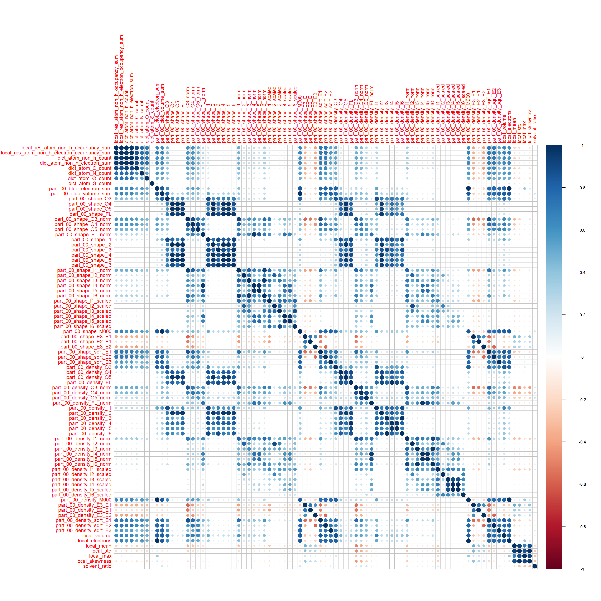 

```r
corrplot(corsMatrix_yellow, method="circle")
```

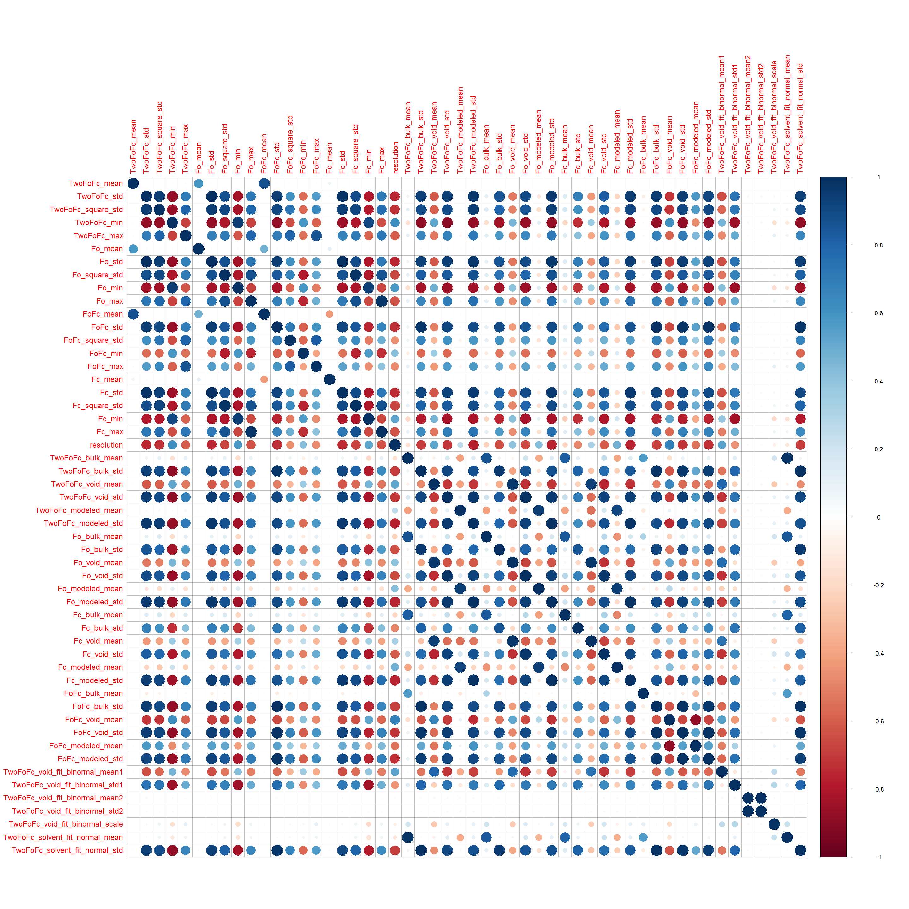 

8. Liczba przykładów dla każdej z klas:

```r
sort(table(data$res_name), decreasing=TRUE)
```

```
## 
## GOL  CA  MG  CL PO4 HEM EDO ACT FAD ADP  FE   K ATP  CU PEG  CD MES EPE 
## 778 661 402 400 301 296 274 167 157 138 120 119 106 104  90  81  79  72 
## BME PG4 TRS  CO SEP PLP CIT GDP SAH FE2 TPO IOD SF4 PGE GLC DMS BOG PCA 
##  67  67  63  61  61  59  56  55  54  52  50  49  49  48  46  42  40  40 
## BGC AMP GTP ACY BMA COA CSD FES 1PE FMT  HG  BR GAL HEC CME UDP PTR CSO 
##  39  38  37  36  36  35  35  35  34  34  34  32  32  32  30  30  29  28 
## P6G FUC H4B MRD ACE FLC IMD SAM SIA MLI LLP MLY IPA KCX TLA MAL PLM POP 
##  28  27  27  27  26  26  25  25  24  23  22  22  21  21  21  19  19  18 
## OCS SUC CAC GSH LMT UMP CRO 8OG APC F3S ABA ACO ALY HED M3L TYS  BA C8E 
##  17  17  16  16  16  16  15  14  14  14  13  13  13  12  12  12  11  11 
## CTP DOC MLA MLZ TPP XYP A2G BEZ BRU MTX RET THP 5CM ACP  AU C5P CDL CSX 
##  11  11  11  11  11  11  10  10  10  10  10  10   9   9   9   9   9   9 
## CU1 CUA F6P  PT  SR BCL BPH BTB FME HEZ PE4 PYR SRM UPG 3DR ADE B12 CAS 
##   9   9   9   9   9   8   8   8   8   8   8   8   8   8   7   7   7   7 
## CCC CO3 CR2  CS CSS DHE GSP HIC IHP IMP MBO PEP U10 U5P UTP VO4  XE YCM 
##   7   7   7   7   7   7   7   7   7   7   7   7   7   7   7   7   7   7 
## 5GP BHG C2E CAD DHT DMU GLA GPP HC4 HYP IDS KAI TAM TTP XYS  YB 2HP 6OG 
##   6   6   6   6   6   6   6   6   6   6   6   6   6   6   6   6   5   5 
## A23 A3P A8S AGS BCT BDP C2F CAM CB3 CIR CMP CPT FBP FOL GSW GTT GTX IPH 
##   5   5   5   5   5   5   5   5   5   5   5   5   5   5   5   5   5   5 
## LAT MLE MRG OLC PGA PGV PSU S9L SGM SRT STU TAR TES  TL TMP UMQ 0G6 12P 
##   5   5   5   5   5   5   5   5   5   5   5   5   5   5   5   5   4   4 
## 2PE 5BU 5MU AKG AP5 ARS ATM AZA AZI BLA CDP CHD CLF COH  CP CTT CXM CXS 
##   4   4   4   4   4   4   4   4   4   4   4   4   4   4   4   4   4   4 
## CYC DXC EOH GMP HDD HEA IAS IPE LBT MLT MOO MPO MTA MVA MYR PAF PAR PEE 
##   4   4   4   4   4   4   4   4   4   4   4   4   4   4   4   4   4   4 
## PG6 PLC PMP PPV ROC S3P SME T44 TAU TPQ TRQ TYD URE YT3 ZST 017 0AF 1BO 
##   4   4   4   4   4   4   4   4   4   4   4   4   4   4   4   3   3   3 
## 1PG 2GP 3CO 3TL 5IU A2M A5P ACD AG2 ALC AME ARB ASJ B3P B4P BCD BMP BTI 
##   3   3   3   3   3   3   3   3   3   3   3   3   3   3   3   3   3   3 
## BU1 BU3 C2O CAF CAP CCS CGU CLA CPS CR8 D3T DDE DEP DMA EAA EMC EPH F09 
##   3   3   3   3   3   3   3   3   3   3   3   3   3   3   3   3   3   3 
## FEO FO1 G3P G6P GAI GBX GCP  GD GLP GYS HAS  HO KPI LHG MA4 ME2 MHO MIY 
##   3   3   3   3   3   3   3   3   3   3   3   3   3   3   3   3   3   3 
## MJI MMC MTT OCY OHT ORO OXM OXY P22 P34 P4C PA5 PC1 PEK PG5 PHD PMB PO3 
##   3   3   3   3   3   3   3   3   3   3   3   3   3   3   3   3   3   3 
## POL PSC R18  RB RBF SAC SCH SFG SGC SLB SPM STA STE TCL TGL TOP TTD UD1 
##   3   3   3   3   3   3   3   3   3   3   3   3   3   3   3   3   3   3 
## WO4 XCP XG4 XMP XXH ZMR 08Q 0MO 128 13P 144 149 1CA 1GP 1MA 250 2AL 2CV 
##   3   3   3   3   3   3   2   2   2   2   2   2   2   2   2   2   2   2 
## 2OP 2PG 3HX 3PG 3TR 4IP 4MO 5FU 5MY 64T A1R A2P AB1 ABJ ACR AD9 AG7 AKR 
##   2   2   2   2   2   2   2   2   2   2   2   2   2   2   2   2   2   2 
## ALF AM2 APJ AS0 ASC ASD ASO ASX AT2 AT3 ATG B3E BCB BCO BCR BCZ BFD BIL 
##   2   2   2   2   2   2   2   2   2   2   2   2   2   2   2   2   2   2 
## BMQ BMT BMU BO2 BO3 BPB C12 CAQ CAZ CBE CBI CE5 CHT CLR CO8 CR7 CRQ CRS 
##   2   2   2   2   2   2   2   2   2   2   2   2   2   2   2   2   2   2 
## CSF CTO CX2 CZH D10 D15 DEX DHC DKI DLY DPO DXP EBP  ET ETF ETM F42 FCO 
##   2   2   2   2   2   2   2   2   2   2   2   2   2   2   2   2   2   2 
## FK5 FMR FRU FUL FWF G2P G39 G3H G4P G6D G75 G85  GB GCD GH3 GPJ GRG GTB 
##   2   2   2   2   2   2   2   2   2   2   2   2   2   2   2   2   2   2 
## H2U HBA HCA HCI HHA HPA HTG HTO HY0 I3P ICT ILO IMO IXM IZA JI2 KAP KD0 
##   2   2   2   2   2   2   2   2   2   2   2   2   2   2   2   2   2   2 
## KDO  KR L2P  LI LI1 LMA LMR LMU LOC LPA M7G MA7 MAA MAE MDO MF4 MIS MLR 
##   2   2   2   2   2   2   2   2   2   2   2   2   2   2   2   2   2   2 
## MOS MPG MTY MYA O2C OAA OLA OLP OMG ORP OXL OXZ   P P4O PAP  PB  PC PCF 
##   2   2   2   2   2   2   2   2   2   2   2   2   2   2   2   2   2   2 
## PCG PE3 PG0 PGO PGR PHI PHS PIO PLR PPS PT6 PTY QEI QSI RAM RBZ RIB RIS 
##   2   2   2   2   2   2   2   2   2   2   2   2   2   2   2   2   2   2 
## RIT SAR SCR SKM SLL  SM SMC SQO SRY STI TAD TAK TBA TBU TCE TDP TEO TFA 
##   2   2   2   2   2   2   2   2   2   2   2   2   2   2   2   2   2   2 
## TFP TG1 THJ THM TRE TRH TX2 U2F UAP UC1 UFR UMS UR3 URA URF XPC XPE XUL 
##   2   2   2   2   2   2   2   2   2   2   2   2   2   2   2   2   2   2 
## ZIP ZLD ZOL 006 010 01K 027 02P 031 03P 03Q 03R 043 048 04C 04L 056 057 
##   2   2   2   1   1   1   1   1   1   1   1   1   1   1   1   1   1   1 
## 05B 065 06W 074 07V 085 08B 08E 08R 091 098 09B 09M 0B3 0BB 0BT 0C2 0C5 
##   1   1   1   1   1   1   1   1   1   1   1   1   1   1   1   1   1   1 
## 0DJ 0ET 0F9 0FQ 0FX 0G1 0GE 0H6 0HH 0HV 0IW 0J5 0JJ 0JK 0JO 0K1 0KH 0L6 
##   1   1   1   1   1   1   1   1   1   1   1   1   1   1   1   1   1   1 
## 0LB 0LG 0LI 0LJ 0LL 0LM 0M8 0ME 0MR 0O4 0OC 0OJ 0OQ 0OU 0QA 0QE 0QK 0RF 
##   1   1   1   1   1   1   1   1   1   1   1   1   1   1   1   1   1   1 
## 0RQ 0RS 0S7 0SC 0SV 0T4 0TD 0TR 0TU 0UL 0VE 0VH 0WH 0WO 0WU 0WZ 0Y4 0ZS 
##   1   1   1   1   1   1   1   1   1   1   1   1   1   1   1   1   1   1 
## 10E 10L 117 11E 11H 11M 11O 11S 126 12F 12V 13C 13U 140 14D 14H 14Q 14W 
##   1   1   1   1   1   1   1   1   1   1   1   1   1   1   1   1   1   1 
## 14Z 15H 15R 16B 16H 16L 17J 17L 182 188 189 18A 18F 18H 18O 198 19E 19G 
##   1   1   1   1   1   1   1   1   1   1   1   1   1   1   1   1   1   1 
## 19J 19Q 19T 1A4 1AC 1BB 1BI 1BK 1BQ 1BS 1BX 1CI 1CO 1CP 1CS 1DF 1DP 1DQ 
##   1   1   1   1   1   1   1   1   1   1   1   1   1   1   1   1   1   1 
## 1DZ 1E8 1EO 1ET 1F2 1FL 1FZ 1G5 1H3 1HW 1JD 1KG 1KX 1LG 1M8 1MF 1MH 1MY 
##   1   1   1   1   1   1   1   1   1   1   1   1   1   1   1   1   1   1 
## 1O6 1P0 1PS 1PV 1QK 1QO 1QZ 1RC 1RH 1RO 1RS 1RY 1SB 1SM 1SS 1TB 1TL 1TY 
##   1   1   1   1   1   1   1   1   1   1   1   1   1   1   1   1   1   1 
## 1U8 1V1 1VK 1VY 1WH 1WO 1WX 1YX 200 21P 21Q 21U 23Q 23R 246 24I 24M 24P 
##   1   1   1   1   1   1   1   1   1   1   1   1   1   1   1   1   1   1 
## 24X 24Z 25A 25E 25H 25P 25R 25U 263 265 27U 285 28C 28D 28F 29Q 29X 2A2 
##   1   1   1   1   1   1   1   1   1   1   1   1   1   1   1   1   1   1 
## 2AD 2AK 2AM 2B4 2BA 2BO 2BP 2BR 2CD 2CK 2CL 2CS 2D0 2D2 2D3 2DB 2DE 2FA 
##   1   1   1   1   1   1   1   1   1   1   1   1   1   1   1   1   1   1 
## 2FY 2FZ 2G0 2GE 2HC 2HF 2ID 2IP 2J8 2JR 2JZ 2K1 2KD 2KJ 2KK 2LC 2LJ 2M8 
##   1   1   1   1   1   1   1   1   1   1   1   1   1   1   1   1   1   1 
## 2MG 2MR 2OB 2OK 2OO 2OT 2OU 2OX 2Q4 2QB 2QG 2SB 2ST 2TS 2TW 2UJ 2UZ 2VR 
##   1   1   1   1   1   1   1   1   1   1   1   1   1   1   1   1   1   1 
## 2WQ 2XA 2XE 2XS 2XY 2YH 2YR 2ZT 2ZV 312 313 31J 31U 321 32G 332 334 33C 
##   1   1   1   1   1   1   1   1   1   1   1   1   1   1   1   1   1   1 
## 33F 344 34H 34I 357 35I 361 364 37D 388 38G 38R 38T 393 394 398 39K 3A2 
##   1   1   1   1   1   1   1   1   1   1   1   1   1   1   1   1   1   1 
## 3AB 3AD 3BC 3BE 3BM 3BV 3BZ 3CM 3CU 3D1 3D8 3DH 3E1 3E5 3EB 3EY 3F8 3FE 
##   1   1   1   1   1   1   1   1   1   1   1   1   1   1   1   1   1   1 
## 3FV 3FX 3GB 3GP 3GQ 3GW 3HC 3J7 3J9 3JR 3JY 3LZ 3M2 3M4 3MC 3MI 3MS 3O4 
##   1   1   1   1   1   1   1   1   1   1   1   1   1   1   1   1   1   1 
## 3OB 3OD 3PI 3PS 3PT 3QC 3RA 3RS 3S2 3SA 3SD 3SL 3SZ 3T9 3U1 3V0 3VB 3WD 
##   1   1   1   1   1   1   1   1   1   1   1   1   1   1   1   1   1   1 
## 3WP 3WR 3XD 3XU 3Z3 3Z8 3ZB 405 406 408 40A 40B 40C 40G 40T 40U 416 426 
##   1   1   1   1   1   1   1   1   1   1   1   1   1   1   1   1   1   1 
## 428 42K 42Z 431 444 447 451 452 48T 4A3 4AW 4BF 4BT 4BZ 4C0 4CC 4CM 4CQ 
##   1   1   1   1   1   1   1   1   1   1   1   1   1   1   1   1   1   1 
## 4CS 4DB 4FF 4FJ 4FY 4FZ 4G5 4HD 4HY 4KA 4OC 4PI 4SB 4SP 4SU 4TT 4UB 509 
##   1   1   1   1   1   1   1   1   1   1   1   1   1   1   1   1   1   1 
## 513 518 523 52A 52B 52P 52X 534 53I 53J 53V 552 569 57D 581 585 596 598 
##   1   1   1   1   1   1   1   1   1   1   1   1   1   1   1   1   1   1 
## 59A 59W 5AD 5B1 5B2 5BA 5DR 5EL 5FC 5FD 5FE 5GF 5H4 5HE 5HK 5MA 5MC 5P3 
##   1   1   1   1   1   1   1   1   1   1   1   1   1   1   1   1   1   1 
## 5P8 5PA 5RP 5SE 5YL 611 614 626 647 64U 65B 675 678 680 6A5 6AS 6CF 6CW 
##   1   1   1   1   1   1   1   1   1   1   1   1   1   1   1   1   1   1 
## 6DJ 6HK 6IA 6MA 6MO 6MZ 6OB 6OC 6P3 6PC 6PG 6PL 6QM 6T6 6TG 75A 76V 770 
##   1   1   1   1   1   1   1   1   1   1   1   1   1   1   1   1   1   1 
## 780 78M 79X 79Z 7A5 7CP 7DE 7DR 7HA 7MD 7ME 7PQ 7RG 7X3 7X4 7X5 7X6 7YG 
##   1   1   1   1   1   1   1   1   1   1   1   1   1   1   1   1   1   1 
## 801 809 815 81R 824 839 845 861 879 880 88W 897 8AR 8CX 8HG 8ME 8PH 8UP 
##   1   1   1   1   1   1   1   1   1   1   1   1   1   1   1   1   1   1 
## 92G 92P 935 942 99B 9DP 9MR 9MX 9PA 9RA A09 A12 A14 A22 A26 A3T A48 A49 
##   1   1   1   1   1   1   1   1   1   1   1   1   1   1   1   1   1   1 
## A5M A60 A6J A6M A8B A9U AA1 AAA AAL AB2 ABB ABG AC2 ACH ACM ACV ADK ADX 
##   1   1   1   1   1   1   1   1   1   1   1   1   1   1   1   1   1   1 
## AEI AEJ AES  AF AF3 AFR AG0 AG6 AGD AGG AGL AGT AHB AHR AHU AIA AIB AIG 
##   1   1   1   1   1   1   1   1   1   1   1   1   1   1   1   1   1   1 
## AIQ AIS AJD AKH ALQ AM7 AMF AMG AMI AMQ AMZ AOC AOE AOV AQH AQM AR6 ARD 
##   1   1   1   1   1   1   1   1   1   1   1   1   1   1   1   1   1   1 
## ARF AS1 ASA ASV AT1 ATR ATV AV2 AVC AVU AVW AVX AX2 AX5 AXA AXD AXX AYA 
##   1   1   1   1   1   1   1   1   1   1   1   1   1   1   1   1   1   1 
## AYH AZ5 AZX AZZ B13 B1R B27 B2A B2P B3L B3Q B3Y B41 B5F B5S B60 B73 B78 
##   1   1   1   1   1   1   1   1   1   1   1   1   1   1   1   1   1   1 
## B7G B85 B86 B93 BA3 BAL BAM BAP BAT BAV BB0 BB6 BB9 BBL BBQ BBZ BC2 BC6 
##   1   1   1   1   1   1   1   1   1   1   1   1   1   1   1   1   1   1 
## BD6 BDB BDE BDW BDX BE1 BE2 BEB BEI BEM BER BES BFG BG6 BGM BGU BGV BH9 
##   1   1   1   1   1   1   1   1   1   1   1   1   1   1   1   1   1   1 
## BHB BHE BHF BHO BI1 BI4 BI8 BIK BIO BJA BK5 BLK BLL BLS BM4 BOU BP1 BPU 
##   1   1   1   1   1   1   1   1   1   1   1   1   1   1   1   1   1   1 
## BPY BR8 BRH BRK BRL BRV BSA BSF BSH BSM BT5 BTK BTM BTQ BTS BTX BU4 BUD 
##   1   1   1   1   1   1   1   1   1   1   1   1   1   1   1   1   1   1 
## BUM BV5 BVD BX3 BX7 BXA BXB BXY BZ2 BZ3 BZ5 BZB BZG BZH C0R C0T C15 C17 
##   1   1   1   1   1   1   1   1   1   1   1   1   1   1   1   1   1   1 
## C1E C1P C1X C27 C28 C2C C2G C38 C42 C46 C6B C6L C70 C8C C9M CA2 CA8 CAO 
##   1   1   1   1   1   1   1   1   1   1   1   1   1   1   1   1   1   1 
## CB4 CB7 CB8 CBD CBH CBK CBQ CBR CBY CCD CCL CCQ CDM CE1 CEE CEF CER CF2 
##   1   1   1   1   1   1   1   1   1   1   1   1   1   1   1   1   1   1 
## CFA CFQ CFV CFZ CH1 CHL CHV CJC CK5 CK7 CL6 CL7 CLY CM0 CM5 CMA CMC CMJ 
##   1   1   1   1   1   1   1   1   1   1   1   1   1   1   1   1   1   1 
## CMT CO4 COB COC COF COU CP3 CPQ CQ2 CQU  CR CR4 CRF CSU CSZ CT0 CT4 CTE 
##   1   1   1   1   1   1   1   1   1   1   1   1   1   1   1   1   1   1 
## CTM CTZ CUO CXG CXT CY3 CY8 CYR D09 D1C D1D D1S D1T D30 D3M D3Y D42 D44 
##   1   1   1   1   1   1   1   1   1   1   1   1   1   1   1   1   1   1 
## D46 D4M D5M D80 D87 DB8 DBJ DBR DDR DDY DDZ DE3 DFP DH2 DHB DHF DHK DHY 
##   1   1   1   1   1   1   1   1   1   1   1   1   1   1   1   1   1   1 
## DJK DKD DKT DLG DLI DM2 DME DMG DOO DOT DP2 DPX DQH DQO DQR DR4 DRX DSC 
##   1   1   1   1   1   1   1   1   1   1   1   1   1   1   1   1   1   1 
## DSD DSG DST DSU DVP DWD DWF DZE DZO E20 E36 E3O E4H E5G EAX ECC ECH EDV 
##   1   1   1   1   1   1   1   1   1   1   1   1   1   1   1   1   1   1 
## EEA EEE EF3 EFG EFT EFZ EGD EIC EIP EK4 EK5 EME EMF EMT EOL EP1 EPA EPB 
##   1   1   1   1   1   1   1   1   1   1   1   1   1   1   1   1   1   1 
## EPZ ERB ERM ERT ERY ESA ESI EST ET1 ETS ETX EV2 EV4 EVJ EWW F01 F12 F2I 
##   1   1   1   1   1   1   1   1   1   1   1   1   1   1   1   1   1   1 
## F2Y F47 F4S F6R F76 F89 F9F F9J FAH FAP FAQ FBO FCE FCL FCT FD1 FDP FDR 
##   1   1   1   1   1   1   1   1   1   1   1   1   1   1   1   1   1   1 
## FEA FER FFX FG5 FGH FGP FHO FHP FHU FID FII FIP FJP FK9 FKP FLA FLF FLW 
##   1   1   1   1   1   1   1   1   1   1   1   1   1   1   1   1   1   1 
## FMB FMP FOA FOM FOS FP1 FPF FPM FPQ FRV FS9 FSC FSK FSL FSO FT0 FT1 FTR 
##   1   1   1   1   1   1   1   1   1   1   1   1   1   1   1   1   1   1 
## FTY FUM FVQ FWD G00 G07 G16 G18 G1C G1P G2F G38 G3B G3E G3G G3R G3X G4M 
##   1   1   1   1   1   1   1   1   1   1   1   1   1   1   1   1   1   1 
## G7P G9D GA2 GA4 GA9 GAA GAU GAX GBL GC2 GCS GD9 GDD GDS GEQ GER GFB GG4 
##   1   1   1   1   1   1   1   1   1   1   1   1   1   1   1   1   1   1 
## GGV GI2 GIC GK1 GLF GLJ GLX GLZ GM6 GMH GOA GOX GP0 GP1 GP7 GPA GPF GPU 
##   1   1   1   1   1   1   1   1   1   1   1   1   1   1   1   1   1   1 
## GRB GS8 GSB GSF GTC GTG GTR GUA GVE GW9 GWH GWJ GYC H02 H06 H13 H16 H1L 
##   1   1   1   1   1   1   1   1   1   1   1   1   1   1   1   1   1   1 
## H1S H2S H4W H57 H5S H5U H9K HA3 HA5 HAH HAM HAO HAR HBB HBP HBQ HCS HD1 
##   1   1   1   1   1   1   1   1   1   1   1   1   1   1   1   1   1   1 
## HDB HDE HDS HE3 HEX HFT HGB HGI HHG HHS HI3 HI5 HKA HLT HMD HMT HOC HP7 
##   1   1   1   1   1   1   1   1   1   1   1   1   1   1   1   1   1   1 
## HPH HQY HR7 HRD HRG HS4 HSX  HT HTI HTL HUP HW9 HXJ HYG I13 I1H I1S I22 
##   1   1   1   1   1   1   1   1   1   1   1   1   1   1   1   1   1   1 
## I2H I3K I5I I5U I6P I76 IAB IAC ICE ICS ID2 IFM IH5 IHE IHH IHJ IHM IK2 
##   1   1   1   1   1   1   1   1   1   1   1   1   1   1   1   1   1   1 
## IL2 IM2 IM9 IMI IOB IOP IP2 IP9 IPT IQO IQX IR4 IRE IRG ISF ISL ITA ITT 
##   1   1   1   1   1   1   1   1   1   1   1   1   1   1   1   1   1   1 
## IUM IVA IVU IW3 IW6 IYZ IZ3 IZ5 J07 J21 J2T J3Z J72 JAK JAO JB1 JB2 JE2 
##   1   1   1   1   1   1   1   1   1   1   1   1   1   1   1   1   1   1 
## JEF JFK JG1 JG3 JGZ JHG JHM JK1 JK3 JLS JM2 JPJ JRO JRS JS4 JZ2 JZI JZS 
##   1   1   1   1   1   1   1   1   1   1   1   1   1   1   1   1   1   1 
## K03 K11 K17 K2Q K4F K55 K83 KAB KBI KDE KGC KI1 KJ8 KJZ KLI KMB KRL KRW 
##   1   1   1   1   1   1   1   1   1   1   1   1   1   1   1   1   1   1 
## KTC KTP KWS KWT KWZ KYS KYT L1R L20 L21 L2C L3P LA2 LA6 LA8 LAC LAE LAG 
##   1   1   1   1   1   1   1   1   1   1   1   1   1   1   1   1   1   1 
## LAI LAR LAZ LBV LC0 LC2 LE2 LFA LFC LGJ LIV LJH LK0 LL3 LL9 LLO LLT LM2 
##   1   1   1   1   1   1   1   1   1   1   1   1   1   1   1   1   1   1 
## LMB LMS LP4 LP5 LP6 LPM LPQ LRD LRG LS4 LSR LT2  LU LWW LX9 LYA LZ7 LZ8 
##   1   1   1   1   1   1   1   1   1   1   1   1   1   1   1   1   1   1 
## LZC LZD LZJ LZP LZS M06 M0E M0Z M23 M27 M2F M2P M2T M3I M3S M42 M6D M77 
##   1   1   1   1   1   1   1   1   1   1   1   1   1   1   1   1   1   1 
## M7K M7P M7S M7U M87 MA5 MA6 MAG MAP MAR MAU MAY MBB MBG MCA MDF MDL MDS 
##   1   1   1   1   1   1   1   1   1   1   1   1   1   1   1   1   1   1 
## MDX ME5 ME6 MEF MER MEV MFR MFT MG7 MGD MGE MGM MGO MGT MGX MH4 MI1 MI2 
##   1   1   1   1   1   1   1   1   1   1   1   1   1   1   1   1   1   1 
## MI6 MIA MK1 MK3 MK5 MK8 ML0 ML2 ML5 MLD MLG MME MMP MMY MO7 MOG MOM MOW 
##   1   1   1   1   1   1   1   1   1   1   1   1   1   1   1   1   1   1 
## MPZ MQ7 MQ9 MQU MR1 MRC MS0 MT9 MTE MTH MTL MU1 MUG MUU MVI MXC MYE MYU 
##   1   1   1   1   1   1   1   1   1   1   1   1   1   1   1   1   1   1 
## MYY O09 O13 O7M O8H O92 OA1 OAR OAS OBI OC9 OCE OCQ OCR ODK ODR OEC OEM 
##   1   1   1   1   1   1   1   1   1   1   1   1   1   1   1   1   1   1 
## OFM OHH OHI OIL OIO OMT OMX OMY OOP OP1 OPC  OS OSE P23 P27 P2Q P33 P38 
##   1   1   1   1   1   1   1   1   1   1   1   1   1   1   1   1   1   1 
## P39 P3J P41 P47 P4L P5A P6L P7A P86 P9C P9G PA7 PAI PAL PAO PAU PBE PBZ 
##   1   1   1   1   1   1   1   1   1   1   1   1   1   1   1   1   1   1 
## PC0 PCD PCJ PCP PCR PCW PE8 PEB PEF PEY PF8 PFB PFD PFF PFU PFY PGH PGP 
##   1   1   1   1   1   1   1   1   1   1   1   1   1   1   1   1   1   1 
## PH2 PH7 PHB PHK PHO PI7 PID PII PIV PIW PIZ PJ7 PK1 PLG PLL PLZ PM2 PM3 
##   1   1   1   1   1   1   1   1   1   1   1   1   1   1   1   1   1   1 
## PMJ PMM POA POV POY PPU PQ0 PQ9 PS9 PSG PT1 PTD PU1 PU2 PU4 PUT PVS PXG 
##   1   1   1   1   1   1   1   1   1   1   1   1   1   1   1   1   1   1 
## PXL PXM PXT PYC PYZ PZ1 PZX Q7U QAP QH3 QJ8 QK0 QPA QPT QQY QUS R4A R4L 
##   1   1   1   1   1   1   1   1   1   1   1   1   1   1   1   1   1   1 
## R57 R8D R8E RAJ RAL RAP RAR RAS RC1 RCA RCO REA RFQ RGP RH3 RH9 RIE RIO 
##   1   1   1   1   1   1   1   1   1   1   1   1   1   1   1   1   1   1 
## RJP RLI RLL RLP RMA RML RMO RO8 ROP RP4 RPF RR8 RRC RRG RT7 RTZ  RU RU7 
##   1   1   1   1   1   1   1   1   1   1   1   1   1   1   1   1   1   1 
## RUM RUT RWY RXC RXP S0C S12 S20 S2C S3H S47 S79 SAG SAL SAP SAY  SB SB4 
##   1   1   1   1   1   1   1   1   1   1   1   1   1   1   1   1   1   1 
## SBE SBI SBT SCQ SCS SDP SDS SEB SEE SEK SES SET SFF SGA SHF SHG SHY SI3 
##   1   1   1   1   1   1   1   1   1   1   1   1   1   1   1   1   1   1 
## SK4 SKZ SL6 SLC SLI SLU SM2 SMA SMM SMQ SMT SO1 SO2 SO3 SOA SOG SOP SOR 
##   1   1   1   1   1   1   1   1   1   1   1   1   1   1   1   1   1   1 
## SPO SPX SQD SRA SRX ST4 ST8 STL STR STZ SUA SUE SUG SUJ SUO SUR SVE SW2 
##   1   1   1   1   1   1   1   1   1   1   1   1   1   1   1   1   1   1 
## SW4 SWA SWG SX0 SXE SXI SXM SYC SYM SYR SYY SZH T04 T05 T23 T25  T3 T3A 
##   1   1   1   1   1   1   1   1   1   1   1   1   1   1   1   1   1   1 
## T3C T3P T3Q T50 T5C T6A T6Q T95 T9T TAC TAF TAT  TB TBY TCB TCG TD9 TDB 
##   1   1   1   1   1   1   1   1   1   1   1   1   1   1   1   1   1   1 
## TDH TDL TDR TDY TFE TFO TFX TGT TH5 THC THF THG THH TIZ TLM TM1 TMF TMQ 
##   1   1   1   1   1   1   1   1   1   1   1   1   1   1   1   1   1   1 
## TMZ TOE TOU TOX TP8 TP9 TPS TQQ TQX TR1 TR3 TR4 TR5 TR7 TRD TRO TSC TSH 
##   1   1   1   1   1   1   1   1   1   1   1   1   1   1   1   1   1   1 
## TT1 TTB TX4 TYK TYM TYY TZ4 TZ5 TZE TZM U1S U21 U2P U31 UA1 UBD UBS UCL 
##   1   1   1   1   1   1   1   1   1   1   1   1   1   1   1   1   1   1 
## UCM UD5 UDX UF2 UFG UFT UGA UI2 ULA UM3 UMA UP3 UPX URC URD US2 UW2 UXH 
##   1   1   1   1   1   1   1   1   1   1   1   1   1   1   1   1   1   1 
## V10 V55 VAP VD2 VDO VDX VET VG5 VGD VGP VHH VIB VIV VJP VME VRB VSC VV7 
##   1   1   1   1   1   1   1   1   1   1   1   1   1   1   1   1   1   1 
## VX6 W05 W7C WA2 WF4 WLM WM9 WO5 WOE WRA WUB X01 X05 X0B X0T X1S X21 X2F 
##   1   1   1   1   1   1   1   1   1   1   1   1   1   1   1   1   1   1 
## X8D XAP XAV XC2 XCC XDS XFE XFM XI2 XJG XK0 XK9 XL3 XLX XMM XPL XQI XQK 
##   1   1   1   1   1   1   1   1   1   1   1   1   1   1   1   1   1   1 
## XRA XTF XVE XXA XY3 XYA XYD XYG XYL Y27 YBY YHX YI1 YIX YLA YLO YM4 YM6 
##   1   1   1   1   1   1   1   1   1   1   1   1   1   1   1   1   1   1 
## YRO YS2 YVQ YYY Z12 Z34 Z3R Z74 Z76 Z80 Z82 Z84 Z85 Z8B Z90 Z92 Z98 ZAA 
##   1   1   1   1   1   1   1   1   1   1   1   1   1   1   1   1   1   1 
## ZAE ZDR ZEA ZID ZIO ZMA ZMG ZOO ZPE ZPG ZSC ZU4 ZW3 ZX0 ZYM ZYV ZYZ ZZ0 
##   1   1   1   1   1   1   1   1   1   1   1   1   1   1   1   1   1   1
```
Dodatkowo istnieje 238 obserwacji bez przypisanej klasy.

9. Rozk³ad liczby atomów (local_res_atom_non_h_count) i elektronów (local_res_atom_non_h_electron_sum):

```r
hist_atom <- ggplot(data, aes(x=local_res_atom_non_h_count)) + geom_histogram(binwidth=1, fill="red", colour="black")
hist_atom
```

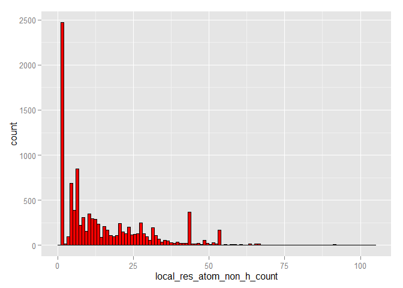 

```r
hist_electron <- ggplot(data, aes(x=local_res_atom_non_h_electron_sum)) + geom_histogram(binwidth=6, fill="red", colour="black")
hist_electron
```

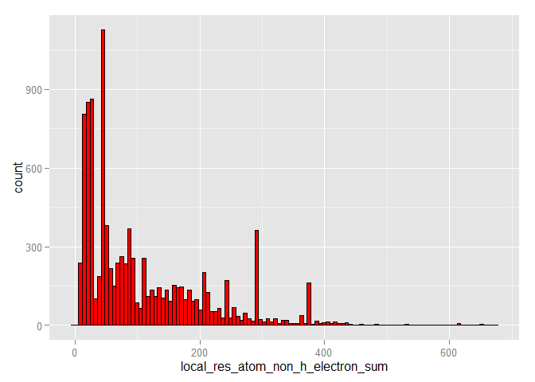 

10. Próba odtworzenia wykresu:

```r
theme_clear <- theme(axis.ticks=element_blank(),
                     panel.background=element_blank(),
                     panel.grid.minor=element_blank(), panel.grid.major=element_blank(), 
                     axis.text.x=element_blank(), axis.text.y=element_blank(),
                     axis.title.x=element_blank(), axis.title.y=element_blank())
               

empty <- ggplot() + geom_point(aes(1,1), colour='white') + theme_clear

scatter <- ggplot(data, aes(local_res_atom_non_h_electron_sum, local_res_atom_non_h_count)) +
    stat_density2d(geom="tile", aes(fill = ..density..), contour = FALSE )+
    scale_fill_gradientn(colours=rev(rainbow(500, start=0, end=0.75, alpha=0.5))) +
    scale_x_continuous(expand = c(0, 0)) + scale_y_continuous(expand = c(0, 0))+
    theme(
        panel.grid.minor=element_blank(), panel.grid.major=element_blank(), 
        axis.title.x=element_blank(), axis.title.y=element_blank(),
        panel.background=element_rect(fill='white',colour='black'),legend.position = "none")

grid.arrange(
  hist_electron + scale_x_continuous(expand = c(0, 0)) + scale_y_continuous(expand = c(0, 0)) + theme_clear, 
  empty, scatter, 
  hist_atom + coord_flip() + scale_x_continuous(expand = c(0, 0)) + scale_y_continuous(expand = c(0, 0)) + theme_clear,
  ncol=2, nrow=2,widths=c(4,1), heights=c(1,4))
```

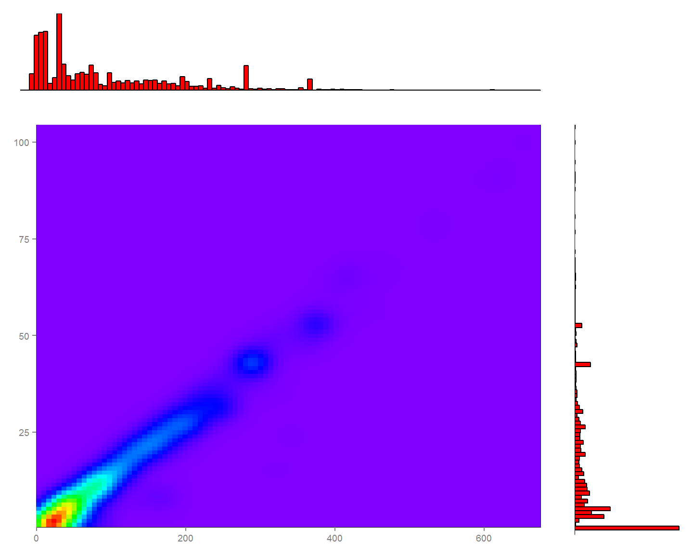 

11.1. 10 klas z największą niezgodnością liczby atomów:


```r
data_11 <- data %>% 
    mutate(diff_atom = abs(local_res_atom_non_h_count - dict_atom_non_h_count)) %>% 
    group_by(res_name) %>%
    summarize(
      mean_diff_atom = mean(diff_atom), 
      min_diff_atom = min(diff_atom),
      max_diff_atom = max(diff_atom)
    )
```

Wg średniej:

```r
data_11 %>% arrange(desc(mean_diff_atom)) %>% select(res_name, mean_diff_atom) %>% head(10)
```

```
## Source: local data frame [10 x 2]
## 
##    res_name mean_diff_atom
##      (fctr)          (dbl)
## 1       PC1       33.33333
## 2       CPQ       33.00000
## 3       JEF       33.00000
## 4       VV7       33.00000
## 5       M0E       32.00000
## 6       PTY       31.00000
## 7       LI1       29.50000
## 8       IP9       27.00000
## 9       PEF       27.00000
## 10      LP5       26.00000
```

Wg min:

```r
data_11 %>% arrange(desc(min_diff_atom)) %>% select(res_name, min_diff_atom) %>% head(10)
```

```
## Source: local data frame [10 x 2]
## 
##    res_name min_diff_atom
##      (fctr)         (dbl)
## 1       CPQ            33
## 2       JEF            33
## 3       VV7            33
## 4       M0E            32
## 5       PTY            31
## 6       IP9            27
## 7       LI1            27
## 8       PEF            27
## 9       LP5            26
## 10      LP4            23
```

Wg max:

```r
data_11 %>% arrange(desc(max_diff_atom)) %>% select(res_name, max_diff_atom) %>% head(10)
```

```
## Source: local data frame [10 x 2]
## 
##    res_name max_diff_atom
##      (fctr)         (dbl)
## 1       CDL            60
## 2       PC1            43
## 3       3TL            33
## 4       CPQ            33
## 5       JEF            33
## 6       PE3            33
## 7       PEE            33
## 8       VV7            33
## 9       LI1            32
## 10      M0E            32
```

11.2. 10 klas z największą niezgodnością liczby elektronów:

```r
data_11 <- data %>% 
    mutate(diff_electron = abs(local_res_atom_non_h_electron_sum - dict_atom_non_h_electron_sum)) %>%
    group_by(res_name) %>%
    summarize(
      mean_diff_electron = mean(diff_electron), 
      min_diff_electron = min(diff_electron),
      max_diff_electron = max(diff_electron)
    )
```

Wg średniej:

```r
data_11 %>% arrange(desc(mean_diff_electron)) %>% select(res_name, mean_diff_electron) %>% head(10)
```

```
## Source: local data frame [10 x 2]
## 
##    res_name mean_diff_electron
##      (fctr)              (dbl)
## 1       CPQ           225.0000
## 2       VV7           224.0000
## 3       JEF           213.0000
## 4       PC1           211.6667
## 5       M0E           196.0000
## 6       PEF           188.0000
## 7       PTY           186.0000
## 8       IP9           185.0000
## 9       LI1           183.0000
## 10      LP5           160.0000
```

Wg min:

```r
data_11 %>% arrange(desc(min_diff_electron)) %>% select(res_name, min_diff_electron) %>% head(10)
```

```
## Source: local data frame [10 x 2]
## 
##    res_name min_diff_electron
##      (fctr)             (dbl)
## 1       CPQ               225
## 2       VV7               224
## 3       JEF               213
## 4       M0E               196
## 5       PEF               188
## 6       PTY               186
## 7       IP9               185
## 8       LI1               168
## 9       LP5               160
## 10      T5C               153
```

Wg max:

```r
data_11 %>% arrange(desc(max_diff_electron)) %>% select(res_name, max_diff_electron) %>% head(10)
```

```
## Source: local data frame [10 x 2]
## 
##    res_name max_diff_electron
##      (fctr)             (dbl)
## 1       CDL               360
## 2       PC1               284
## 3       CPQ               225
## 4       PEE               224
## 5       VV7               224
## 6       PE3               222
## 7       B4P               220
## 8       JEF               213
## 9       3TL               211
## 10      LI1               198
```

12. Rozkład wartości wszystkich kolumn zaczynających się od part_01 z zaznaczeniem średniej wartości:


```r
cols_part_01 <- select(data, matches("part_01.*"))

par(mfrow=c(1,3), las=1)

for(i in 1:ncol(cols_part_01)) {
  mx <- mean(cols_part_01[[i]], na.rm = TRUE)
  hist(cols_part_01[[i]], main = paste(colnames(cols_part_01)[i], "\n(avg:", mx, ")", sep=""))
  abline(v = mx, col = "blue", lwd = 2)
}
```

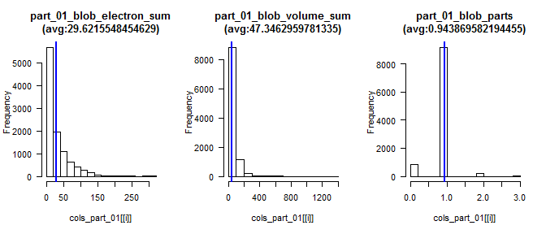 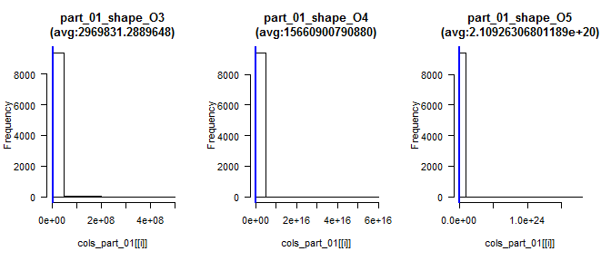 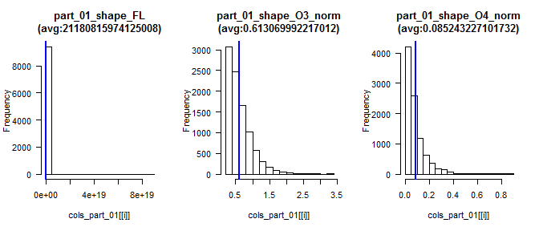 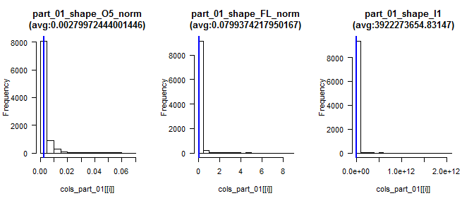 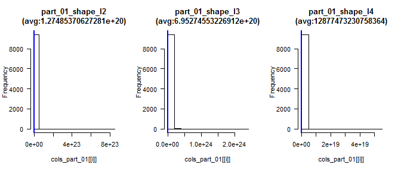 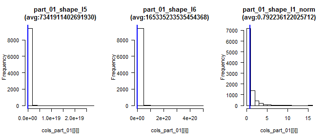 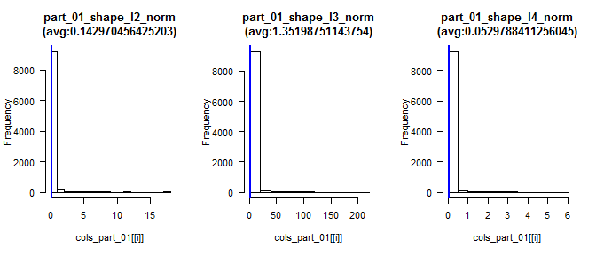 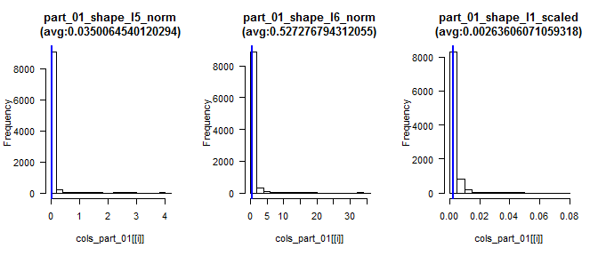 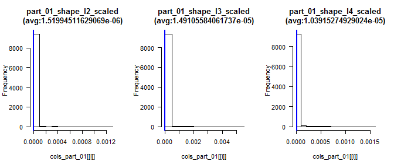 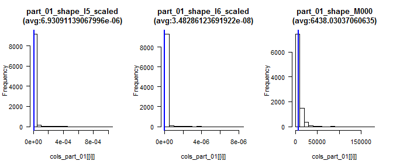 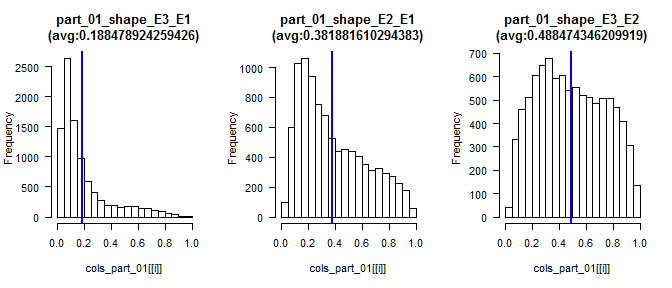 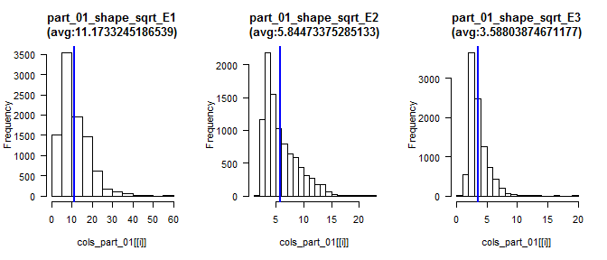 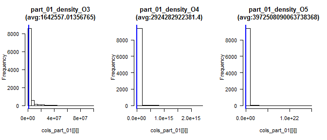 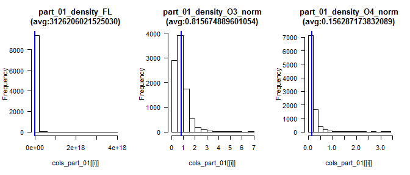 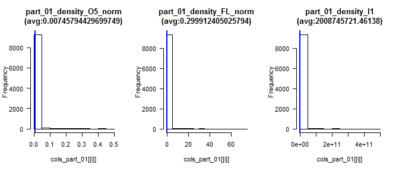  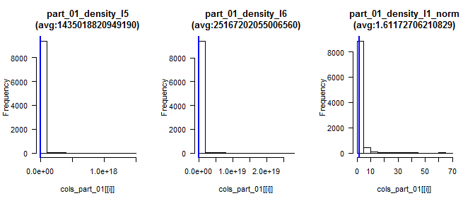 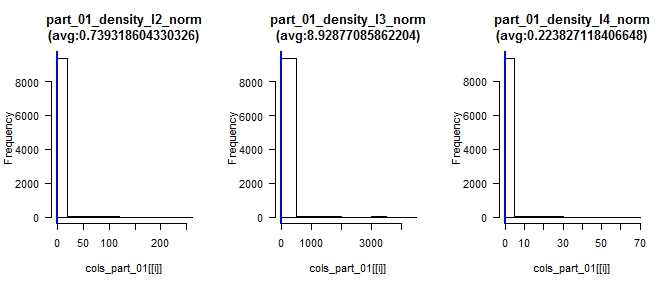 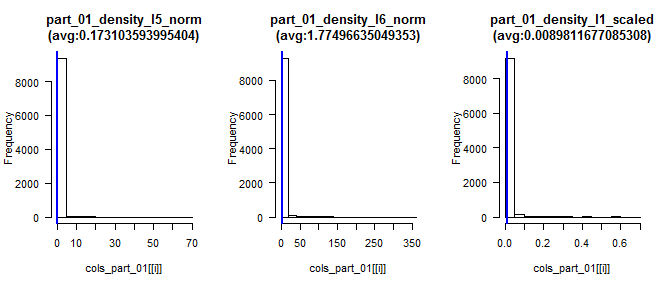 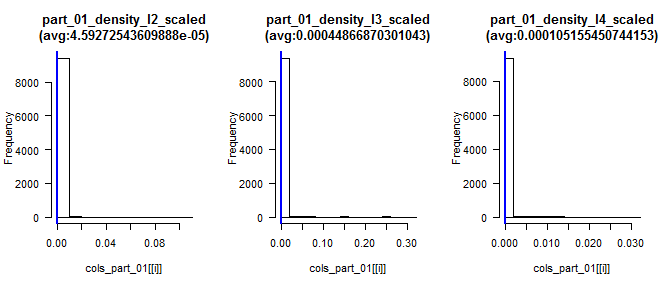 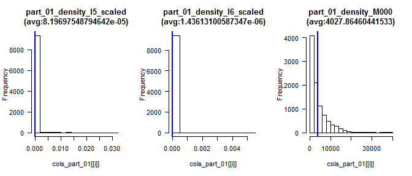 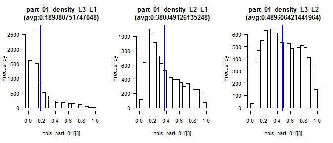 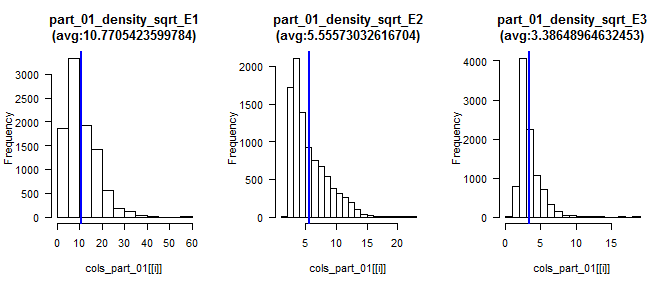 

13. Sekcja sprawdzająca czy na podstawie wartości innych kolumn można przewidzieć liczbę elektronów i atomów oraz z jaką dokładnością można dokonać takiej predykcji; trafność regresji powinna zostać oszacowana na podstawie miar R^2 i RMSE.

13.1 Przewidywanie liczby atomow


```r
data_13 <- data %>% dplyr::select(
  local_res_atom_non_h_count, 
  
  local_volume, local_electrons, local_mean, local_std, local_max, local_skewness, local_parts, #green
  solvent_mask_count, void_mask_count, modeled_mask_count, solvent_ratio, #green
  matches("part_00_.*"), #green
  
  #yellow
  TwoFoFc_mean, TwoFoFc_std, TwoFoFc_square_std, TwoFoFc_min, TwoFoFc_max,Fo_mean, Fo_std, Fo_square_std, Fo_min, Fo_max,FoFc_mean, FoFc_std, FoFc_square_std, FoFc_min, FoFc_max,Fc_mean, Fc_std, Fc_square_std, Fc_min, Fc_max,resolution, TwoFoFc_bulk_mean, TwoFoFc_bulk_std, TwoFoFc_void_mean, TwoFoFc_void_std, TwoFoFc_modeled_mean, TwoFoFc_modeled_std,Fo_bulk_mean, Fo_bulk_std, Fo_void_mean, Fo_void_std, Fo_modeled_mean, Fo_modeled_std,Fc_bulk_mean, Fc_bulk_std, Fc_void_mean, Fc_void_std, Fc_modeled_mean, Fc_modeled_std,FoFc_bulk_mean, FoFc_bulk_std, FoFc_void_mean, FoFc_void_std, FoFc_modeled_mean, FoFc_modeled_std,TwoFoFc_void_fit_binormal_mean1, TwoFoFc_void_fit_binormal_std1, TwoFoFc_void_fit_binormal_mean2, TwoFoFc_void_fit_binormal_std2, TwoFoFc_void_fit_binormal_scale, TwoFoFc_solvent_fit_normal_mean, TwoFoFc_solvent_fit_normal_std 
)

data_13 <- na.omit(data_13)

inTraining <- 
  createDataPartition(
    y = data_13$local_res_atom_non_h_count,
    p = .70,
    list = FALSE)

trainingDescr <- select(data_13[ inTraining,], -local_res_atom_non_h_count)
testingDescr <-  select(data_13[ -inTraining,], -local_res_atom_non_h_count)
trainingClass <- select(data_13[ inTraining,], local_res_atom_non_h_count)
testingClass <-  select(data_13[ -inTraining,], local_res_atom_non_h_count)

gridCtrl <- trainControl(
  method = "repeatedcv",
  number = 10,
  repeats = 3)

rfFit <- train(trainingDescr, 
               trainingClass$local_res_atom_non_h_count, 
               method="rf", 
               metric = "RMSE",
               minimize = TRUE,
               trControl = gridCtrl,
               ntree=20)
```

```
## Loading required package: randomForest
## randomForest 4.6-12
## Type rfNews() to see new features/changes/bug fixes.
## 
## Attaching package: 'randomForest'
## 
## Następujący obiekt został zakryty z 'package:dplyr':
## 
##     combine
```

```r
getTrainPerf(rfFit)
```

```
##   TrainRMSE TrainRsquared method
## 1  8.772106     0.6424121     rf
```

```r
predictedValues <- predict(rfFit, newdata = testingDescr)

plot(testingClass$local_res_atom_non_h_count, predictedValues)
```

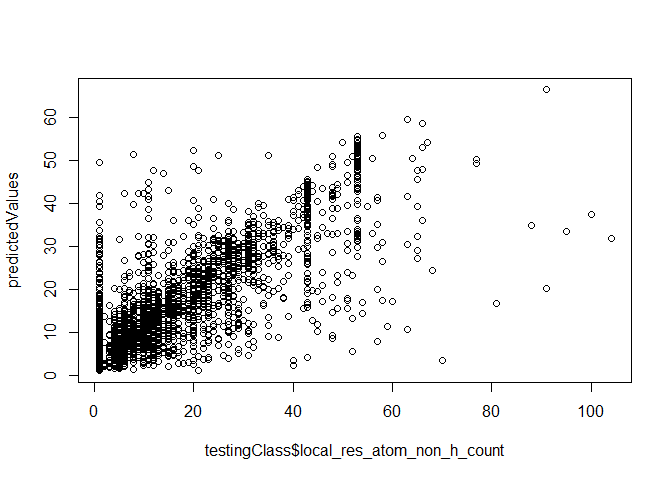 

13.2 Przewidywanie liczby elektronow


```r
data_13 <- data %>% dplyr::select(
  local_res_atom_non_h_electron_sum, 
  
  local_volume, local_electrons, local_mean, local_std, local_max, local_skewness, local_parts, #green
  solvent_mask_count, void_mask_count, modeled_mask_count, solvent_ratio, #green
  matches("part_00_.*"), #green
  
  #yellow
  TwoFoFc_mean, TwoFoFc_std, TwoFoFc_square_std, TwoFoFc_min, TwoFoFc_max,Fo_mean, Fo_std, Fo_square_std, Fo_min, Fo_max,FoFc_mean, FoFc_std, FoFc_square_std, FoFc_min, FoFc_max,Fc_mean, Fc_std, Fc_square_std, Fc_min, Fc_max,resolution, TwoFoFc_bulk_mean, TwoFoFc_bulk_std, TwoFoFc_void_mean, TwoFoFc_void_std, TwoFoFc_modeled_mean, TwoFoFc_modeled_std,Fo_bulk_mean, Fo_bulk_std, Fo_void_mean, Fo_void_std, Fo_modeled_mean, Fo_modeled_std,Fc_bulk_mean, Fc_bulk_std, Fc_void_mean, Fc_void_std, Fc_modeled_mean, Fc_modeled_std,FoFc_bulk_mean, FoFc_bulk_std, FoFc_void_mean, FoFc_void_std, FoFc_modeled_mean, FoFc_modeled_std,TwoFoFc_void_fit_binormal_mean1, TwoFoFc_void_fit_binormal_std1, TwoFoFc_void_fit_binormal_mean2, TwoFoFc_void_fit_binormal_std2, TwoFoFc_void_fit_binormal_scale, TwoFoFc_solvent_fit_normal_mean, TwoFoFc_solvent_fit_normal_std 
)

data_13 <- na.omit(data_13)

inTraining <- 
  createDataPartition(
    y = data_13$local_res_atom_non_h_electron_sum,
    p = .70,
    list = FALSE)

trainingDescr <- select(data_13[ inTraining,], -local_res_atom_non_h_electron_sum)
testingDescr <-  select(data_13[ -inTraining,], -local_res_atom_non_h_electron_sum)
trainingClass <- select(data_13[ inTraining,], local_res_atom_non_h_electron_sum)
testingClass <-  select(data_13[ -inTraining,], local_res_atom_non_h_electron_sum)

gridCtrl <- trainControl(
  method = "repeatedcv",
  number = 10,
  repeats = 3)

rfFit <- train(trainingDescr, 
               trainingClass$local_res_atom_non_h_electron_sum, 
               method="rf", 
               metric = "RMSE",
               minimize = TRUE,
               trControl = gridCtrl,
               ntree=20)

getTrainPerf(rfFit)
```

```
##   TrainRMSE TrainRsquared method
## 1  60.78358     0.6291564     rf
```

```r
predictedValues <- predict(rfFit, newdata = testingDescr)

plot(testingClass$local_res_atom_non_h_electron_sum, predictedValues)
```

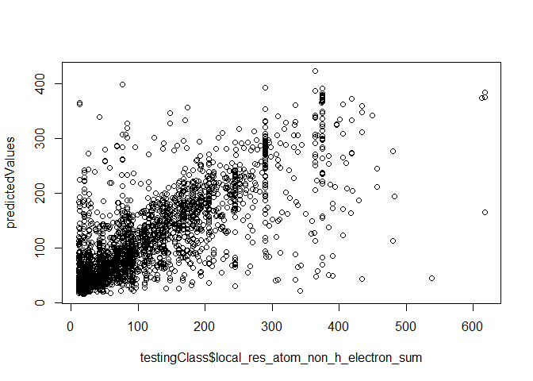 

14. Sekcję próbującą stworzyć klasyfikator przewidujący wartość atrybutu res_name (w tej sekcji należy wykorzystać wiedzę z pozostałych punktów oraz wykonać dodatkowe czynności, które mogą poprawić trafność klasyfikacji); trafność klasyfikacji powinna zostać oszacowana na danych inne niż uczące za pomocą mechanizmu (stratyfikowanej!) oceny krzyżowej lub (stratyfikowanego!) zbioru testowego.


```r
data_14 <- data %>% dplyr::select(res_name,
  local_volume, local_electrons, local_mean, local_std, 
  local_max, local_skewness, local_parts,
  solvent_mask_count, void_mask_count, modeled_mask_count, solvent_ratio,
  matches("part_00_.*")
)

data_14 <- na.omit(data_14)

# odfiltrowanie rzadkich klas
data_14 %>% group_by(res_name) %>% summarize(length(local_volume))
```

```
## Source: local data frame [2,289 x 2]
## 
##    res_name length(local_volume)
##      (fctr)                (int)
## 1       006                    1
## 2       010                    1
## 3       017                    3
## 4       01K                    1
## 5       027                    1
## 6       02P                    1
## 7       031                    1
## 8       03P                    1
## 9       03Q                    1
## 10      03R                    1
## ..      ...                  ...
```

```r
df <- (as.data.frame(table(data_14$res_name)) %>% filter(Freq >= 5))$Var1
df <- as.character(df)
data_14 <- data_14 %>% filter(res_name %in% df)

data_14$res_name <- factor(data_14$res_name)

inTraining <- 
  createDataPartition(
    y = data_14$res_name,
    p = .70,
    list = FALSE)

training <- data_14[ inTraining,]
testing <- data_14[ -inTraining,]


gridCtrl <- trainControl(
  method = "repeatedcv",
  number = 10,
  repeats = 1)

rfFit <- train(res_name~., 
               data=training, 
               method="rf", 
               trControl = gridCtrl,
               ntree=20)

rfClasses <- predict(rfFit, newdata = testing)

confusionMatrix(data = rfClasses, testing$res_name)
```

```
## Confusion Matrix and Statistics
## 
##           Reference
## Prediction 1PE 2HP 3DR 5CM 5GP 8OG A23 A2G A3P A8S ABA ACE ACO ACP ACT ACY
##        1PE   2   0   0   0   0   0   0   0   0   0   0   0   0   0   0   0
##        2HP   0   0   0   0   0   0   0   0   0   0   0   0   0   0   0   0
##        3DR   0   0   0   0   0   0   0   0   0   0   0   0   0   0   0   0
##        5CM   0   0   0   0   0   0   0   0   0   0   0   0   0   0   0   0
##        5GP   0   0   0   0   0   0   0   0   0   0   0   0   0   0   0   0
##        8OG   0   0   0   0   0   0   0   0   0   0   0   0   0   0   0   0
##        A23   0   0   0   0   0   0   0   0   0   0   0   0   0   0   0   0
##        A2G   0   0   0   0   0   0   0   0   0   0   0   0   0   0   0   0
##        A3P   0   0   0   0   0   0   0   0   0   0   0   0   0   0   0   0
##        A8S   0   0   0   0   0   0   0   0   0   1   0   0   0   0   0   0
##        ABA   0   0   0   0   0   0   0   0   0   0   0   0   0   0   0   0
##        ACE   0   0   0   0   0   0   0   0   0   0   0   0   0   0   0   0
##        ACO   0   0   0   0   0   0   0   0   0   0   0   0   0   0   0   0
##        ACP   0   0   0   0   0   0   0   0   0   0   0   0   0   0   0   0
##        ACT   0   0   0   0   0   0   0   0   0   0   0   1   0   0  10   5
##        ACY   0   0   0   0   0   0   0   0   0   0   0   0   0   0   0   0
##        ADE   0   0   0   0   0   0   0   0   0   0   0   0   0   0   0   0
##        ADP   0   0   0   0   0   1   0   0   0   0   0   0   0   1   0   0
##        AGS   0   0   0   0   0   0   0   0   0   0   0   0   0   0   0   0
##        ALY   0   0   0   0   0   0   0   0   0   0   0   0   0   0   0   0
##        AMP   0   0   0   0   0   0   0   0   0   0   0   0   0   0   0   0
##        APC   0   0   0   0   0   0   0   0   0   0   0   0   0   0   0   0
##        ATP   0   0   0   0   0   1   1   0   0   0   0   0   0   0   0   0
##        AU    0   0   0   0   0   0   0   0   0   0   0   0   0   0   0   0
##        B12   0   0   0   0   0   0   0   0   0   0   0   0   0   0   0   0
##        BA    0   0   0   0   0   0   0   0   0   0   0   0   0   0   0   0
##        BCL   0   0   0   0   0   0   0   0   0   0   0   0   0   0   0   0
##        BCT   0   0   0   0   0   0   0   0   0   0   0   0   0   0   0   0
##        BDP   0   0   0   0   0   0   0   0   0   0   0   0   0   0   0   0
##        BEZ   0   0   0   0   0   0   0   0   0   0   0   0   0   0   0   0
##        BGC   0   0   0   1   0   0   0   0   0   0   0   0   0   0   0   0
##        BHG   0   0   0   0   0   0   0   0   0   0   0   0   0   0   0   0
##        BMA   0   0   0   0   0   0   0   0   0   0   0   0   0   0   0   0
##        BME   1   0   0   0   0   0   0   0   0   0   1   0   0   0   1   0
##        BOG   1   0   0   0   0   0   0   0   0   0   0   0   0   0   0   0
##        BPH   0   0   0   0   0   0   0   0   0   0   0   0   0   0   0   0
##        BR    0   0   0   0   0   0   0   0   0   0   0   0   0   0   0   0
##        BRU   0   0   0   0   0   0   0   0   0   0   0   0   0   0   0   0
##        BTB   0   0   0   0   0   0   0   0   0   0   0   0   0   0   0   0
##        C2E   0   0   0   0   0   0   0   0   0   0   0   0   0   0   0   0
##        C2F   0   0   0   0   0   0   0   0   0   0   0   0   0   0   0   0
##        C5P   0   0   0   0   0   0   0   0   0   0   0   0   0   0   0   0
##        C8E   0   0   0   0   0   0   0   0   0   0   0   0   0   0   0   0
##        CA    0   0   0   0   0   0   0   0   0   0   0   0   0   0   0   0
##        CAC   0   0   0   0   0   0   0   0   0   0   0   0   0   0   0   0
##        CAD   0   0   0   0   0   0   0   0   0   0   0   0   0   0   0   0
##        CAM   0   0   0   0   0   0   0   0   0   0   0   0   0   0   0   0
##        CAS   0   0   0   0   0   0   0   0   0   0   0   0   0   0   0   0
##        CB3   0   0   0   0   0   0   0   0   0   0   0   0   0   0   0   0
##        CCC   0   0   0   0   0   0   0   0   0   0   0   0   0   0   0   0
##        CD    0   0   0   0   0   0   0   0   0   0   0   0   0   0   0   0
##        CDL   0   0   0   0   0   0   0   0   0   0   0   0   0   0   0   0
##        CIR   0   0   0   0   0   0   0   0   0   0   0   0   0   0   0   0
##        CIT   0   0   0   0   0   0   0   0   0   0   0   0   0   0   0   0
##        CL    0   0   0   0   0   0   0   0   0   0   0   1   0   0   9   1
##        CME   0   0   0   0   0   0   0   0   0   0   0   0   0   0   0   0
##        CMP   0   0   0   0   0   0   0   0   0   0   0   0   0   0   0   0
##        CO    0   0   0   0   0   0   0   0   0   0   0   0   0   0   0   0
##        CO3   0   0   0   0   0   0   0   0   0   0   0   0   0   0   0   0
##        COA   0   0   0   0   0   0   0   0   0   0   0   0   1   0   0   0
##        CPT   0   0   0   0   0   0   0   0   0   0   0   0   0   0   0   0
##        CR2   0   0   0   0   0   0   0   0   0   0   0   0   0   0   0   0
##        CRO   0   0   0   0   0   0   0   0   0   0   0   0   0   0   0   0
##        CS    0   0   0   0   0   0   0   0   0   0   0   0   0   0   0   0
##        CSD   0   0   0   0   0   0   0   0   0   0   0   0   0   0   0   0
##        CSO   0   0   0   0   0   0   0   0   0   0   0   0   0   0   0   0
##        CSS   0   0   0   0   0   0   0   0   0   0   0   0   0   0   0   0
##        CSX   0   0   0   0   0   0   0   0   0   0   0   0   0   0   0   0
##        CTP   0   0   0   0   0   0   0   0   0   0   0   0   0   0   0   0
##        CU    0   0   0   0   0   0   0   0   0   0   0   0   0   0   0   0
##        CU1   0   0   0   0   0   0   0   0   0   0   0   0   0   0   0   0
##        CUA   0   0   0   0   0   0   0   0   0   0   0   0   0   0   0   0
##        DHE   0   0   0   0   0   0   0   0   0   0   0   0   0   0   0   0
##        DHT   0   0   0   0   0   1   0   0   0   0   0   0   0   0   0   0
##        DMS   0   0   0   0   0   0   0   0   0   0   0   0   0   0   0   0
##        DMU   0   0   0   0   0   0   0   0   0   0   0   0   0   0   0   0
##        DOC   0   0   0   0   0   0   0   0   0   0   0   0   0   0   0   0
##        EDO   0   0   0   0   0   0   0   0   0   0   0   0   0   0   3   0
##        EPE   1   0   0   0   0   0   0   0   0   0   0   0   0   0   0   0
##        F3S   0   0   0   0   0   0   0   0   0   0   0   0   0   0   0   0
##        F6P   0   0   0   0   0   0   0   0   0   0   0   0   0   0   0   0
##        FAD   0   0   0   0   0   0   0   1   1   0   0   0   1   0   0   0
##        FBP   0   0   0   0   0   0   0   0   0   0   0   0   0   0   0   0
##        FE    0   0   0   0   0   0   0   0   0   0   0   0   0   0   0   0
##        FE2   0   0   0   1   0   0   0   0   0   0   0   0   0   0   0   0
##        FES   0   0   0   0   0   0   0   0   0   0   0   0   0   0   0   0
##        FLC   0   0   0   0   0   0   0   0   0   0   0   0   0   0   0   0
##        FME   0   0   0   0   0   0   0   0   0   0   0   0   0   0   0   0
##        FMT   0   0   0   0   0   0   0   0   0   0   0   0   0   0   0   0
##        FOL   0   0   0   0   0   0   0   0   0   0   0   0   0   0   0   0
##        FUC   0   0   0   0   0   0   0   0   0   0   0   0   0   0   0   0
##        GAL   0   0   0   0   0   0   0   0   0   0   0   0   0   0   0   0
##        GDP   0   0   0   0   0   0   0   0   0   0   0   0   0   0   0   0
##        GLA   0   0   0   0   0   0   0   0   0   0   0   0   0   0   0   0
##        GLC   0   0   0   0   0   0   0   0   0   0   0   0   0   0   0   0
##        GOL   1   0   0   0   0   0   0   0   0   0   1   3   0   1  13   1
##        GPP   0   0   0   0   0   0   0   0   0   0   0   0   0   0   0   0
##        GSH   0   0   0   0   0   0   0   0   0   0   0   0   0   0   0   0
##        GSP   0   0   0   0   0   0   0   0   0   0   0   0   0   0   0   0
##        GSW   0   0   0   0   0   0   0   0   0   0   0   0   0   0   0   0
##        GTP   0   0   0   0   0   0   0   0   0   0   0   0   0   0   0   0
##        GTT   0   0   0   0   0   0   0   0   0   0   0   0   0   0   0   0
##        GTX   0   0   0   0   0   0   0   0   0   0   0   0   0   0   0   0
##        H4B   0   0   0   0   0   0   0   0   0   0   0   0   0   0   0   0
##        HC4   0   0   0   0   0   0   0   0   0   0   0   0   0   0   0   0
##        HEC   0   0   0   0   0   0   0   0   0   0   0   0   0   0   0   0
##        HED   0   0   0   0   0   0   0   0   0   0   0   0   0   0   0   0
##        HEM   0   0   0   0   1   0   0   0   0   0   0   0   0   0   0   0
##        HEZ   0   0   0   0   0   0   0   0   0   0   0   0   0   0   0   0
##        HG    0   0   0   0   0   0   0   0   0   0   0   0   0   0   0   0
##        HIC   0   0   0   0   0   0   0   0   0   0   0   0   0   0   0   0
##        HYP   0   0   0   0   0   0   0   0   0   0   0   0   0   0   0   0
##        IDS   0   0   0   0   0   0   0   0   0   0   0   0   0   0   0   0
##        IHP   0   0   0   0   0   0   0   0   0   0   0   0   0   0   0   0
##        IMD   0   0   0   0   0   0   0   0   0   0   0   0   0   0   0   0
##        IMP   0   0   0   0   0   0   0   0   0   0   0   0   0   0   0   0
##        IOD   0   0   0   0   0   0   0   0   0   0   0   0   0   0   0   0
##        IPA   0   0   0   0   0   0   0   0   0   0   0   0   0   0   0   0
##        IPH   0   0   0   0   0   0   0   0   0   0   0   0   0   0   0   0
##        K     0   0   0   0   0   0   0   0   0   0   0   0   0   0   0   0
##        KAI   0   0   0   0   0   0   0   0   0   0   0   0   0   0   0   0
##        KCX   0   0   0   0   0   0   0   0   0   0   0   0   0   0   0   0
##        LAT   0   0   0   0   0   0   0   0   0   0   0   0   0   0   0   0
##        LLP   0   0   0   0   0   0   0   0   0   0   0   0   1   0   0   0
##        LMT   0   0   0   0   0   0   0   0   0   0   0   0   0   0   0   0
##        M3L   0   0   0   0   0   0   0   0   0   0   0   0   0   0   0   0
##        MAL   0   0   1   0   0   0   0   0   0   0   0   0   0   0   0   0
##        MBO   0   0   0   0   0   0   0   0   0   0   0   0   0   0   0   0
##        MES   0   0   0   0   0   0   0   0   0   0   0   0   0   0   1   0
##        MG    1   0   0   0   0   0   0   0   0   0   1   0   0   0   1   3
##        MLA   0   0   0   0   0   0   0   0   0   0   0   0   0   0   0   0
##        MLE   0   0   0   0   0   0   0   0   0   0   0   0   0   0   0   0
##        MLI   0   0   0   0   0   0   0   0   0   0   0   0   0   0   0   0
##        MLY   0   0   0   0   0   0   0   0   0   0   0   0   0   0   0   0
##        MLZ   0   0   0   0   0   0   0   0   0   0   0   0   0   0   0   0
##        MRD   0   0   0   0   0   0   0   0   0   0   0   0   0   0   0   0
##        MRG   0   0   0   0   0   0   0   0   0   0   0   0   0   0   0   0
##        MTX   0   0   0   0   0   0   0   0   0   0   0   0   0   0   0   0
##        OCS   0   0   0   0   0   0   0   0   0   0   0   0   0   0   0   0
##        OLC   0   0   0   0   0   0   0   0   0   0   0   0   0   0   0   0
##        P6G   0   0   0   0   0   0   0   0   0   0   0   0   0   0   0   0
##        PCA   0   0   0   0   0   0   0   0   0   0   0   0   0   0   0   0
##        PE4   0   0   0   0   0   0   0   0   0   0   0   0   0   0   0   0
##        PEG   0   0   0   0   0   0   0   0   0   0   0   0   0   0   1   0
##        PEP   0   0   0   0   0   0   0   0   0   0   0   0   0   0   0   0
##        PG4   0   0   0   0   0   0   0   0   0   0   0   0   0   0   0   0
##        PGA   0   0   0   0   0   0   0   0   0   0   0   0   0   0   0   0
##        PGE   0   0   0   0   0   0   0   0   0   0   0   0   0   0   0   0
##        PGV   0   0   0   0   0   0   0   0   0   0   0   0   0   0   0   0
##        PLM   0   0   0   0   0   0   0   0   0   0   0   0   0   0   0   0
##        PLP   0   0   0   0   0   1   0   0   0   0   0   0   0   0   0   0
##        PO4   0   1   0   0   0   0   0   0   0   0   0   0   0   0   7   0
##        POP   0   0   0   0   0   0   0   0   0   0   0   0   0   0   0   0
##        PSU   0   0   0   0   0   0   0   0   0   0   0   0   0   0   0   0
##        PT    0   0   0   0   0   0   0   0   0   0   0   0   0   0   0   0
##        PTR   0   0   0   0   0   0   0   0   0   0   0   0   0   0   0   0
##        PYR   0   0   0   0   0   0   0   0   0   0   0   0   0   0   0   0
##        RET   0   0   0   0   0   0   0   0   0   0   0   0   0   0   0   0
##        S9L   0   0   0   0   0   0   0   0   0   0   0   0   0   0   0   0
##        SAH   2   0   0   0   0   0   0   0   0   0   0   0   0   0   0   0
##        SAM   0   0   0   0   0   0   0   0   0   0   0   0   0   0   0   0
##        SEP   0   0   1   0   0   0   0   0   0   0   0   0   0   0   0   0
##        SF4   0   0   0   0   0   0   0   0   0   0   0   0   0   0   0   0
##        SIA   0   0   0   0   0   0   0   0   0   0   0   0   0   0   0   0
##        SR    0   0   0   0   0   0   0   0   0   0   0   0   0   0   0   0
##        SRM   0   0   0   0   0   0   0   1   0   0   0   0   0   0   0   0
##        SRT   0   0   0   0   0   0   0   0   0   0   0   0   0   0   0   0
##        STU   0   0   0   0   0   0   0   0   0   0   0   0   0   0   0   0
##        SUC   0   0   0   0   0   0   0   0   0   0   0   0   0   0   0   0
##        TAM   0   0   0   0   0   0   0   0   0   0   0   0   0   0   0   0
##        TAR   0   0   0   0   0   0   0   0   0   0   0   0   0   0   0   0
##        TES   0   0   0   0   0   0   0   0   0   0   0   0   0   0   0   0
##        THP   0   0   0   0   0   0   0   0   0   0   0   0   0   0   0   0
##        TL    0   0   0   0   0   0   0   0   0   0   0   0   0   0   0   0
##        TLA   0   0   0   0   0   0   0   0   0   0   0   0   0   0   0   0
##        TPO   0   0   0   0   0   0   0   0   0   0   0   0   0   0   0   0
##        TPP   0   0   0   0   0   0   0   0   0   0   0   0   0   0   0   0
##        TRS   0   0   0   0   0   0   0   0   0   0   0   0   0   0   0   0
##        TTP   0   0   0   0   0   0   0   0   0   0   0   0   0   0   0   0
##        TYS   0   0   0   0   0   0   0   0   0   0   0   0   0   0   0   0
##        U10   0   0   0   0   0   0   0   0   0   0   0   0   0   0   0   0
##        U5P   0   0   0   0   0   0   0   0   0   0   0   0   0   0   0   0
##        UDP   0   0   0   0   0   0   0   0   0   0   0   0   0   0   0   0
##        UMP   0   0   0   0   0   0   0   0   0   0   0   0   0   0   0   0
##        UMQ   0   0   0   0   0   0   0   0   0   0   0   0   0   0   0   0
##        UPG   0   0   0   0   0   0   0   0   0   0   0   0   0   0   0   0
##        UTP   0   0   0   0   0   0   0   0   0   0   0   0   0   0   0   0
##        VO4   0   0   0   0   0   0   0   0   0   0   0   0   0   0   0   0
##        XE    0   0   0   0   0   0   0   0   0   0   0   0   0   0   0   0
##        XYP   0   0   0   0   0   0   0   0   0   0   0   0   0   0   0   0
##        XYS   0   0   0   0   0   0   0   0   0   0   0   0   0   0   0   0
##        YB    0   0   0   0   0   0   0   0   0   0   0   0   0   0   0   0
##        YCM   0   0   0   0   0   0   0   1   0   0   0   0   0   0   0   0
##           Reference
## Prediction ADE ADP AGS ALY AMP APC ATP  AU B12  BA BCL BCT BDP BEZ BGC BHG
##        1PE   0   0   0   0   0   0   0   0   0   0   0   0   0   0   1   0
##        2HP   0   0   0   0   0   0   0   0   0   0   0   0   0   0   0   0
##        3DR   0   0   0   0   0   0   0   0   0   0   0   0   0   0   0   0
##        5CM   0   0   0   0   0   0   0   0   0   0   0   0   0   0   0   0
##        5GP   0   0   0   0   0   0   0   0   0   0   0   0   0   0   0   0
##        8OG   0   0   0   0   0   0   0   0   0   0   0   0   0   0   0   0
##        A23   0   0   0   0   0   0   0   0   0   0   0   0   0   0   0   0
##        A2G   0   0   0   0   0   0   0   0   0   0   0   0   0   0   0   0
##        A3P   0   0   0   0   0   0   0   0   0   0   0   0   0   0   0   0
##        A8S   0   0   0   0   0   0   0   0   0   0   0   0   0   0   0   0
##        ABA   0   0   0   0   0   0   0   0   0   0   0   0   0   0   0   0
##        ACE   0   0   0   0   0   0   0   0   0   0   0   0   0   0   0   0
##        ACO   0   0   0   0   0   0   0   0   0   0   0   0   0   0   0   0
##        ACP   0   0   0   0   0   0   0   0   0   0   0   0   0   0   0   0
##        ACT   0   0   0   0   0   0   0   0   0   0   0   0   0   0   1   0
##        ACY   0   0   0   0   0   0   0   0   0   0   0   0   0   0   0   0
##        ADE   0   0   0   0   0   0   0   0   0   0   0   0   0   0   0   0
##        ADP   0  16   1   0   1   0   8   0   0   0   0   0   0   0   0   0
##        AGS   0   0   0   0   0   0   0   0   0   0   0   0   0   0   0   0
##        ALY   0   0   0   1   0   0   0   0   0   0   0   0   0   0   0   0
##        AMP   0   0   0   0   1   0   0   0   0   0   0   0   0   0   1   0
##        APC   0   0   0   0   0   0   0   0   0   0   0   0   0   0   0   0
##        ATP   0   4   0   0   0   2  11   0   0   0   1   0   0   0   0   0
##        AU    0   0   0   0   0   0   0   0   0   0   0   0   0   0   0   0
##        B12   0   0   0   0   0   0   0   0   1   0   0   0   0   0   0   0
##        BA    0   0   0   0   0   0   0   0   0   0   0   0   0   0   0   0
##        BCL   0   0   0   0   0   0   0   0   0   0   0   0   0   0   0   0
##        BCT   0   0   0   0   0   0   0   0   0   0   0   0   0   0   0   0
##        BDP   1   0   0   0   0   0   0   0   0   0   0   0   0   0   0   0
##        BEZ   0   0   0   0   0   0   0   0   0   0   0   0   0   0   0   0
##        BGC   0   0   0   0   0   0   0   0   0   0   0   0   0   0   1   0
##        BHG   0   0   0   0   0   0   0   0   0   0   0   0   0   0   0   0
##        BMA   0   0   0   0   0   0   0   0   0   0   0   0   0   0   0   0
##        BME   0   0   0   0   0   0   0   0   0   0   0   0   0   0   0   0
##        BOG   0   0   0   0   0   0   0   0   0   0   0   0   0   0   1   0
##        BPH   0   0   0   0   0   0   0   0   0   0   0   0   0   0   0   0
##        BR    0   0   0   0   0   0   0   0   0   1   0   0   0   0   0   0
##        BRU   0   0   0   0   0   0   0   0   0   0   0   0   0   0   0   0
##        BTB   0   0   0   0   0   0   0   0   0   0   0   0   0   0   0   0
##        C2E   0   0   0   0   0   0   0   0   0   0   0   0   0   0   0   0
##        C2F   0   0   0   0   0   0   0   0   0   0   0   0   0   0   0   0
##        C5P   0   0   0   0   0   0   0   0   0   0   0   0   0   0   0   0
##        C8E   0   0   0   0   0   0   0   0   0   0   0   0   0   0   0   0
##        CA    0   1   0   0   0   0   0   0   0   1   0   0   0   0   0   0
##        CAC   0   0   0   0   0   0   0   0   0   0   0   0   0   0   0   0
##        CAD   0   0   0   0   0   0   0   0   0   0   0   0   0   0   0   0
##        CAM   0   0   0   0   0   0   0   0   0   0   0   0   0   0   0   0
##        CAS   0   0   0   0   0   0   0   0   0   0   0   0   0   0   0   0
##        CB3   0   0   0   0   0   0   0   0   0   0   0   0   0   0   0   0
##        CCC   0   0   0   0   0   0   0   0   0   0   0   0   0   0   0   0
##        CD    0   0   0   0   0   0   0   1   0   0   0   0   0   0   0   0
##        CDL   0   0   0   0   0   0   0   0   0   0   0   0   0   0   0   0
##        CIR   0   0   0   0   0   0   0   0   0   0   0   0   0   0   0   0
##        CIT   0   0   0   0   0   0   0   0   0   0   0   0   0   0   0   0
##        CL    0   0   0   0   0   0   0   0   0   0   0   0   0   0   0   0
##        CME   0   1   0   0   0   0   0   0   0   0   0   0   0   0   0   0
##        CMP   0   0   0   0   0   0   0   0   0   0   0   0   0   0   0   0
##        CO    0   1   0   0   0   0   0   0   0   0   0   0   0   0   0   0
##        CO3   0   0   0   0   0   0   0   0   0   0   0   0   0   0   0   0
##        COA   0   0   0   1   0   0   0   0   0   0   1   0   0   0   0   0
##        CPT   0   0   0   0   0   0   0   0   0   0   0   0   0   0   0   0
##        CR2   0   1   0   0   0   0   0   0   0   0   0   0   0   0   0   0
##        CRO   0   0   0   0   0   1   0   0   0   0   0   0   0   0   0   0
##        CS    0   0   0   0   0   0   0   0   0   0   0   0   0   0   0   0
##        CSD   0   0   0   0   0   0   0   0   0   0   0   0   0   0   0   0
##        CSO   0   0   0   0   0   0   0   0   0   0   0   0   0   0   2   0
##        CSS   0   0   0   0   0   0   0   0   0   0   0   0   0   1   0   0
##        CSX   0   0   0   0   0   0   0   0   0   0   0   0   0   0   0   0
##        CTP   0   0   0   0   0   0   0   0   0   0   0   0   0   0   0   0
##        CU    0   0   0   0   0   0   0   0   0   0   0   0   0   0   0   0
##        CU1   0   0   0   0   0   0   0   0   0   0   0   0   0   0   0   0
##        CUA   0   0   0   0   0   0   0   0   0   0   0   0   0   0   0   0
##        DHE   0   0   0   0   0   0   0   0   0   0   0   0   0   0   0   0
##        DHT   0   0   0   0   0   0   0   0   0   0   0   0   0   0   0   0
##        DMS   0   0   0   0   0   0   0   0   0   0   0   0   0   0   0   0
##        DMU   0   0   0   0   0   0   0   0   0   0   0   0   0   0   0   0
##        DOC   0   0   0   0   0   0   0   0   0   0   0   0   0   0   0   0
##        EDO   0   0   0   0   0   0   0   0   0   0   0   0   0   0   0   0
##        EPE   0   0   0   0   0   0   0   0   0   0   0   0   0   0   0   0
##        F3S   0   0   0   0   0   0   0   0   0   0   0   0   0   0   0   0
##        F6P   0   0   0   0   0   0   0   0   0   0   0   0   0   0   0   0
##        FAD   0   1   0   0   0   0   0   0   1   0   0   0   0   0   1   0
##        FBP   0   0   0   0   0   0   0   0   0   0   0   0   0   0   0   0
##        FE    0   0   0   0   0   0   2   0   0   0   0   0   0   0   0   0
##        FE2   0   0   0   0   0   0   0   0   0   0   0   0   0   0   0   0
##        FES   0   0   0   0   0   0   0   0   0   0   0   0   0   0   0   0
##        FLC   0   0   0   0   0   0   0   0   0   0   0   0   0   0   0   0
##        FME   0   1   0   0   0   0   0   0   0   0   0   0   0   0   0   0
##        FMT   0   0   0   0   0   0   0   0   0   0   0   0   0   0   0   0
##        FOL   0   0   0   0   0   0   0   0   0   0   0   0   0   0   0   0
##        FUC   0   0   0   0   0   0   0   0   0   0   0   0   0   0   0   0
##        GAL   0   0   0   0   0   0   0   0   0   0   0   0   1   0   0   0
##        GDP   0   2   0   0   0   0   1   0   0   0   0   0   0   0   0   0
##        GLA   0   0   0   0   0   0   0   0   0   0   0   0   0   0   0   0
##        GLC   0   1   0   0   0   0   0   0   0   0   0   0   0   0   0   0
##        GOL   0   1   0   0   2   0   1   0   0   0   0   1   0   1   2   0
##        GPP   0   0   0   0   0   0   0   0   0   0   0   0   0   0   0   0
##        GSH   0   0   0   0   0   0   0   0   0   0   0   0   0   0   0   0
##        GSP   0   0   0   0   0   0   0   0   0   0   0   0   0   0   0   0
##        GSW   0   0   0   0   0   0   0   0   0   0   0   0   0   0   0   0
##        GTP   0   1   0   0   0   0   1   0   0   0   0   0   0   0   0   0
##        GTT   0   0   0   0   0   0   0   0   0   0   0   0   0   0   0   0
##        GTX   0   0   0   0   0   0   0   0   0   0   0   0   0   0   0   0
##        H4B   0   0   0   0   0   0   0   0   0   0   0   0   0   0   0   0
##        HC4   0   0   0   0   0   0   0   0   0   0   0   0   0   0   0   0
##        HEC   0   0   0   0   0   0   0   0   0   0   0   0   0   0   0   0
##        HED   0   0   0   0   0   0   0   0   0   0   0   0   0   0   0   0
##        HEM   0   0   0   0   0   0   0   0   0   0   0   0   0   0   0   0
##        HEZ   0   0   0   0   0   0   0   0   0   0   0   0   0   0   0   0
##        HG    0   0   0   0   0   0   0   0   0   0   0   0   0   0   0   0
##        HIC   0   0   0   0   0   0   0   0   0   0   0   0   0   0   0   0
##        HYP   0   0   0   0   0   0   0   0   0   0   0   0   0   0   0   0
##        IDS   0   0   0   0   0   0   0   0   0   0   0   0   0   0   0   0
##        IHP   0   0   0   0   0   0   0   0   0   0   0   0   0   0   0   0
##        IMD   0   0   0   0   0   0   0   0   0   0   0   0   0   0   0   0
##        IMP   0   0   0   0   0   0   0   0   0   0   0   0   0   0   0   0
##        IOD   0   1   0   0   0   0   0   0   0   0   0   0   0   0   0   0
##        IPA   0   0   0   0   0   0   0   0   0   0   0   0   0   0   0   0
##        IPH   0   0   0   0   0   0   0   0   0   0   0   0   0   0   0   0
##        K     0   0   0   0   0   0   0   0   0   0   0   0   0   0   0   0
##        KAI   0   0   0   0   0   0   0   0   0   0   0   0   0   0   0   0
##        KCX   0   0   0   0   0   0   0   0   0   0   0   0   0   0   0   0
##        LAT   0   0   0   0   0   0   0   0   0   0   0   0   0   0   0   0
##        LLP   0   1   0   0   0   0   0   0   0   0   0   0   0   0   0   0
##        LMT   0   0   0   0   0   0   0   0   0   0   0   0   0   0   0   0
##        M3L   0   0   0   0   0   0   0   0   0   0   0   0   0   0   0   0
##        MAL   0   0   0   0   0   0   0   0   0   0   0   0   0   0   0   0
##        MBO   0   0   0   0   0   0   0   0   0   0   0   0   0   0   0   0
##        MES   0   0   0   0   0   0   0   0   0   0   0   0   0   0   0   0
##        MG    1   1   0   0   1   0   2   0   0   0   0   0   0   0   0   0
##        MLA   0   0   0   0   0   0   0   0   0   0   0   0   0   0   0   0
##        MLE   0   0   0   0   0   0   0   0   0   0   0   0   0   0   0   0
##        MLI   0   0   0   0   0   0   0   0   0   0   0   0   0   0   0   0
##        MLY   0   0   0   0   0   0   1   0   0   0   0   0   0   0   0   0
##        MLZ   0   0   0   0   0   0   0   0   0   0   0   0   0   0   0   0
##        MRD   0   0   0   0   0   0   0   0   0   0   0   0   0   0   0   0
##        MRG   0   0   0   0   0   0   0   0   0   0   0   0   0   0   0   0
##        MTX   0   0   0   0   0   0   0   0   0   0   0   0   0   0   0   0
##        OCS   0   0   0   0   0   0   0   0   0   0   0   0   0   1   0   0
##        OLC   0   0   0   0   0   0   0   0   0   0   0   0   0   0   0   0
##        P6G   0   0   0   0   0   0   0   0   0   0   0   0   0   0   0   0
##        PCA   0   0   0   0   0   0   0   0   0   0   0   0   0   0   0   0
##        PE4   0   0   0   0   0   0   0   0   0   0   0   0   0   0   0   0
##        PEG   0   0   0   0   0   0   0   0   0   0   0   0   0   0   0   0
##        PEP   0   0   0   0   0   0   0   0   0   0   0   0   0   0   0   0
##        PG4   0   0   0   0   1   0   0   0   0   0   0   0   0   0   0   0
##        PGA   0   0   0   0   0   0   0   0   0   0   0   0   0   0   0   0
##        PGE   0   0   0   1   0   0   0   0   0   0   0   0   0   0   0   0
##        PGV   0   0   0   0   0   0   0   0   0   0   0   0   0   0   0   0
##        PLM   0   0   0   0   0   0   0   0   0   0   0   0   0   0   0   0
##        PLP   0   0   0   0   2   0   0   0   0   0   0   0   0   0   0   0
##        PO4   0   1   0   0   0   0   0   1   0   0   0   0   0   0   0   0
##        POP   0   0   0   0   0   0   0   0   0   0   0   0   0   0   0   0
##        PSU   0   0   0   0   0   0   0   0   0   0   0   0   0   0   0   0
##        PT    0   0   0   0   0   0   0   0   0   0   0   0   0   0   0   0
##        PTR   0   0   0   0   0   0   0   0   0   1   0   0   0   0   0   0
##        PYR   0   0   0   0   0   0   0   0   0   0   0   0   0   0   0   0
##        RET   0   0   0   0   0   0   0   0   0   0   0   0   0   0   0   0
##        S9L   0   0   0   0   0   0   0   0   0   0   0   0   0   0   0   0
##        SAH   0   2   0   0   1   0   1   0   0   0   0   0   0   0   0   0
##        SAM   0   0   0   0   1   0   0   0   0   0   0   0   0   0   0   0
##        SEP   0   0   0   0   0   0   0   0   0   0   0   0   0   0   0   0
##        SF4   0   0   0   0   0   0   0   0   0   0   0   0   0   0   0   0
##        SIA   0   0   0   0   0   0   0   0   0   0   0   0   0   0   0   0
##        SR    0   0   0   0   0   0   0   0   0   0   0   0   0   0   0   0
##        SRM   0   0   0   0   0   0   0   0   0   0   0   0   0   0   0   0
##        SRT   0   0   0   0   0   0   0   0   0   0   0   0   0   0   0   0
##        STU   0   0   0   0   0   0   0   0   0   0   0   0   0   0   0   0
##        SUC   0   0   0   0   0   0   1   0   0   0   0   0   0   0   0   1
##        TAM   0   0   0   0   0   0   0   0   0   0   0   0   0   0   0   0
##        TAR   0   0   0   0   0   0   0   0   0   0   0   0   0   0   0   0
##        TES   0   0   0   0   0   0   0   0   0   0   0   0   0   0   0   0
##        THP   0   0   0   0   0   0   0   0   0   0   0   0   0   0   0   0
##        TL    0   0   0   0   0   0   0   0   0   0   0   0   0   0   0   0
##        TLA   0   0   0   0   0   0   1   0   0   0   0   0   0   0   0   0
##        TPO   0   0   0   0   0   0   0   0   0   0   0   0   0   0   0   0
##        TPP   0   0   0   0   0   0   0   0   0   0   0   0   0   0   0   0
##        TRS   0   0   0   0   0   0   0   0   0   0   0   0   0   0   0   0
##        TTP   0   0   0   0   0   0   0   0   0   0   0   0   0   0   0   0
##        TYS   0   0   0   0   0   0   0   0   0   0   0   0   0   0   0   0
##        U10   0   0   0   0   0   0   0   0   0   0   0   0   0   0   0   0
##        U5P   0   0   0   0   0   0   0   0   0   0   0   0   0   0   0   0
##        UDP   0   3   0   0   1   0   1   0   0   0   0   0   0   0   1   0
##        UMP   0   0   0   0   0   0   0   0   0   0   0   0   0   0   0   0
##        UMQ   0   0   0   0   0   0   0   0   0   0   0   0   0   0   0   0
##        UPG   0   0   0   0   0   0   0   0   0   0   0   0   0   0   0   0
##        UTP   0   0   0   0   0   0   0   0   0   0   0   0   0   0   0   0
##        VO4   0   0   0   0   0   0   0   0   0   0   0   0   0   0   0   0
##        XE    0   0   0   0   0   0   0   0   0   0   0   0   0   0   0   0
##        XYP   0   0   0   0   0   0   0   0   0   0   0   0   0   0   0   0
##        XYS   0   0   0   0   0   0   0   0   0   0   0   0   0   0   0   0
##        YB    0   0   0   0   0   0   0   0   0   0   0   0   0   0   0   0
##        YCM   0   0   0   0   0   0   0   0   0   0   0   0   0   0   0   0
##           Reference
## Prediction BMA BME BOG BPH  BR BRU BTB C2E C2F C5P C8E  CA CAC CAD CAM CAS
##        1PE   0   0   1   0   1   0   0   0   0   0   1   0   0   0   0   0
##        2HP   0   0   0   0   0   0   0   0   0   0   0   0   0   0   0   0
##        3DR   0   0   0   0   0   0   0   0   0   0   0   0   0   0   0   0
##        5CM   0   0   0   0   0   0   0   0   0   0   0   0   0   0   0   0
##        5GP   0   0   0   0   0   0   0   0   0   0   0   0   0   0   0   0
##        8OG   0   0   0   0   0   0   0   0   0   0   0   0   0   0   0   0
##        A23   0   0   0   0   0   0   0   0   0   0   0   0   0   0   0   0
##        A2G   0   0   0   0   0   0   0   0   0   0   0   0   0   0   0   0
##        A3P   0   0   0   0   0   0   0   0   0   0   0   0   0   0   0   0
##        A8S   0   0   0   0   0   0   0   0   0   0   0   1   0   0   0   0
##        ABA   0   0   0   0   0   0   0   0   0   0   0   0   0   0   0   0
##        ACE   0   0   0   0   0   0   0   0   0   0   0   0   0   0   0   0
##        ACO   0   0   0   0   0   0   0   0   0   0   0   0   0   0   0   0
##        ACP   0   0   0   0   0   0   0   0   0   0   0   0   0   0   0   0
##        ACT   0   0   0   0   0   0   0   0   0   0   0   0   0   0   0   0
##        ACY   0   0   0   0   0   0   0   0   0   0   0   0   0   0   0   0
##        ADE   0   0   0   0   0   0   0   0   0   0   0   1   0   0   0   0
##        ADP   0   0   0   0   0   0   0   0   0   0   0   1   0   0   0   0
##        AGS   0   0   0   0   0   0   0   0   0   0   0   0   0   0   0   0
##        ALY   0   0   0   0   0   0   0   0   0   0   0   0   0   0   0   0
##        AMP   0   0   0   0   0   0   0   0   0   2   0   2   0   0   0   0
##        APC   0   0   0   0   0   0   0   0   0   0   0   1   0   0   0   0
##        ATP   0   0   0   0   0   0   0   1   0   0   0   1   0   0   0   0
##        AU    0   0   0   0   0   0   0   0   0   0   0   1   0   0   0   0
##        B12   0   0   0   0   0   0   0   0   0   0   0   0   0   0   0   0
##        BA    0   0   0   0   0   0   0   0   0   0   0   0   0   0   0   0
##        BCL   0   0   0   0   0   0   0   0   0   0   0   0   0   0   0   0
##        BCT   0   0   0   0   0   0   0   0   0   0   0   0   0   0   0   0
##        BDP   0   0   0   0   0   0   0   0   0   0   0   0   0   0   0   0
##        BEZ   0   0   0   0   0   0   0   0   0   0   0   0   0   0   0   0
##        BGC   0   0   0   0   0   0   0   0   0   0   0   0   0   0   0   0
##        BHG   0   0   0   0   0   0   0   0   0   0   0   0   0   0   0   0
##        BMA   0   0   0   0   0   0   0   0   0   0   0   0   0   0   0   0
##        BME   0   4   0   0   0   0   0   0   0   0   0   0   0   0   0   0
##        BOG   0   0   1   0   0   0   0   0   0   0   0   0   0   0   0   0
##        BPH   0   0   0   1   1   0   0   0   0   0   0   0   0   0   0   0
##        BR    0   0   0   0   2   0   0   0   0   0   0   0   0   0   0   0
##        BRU   0   0   0   0   0   0   0   0   0   0   0   0   0   0   0   0
##        BTB   0   0   0   0   0   0   0   0   0   0   0   0   0   0   0   0
##        C2E   0   0   0   0   0   0   0   0   0   0   0   0   0   0   0   0
##        C2F   0   0   0   0   0   0   0   0   0   0   0   0   0   0   0   0
##        C5P   0   0   0   0   0   0   0   0   0   0   0   0   0   0   0   0
##        C8E   0   0   0   0   0   0   0   0   0   0   0   0   0   0   0   0
##        CA    0   2   0   1   2   0   0   0   0   0   0 117   2   0   0   0
##        CAC   0   0   0   0   0   0   0   0   0   0   0   0   0   0   0   0
##        CAD   0   0   0   0   0   0   0   0   0   0   0   0   0   0   0   0
##        CAM   0   0   0   0   0   0   0   0   0   0   0   0   0   0   0   0
##        CAS   0   0   0   0   0   0   0   0   0   0   0   0   0   0   0   1
##        CB3   0   0   0   0   0   0   0   0   0   0   0   0   0   0   0   0
##        CCC   0   0   0   0   0   0   0   0   0   0   0   0   0   0   0   0
##        CD    0   0   0   0   1   0   0   0   0   0   0   0   0   0   0   0
##        CDL   0   0   0   0   0   0   0   0   0   0   0   0   0   0   0   0
##        CIR   0   0   0   0   0   0   0   0   0   0   0   0   0   0   0   0
##        CIT   1   0   0   0   0   0   0   0   0   0   0   2   0   0   0   0
##        CL    2   0   0   0   0   0   0   0   0   0   0   7   0   0   0   0
##        CME   0   0   0   0   0   0   0   0   0   0   0   0   0   0   0   0
##        CMP   0   0   0   0   0   0   0   0   0   0   0   0   0   0   0   0
##        CO    0   0   0   0   0   0   0   0   0   0   0   0   0   0   0   0
##        CO3   0   0   0   0   0   0   0   0   0   0   0   0   0   0   0   0
##        COA   1   0   0   0   0   0   0   0   0   0   0   0   0   0   0   0
##        CPT   0   0   0   0   0   0   0   0   0   0   0   0   0   0   0   0
##        CR2   0   0   0   0   0   0   0   0   0   0   0   0   0   0   0   0
##        CRO   0   0   0   0   0   0   0   0   0   0   0   0   0   0   0   0
##        CS    0   0   0   0   0   0   0   0   0   0   0   0   0   0   0   0
##        CSD   0   0   0   0   0   0   0   0   0   0   0   1   0   0   0   0
##        CSO   0   0   0   0   0   0   1   0   0   0   0   0   0   0   0   0
##        CSS   0   0   0   0   0   0   0   0   0   0   0   0   0   0   0   0
##        CSX   0   0   0   0   0   0   0   0   0   0   0   0   0   0   0   0
##        CTP   0   0   0   0   0   0   0   0   0   0   0   0   0   0   0   0
##        CU    0   0   0   0   0   0   0   0   0   0   0   2   0   0   0   0
##        CU1   0   0   0   0   0   0   0   0   0   0   0   0   0   0   0   0
##        CUA   0   0   0   0   0   0   0   0   0   0   0   0   0   0   0   0
##        DHE   0   0   0   0   0   0   0   0   0   0   0   0   0   0   0   0
##        DHT   0   0   0   0   0   0   0   0   0   0   0   0   0   0   0   0
##        DMS   0   0   0   0   0   0   0   0   0   0   0   0   0   0   0   0
##        DMU   0   0   0   0   0   0   0   0   0   0   0   0   0   0   0   0
##        DOC   0   0   0   0   0   0   0   0   0   0   0   0   0   0   0   0
##        EDO   1   1   0   0   0   0   0   0   0   0   0   3   0   0   0   0
##        EPE   0   1   0   0   0   0   0   0   0   0   0   0   0   0   0   0
##        F3S   0   0   0   0   0   0   0   0   0   0   0   0   0   0   0   0
##        F6P   0   0   0   0   0   0   0   0   0   0   0   1   0   0   0   0
##        FAD   0   0   0   0   0   0   0   0   0   0   0   1   0   0   0   0
##        FBP   0   0   0   0   0   0   0   0   0   0   0   0   0   0   0   0
##        FE    0   0   0   0   0   1   0   0   0   0   0   2   0   0   0   0
##        FE2   0   0   0   0   0   0   0   0   0   0   0   2   0   0   0   0
##        FES   0   0   0   0   0   0   0   0   0   0   0   0   0   0   0   0
##        FLC   0   0   1   0   0   0   0   0   0   0   0   0   0   0   0   0
##        FME   0   0   0   0   0   0   0   0   0   0   0   0   0   0   0   0
##        FMT   0   0   0   0   0   0   0   0   0   0   0   0   0   0   0   0
##        FOL   0   0   0   0   0   0   0   0   0   0   0   0   0   0   0   0
##        FUC   0   0   0   0   0   0   0   0   0   0   0   0   0   0   0   0
##        GAL   0   0   0   0   0   0   0   0   0   0   0   0   0   0   0   0
##        GDP   1   0   0   0   0   0   0   0   0   0   0   0   0   0   0   0
##        GLA   0   0   0   0   0   0   0   0   0   0   0   1   0   0   0   0
##        GLC   1   0   0   0   0   0   0   0   0   0   0   0   0   0   0   0
##        GOL   3   4   4   0   0   0   0   0   0   0   0   7   0   0   0   0
##        GPP   0   0   0   0   0   0   0   0   0   0   0   0   0   0   0   0
##        GSH   0   0   0   0   0   0   0   0   0   0   0   0   0   0   0   0
##        GSP   0   0   0   0   0   0   0   0   0   0   0   0   0   0   0   0
##        GSW   0   0   0   0   0   0   0   0   0   0   0   0   0   0   0   0
##        GTP   0   0   0   0   0   0   0   0   0   0   0   0   0   0   0   0
##        GTT   0   0   0   0   0   0   0   0   0   0   0   0   0   0   0   0
##        GTX   0   0   0   0   0   0   0   0   0   0   0   0   0   0   0   0
##        H4B   0   0   1   0   0   0   0   0   0   0   0   0   0   0   0   0
##        HC4   0   0   0   0   0   0   0   0   0   0   0   0   0   0   0   0
##        HEC   0   0   0   0   0   0   0   0   0   0   0   0   0   0   0   0
##        HED   0   0   0   0   0   0   0   0   0   0   0   1   0   0   0   0
##        HEM   0   0   0   0   0   0   0   0   0   0   0   0   0   0   0   0
##        HEZ   0   0   0   0   0   0   0   0   0   0   0   0   0   0   0   0
##        HG    0   0   0   0   0   0   0   0   0   0   0   0   0   0   0   0
##        HIC   0   0   0   0   0   0   0   0   0   0   0   0   0   0   0   0
##        HYP   0   0   0   0   0   0   0   0   0   0   0   0   0   0   0   0
##        IDS   0   0   0   0   0   0   0   0   0   0   0   0   0   0   0   0
##        IHP   0   0   0   0   0   0   0   0   0   0   0   0   0   0   0   0
##        IMD   0   1   0   0   0   0   0   0   0   0   0   0   0   0   0   0
##        IMP   0   0   0   0   0   0   0   0   0   0   0   0   0   0   0   0
##        IOD   0   0   0   0   2   0   0   0   0   0   0   0   1   0   0   0
##        IPA   0   0   0   0   0   0   0   0   0   0   0   0   0   0   0   0
##        IPH   0   0   0   0   0   0   0   0   0   0   0   0   0   0   0   0
##        K     0   0   0   0   0   0   0   0   0   0   0   3   0   0   0   0
##        KAI   0   0   0   0   0   0   0   0   0   0   0   0   0   0   0   0
##        KCX   0   0   1   0   0   0   0   0   0   0   0   0   0   0   0   0
##        LAT   0   0   0   0   0   0   0   0   0   0   0   0   0   0   0   0
##        LLP   0   0   0   0   0   0   0   0   0   0   0   0   0   0   0   0
##        LMT   0   0   0   0   0   0   0   0   0   0   0   0   0   0   0   0
##        M3L   0   0   0   0   0   0   0   0   0   0   0   0   0   0   0   0
##        MAL   0   0   0   0   0   0   0   0   0   0   0   0   0   0   0   0
##        MBO   0   0   0   0   0   0   0   0   0   0   0   0   0   0   0   0
##        MES   0   1   0   0   0   1   0   0   0   0   0   2   0   0   0   0
##        MG    0   1   2   0   0   0   1   0   0   0   0  18   0   1   0   0
##        MLA   0   0   0   0   0   0   0   0   0   0   0   0   0   0   0   0
##        MLE   0   0   0   0   0   0   0   0   0   0   0   0   0   0   0   0
##        MLI   0   0   0   0   0   0   0   0   0   0   0   0   0   0   0   0
##        MLY   0   0   0   0   0   0   0   0   0   0   0   0   0   0   0   0
##        MLZ   0   0   0   0   0   0   0   0   0   0   0   0   0   0   0   0
##        MRD   0   0   0   0   0   0   0   0   0   0   0   1   0   0   0   0
##        MRG   0   0   0   0   0   0   0   0   0   0   0   0   0   0   0   0
##        MTX   0   0   0   0   0   0   0   0   0   0   0   0   0   0   0   0
##        OCS   0   0   0   0   0   0   0   0   0   0   0   0   0   0   0   0
##        OLC   0   0   0   0   0   0   0   0   0   0   0   0   0   0   0   0
##        P6G   0   0   0   0   0   0   0   0   0   0   0   0   0   0   0   0
##        PCA   0   0   0   0   0   0   0   0   0   0   0   0   0   0   0   0
##        PE4   0   0   0   0   0   0   0   0   0   0   0   0   0   0   0   0
##        PEG   0   0   0   0   0   0   0   0   0   0   0   0   0   0   0   0
##        PEP   0   0   0   0   0   0   0   0   0   0   0   0   0   0   0   0
##        PG4   0   0   0   0   0   0   0   0   0   0   0   0   0   0   0   0
##        PGA   0   0   0   0   0   0   0   0   0   0   0   0   0   0   0   0
##        PGE   0   0   0   0   0   0   0   0   0   0   2   0   0   0   0   0
##        PGV   0   0   0   0   0   0   0   0   0   0   0   0   0   0   0   0
##        PLM   0   1   0   0   0   0   0   0   0   0   0   1   0   0   0   0
##        PLP   0   0   0   0   0   0   0   0   0   0   0   1   0   0   0   0
##        PO4   0   2   0   0   0   0   0   0   0   0   0   8   1   0   0   0
##        POP   0   0   0   0   0   0   0   0   0   0   0   0   0   0   0   0
##        PSU   0   0   0   0   0   0   0   0   0   0   0   0   0   0   0   0
##        PT    0   0   0   0   0   0   0   0   0   0   0   0   0   0   1   0
##        PTR   0   0   0   0   0   0   0   0   0   0   0   0   0   0   0   0
##        PYR   0   0   0   0   0   0   0   0   0   0   0   0   0   0   0   0
##        RET   0   0   0   0   0   0   0   0   0   0   0   0   0   0   0   0
##        S9L   0   0   0   0   0   0   0   0   0   0   0   0   0   0   0   0
##        SAH   0   0   0   0   0   0   0   0   1   0   0   0   0   0   0   0
##        SAM   0   0   0   0   0   0   0   0   0   0   0   0   0   0   0   0
##        SEP   0   0   1   0   0   0   0   0   0   0   0   1   0   0   0   0
##        SF4   0   0   0   0   0   0   0   0   0   0   0   0   0   0   0   0
##        SIA   0   0   0   0   0   0   0   0   0   0   0   0   0   0   0   0
##        SR    0   0   0   0   0   0   0   0   0   0   0   0   0   0   0   0
##        SRM   0   0   0   0   0   0   0   0   0   0   0   0   0   0   0   0
##        SRT   0   0   0   0   0   0   0   0   0   0   0   0   0   0   0   0
##        STU   0   0   0   0   0   0   0   0   0   0   0   0   0   0   0   0
##        SUC   0   0   0   0   0   0   0   0   0   0   0   1   0   0   0   0
##        TAM   0   0   0   0   0   0   0   0   0   0   0   0   0   0   0   0
##        TAR   0   0   0   0   0   0   0   0   0   0   0   0   0   0   0   0
##        TES   0   0   0   0   0   0   0   0   0   0   0   0   0   0   0   0
##        THP   0   0   0   0   0   0   0   0   0   0   0   1   0   0   0   0
##        TL    0   0   0   0   0   0   0   0   0   0   0   0   0   0   0   0
##        TLA   0   0   0   0   0   0   0   0   0   0   0   0   0   0   0   0
##        TPO   0   0   0   0   0   0   0   0   0   0   0   0   0   0   0   1
##        TPP   0   0   0   0   0   0   0   0   0   0   0   0   0   0   0   0
##        TRS   0   0   0   0   0   0   0   0   0   0   0   0   0   0   0   0
##        TTP   0   0   0   0   0   0   0   0   0   0   0   0   0   0   0   0
##        TYS   0   0   0   0   0   0   0   0   0   0   0   0   0   0   0   0
##        U10   0   0   0   0   0   0   0   0   0   0   0   0   0   0   0   0
##        U5P   0   0   0   0   0   0   0   0   0   0   0   0   0   0   0   0
##        UDP   0   0   0   0   0   0   0   0   0   0   0   0   0   0   0   0
##        UMP   0   0   0   0   0   0   0   0   0   0   0   0   0   0   0   0
##        UMQ   0   0   0   0   0   0   0   0   0   0   0   0   0   0   0   0
##        UPG   0   0   0   0   0   0   0   0   0   0   0   0   0   0   0   0
##        UTP   0   0   0   0   0   0   0   0   0   0   0   0   0   0   0   0
##        VO4   0   0   0   0   0   0   0   0   0   0   0   0   0   0   0   0
##        XE    0   0   0   0   0   0   0   0   0   0   0   0   0   0   0   0
##        XYP   0   0   0   0   0   0   0   0   0   0   0   0   0   0   0   0
##        XYS   0   0   0   0   0   0   0   0   0   0   0   0   0   0   0   0
##        YB    0   0   0   0   0   0   0   0   0   0   0   0   0   0   0   0
##        YCM   0   0   0   0   0   0   0   0   0   0   0   0   0   0   0   0
##           Reference
## Prediction CB3 CCC  CD CDL CIR CIT  CL CME CMP  CO CO3 COA CPT CR2 CRO  CS
##        1PE   0   0   0   0   0   0   0   0   0   0   0   0   0   0   0   0
##        2HP   0   0   0   0   0   0   0   0   0   0   0   0   0   0   0   0
##        3DR   0   0   0   0   0   0   0   0   0   0   0   0   0   0   0   0
##        5CM   0   0   0   0   0   0   0   0   0   0   0   0   0   0   0   0
##        5GP   0   0   0   0   0   0   0   0   0   0   0   0   0   0   0   0
##        8OG   0   0   0   0   0   0   0   0   0   0   0   0   0   0   0   0
##        A23   0   0   0   0   0   0   0   0   0   0   0   0   0   0   1   0
##        A2G   0   0   0   0   0   0   0   0   0   0   0   0   0   0   0   0
##        A3P   0   0   0   0   0   0   0   0   0   0   0   0   0   0   0   0
##        A8S   0   0   0   0   0   0   0   0   0   0   0   0   0   0   0   0
##        ABA   0   0   0   0   0   0   0   1   0   0   0   0   0   0   0   0
##        ACE   0   0   0   0   0   0   0   0   0   0   0   0   0   0   0   0
##        ACO   0   0   0   0   0   0   0   0   0   0   0   0   0   0   0   0
##        ACP   0   0   0   0   0   0   0   0   0   0   0   0   0   0   0   0
##        ACT   0   0   0   0   0   0   2   0   0   0   0   0   0   0   0   0
##        ACY   0   0   0   0   0   0   0   0   0   0   0   0   0   0   0   0
##        ADE   0   0   0   0   0   0   0   0   0   0   0   0   0   0   0   0
##        ADP   0   0   0   0   0   0   0   0   0   0   0   0   0   0   1   0
##        AGS   0   0   0   0   0   0   0   0   0   0   0   0   0   0   0   0
##        ALY   0   0   0   0   0   0   0   0   0   0   0   0   0   0   0   0
##        AMP   0   0   0   0   0   0   0   0   0   0   0   0   0   0   1   0
##        APC   0   0   0   0   0   0   0   0   0   0   0   0   0   0   0   0
##        ATP   0   0   0   0   0   0   0   0   0   0   0   0   0   0   0   0
##        AU    0   0   0   0   0   0   0   0   0   0   0   0   0   0   0   0
##        B12   0   0   0   0   0   0   0   1   0   0   0   0   0   0   0   0
##        BA    0   0   0   0   0   0   0   0   0   0   0   0   0   0   0   0
##        BCL   0   0   0   0   0   0   0   0   0   0   0   0   0   0   0   0
##        BCT   0   0   0   0   0   0   0   0   0   0   0   0   0   0   0   0
##        BDP   0   0   0   0   0   0   0   0   0   0   0   0   0   0   0   0
##        BEZ   0   0   0   0   0   0   0   0   0   0   0   0   0   0   0   0
##        BGC   0   0   0   0   0   0   0   0   0   0   0   0   0   0   0   0
##        BHG   0   0   0   0   0   0   0   0   0   0   0   0   0   0   0   0
##        BMA   0   0   0   0   0   0   0   0   0   0   0   0   0   0   0   0
##        BME   0   0   0   0   0   0   0   0   0   0   0   0   0   0   0   0
##        BOG   0   0   0   1   0   0   1   0   0   0   0   0   0   0   0   0
##        BPH   0   0   0   0   0   0   0   0   0   0   0   0   0   0   0   0
##        BR    0   0   0   0   0   0   1   0   0   0   0   0   0   0   0   0
##        BRU   0   0   0   0   0   0   0   0   0   0   0   0   0   0   0   0
##        BTB   0   0   0   0   0   0   0   0   0   0   0   0   0   0   0   0
##        C2E   0   0   0   0   0   0   0   0   0   0   0   0   0   0   0   0
##        C2F   0   0   0   0   0   0   0   0   0   0   0   0   0   0   0   0
##        C5P   0   0   0   0   0   0   0   0   0   0   0   0   0   0   0   0
##        C8E   0   0   0   0   0   0   0   0   0   0   0   0   0   0   0   0
##        CA    0   0   1   0   0   1   6   0   0   6   0   0   1   0   0   0
##        CAC   0   0   0   0   0   0   0   0   0   0   0   0   0   0   0   0
##        CAD   0   0   0   0   0   0   0   0   0   0   0   0   0   0   0   0
##        CAM   0   0   0   0   0   0   0   0   0   0   0   0   0   0   0   0
##        CAS   0   0   0   0   0   0   0   0   0   0   0   0   0   0   0   0
##        CB3   0   0   0   0   0   0   0   0   0   0   0   0   0   0   0   0
##        CCC   0   0   0   0   0   0   0   0   0   0   0   0   0   0   0   0
##        CD    0   0  12   0   0   0   0   0   0   1   0   0   0   0   0   0
##        CDL   0   0   0   1   0   0   0   0   0   0   0   0   0   0   0   0
##        CIR   0   0   0   0   0   0   0   0   0   0   0   0   0   0   0   0
##        CIT   0   0   0   0   0   5   0   0   0   0   0   0   0   0   0   0
##        CL    0   0   0   0   0   0  63   0   0   1   0   0   0   0   0   1
##        CME   0   0   0   0   1   0   0   2   0   0   0   0   0   0   0   0
##        CMP   0   0   0   0   0   0   0   0   0   0   0   0   0   0   0   0
##        CO    0   0   0   0   0   0   0   0   0   2   0   0   0   0   0   0
##        CO3   0   0   0   0   0   0   0   0   0   0   0   0   0   0   0   0
##        COA   0   0   0   0   0   0   0   0   0   0   0   5   0   0   0   0
##        CPT   0   0   0   0   0   0   0   0   0   0   0   0   0   0   0   0
##        CR2   0   0   0   0   0   0   0   0   0   0   0   0   0   2   0   0
##        CRO   0   0   0   0   0   0   0   0   0   0   0   0   0   0   0   0
##        CS    0   0   0   0   0   0   0   0   0   0   0   0   0   0   0   0
##        CSD   0   0   0   0   0   0   0   0   0   0   0   0   0   0   0   0
##        CSO   0   0   0   0   0   0   0   0   0   0   0   0   0   0   0   0
##        CSS   0   0   0   0   0   0   0   1   0   0   0   0   0   0   0   0
##        CSX   0   0   0   0   0   0   0   0   0   0   0   0   0   0   0   0
##        CTP   0   0   0   0   0   0   0   0   0   0   0   0   0   0   0   0
##        CU    0   0   2   0   0   0   0   0   0   1   0   0   0   0   0   0
##        CU1   0   0   0   0   0   0   0   0   0   0   0   0   0   0   0   0
##        CUA   0   0   0   0   0   0   0   0   0   0   0   0   0   0   0   0
##        DHE   0   0   0   0   0   0   0   0   0   0   0   0   0   0   0   0
##        DHT   0   0   0   0   0   0   0   0   0   0   0   0   0   0   0   0
##        DMS   0   0   0   0   0   0   0   0   0   0   0   0   0   0   0   0
##        DMU   0   0   0   0   0   0   0   0   0   0   0   0   0   0   0   0
##        DOC   0   0   0   0   0   0   0   0   0   0   0   0   0   0   0   0
##        EDO   0   0   0   0   0   0   3   0   0   0   0   0   0   0   0   0
##        EPE   0   0   0   0   0   0   0   0   0   0   0   0   0   0   0   0
##        F3S   0   0   0   0   0   0   0   0   0   0   0   0   0   0   0   0
##        F6P   0   0   0   0   0   0   0   0   0   0   0   0   0   0   0   0
##        FAD   0   0   0   0   0   0   0   0   0   0   0   1   0   0   0   0
##        FBP   0   0   0   0   0   0   0   0   0   0   0   0   0   0   0   0
##        FE    0   0   0   0   0   0   1   0   0   3   0   0   0   0   0   0
##        FE2   0   0   1   0   0   0   0   0   0   1   0   0   0   0   0   0
##        FES   0   0   0   0   0   0   0   0   0   0   0   0   0   0   0   0
##        FLC   0   0   0   0   0   1   0   0   0   0   0   0   0   0   0   0
##        FME   0   0   0   0   0   0   0   0   0   0   0   0   0   0   0   0
##        FMT   0   0   0   0   0   0   0   0   0   0   0   0   0   0   0   0
##        FOL   0   0   0   0   0   0   0   0   0   0   0   0   0   0   0   0
##        FUC   0   0   0   0   0   0   1   0   0   0   0   0   0   0   0   0
##        GAL   0   0   0   0   0   0   0   0   0   0   0   0   0   0   0   0
##        GDP   0   0   0   0   0   0   0   0   0   0   0   0   0   0   0   0
##        GLA   0   0   0   0   0   0   0   0   0   0   0   0   0   0   0   0
##        GLC   0   0   0   0   0   1   0   0   0   0   0   0   0   0   0   0
##        GOL   0   2   0   0   0   3  14   0   0   0   0   1   0   0   0   0
##        GPP   0   0   0   0   0   0   0   0   0   0   0   0   0   0   0   0
##        GSH   0   0   0   0   0   0   0   0   0   0   0   0   0   0   0   0
##        GSP   0   0   0   0   0   0   0   0   0   0   0   0   0   0   0   0
##        GSW   0   0   0   0   0   0   0   0   0   0   0   0   0   0   0   0
##        GTP   0   0   0   0   0   0   0   0   0   0   0   0   0   0   0   0
##        GTT   0   0   0   0   0   0   0   0   0   0   0   0   0   0   0   0
##        GTX   0   0   0   0   0   0   0   0   0   0   0   0   0   0   0   0
##        H4B   0   0   0   0   0   0   0   1   0   0   0   0   0   0   0   0
##        HC4   0   0   0   0   0   0   0   0   0   0   0   0   0   0   0   0
##        HEC   0   0   0   0   0   0   0   0   0   0   0   0   0   0   0   0
##        HED   0   0   0   0   0   0   0   0   0   0   0   0   0   0   0   0
##        HEM   0   0   0   0   0   0   0   0   0   0   0   1   0   0   1   0
##        HEZ   0   0   0   0   0   0   0   0   0   0   0   0   0   0   0   0
##        HG    0   0   2   0   0   0   0   0   0   0   0   0   0   0   0   1
##        HIC   0   0   0   0   0   0   0   0   0   0   0   0   0   0   0   0
##        HYP   0   0   0   0   0   0   0   0   0   0   0   0   0   0   0   0
##        IDS   0   0   0   0   0   0   0   0   0   0   0   0   0   0   0   0
##        IHP   0   0   0   0   0   0   0   0   0   0   0   0   0   0   0   0
##        IMD   0   0   0   0   0   1   0   0   0   0   0   0   0   0   0   0
##        IMP   0   0   0   0   0   0   0   0   0   0   0   0   0   0   0   0
##        IOD   0   0   1   0   0   0   2   0   0   0   0   0   0   0   0   0
##        IPA   0   0   0   0   0   0   0   0   0   0   0   0   0   0   0   0
##        IPH   0   0   0   0   0   0   0   0   0   0   0   0   0   0   0   0
##        K     0   0   0   0   0   0   2   0   0   0   0   0   0   0   0   0
##        KAI   0   0   0   0   0   0   0   0   0   0   0   0   0   0   0   0
##        KCX   0   0   0   0   0   0   1   0   0   0   0   0   0   0   0   0
##        LAT   0   0   0   0   0   0   0   0   0   0   0   0   0   0   0   0
##        LLP   0   0   0   0   0   0   0   0   0   0   0   0   0   0   0   0
##        LMT   0   0   0   0   0   0   0   0   0   0   0   0   0   0   0   0
##        M3L   0   0   0   0   0   0   0   0   0   0   0   0   0   0   0   0
##        MAL   0   0   0   0   0   0   0   0   0   0   0   0   0   0   0   0
##        MBO   0   0   0   0   0   0   0   0   0   0   0   0   0   0   0   0
##        MES   0   0   0   0   0   0   2   0   0   0   0   0   0   0   0   0
##        MG    0   0   2   0   0   1   4   1   0   0   1   0   0   0   0   0
##        MLA   0   0   0   0   0   0   0   0   0   0   0   0   0   0   0   0
##        MLE   0   0   0   0   0   0   0   0   0   0   0   0   0   0   0   0
##        MLI   0   0   0   0   0   0   0   0   0   0   0   0   0   0   0   0
##        MLY   0   0   0   0   0   0   0   0   0   0   0   0   0   0   0   0
##        MLZ   0   0   0   0   0   0   0   0   0   0   0   0   0   0   0   0
##        MRD   0   0   0   0   0   0   0   0   0   0   0   0   0   0   0   0
##        MRG   0   0   0   0   0   0   0   0   0   0   0   0   0   0   0   0
##        MTX   0   0   0   0   0   0   0   0   0   0   0   0   0   0   0   0
##        OCS   0   0   0   0   0   0   0   0   0   0   0   0   0   0   0   0
##        OLC   0   0   0   0   0   0   0   0   0   0   0   0   0   0   0   0
##        P6G   0   0   0   0   0   0   0   0   0   0   0   0   0   0   0   0
##        PCA   0   0   0   0   0   1   1   0   0   0   0   0   0   0   0   0
##        PE4   0   0   0   0   0   0   0   0   0   0   0   0   0   0   0   0
##        PEG   0   0   0   0   0   0   0   2   0   0   0   0   0   0   0   0
##        PEP   0   0   0   0   0   0   0   0   0   0   0   0   0   0   0   0
##        PG4   0   0   0   0   0   0   0   0   0   0   0   0   0   0   0   0
##        PGA   0   0   0   0   0   0   0   0   0   0   0   0   0   0   0   0
##        PGE   1   0   0   0   0   0   0   0   0   0   0   0   0   0   0   0
##        PGV   0   0   0   0   0   0   0   0   0   0   0   0   0   0   0   0
##        PLM   0   0   0   0   0   0   1   0   0   0   0   0   0   0   0   0
##        PLP   0   0   0   0   0   0   0   0   1   0   0   1   0   0   0   0
##        PO4   0   0   2   0   0   0   5   0   0   2   0   0   0   0   0   0
##        POP   0   0   0   0   0   0   0   0   0   0   0   0   0   0   0   0
##        PSU   0   0   0   0   0   0   0   0   0   0   0   0   0   0   0   0
##        PT    0   0   0   0   0   0   0   0   0   0   0   0   0   0   0   0
##        PTR   0   0   0   0   0   0   0   0   0   0   0   1   0   0   0   0
##        PYR   0   0   0   0   0   0   0   0   0   0   0   0   0   0   0   0
##        RET   0   0   0   0   0   0   0   0   0   0   0   0   0   0   0   0
##        S9L   0   0   0   0   0   0   0   0   0   0   0   0   0   0   0   0
##        SAH   0   0   0   0   0   0   0   0   0   0   0   0   0   0   0   0
##        SAM   0   0   0   0   0   0   0   0   0   0   0   0   0   0   0   0
##        SEP   0   0   0   0   0   0   0   0   0   1   0   0   0   0   0   0
##        SF4   0   0   0   0   0   0   0   0   0   0   0   0   0   0   0   0
##        SIA   0   0   0   0   0   0   0   0   0   0   0   0   0   0   0   0
##        SR    0   0   0   0   0   0   0   0   0   0   0   0   0   0   0   0
##        SRM   0   0   0   0   0   0   0   0   0   0   0   0   0   0   0   0
##        SRT   0   0   0   0   0   0   0   0   0   0   0   0   0   0   0   0
##        STU   0   0   0   0   0   0   0   0   0   0   0   0   0   0   0   0
##        SUC   0   0   0   0   0   1   0   0   0   0   0   0   0   0   0   0
##        TAM   0   0   0   0   0   0   0   0   0   0   0   0   0   0   0   0
##        TAR   0   0   0   0   0   0   0   0   0   0   0   0   0   0   0   0
##        TES   0   0   0   0   0   0   0   0   0   0   0   0   0   0   0   0
##        THP   0   0   0   0   0   0   0   0   0   0   0   0   0   0   0   0
##        TL    0   0   0   0   0   0   0   0   0   0   0   0   0   0   0   0
##        TLA   0   0   0   0   0   0   0   0   0   0   0   0   0   0   0   0
##        TPO   0   0   0   0   0   0   0   0   0   0   0   0   0   0   0   0
##        TPP   0   0   0   0   0   0   0   0   0   0   0   0   0   0   0   0
##        TRS   0   0   0   0   0   0   0   0   0   0   0   0   0   0   0   0
##        TTP   0   0   0   0   0   0   0   0   0   0   0   0   0   0   0   0
##        TYS   0   0   0   0   0   0   0   0   0   0   0   0   0   0   0   0
##        U10   0   0   0   0   0   0   0   0   0   0   0   0   0   0   0   0
##        U5P   0   0   0   0   0   0   0   0   0   0   0   0   0   0   0   0
##        UDP   0   0   0   0   0   0   0   0   0   0   0   0   0   0   0   0
##        UMP   0   0   0   0   0   0   0   0   0   0   0   0   0   0   0   0
##        UMQ   0   0   0   0   0   0   0   0   0   0   0   0   0   0   0   0
##        UPG   0   0   0   0   0   0   0   0   0   0   0   0   0   0   0   0
##        UTP   0   0   0   0   0   0   0   0   0   0   0   0   0   0   0   0
##        VO4   0   0   0   0   0   0   0   0   0   0   0   0   0   0   0   0
##        XE    0   0   0   0   0   0   0   0   0   0   0   0   0   0   0   0
##        XYP   0   0   0   0   0   0   0   0   0   0   0   0   0   0   0   0
##        XYS   0   0   0   0   0   0   0   0   0   0   0   0   0   0   0   0
##        YB    0   0   0   0   0   0   0   0   0   0   0   0   0   0   0   0
##        YCM   0   0   0   0   0   0   0   0   0   0   0   0   0   0   0   0
##           Reference
## Prediction CSD CSO CSS CSX CTP  CU CU1 CUA DHE DHT DMS DMU DOC EDO EPE F3S
##        1PE   0   0   0   0   0   0   0   0   0   0   0   0   0   1   0   0
##        2HP   0   0   0   0   0   0   0   0   0   0   0   0   0   0   0   0
##        3DR   0   0   0   0   0   0   0   0   0   0   0   0   0   0   0   0
##        5CM   0   0   0   0   0   0   0   0   0   0   0   0   0   0   0   0
##        5GP   0   0   0   0   0   0   0   0   0   0   0   0   0   0   0   0
##        8OG   0   0   0   0   0   0   0   0   0   0   0   0   0   0   0   0
##        A23   0   0   0   0   0   0   0   0   0   0   0   0   0   0   0   0
##        A2G   0   0   0   0   0   0   0   0   0   0   0   0   0   0   0   0
##        A3P   0   0   0   0   0   0   0   0   0   0   0   0   0   0   0   0
##        A8S   0   0   0   0   0   0   0   0   0   0   0   0   0   0   1   0
##        ABA   0   0   0   0   0   0   0   0   0   0   0   0   0   0   0   0
##        ACE   0   0   0   0   0   0   0   0   0   0   0   0   0   0   0   0
##        ACO   0   0   0   0   0   0   0   0   0   0   0   0   0   0   0   0
##        ACP   0   0   0   0   0   0   0   0   0   0   0   0   0   0   0   0
##        ACT   0   0   0   0   0   0   0   0   0   0   0   0   0   5   1   0
##        ACY   0   0   0   0   0   0   0   0   0   0   0   0   0   0   0   0
##        ADE   0   0   0   0   0   0   0   0   0   0   0   0   0   0   0   0
##        ADP   0   0   0   0   1   0   0   0   0   0   0   0   0   0   0   0
##        AGS   0   0   0   0   0   0   0   0   0   0   0   0   0   0   0   0
##        ALY   0   0   0   0   0   0   0   0   0   0   0   0   0   0   0   0
##        AMP   0   1   0   0   0   0   0   0   0   0   0   0   0   0   1   0
##        APC   0   0   0   0   0   0   0   0   0   0   0   0   0   0   0   0
##        ATP   0   0   0   0   2   0   0   0   0   0   0   0   0   0   0   0
##        AU    0   0   0   0   0   0   0   0   0   0   0   0   0   0   0   0
##        B12   0   0   0   0   0   0   0   0   0   0   0   0   0   0   0   0
##        BA    0   0   0   0   0   0   0   0   0   0   0   0   0   0   0   0
##        BCL   0   0   0   0   0   0   0   0   0   0   0   0   0   0   0   0
##        BCT   0   0   0   0   0   0   0   0   0   0   0   0   0   0   0   0
##        BDP   0   0   0   0   0   0   0   0   0   0   0   0   0   0   0   0
##        BEZ   0   0   0   0   0   0   0   0   0   0   0   0   0   0   0   0
##        BGC   0   0   0   0   0   0   0   0   0   0   0   0   0   0   0   0
##        BHG   0   0   0   0   0   0   0   0   0   0   0   0   0   0   0   0
##        BMA   0   0   0   0   0   0   0   0   0   0   0   0   0   0   1   0
##        BME   0   0   0   0   0   0   0   0   0   0   0   0   0   0   1   0
##        BOG   0   0   0   0   0   0   0   0   0   0   0   0   0   0   0   0
##        BPH   0   0   0   0   0   0   0   0   0   0   0   0   0   0   0   0
##        BR    0   0   0   0   0   0   0   0   0   0   0   0   0   0   0   0
##        BRU   0   0   0   0   0   0   0   0   0   0   0   0   0   0   0   0
##        BTB   0   0   0   0   0   0   0   0   0   0   0   0   0   0   0   0
##        C2E   0   0   0   0   0   0   0   0   0   0   0   0   0   0   0   0
##        C2F   0   0   0   0   0   0   0   0   0   0   0   0   0   0   0   0
##        C5P   0   0   0   0   0   0   0   0   0   0   0   0   0   0   0   0
##        C8E   0   0   0   0   0   0   0   0   0   0   0   0   0   0   0   0
##        CA    2   1   0   0   0   7   1   0   0   0   4   0   2   2   1   0
##        CAC   0   0   0   0   0   0   0   0   0   0   0   0   0   0   0   0
##        CAD   0   0   0   0   0   0   0   0   0   0   0   0   0   0   0   0
##        CAM   0   0   0   0   0   0   0   0   0   0   0   0   0   0   0   0
##        CAS   0   0   0   0   0   0   0   0   0   0   0   0   0   0   0   0
##        CB3   0   0   0   0   0   0   0   0   0   0   0   0   0   0   0   0
##        CCC   0   0   0   0   0   0   0   0   0   0   0   0   0   0   0   0
##        CD    0   0   0   0   0   1   0   0   0   0   0   0   0   0   0   0
##        CDL   0   0   0   0   0   0   0   0   0   0   0   0   0   0   0   0
##        CIR   0   0   0   0   0   0   0   0   0   0   0   0   0   0   0   0
##        CIT   0   0   0   1   0   0   0   0   0   0   0   0   0   0   0   0
##        CL    1   0   0   0   0   0   0   0   0   0   4   0   0   3   0   0
##        CME   0   0   0   0   0   0   0   0   0   0   0   0   0   0   0   0
##        CMP   0   0   0   0   0   0   0   0   0   0   0   0   0   0   0   0
##        CO    0   0   0   0   0   0   0   0   0   0   0   0   0   0   0   0
##        CO3   0   0   0   0   0   0   0   0   0   0   0   0   0   0   0   0
##        COA   0   0   0   0   0   0   0   0   0   0   0   0   0   0   0   0
##        CPT   0   0   0   0   0   0   0   0   0   0   0   0   0   0   0   0
##        CR2   0   0   0   0   0   0   0   0   0   0   0   0   0   0   0   0
##        CRO   0   0   0   0   0   0   0   0   0   0   0   0   0   0   0   0
##        CS    0   0   0   0   0   0   0   0   0   0   0   0   0   0   0   0
##        CSD   2   1   0   0   0   0   0   0   0   0   0   0   0   0   0   0
##        CSO   2   1   0   0   0   0   0   0   0   0   0   0   0   0   0   0
##        CSS   0   1   0   0   0   0   0   0   0   0   0   0   0   0   0   0
##        CSX   0   0   0   0   0   0   0   0   0   0   0   0   0   0   0   0
##        CTP   0   0   0   0   0   0   0   0   0   0   0   0   0   0   0   0
##        CU    0   0   0   0   0   6   1   0   0   0   0   0   0   0   0   0
##        CU1   0   0   0   0   0   0   0   0   0   0   0   0   0   0   0   0
##        CUA   0   0   0   0   0   0   0   1   0   0   0   0   0   0   0   0
##        DHE   0   0   0   0   0   0   0   0   0   0   0   0   0   0   0   0
##        DHT   0   0   0   0   0   0   0   0   0   0   0   0   0   0   0   0
##        DMS   0   0   0   0   0   1   0   0   0   0   0   0   0   0   0   0
##        DMU   0   0   0   0   0   0   0   0   0   0   0   0   0   0   0   0
##        DOC   0   0   0   0   0   0   0   0   0   0   0   0   0   0   0   0
##        EDO   0   1   0   0   0   0   0   0   0   0   0   1   0  26   2   0
##        EPE   0   0   0   0   0   0   0   0   0   0   0   0   0   0   2   0
##        F3S   0   0   0   0   0   0   0   0   0   0   0   0   0   0   0   4
##        F6P   0   0   0   0   0   0   0   0   0   0   0   0   0   0   0   0
##        FAD   0   0   0   0   0   0   0   0   0   0   0   0   0   0   0   0
##        FBP   0   0   0   0   0   0   0   0   0   0   0   0   0   0   0   0
##        FE    0   0   0   0   0   6   0   0   0   0   0   0   0   0   0   0
##        FE2   0   0   0   0   0   1   0   0   0   0   0   0   0   0   0   0
##        FES   0   0   0   0   0   0   0   0   0   0   0   0   0   0   0   0
##        FLC   0   0   0   0   0   0   0   0   0   0   0   0   0   0   0   0
##        FME   0   0   0   0   0   0   0   0   0   0   0   0   0   0   0   0
##        FMT   0   0   0   0   0   0   0   0   0   0   0   0   0   1   0   0
##        FOL   0   0   0   0   0   0   0   0   0   0   0   0   0   0   0   0
##        FUC   0   0   0   0   0   0   0   0   0   0   0   0   0   0   0   0
##        GAL   0   0   0   0   0   0   0   0   0   0   0   0   0   0   0   0
##        GDP   0   0   0   0   0   0   0   0   0   0   0   0   0   0   0   0
##        GLA   0   0   0   0   0   0   0   0   0   0   0   0   0   0   0   0
##        GLC   0   0   0   0   0   0   0   0   0   0   0   0   0   0   0   0
##        GOL   2   1   0   1   0   1   0   0   0   0   1   0   0  29   4   0
##        GPP   0   0   0   0   0   0   0   0   0   0   0   0   0   0   0   0
##        GSH   0   0   0   0   0   0   0   0   0   0   0   0   0   0   0   0
##        GSP   0   0   0   0   0   0   0   0   0   0   0   0   0   0   0   0
##        GSW   0   0   0   0   0   0   0   0   0   0   0   0   0   0   0   0
##        GTP   0   0   0   0   0   0   0   0   0   0   0   0   0   0   0   0
##        GTT   0   0   0   0   0   0   0   0   0   0   0   0   0   0   0   0
##        GTX   0   0   0   0   0   0   0   0   0   0   0   0   0   0   0   0
##        H4B   0   0   0   0   0   0   0   0   0   0   0   0   0   0   0   0
##        HC4   0   0   0   0   0   0   0   0   0   0   0   0   0   0   0   0
##        HEC   0   0   0   0   0   0   0   0   0   0   0   0   0   0   0   0
##        HED   0   0   0   0   0   0   0   0   0   0   0   0   0   0   0   0
##        HEM   0   0   0   0   0   0   0   0   2   0   0   0   0   0   0   0
##        HEZ   0   0   0   0   0   0   0   0   0   0   0   0   0   0   0   0
##        HG    0   0   0   0   0   1   0   0   0   0   0   0   0   0   0   0
##        HIC   0   0   0   0   0   0   0   0   0   0   0   0   0   0   0   0
##        HYP   0   0   0   0   0   0   0   0   0   0   0   0   0   0   0   0
##        IDS   0   0   0   0   0   0   0   0   0   0   0   0   0   0   0   0
##        IHP   0   0   0   0   0   0   0   0   0   0   0   0   0   0   0   0
##        IMD   0   0   0   0   0   1   0   0   0   0   0   0   0   0   0   0
##        IMP   0   0   0   0   0   0   0   0   0   0   0   0   0   0   0   0
##        IOD   0   0   0   0   0   0   0   0   0   0   0   0   0   0   0   0
##        IPA   0   0   0   0   0   0   0   0   0   0   0   0   0   0   0   0
##        IPH   0   0   0   0   0   0   0   0   0   0   0   0   0   0   0   0
##        K     1   0   0   0   0   0   0   0   0   0   0   0   0   0   0   0
##        KAI   0   0   0   0   0   0   0   0   0   0   0   0   0   0   0   0
##        KCX   0   0   0   0   0   0   0   0   0   0   0   0   0   0   0   0
##        LAT   0   0   0   0   0   0   0   0   0   0   0   0   0   0   0   0
##        LLP   0   0   0   0   0   0   0   0   0   0   0   0   0   0   0   0
##        LMT   0   0   0   0   0   0   0   0   0   0   0   0   0   1   1   0
##        M3L   0   0   0   0   0   0   0   0   0   0   0   0   0   0   0   0
##        MAL   0   0   0   0   0   0   0   0   0   0   0   0   0   0   0   0
##        MBO   0   0   0   0   0   0   0   0   0   0   0   0   0   0   0   0
##        MES   0   0   0   0   0   1   0   0   0   0   1   0   0   0   2   0
##        MG    0   0   1   0   0   0   0   1   0   0   0   0   0   2   2   0
##        MLA   0   0   0   0   0   0   0   0   0   0   0   0   0   0   0   0
##        MLE   0   0   0   0   0   0   0   0   0   0   0   0   0   0   0   0
##        MLI   0   0   0   0   0   0   0   0   0   0   0   0   0   0   0   0
##        MLY   0   0   0   0   0   0   0   0   0   0   0   0   0   0   1   0
##        MLZ   0   0   0   0   0   0   0   0   0   0   0   0   0   0   0   0
##        MRD   0   0   0   0   0   0   0   0   0   0   0   0   0   0   0   0
##        MRG   0   0   0   0   0   0   0   0   0   0   0   0   0   0   0   0
##        MTX   0   0   0   0   0   0   0   0   0   0   0   0   0   0   0   0
##        OCS   0   0   0   0   0   1   0   0   0   0   0   0   0   0   0   0
##        OLC   0   0   0   0   0   0   0   0   0   0   0   0   0   0   0   0
##        P6G   0   0   0   0   0   0   0   0   0   0   0   0   0   0   0   0
##        PCA   0   1   0   0   0   0   0   0   0   0   0   0   0   0   0   0
##        PE4   0   0   0   0   0   0   0   0   0   0   0   0   0   0   0   0
##        PEG   0   0   0   0   0   0   0   0   0   0   0   0   0   3   0   0
##        PEP   0   0   0   0   0   0   0   0   0   0   0   0   0   0   0   0
##        PG4   0   0   0   0   0   0   0   0   0   0   0   0   0   0   0   0
##        PGA   0   0   0   0   0   0   0   0   0   0   0   0   0   0   0   0
##        PGE   0   0   0   0   0   0   0   0   0   0   0   0   0   0   0   0
##        PGV   0   0   0   0   0   0   0   0   0   0   0   0   0   0   0   0
##        PLM   0   0   0   0   0   0   0   0   0   0   0   0   0   0   0   0
##        PLP   0   0   0   0   0   0   0   0   0   0   0   0   0   0   0   0
##        PO4   0   0   0   0   0   2   0   0   0   0   2   0   0   2   1   0
##        POP   0   0   0   0   0   1   0   0   0   0   0   0   0   0   0   0
##        PSU   0   0   0   0   0   0   0   0   0   0   0   0   0   0   0   0
##        PT    0   0   0   0   0   0   0   0   0   0   0   0   0   0   0   0
##        PTR   0   0   0   0   0   0   0   0   0   0   0   0   0   0   0   0
##        PYR   0   0   0   0   0   0   0   0   0   0   0   0   0   0   0   0
##        RET   0   0   0   0   0   0   0   0   0   0   0   0   0   0   0   0
##        S9L   0   0   0   0   0   0   0   0   0   0   0   0   0   0   0   0
##        SAH   0   0   0   0   0   0   0   0   0   0   0   0   0   0   0   0
##        SAM   0   0   0   0   0   0   0   0   0   0   0   0   0   0   0   0
##        SEP   0   0   0   0   0   0   0   0   0   0   0   0   0   0   0   0
##        SF4   0   0   0   0   0   0   0   0   0   0   0   0   0   0   0   0
##        SIA   0   0   0   0   0   0   0   0   0   0   0   0   0   0   0   0
##        SR    0   0   0   0   0   0   0   0   0   0   0   0   0   0   0   0
##        SRM   0   0   0   0   0   0   0   0   0   0   0   0   0   0   0   0
##        SRT   0   0   0   0   0   0   0   0   0   0   0   0   0   0   0   0
##        STU   0   0   0   0   0   0   0   0   0   0   0   0   0   0   0   0
##        SUC   0   0   0   0   0   0   0   0   0   0   0   0   0   0   0   0
##        TAM   0   0   0   0   0   0   0   0   0   0   0   0   0   0   0   0
##        TAR   0   0   0   0   0   0   0   0   0   0   0   0   0   0   0   0
##        TES   0   0   0   0   0   0   0   0   0   1   0   0   0   0   0   0
##        THP   0   0   0   0   0   0   0   0   0   0   0   0   0   0   0   0
##        TL    0   0   0   0   0   0   0   0   0   0   0   0   0   0   0   0
##        TLA   0   0   0   0   0   0   0   0   0   0   0   0   0   1   0   0
##        TPO   0   0   0   0   0   0   0   0   0   0   0   0   0   0   0   0
##        TPP   0   0   0   0   0   0   0   0   0   0   0   0   0   0   0   0
##        TRS   0   0   1   0   0   0   0   0   0   0   0   0   0   0   0   0
##        TTP   0   0   0   0   0   0   0   0   0   0   0   0   0   0   0   0
##        TYS   0   0   0   0   0   0   0   0   0   0   0   0   0   0   0   0
##        U10   0   0   0   0   0   0   0   0   0   0   0   0   0   0   0   0
##        U5P   0   0   0   0   0   0   0   0   0   0   0   0   1   0   0   0
##        UDP   0   0   0   0   0   0   0   0   0   0   0   0   0   0   0   0
##        UMP   0   0   0   0   0   0   0   0   0   0   0   0   0   0   0   0
##        UMQ   0   0   0   0   0   0   0   0   0   0   0   0   0   0   0   0
##        UPG   0   0   0   0   0   0   0   0   0   0   0   0   0   0   0   0
##        UTP   0   0   0   0   0   0   0   0   0   0   0   0   0   0   0   0
##        VO4   0   0   0   0   0   0   0   0   0   0   0   0   0   0   0   0
##        XE    0   0   0   0   0   0   0   0   0   0   0   0   0   0   0   0
##        XYP   0   0   0   0   0   0   0   0   0   0   0   0   0   0   0   0
##        XYS   0   0   0   0   0   0   0   0   0   0   0   0   0   0   0   0
##        YB    0   0   0   0   0   0   0   0   0   0   0   0   0   0   0   0
##        YCM   0   0   0   0   0   0   0   0   0   0   0   0   0   0   0   0
##           Reference
## Prediction F6P FAD FBP  FE FE2 FES FLC FME FMT FOL FUC GAL GDP GLA GLC GOL
##        1PE   0   0   0   0   0   0   0   0   0   0   0   0   0   0   0   0
##        2HP   0   0   0   0   0   0   0   0   0   0   0   0   0   0   0   0
##        3DR   0   0   0   0   0   0   0   0   0   0   0   0   0   0   0   0
##        5CM   0   0   0   0   0   0   0   0   0   0   0   0   0   0   0   0
##        5GP   0   0   0   0   0   0   0   0   0   0   0   0   0   0   0   0
##        8OG   0   0   0   0   0   0   0   0   0   0   0   0   0   0   0   0
##        A23   0   0   0   0   0   0   0   0   0   0   0   0   0   0   0   0
##        A2G   0   0   0   0   0   0   0   0   0   0   0   0   0   0   0   0
##        A3P   0   0   0   0   0   0   0   0   0   0   0   0   0   0   0   0
##        A8S   0   0   0   0   0   0   0   0   0   0   0   0   0   0   0   0
##        ABA   0   0   0   0   0   0   0   0   0   0   0   0   0   0   0   0
##        ACE   0   0   0   0   0   0   0   0   0   0   0   0   0   0   0   0
##        ACO   0   0   0   0   0   0   0   0   0   0   0   0   1   0   0   0
##        ACP   0   0   0   0   0   0   0   0   0   0   0   0   0   0   0   0
##        ACT   0   0   0   0   0   0   0   0   0   0   0   0   0   0   0   4
##        ACY   0   0   0   0   0   0   0   0   0   0   0   0   0   0   0   1
##        ADE   0   0   0   0   0   0   0   0   0   0   0   0   0   0   0   0
##        ADP   0   1   0   1   0   0   0   0   0   0   0   0   6   0   1   1
##        AGS   0   0   0   0   0   0   0   0   0   0   0   0   0   0   0   0
##        ALY   0   0   0   0   0   0   0   0   0   0   0   0   0   0   0   0
##        AMP   0   0   1   0   0   0   0   0   0   0   0   0   0   0   0   0
##        APC   0   0   0   0   0   0   0   0   0   0   0   0   0   0   0   0
##        ATP   0   1   0   0   0   0   0   0   0   0   0   2   1   0   0   0
##        AU    0   0   0   0   0   0   0   0   0   0   0   0   0   0   0   0
##        B12   0   0   0   0   0   0   0   0   0   0   0   0   0   0   0   0
##        BA    0   0   0   0   0   0   0   0   0   0   0   0   0   0   0   0
##        BCL   0   0   0   0   0   0   0   0   0   0   0   0   0   0   0   0
##        BCT   0   0   0   0   0   0   0   0   0   0   0   0   0   0   0   0
##        BDP   0   0   0   0   0   0   0   0   0   0   0   0   0   0   0   0
##        BEZ   0   0   0   0   0   0   0   0   0   0   0   0   0   0   0   0
##        BGC   0   0   0   0   0   0   0   0   0   0   0   0   0   0   0   0
##        BHG   0   0   0   0   0   0   0   0   0   0   0   0   0   0   0   0
##        BMA   0   0   0   0   0   0   0   0   0   0   0   0   0   0   0   0
##        BME   0   0   0   0   0   0   0   0   0   0   0   0   0   0   0   0
##        BOG   0   0   0   0   0   0   0   0   0   0   1   0   0   0   0   1
##        BPH   0   0   0   0   0   0   0   0   0   0   0   0   0   0   0   0
##        BR    0   0   0   0   0   0   0   0   0   0   0   0   0   0   0   0
##        BRU   0   0   0   0   0   0   0   0   0   0   0   0   0   0   0   0
##        BTB   0   0   0   0   0   0   0   0   0   0   0   0   0   0   0   0
##        C2E   0   0   0   0   0   0   0   0   0   0   0   0   0   0   0   0
##        C2F   0   0   0   0   0   0   0   0   0   0   0   0   0   0   0   0
##        C5P   0   0   0   0   0   0   0   0   0   0   0   0   0   0   0   0
##        C8E   0   0   0   0   0   0   0   0   0   0   0   0   0   0   0   0
##        CA    0   0   0   5   5   0   0   0   0   0   0   0   1   0   0   5
##        CAC   0   0   0   0   0   0   0   0   0   0   0   0   0   0   0   0
##        CAD   0   0   0   0   0   0   0   0   0   0   0   0   0   0   0   0
##        CAM   0   0   0   0   0   0   0   0   0   0   0   0   0   0   0   0
##        CAS   0   0   0   0   0   0   0   0   0   0   0   0   0   0   0   0
##        CB3   0   0   0   0   0   0   0   0   0   0   0   0   0   0   0   0
##        CCC   0   0   0   0   0   0   0   0   0   0   0   0   0   0   0   0
##        CD    0   0   0   0   2   0   0   0   0   0   0   0   0   0   0   0
##        CDL   0   0   0   0   0   0   0   0   0   0   0   0   0   0   0   0
##        CIR   0   0   0   0   0   0   0   0   0   0   0   0   0   0   0   0
##        CIT   0   0   0   1   0   0   1   0   0   0   0   0   0   0   0   1
##        CL    0   0   0   1   0   0   0   0   1   0   0   0   0   0   0   6
##        CME   0   0   0   0   0   0   0   0   0   0   0   0   0   0   0   1
##        CMP   0   0   0   0   0   0   0   0   0   0   0   0   0   0   0   0
##        CO    0   0   0   0   0   0   0   0   0   0   0   0   0   0   0   0
##        CO3   0   0   0   0   0   0   0   0   0   0   0   0   0   0   0   0
##        COA   0   0   0   0   0   0   0   0   0   0   0   0   0   0   0   0
##        CPT   0   0   0   0   0   0   0   0   0   0   0   0   0   0   0   0
##        CR2   0   0   0   0   0   0   0   0   0   0   0   0   0   0   0   0
##        CRO   0   0   0   0   0   0   0   0   0   0   0   0   0   0   0   0
##        CS    0   0   0   0   0   0   0   0   0   0   0   0   0   0   0   0
##        CSD   0   0   0   0   0   0   0   0   0   0   0   0   0   0   0   0
##        CSO   0   0   0   0   0   0   0   0   0   0   0   0   0   0   0   0
##        CSS   0   0   0   0   0   0   0   0   0   0   0   0   0   0   0   0
##        CSX   0   0   0   0   0   0   0   0   0   0   0   0   0   0   0   0
##        CTP   0   0   0   0   0   0   0   0   0   0   0   0   0   0   0   0
##        CU    0   0   0   5   0   0   0   0   0   0   0   0   0   0   0   0
##        CU1   0   0   0   0   0   0   0   0   0   0   0   0   0   0   0   0
##        CUA   0   0   0   0   0   0   0   0   0   0   0   0   0   0   0   0
##        DHE   0   0   0   0   0   0   0   0   0   0   0   0   0   0   0   0
##        DHT   0   0   0   0   0   0   0   0   0   0   0   0   0   0   0   0
##        DMS   0   0   0   0   0   0   0   0   0   0   0   0   0   0   0   0
##        DMU   0   0   0   0   0   0   0   0   0   0   0   0   0   0   0   0
##        DOC   0   0   0   0   0   0   0   0   0   0   0   0   0   0   0   0
##        EDO   0   0   0   0   0   0   0   0   2   0   0   0   0   0   1  21
##        EPE   0   0   0   0   0   0   0   0   0   1   0   0   0   0   0   0
##        F3S   0   0   0   0   0   0   0   0   0   0   0   0   0   0   0   0
##        F6P   1   0   0   0   0   0   0   0   0   0   0   0   0   0   0   0
##        FAD   0  36   0   0   0   0   0   0   0   0   0   1   1   0   0   0
##        FBP   0   0   0   0   0   0   0   0   0   0   0   0   0   0   0   0
##        FE    0   0   0   6   1   1   0   0   0   0   0   0   0   0   0   0
##        FE2   0   0   0   1   0   0   0   0   0   0   0   0   0   0   0   1
##        FES   0   0   0   0   0   8   0   0   0   0   0   0   0   0   0   0
##        FLC   0   0   0   0   1   0   1   0   0   0   0   0   0   0   0   0
##        FME   0   0   0   0   0   0   0   2   0   0   0   0   0   0   0   0
##        FMT   0   0   0   0   0   0   0   0   1   0   0   0   0   0   0   1
##        FOL   0   0   0   0   0   0   0   0   0   0   0   0   0   0   0   0
##        FUC   0   0   0   0   0   0   0   0   0   0   0   0   0   0   0   0
##        GAL   1   0   0   0   0   0   0   0   0   0   0   0   0   0   0   0
##        GDP   0   0   0   0   0   0   0   0   0   0   0   0   1   0   0   0
##        GLA   0   0   0   0   0   0   0   0   0   0   0   0   0   0   0   0
##        GLC   0   0   0   0   0   0   0   0   0   0   0   0   0   0   1   0
##        GOL   0   1   0   2   0   0   2   0   5   0   3   2   0   0   3 149
##        GPP   0   0   0   0   0   0   0   0   0   0   0   0   0   0   0   0
##        GSH   0   0   0   0   0   0   0   0   0   0   0   0   0   0   0   0
##        GSP   0   0   0   0   0   0   0   0   0   0   0   0   0   0   0   0
##        GSW   0   0   0   0   0   0   0   0   0   0   0   0   0   0   0   0
##        GTP   0   0   0   0   0   0   0   0   0   0   0   0   1   0   0   0
##        GTT   0   0   0   0   0   0   0   0   0   0   0   0   0   0   0   0
##        GTX   0   0   0   0   0   0   0   0   0   0   0   0   0   0   0   0
##        H4B   0   0   0   0   0   0   0   0   0   0   1   0   0   0   0   0
##        HC4   0   0   0   0   0   0   0   0   0   0   0   0   0   0   0   0
##        HEC   0   0   0   0   0   0   0   0   0   0   0   0   0   0   0   0
##        HED   0   0   0   0   0   0   0   0   0   0   0   0   0   0   0   0
##        HEM   0   1   0   2   3   0   0   0   0   0   1   0   0   0   0   0
##        HEZ   0   0   0   0   0   0   0   0   0   0   0   0   0   0   0   0
##        HG    0   0   0   0   0   0   0   0   0   0   0   0   0   0   0   0
##        HIC   0   0   0   0   0   0   0   0   0   0   0   0   0   0   0   0
##        HYP   0   0   0   0   0   0   0   0   0   0   0   0   0   0   0   0
##        IDS   0   0   0   0   0   0   0   0   0   0   0   0   0   0   0   0
##        IHP   0   0   0   0   0   0   0   0   0   0   0   0   0   0   0   0
##        IMD   0   0   0   0   0   0   0   0   0   0   0   0   0   0   0   0
##        IMP   0   0   0   0   0   0   0   0   0   0   0   0   0   0   0   0
##        IOD   0   0   0   0   0   0   0   0   0   0   0   0   0   0   0   0
##        IPA   0   0   0   0   0   0   0   0   0   0   0   0   0   0   0   0
##        IPH   0   0   0   0   0   0   0   0   0   0   0   0   0   0   0   0
##        K     0   1   0   0   0   0   0   0   0   0   0   0   0   0   0   0
##        KAI   0   0   0   0   0   0   0   0   0   0   0   0   0   0   0   0
##        KCX   0   0   0   0   0   0   0   0   0   0   0   0   0   0   0   0
##        LAT   0   0   0   0   0   0   0   0   0   0   0   1   0   0   0   0
##        LLP   0   0   0   0   0   0   0   0   0   0   0   0   0   0   0   0
##        LMT   0   0   0   0   0   0   0   0   0   0   0   0   0   0   0   0
##        M3L   0   0   0   0   0   0   0   0   0   0   0   0   0   0   0   1
##        MAL   0   0   0   0   0   0   0   0   0   0   0   0   0   0   0   0
##        MBO   0   0   0   0   0   0   0   0   0   0   0   0   0   0   0   0
##        MES   0   0   0   2   0   0   0   0   0   0   0   0   0   0   0   0
##        MG    0   0   0   1   1   1   3   0   0   0   0   0   0   1   0   9
##        MLA   0   0   0   0   0   0   0   0   0   0   0   0   0   0   0   0
##        MLE   0   0   0   0   0   0   0   0   0   0   0   0   0   0   0   0
##        MLI   0   0   0   0   0   0   0   0   0   0   0   0   0   0   0   0
##        MLY   0   0   0   0   0   0   0   0   0   0   0   0   0   0   1   1
##        MLZ   0   0   0   0   0   0   0   0   0   0   0   0   0   0   0   0
##        MRD   0   0   0   0   0   0   0   0   0   0   0   0   0   0   0   0
##        MRG   0   0   0   0   0   0   0   0   0   0   0   0   0   0   0   0
##        MTX   0   0   0   0   0   0   0   0   0   0   0   0   0   0   0   0
##        OCS   0   0   0   0   0   0   0   0   0   0   0   0   0   0   0   1
##        OLC   0   0   0   0   0   0   0   0   0   0   0   0   0   0   0   0
##        P6G   0   0   0   0   0   0   0   0   0   0   0   0   0   0   0   0
##        PCA   0   0   0   0   0   0   0   0   0   0   0   0   0   0   0   0
##        PE4   0   0   0   0   0   0   0   0   0   0   0   0   0   0   0   0
##        PEG   0   0   0   0   0   0   0   0   0   0   0   0   0   0   0   8
##        PEP   0   0   0   0   0   0   0   0   0   0   0   0   0   0   0   0
##        PG4   0   1   0   0   0   0   0   0   0   0   0   0   0   0   1   2
##        PGA   0   0   0   0   0   0   0   0   0   0   0   0   0   0   0   0
##        PGE   0   0   0   0   0   0   0   0   0   0   1   1   0   0   0   2
##        PGV   0   0   0   0   0   0   0   0   0   0   0   0   0   0   0   0
##        PLM   0   0   0   0   0   0   0   0   0   0   0   0   0   0   0   0
##        PLP   0   0   0   2   1   0   0   0   0   0   0   0   0   0   0   0
##        PO4   0   1   0   4   1   0   0   0   0   0   0   0   0   0   1   5
##        POP   0   0   0   1   0   0   0   0   0   0   0   0   0   0   0   0
##        PSU   0   0   0   0   0   0   0   0   0   0   0   0   0   0   0   0
##        PT    0   0   0   0   0   0   0   0   0   0   0   0   0   0   0   0
##        PTR   0   0   0   0   0   0   0   0   0   0   0   0   0   0   0   0
##        PYR   0   0   0   0   0   0   0   0   0   0   0   0   0   0   0   1
##        RET   0   0   0   0   0   0   0   0   0   0   0   0   0   0   0   0
##        S9L   0   0   0   0   0   0   0   0   0   0   0   0   0   0   0   0
##        SAH   0   1   0   1   0   0   0   0   0   0   0   1   1   0   1   0
##        SAM   0   0   0   0   0   0   0   0   0   0   0   0   0   0   0   0
##        SEP   0   0   0   0   0   0   0   0   0   0   0   0   0   0   0   0
##        SF4   0   0   0   0   0   0   0   0   0   0   0   0   0   0   0   0
##        SIA   0   1   0   0   0   0   0   0   0   0   0   0   0   0   2   0
##        SR    0   0   0   0   0   0   0   0   0   0   0   0   0   0   0   0
##        SRM   0   0   0   0   0   0   0   0   0   0   0   0   0   0   0   0
##        SRT   0   0   0   0   0   0   0   0   0   0   0   0   0   0   0   0
##        STU   0   0   0   0   0   0   0   0   0   0   0   0   0   0   0   0
##        SUC   0   0   0   0   0   0   0   0   0   0   0   0   0   0   0   0
##        TAM   0   0   0   0   0   0   0   0   0   0   0   0   0   0   0   0
##        TAR   0   0   0   0   0   0   0   0   0   0   0   0   0   0   0   0
##        TES   0   0   0   0   0   0   0   0   0   0   0   0   0   0   0   0
##        THP   0   0   0   0   0   0   0   0   0   0   0   0   0   0   0   0
##        TL    0   0   0   0   0   0   0   0   0   0   0   0   0   0   0   0
##        TLA   0   0   0   0   0   0   0   0   0   0   0   0   0   0   0   0
##        TPO   0   0   0   0   0   0   0   0   0   0   0   0   0   0   0   0
##        TPP   0   0   0   0   0   0   0   0   0   0   0   0   0   0   0   0
##        TRS   0   0   0   0   0   0   0   0   0   0   1   0   0   0   0   0
##        TTP   0   0   0   0   0   0   0   0   0   0   0   0   0   0   0   0
##        TYS   0   0   0   0   0   0   0   0   0   0   0   0   0   0   0   0
##        U10   0   0   0   0   0   0   0   0   0   0   0   1   0   0   0   0
##        U5P   0   0   0   0   0   0   0   0   0   0   0   0   0   0   0   0
##        UDP   0   0   0   0   0   0   0   0   0   0   0   0   2   0   0   0
##        UMP   0   0   0   0   0   0   0   0   0   0   0   0   1   0   0   0
##        UMQ   0   0   0   0   0   0   0   0   0   0   0   0   0   0   0   0
##        UPG   0   0   0   0   0   0   0   0   0   0   0   0   0   0   1   0
##        UTP   0   0   0   0   0   0   0   0   0   0   0   0   0   0   0   0
##        VO4   0   0   0   0   0   0   0   0   0   0   0   0   0   0   0   0
##        XE    0   0   0   0   0   0   0   0   0   0   0   0   0   0   0   0
##        XYP   0   0   0   0   0   0   0   0   0   0   0   0   0   0   0   0
##        XYS   0   0   0   0   0   0   0   0   0   0   0   0   0   0   0   0
##        YB    0   0   0   0   0   0   0   0   0   0   0   0   0   0   0   0
##        YCM   0   0   0   0   0   0   0   0   0   0   0   0   0   0   0   0
##           Reference
## Prediction GPP GSH GSP GSW GTP GTT GTX H4B HC4 HEC HED HEM HEZ  HG HIC HYP
##        1PE   0   0   0   0   0   0   0   0   0   0   0   0   0   0   0   0
##        2HP   0   0   0   0   0   0   0   0   0   0   0   0   0   0   0   0
##        3DR   0   0   0   0   0   0   0   0   0   0   0   0   0   0   0   0
##        5CM   0   0   0   0   0   0   0   0   0   0   0   0   0   0   0   0
##        5GP   0   0   0   0   0   0   0   0   0   0   0   0   0   0   0   0
##        8OG   0   0   0   0   0   0   0   0   0   0   0   0   0   0   0   0
##        A23   0   0   0   0   0   0   0   0   0   0   0   0   0   0   0   0
##        A2G   0   0   0   0   0   0   0   0   0   0   0   0   0   0   0   0
##        A3P   0   0   0   0   0   0   0   0   0   0   0   0   0   0   0   0
##        A8S   0   0   0   0   0   0   0   0   0   0   0   0   0   0   0   0
##        ABA   0   0   0   0   0   0   0   0   0   0   0   0   0   0   0   0
##        ACE   0   0   0   0   0   0   0   0   0   0   0   0   0   0   0   0
##        ACO   0   0   0   0   0   0   0   0   0   0   0   0   0   0   0   0
##        ACP   0   0   0   0   0   0   0   0   0   0   0   0   0   0   0   0
##        ACT   0   0   0   0   0   0   0   0   0   0   0   0   0   0   0   0
##        ACY   0   0   0   0   0   0   0   0   0   0   0   0   0   0   0   0
##        ADE   0   0   0   0   0   0   0   0   0   0   0   0   0   0   0   0
##        ADP   0   0   2   0   5   0   0   0   0   0   0   0   0   0   0   0
##        AGS   0   0   0   0   0   0   0   0   0   0   0   0   0   0   0   0
##        ALY   0   0   0   0   0   0   0   0   0   0   0   0   0   0   0   0
##        AMP   0   0   0   0   0   0   0   0   0   0   0   0   0   0   0   0
##        APC   0   0   0   0   0   0   0   0   0   0   0   0   0   0   0   0
##        ATP   0   1   0   0   2   0   0   0   0   0   0   0   0   0   0   0
##        AU    0   0   0   0   0   0   0   0   0   0   0   0   0   0   0   0
##        B12   0   0   0   0   0   0   0   0   0   0   0   0   0   0   0   0
##        BA    0   0   0   0   0   0   0   0   0   0   0   0   0   0   0   0
##        BCL   0   0   0   0   0   0   0   0   0   0   0   0   0   0   0   0
##        BCT   0   0   0   0   0   0   0   0   0   0   0   0   0   0   0   0
##        BDP   0   0   0   0   0   0   0   0   0   0   0   0   0   0   0   0
##        BEZ   0   0   0   0   0   0   0   0   0   0   0   0   0   0   0   0
##        BGC   0   0   0   0   0   0   0   0   0   0   0   0   0   0   0   0
##        BHG   0   0   0   0   0   0   0   0   0   0   0   0   0   0   0   0
##        BMA   0   0   0   0   0   0   0   0   0   0   0   0   0   0   0   0
##        BME   0   0   0   0   0   0   0   0   0   0   2   0   0   0   0   0
##        BOG   0   0   0   0   0   0   0   0   0   0   0   0   0   0   0   0
##        BPH   0   0   0   0   0   0   0   0   0   0   0   0   0   0   0   0
##        BR    0   0   0   0   0   0   0   0   0   0   0   0   0   0   0   0
##        BRU   0   0   0   0   0   0   0   0   0   0   0   0   0   0   0   0
##        BTB   0   0   0   0   0   0   0   0   0   0   0   0   0   0   0   0
##        C2E   0   0   0   0   0   0   0   0   0   0   0   0   0   0   0   0
##        C2F   0   0   0   0   0   0   0   0   0   0   0   0   0   0   0   0
##        C5P   0   0   0   0   0   0   0   0   0   0   0   0   0   0   0   0
##        C8E   0   0   0   0   0   0   0   0   0   0   0   0   0   0   0   0
##        CA    0   0   0   0   0   0   0   0   0   0   1   1   0   2   0   0
##        CAC   0   0   0   0   0   0   0   0   0   0   0   0   0   0   0   0
##        CAD   0   0   0   0   0   0   0   0   0   0   0   0   0   0   0   0
##        CAM   0   0   0   0   0   0   0   0   0   0   0   0   0   0   0   0
##        CAS   0   0   0   0   0   0   0   0   0   0   0   0   0   0   0   0
##        CB3   0   0   0   0   0   0   0   0   0   0   0   0   0   0   0   0
##        CCC   0   0   0   0   0   0   0   0   0   0   0   0   0   0   0   0
##        CD    0   0   0   0   0   0   0   0   0   0   0   0   0   3   0   0
##        CDL   0   0   0   0   0   0   0   0   0   0   0   0   0   0   0   0
##        CIR   0   0   0   0   0   0   0   0   0   0   0   0   0   0   0   0
##        CIT   0   0   0   0   0   0   0   0   0   0   0   0   0   0   1   0
##        CL    0   0   0   0   0   0   0   0   0   0   0   0   0   0   0   0
##        CME   0   0   0   0   0   0   0   0   0   0   0   0   0   0   0   0
##        CMP   0   0   0   0   0   0   0   0   0   0   0   0   0   0   0   0
##        CO    0   0   0   0   0   0   0   0   0   0   0   0   0   0   0   0
##        CO3   0   0   0   0   0   0   0   0   0   0   0   0   0   0   0   0
##        COA   0   0   0   0   0   0   0   0   0   0   0   0   0   0   0   0
##        CPT   0   0   0   0   0   0   0   0   0   0   0   0   0   0   0   0
##        CR2   0   0   0   0   0   0   0   0   0   0   0   1   0   0   0   0
##        CRO   0   0   0   0   0   0   0   0   0   0   0   0   0   0   0   0
##        CS    0   0   0   0   0   0   0   0   0   0   0   0   0   0   0   0
##        CSD   0   0   0   0   0   0   0   0   0   0   0   0   0   0   0   0
##        CSO   0   0   0   0   0   0   0   0   0   0   0   0   0   0   0   0
##        CSS   0   0   0   0   0   0   0   0   0   0   0   0   0   0   0   0
##        CSX   0   0   0   0   0   0   0   0   0   0   0   0   0   0   0   0
##        CTP   0   0   0   0   0   0   0   0   0   0   0   0   0   0   0   0
##        CU    0   0   0   0   0   0   0   0   0   0   0   0   0   1   0   0
##        CU1   0   0   0   0   0   0   0   0   0   0   0   0   0   0   0   0
##        CUA   0   0   0   0   0   0   0   0   0   0   0   0   0   0   0   0
##        DHE   0   0   0   0   0   0   0   0   0   0   0   0   0   0   0   0
##        DHT   0   0   0   0   0   0   0   0   0   0   0   0   0   0   0   0
##        DMS   0   0   0   0   0   0   0   0   0   0   0   0   0   0   0   0
##        DMU   0   0   0   0   0   0   0   0   0   0   0   0   0   0   0   0
##        DOC   0   0   0   0   0   0   0   0   0   0   0   0   0   0   0   0
##        EDO   0   0   0   0   0   0   0   0   0   0   0   0   0   0   0   0
##        EPE   0   0   0   0   0   0   0   0   1   0   0   0   0   0   0   0
##        F3S   0   0   0   0   0   0   0   0   0   0   0   0   0   0   0   0
##        F6P   0   0   0   0   0   0   0   0   0   0   0   0   0   0   0   0
##        FAD   0   0   0   0   0   0   0   0   0   0   0   2   0   0   0   0
##        FBP   0   0   0   0   0   0   0   0   0   0   0   0   0   0   0   0
##        FE    0   0   0   0   1   0   0   0   0   0   0   0   0   0   0   0
##        FE2   0   0   0   0   0   0   0   0   0   0   0   0   0   0   0   0
##        FES   0   0   0   0   0   0   0   0   0   0   0   0   0   0   0   0
##        FLC   0   0   0   0   0   0   0   0   0   0   0   0   0   0   0   0
##        FME   0   0   0   0   0   0   0   0   0   0   0   0   0   0   0   0
##        FMT   0   0   0   0   0   0   0   0   0   0   0   0   0   0   0   0
##        FOL   0   0   0   0   0   0   0   0   0   0   0   0   0   0   0   0
##        FUC   0   0   0   0   0   0   0   0   0   0   0   0   0   0   0   0
##        GAL   0   0   0   0   0   0   0   0   0   0   0   0   0   0   0   0
##        GDP   0   0   0   0   1   0   0   0   0   0   0   0   0   0   0   0
##        GLA   0   0   0   0   0   0   0   0   0   0   0   0   0   0   0   0
##        GLC   0   0   0   0   0   0   0   0   0   0   0   1   0   0   0   0
##        GOL   0   0   0   0   0   0   0   0   0   0   0   2   1   0   0   0
##        GPP   0   0   0   0   0   0   0   0   0   0   0   0   0   0   0   0
##        GSH   0   1   0   0   0   0   0   0   0   0   0   0   0   0   0   1
##        GSP   0   0   0   0   0   0   0   0   0   0   0   0   0   0   0   0
##        GSW   0   0   0   0   0   0   0   0   0   0   0   0   0   0   0   0
##        GTP   0   0   0   0   1   0   0   0   0   0   0   0   0   0   0   0
##        GTT   0   0   0   0   0   0   0   0   0   0   0   0   0   0   0   0
##        GTX   0   0   0   0   0   1   0   0   0   0   0   0   0   0   0   0
##        H4B   0   0   0   0   0   0   0   7   0   0   0   0   0   0   0   0
##        HC4   0   0   0   0   0   0   0   0   0   0   0   0   0   0   0   0
##        HEC   0   0   0   0   0   0   0   0   0   0   0   0   0   0   0   0
##        HED   0   0   0   0   0   0   0   0   0   0   0   0   0   0   0   0
##        HEM   0   0   0   0   1   0   0   0   0   9   0  79   0   0   0   0
##        HEZ   0   0   0   0   0   0   0   0   0   0   0   0   0   0   0   0
##        HG    0   0   0   0   0   0   0   0   0   0   0   0   0   3   0   0
##        HIC   0   0   0   0   0   0   0   0   0   0   0   0   0   0   1   0
##        HYP   0   0   0   0   0   0   0   0   0   0   0   0   0   0   0   0
##        IDS   0   0   0   0   0   0   0   0   0   0   0   0   0   0   0   0
##        IHP   0   0   0   0   0   0   0   0   0   0   0   0   0   0   0   0
##        IMD   0   0   0   0   0   0   0   0   0   0   0   0   0   0   0   0
##        IMP   0   0   0   0   0   0   0   0   0   0   0   0   0   0   0   0
##        IOD   0   0   0   0   0   0   0   0   0   0   0   0   0   0   0   0
##        IPA   0   0   0   0   0   0   0   0   0   0   0   0   0   0   0   0
##        IPH   0   0   0   0   0   0   0   0   0   0   0   0   0   0   0   0
##        K     0   0   0   0   0   0   0   0   0   0   0   0   0   0   0   0
##        KAI   0   0   0   0   0   0   0   0   0   0   0   0   0   0   0   0
##        KCX   0   0   0   0   0   0   0   0   0   0   0   0   0   0   0   0
##        LAT   0   0   0   0   0   0   0   0   0   0   0   0   0   0   0   0
##        LLP   0   1   0   0   0   0   1   0   0   0   0   0   0   0   0   0
##        LMT   0   0   0   0   0   0   0   0   0   0   0   0   0   0   0   0
##        M3L   0   0   0   0   0   0   0   0   0   0   0   0   0   0   0   0
##        MAL   0   0   0   0   0   0   0   0   0   0   0   0   0   0   0   0
##        MBO   0   0   0   0   0   0   0   0   0   0   0   0   0   0   0   0
##        MES   1   0   0   0   0   0   0   0   0   0   0   0   0   0   0   0
##        MG    0   0   0   0   0   0   0   1   0   0   0   0   0   0   0   0
##        MLA   0   0   0   0   0   0   0   0   0   0   0   0   0   0   0   0
##        MLE   0   0   0   0   0   0   0   0   0   0   0   0   0   0   0   0
##        MLI   0   0   0   0   0   0   0   0   0   0   0   0   0   0   0   0
##        MLY   0   0   0   0   0   0   0   0   0   0   0   0   0   0   0   0
##        MLZ   0   0   0   0   0   0   0   0   0   0   0   0   0   0   0   0
##        MRD   0   0   0   0   0   0   0   0   0   0   0   0   0   0   0   0
##        MRG   0   0   0   0   0   0   0   0   0   0   0   0   0   0   0   0
##        MTX   0   0   0   0   0   0   0   0   0   0   0   0   0   0   0   0
##        OCS   0   0   0   0   0   0   0   0   0   0   0   0   0   0   0   0
##        OLC   0   0   0   0   0   0   0   0   0   0   0   0   0   0   0   0
##        P6G   0   0   0   0   0   0   0   0   0   0   0   0   0   0   0   0
##        PCA   0   0   0   0   0   0   0   0   0   0   0   1   0   0   0   0
##        PE4   0   0   0   0   0   0   0   0   0   0   0   0   0   0   0   0
##        PEG   0   0   0   0   0   0   0   0   0   0   0   0   0   0   0   0
##        PEP   0   0   0   0   0   0   0   0   0   0   0   0   0   0   0   0
##        PG4   0   0   0   0   0   0   0   0   0   0   0   0   1   0   0   0
##        PGA   0   0   0   0   0   0   0   0   0   0   0   0   0   0   0   0
##        PGE   0   0   0   0   0   0   0   0   0   0   0   0   0   0   0   0
##        PGV   0   0   0   0   0   0   0   0   0   0   0   0   0   0   0   0
##        PLM   0   0   0   0   0   0   0   0   0   0   0   0   0   0   0   0
##        PLP   0   0   0   0   0   0   0   0   0   0   0   0   0   0   0   0
##        PO4   0   0   0   0   0   0   0   0   0   0   0   0   0   1   0   0
##        POP   0   0   0   0   0   0   0   0   0   0   0   0   0   0   0   0
##        PSU   0   0   0   0   0   0   0   0   0   0   0   0   0   0   0   0
##        PT    0   0   0   0   0   0   0   0   0   0   0   0   0   0   0   0
##        PTR   0   0   0   0   0   0   0   0   0   0   0   0   0   0   0   0
##        PYR   0   0   0   0   0   0   0   0   0   0   0   0   0   0   0   0
##        RET   0   0   0   0   0   0   0   0   0   0   0   0   0   0   0   0
##        S9L   0   0   0   0   0   0   0   0   0   0   0   0   0   0   0   0
##        SAH   0   0   0   0   0   0   0   0   0   0   0   0   0   0   0   0
##        SAM   0   0   0   1   0   0   0   0   0   0   0   0   0   0   0   0
##        SEP   0   0   0   0   0   0   0   0   0   0   0   0   0   0   0   0
##        SF4   0   0   0   0   0   0   0   0   0   0   0   0   0   0   0   0
##        SIA   0   1   0   0   0   0   0   0   0   0   0   0   0   0   0   0
##        SR    0   0   0   0   0   0   0   0   0   0   0   0   0   0   0   0
##        SRM   0   0   0   0   0   0   0   0   0   0   0   0   0   0   0   0
##        SRT   0   0   0   0   0   0   0   0   0   0   0   0   0   0   0   0
##        STU   0   0   0   0   0   0   0   0   0   0   0   0   0   0   0   0
##        SUC   0   0   0   0   0   0   0   0   0   0   0   0   0   0   0   0
##        TAM   0   0   0   0   0   0   0   0   0   0   0   0   0   0   0   0
##        TAR   0   0   0   0   0   0   0   0   0   0   0   0   0   0   0   0
##        TES   0   0   0   0   0   0   0   0   0   0   0   0   0   0   0   0
##        THP   0   0   0   0   0   0   0   0   0   0   0   0   0   0   0   0
##        TL    0   0   0   0   0   0   0   0   0   0   0   0   0   0   0   0
##        TLA   0   0   0   0   0   0   0   0   0   0   0   0   0   0   0   0
##        TPO   0   0   0   0   0   0   0   0   0   0   0   0   0   0   0   0
##        TPP   0   0   0   0   0   0   0   0   0   0   0   0   0   0   0   0
##        TRS   0   0   0   0   0   0   0   0   0   0   0   0   0   0   0   0
##        TTP   0   0   0   0   0   0   0   0   0   0   0   0   0   0   0   0
##        TYS   0   0   0   0   0   0   0   0   0   0   0   0   0   0   0   0
##        U10   0   0   0   0   0   0   0   0   0   0   0   0   0   0   0   0
##        U5P   0   0   0   0   0   0   0   0   0   0   0   0   0   0   0   0
##        UDP   0   0   0   0   0   0   0   0   0   0   0   0   0   0   0   0
##        UMP   0   0   0   0   0   0   0   0   0   0   0   0   0   0   0   0
##        UMQ   0   0   0   0   0   0   0   0   0   0   0   0   0   0   0   0
##        UPG   0   0   0   0   0   0   0   0   0   0   0   0   0   0   0   0
##        UTP   0   0   0   0   0   0   0   0   0   0   0   0   0   0   0   0
##        VO4   0   0   0   0   0   0   0   0   0   0   0   0   0   0   0   0
##        XE    0   0   0   0   0   0   0   0   0   0   0   0   0   0   0   0
##        XYP   0   0   0   0   0   0   0   0   0   0   0   0   0   0   0   0
##        XYS   0   0   0   0   0   0   0   0   0   0   0   0   0   0   0   0
##        YB    0   0   0   0   0   0   0   0   0   0   0   0   0   0   0   0
##        YCM   0   0   0   0   0   0   0   0   0   0   0   0   0   0   0   0
##           Reference
## Prediction IDS IHP IMD IMP IOD IPA IPH   K KAI KCX LAT LLP LMT M3L MAL MBO
##        1PE   0   0   0   0   0   0   0   0   0   1   0   0   0   0   0   0
##        2HP   0   0   0   0   0   0   0   0   0   0   0   0   0   0   0   0
##        3DR   0   0   0   0   0   0   0   0   0   0   0   0   0   0   0   0
##        5CM   0   0   0   0   0   0   0   0   0   0   0   0   0   0   0   0
##        5GP   0   0   0   0   0   0   0   0   0   0   0   0   0   0   0   0
##        8OG   0   0   0   0   0   0   0   0   0   0   0   0   0   0   0   0
##        A23   0   0   0   0   0   0   0   0   0   0   0   0   0   0   0   0
##        A2G   0   0   0   0   0   0   0   0   0   0   0   0   0   0   0   0
##        A3P   0   0   0   0   0   0   0   0   0   0   0   0   0   0   0   0
##        A8S   0   0   0   0   0   0   0   0   0   0   0   0   0   0   0   0
##        ABA   0   0   0   0   0   0   0   0   0   0   0   0   0   0   0   0
##        ACE   0   0   0   0   0   0   0   0   0   0   0   0   0   0   0   0
##        ACO   0   0   0   0   0   0   0   0   0   0   0   0   0   0   0   0
##        ACP   0   0   0   0   0   0   0   0   0   0   0   0   0   0   0   0
##        ACT   0   0   0   0   0   1   0   0   0   0   0   0   0   0   0   0
##        ACY   0   0   0   0   0   0   0   0   0   0   0   0   0   0   0   0
##        ADE   0   0   0   0   0   0   0   0   0   0   0   0   0   0   0   0
##        ADP   0   0   0   1   0   0   0   0   0   0   0   0   0   0   0   0
##        AGS   0   0   0   0   0   0   0   0   0   0   0   0   0   0   0   0
##        ALY   0   0   0   0   0   0   0   0   0   0   0   0   1   0   0   0
##        AMP   0   1   0   0   0   0   0   0   0   0   0   0   0   0   0   0
##        APC   0   0   0   0   0   0   0   0   0   0   0   0   0   0   0   0
##        ATP   0   0   0   0   0   0   0   0   0   0   1   0   0   0   0   0
##        AU    0   0   0   0   0   0   0   0   0   0   0   0   0   0   0   0
##        B12   0   0   0   0   0   0   0   0   0   0   0   0   0   0   0   0
##        BA    0   0   0   0   0   0   0   0   0   0   0   0   0   0   0   0
##        BCL   0   0   0   0   0   0   0   0   0   0   0   0   0   0   0   0
##        BCT   0   0   0   0   0   0   0   0   0   0   0   0   0   0   0   0
##        BDP   0   0   0   0   0   0   0   0   0   0   0   0   0   0   0   0
##        BEZ   0   0   0   0   0   0   0   0   0   0   0   0   0   0   0   0
##        BGC   0   0   0   0   0   0   0   0   0   0   0   0   0   0   0   0
##        BHG   0   0   0   0   0   0   0   0   0   0   0   0   0   0   0   0
##        BMA   0   0   0   0   0   0   0   0   0   0   0   0   0   0   0   0
##        BME   0   0   0   0   0   0   0   0   0   0   0   0   0   0   0   0
##        BOG   0   0   0   0   0   0   0   1   0   1   0   0   1   0   0   0
##        BPH   0   0   0   0   0   0   0   0   0   0   0   0   0   0   0   0
##        BR    0   0   0   0   0   0   0   2   0   0   0   0   0   0   0   0
##        BRU   0   0   0   0   0   0   0   0   0   0   0   0   0   0   0   0
##        BTB   0   0   0   0   0   0   0   0   0   0   0   0   0   0   0   0
##        C2E   0   0   0   0   0   0   0   0   0   0   0   0   0   0   0   0
##        C2F   0   0   0   0   0   0   0   0   0   0   0   0   0   0   0   0
##        C5P   0   0   0   0   0   0   0   0   0   0   0   0   0   0   0   0
##        C8E   0   0   0   0   0   0   0   0   0   0   0   0   0   0   0   0
##        CA    0   0   1   1   0   1   0   5   0   1   0   0   0   1   0   0
##        CAC   0   0   0   0   0   0   0   0   0   0   0   0   0   0   0   0
##        CAD   0   0   0   0   0   0   0   0   0   0   0   0   0   0   0   0
##        CAM   0   0   0   0   0   0   0   0   0   0   0   0   0   0   0   0
##        CAS   0   0   0   0   0   0   0   0   0   0   0   0   0   0   0   0
##        CB3   0   0   0   0   0   0   0   0   0   0   0   0   0   0   0   0
##        CCC   0   0   0   0   0   0   0   0   0   0   0   0   0   0   0   0
##        CD    0   0   0   0   1   0   0   0   0   0   0   0   0   0   0   0
##        CDL   0   0   0   0   0   0   0   0   0   0   0   0   0   0   0   0
##        CIR   0   0   0   0   0   0   0   0   0   0   0   0   0   0   0   0
##        CIT   0   0   0   0   0   0   0   0   0   0   0   0   0   0   0   0
##        CL    0   0   1   0   1   1   0   6   0   0   0   0   0   0   0   0
##        CME   0   0   0   0   0   0   0   0   0   0   0   0   0   0   0   0
##        CMP   0   0   0   0   0   0   0   0   0   0   0   0   0   0   0   0
##        CO    0   0   0   0   0   0   0   0   0   0   0   0   0   0   0   0
##        CO3   0   0   0   0   0   0   0   0   0   0   0   0   0   0   0   0
##        COA   0   0   0   0   0   0   0   0   0   0   0   0   0   0   0   0
##        CPT   0   0   0   0   0   0   0   0   0   0   0   0   0   0   0   0
##        CR2   0   0   0   0   0   0   0   0   0   0   0   0   0   0   0   0
##        CRO   0   0   0   0   0   0   0   0   0   0   0   0   0   0   0   0
##        CS    0   0   0   0   0   0   0   0   0   0   0   0   0   0   0   0
##        CSD   0   0   0   0   0   0   0   0   0   0   0   0   0   0   0   0
##        CSO   0   0   0   0   0   0   0   0   0   0   0   0   0   0   0   0
##        CSS   0   0   0   0   0   0   0   1   0   0   0   0   0   0   0   0
##        CSX   0   0   0   0   0   0   0   0   0   0   0   0   0   0   0   0
##        CTP   0   0   0   0   0   0   0   0   0   0   0   0   0   0   0   0
##        CU    0   0   0   0   0   0   0   0   0   0   0   0   0   0   0   0
##        CU1   0   0   0   0   0   0   0   0   0   0   0   0   0   0   0   0
##        CUA   0   0   0   0   0   0   0   0   0   0   0   0   0   0   0   0
##        DHE   0   0   0   0   0   0   0   0   0   0   0   0   0   0   0   0
##        DHT   0   0   0   0   0   0   0   0   0   0   0   0   0   0   0   0
##        DMS   0   0   1   0   0   0   0   0   0   0   0   0   0   0   0   0
##        DMU   0   0   0   0   0   0   0   0   0   0   0   0   0   0   0   0
##        DOC   0   0   0   0   0   0   0   0   0   0   0   0   0   0   0   0
##        EDO   1   0   0   0   0   0   0   0   0   0   0   0   0   0   0   0
##        EPE   0   0   0   0   0   0   0   0   0   0   0   0   0   0   0   0
##        F3S   0   0   0   0   0   0   0   0   0   0   0   0   0   0   0   0
##        F6P   0   0   0   0   0   0   0   0   0   0   0   0   0   0   0   0
##        FAD   0   0   0   0   0   0   0   0   0   0   0   0   0   0   0   0
##        FBP   0   0   0   0   0   0   0   0   0   0   0   0   0   0   0   0
##        FE    0   0   0   0   1   0   0   0   0   0   0   0   0   0   0   0
##        FE2   0   0   0   0   0   0   0   0   0   0   0   0   0   0   0   0
##        FES   0   0   0   0   0   0   0   1   0   0   0   0   0   0   0   0
##        FLC   0   0   0   0   0   0   0   0   0   0   0   0   0   0   0   0
##        FME   0   0   0   0   0   0   0   0   0   0   0   0   0   0   0   0
##        FMT   0   0   0   0   0   0   0   0   0   0   0   0   0   0   0   0
##        FOL   0   0   0   0   0   0   0   0   0   0   0   0   0   0   0   0
##        FUC   0   0   0   0   0   0   0   0   0   0   0   0   0   0   0   0
##        GAL   0   0   0   0   0   0   0   0   0   0   0   0   0   0   0   0
##        GDP   0   0   0   0   0   0   0   0   0   0   0   0   0   0   0   0
##        GLA   0   0   0   0   0   0   0   0   0   0   0   0   0   0   0   0
##        GLC   0   0   0   0   0   0   0   0   0   0   0   0   0   0   0   0
##        GOL   0   0   1   0   1   1   1   3   0   1   0   0   1   0   0   0
##        GPP   0   0   0   0   0   0   0   0   0   0   0   0   0   0   0   0
##        GSH   0   0   0   0   0   0   0   0   0   0   0   0   0   0   0   0
##        GSP   0   0   0   0   0   0   0   0   0   0   0   0   0   0   0   0
##        GSW   0   0   0   0   0   0   0   0   0   0   0   0   0   0   0   0
##        GTP   0   0   0   0   0   0   0   0   0   0   0   0   0   0   0   0
##        GTT   0   0   0   0   0   0   0   0   0   0   0   0   0   0   0   0
##        GTX   0   0   0   0   0   0   0   0   0   0   0   0   0   0   0   0
##        H4B   0   0   0   0   0   0   0   0   0   0   0   0   0   0   0   0
##        HC4   0   0   0   0   0   0   0   0   0   0   0   0   0   0   0   0
##        HEC   0   0   0   0   0   0   0   0   0   0   0   0   0   0   0   0
##        HED   0   0   0   0   0   0   0   0   0   0   0   0   0   0   0   0
##        HEM   0   0   0   0   0   0   0   0   0   0   0   0   0   0   1   0
##        HEZ   0   0   0   0   0   0   0   0   0   0   0   0   0   0   0   0
##        HG    0   0   0   0   0   0   0   0   0   0   0   0   0   0   0   0
##        HIC   0   0   0   0   0   0   0   0   0   0   0   0   0   0   0   0
##        HYP   0   0   0   0   0   0   0   0   0   0   0   0   0   0   0   0
##        IDS   0   0   0   0   0   0   0   0   0   0   0   0   0   0   0   0
##        IHP   0   1   0   0   0   0   0   0   0   0   0   0   0   0   0   0
##        IMD   0   0   1   0   0   0   0   0   0   0   0   0   0   0   0   0
##        IMP   0   0   0   0   0   0   0   0   0   0   0   0   0   0   0   0
##        IOD   0   0   0   0   8   0   0   0   0   0   0   0   0   0   0   0
##        IPA   0   0   0   0   0   0   0   0   0   0   0   0   0   0   0   0
##        IPH   0   0   0   0   0   0   0   0   0   0   0   0   0   0   0   0
##        K     0   0   0   0   0   0   0   4   0   0   0   0   0   0   0   0
##        KAI   0   0   0   0   0   0   0   0   1   0   0   0   0   0   0   0
##        KCX   0   0   0   0   0   0   0   0   0   0   0   0   0   0   0   0
##        LAT   0   0   0   0   0   0   0   0   0   0   0   0   0   0   0   0
##        LLP   0   0   0   0   0   0   0   0   0   0   0   6   0   0   0   0
##        LMT   0   0   0   0   0   0   0   0   0   0   0   0   0   0   0   0
##        M3L   0   0   0   0   0   0   0   0   0   0   0   0   0   0   0   0
##        MAL   0   0   0   0   0   0   0   0   0   0   0   0   0   0   2   0
##        MBO   0   0   0   0   0   0   0   0   0   0   0   0   0   0   0   2
##        MES   0   0   0   0   0   0   0   0   0   0   0   0   0   0   0   0
##        MG    0   0   0   0   0   0   0   3   0   1   0   0   0   0   0   0
##        MLA   0   0   0   0   0   0   0   0   0   0   0   0   0   0   0   0
##        MLE   0   0   0   0   0   0   0   0   0   0   0   0   0   0   0   0
##        MLI   0   0   0   0   0   0   0   0   0   0   0   0   0   0   0   0
##        MLY   0   0   0   0   0   0   0   0   0   0   0   0   0   0   1   0
##        MLZ   0   0   0   0   0   0   0   0   0   0   0   0   0   0   0   0
##        MRD   0   0   0   0   0   0   0   0   0   0   0   0   0   0   0   0
##        MRG   0   0   0   0   0   0   0   1   0   0   0   0   0   0   0   0
##        MTX   0   0   0   0   0   0   0   0   0   0   0   0   0   0   0   0
##        OCS   0   0   0   0   0   0   0   0   0   0   0   0   0   0   0   0
##        OLC   0   0   0   0   0   0   0   0   0   0   0   0   0   0   0   0
##        P6G   0   0   0   0   0   0   0   0   0   0   0   0   0   0   0   0
##        PCA   0   0   0   0   0   0   0   0   0   0   0   0   0   0   0   0
##        PE4   0   0   0   0   0   0   0   0   0   0   0   0   0   0   0   0
##        PEG   0   0   0   0   0   0   0   0   0   0   0   0   0   1   0   0
##        PEP   0   0   0   0   0   0   0   0   0   0   0   0   0   0   0   0
##        PG4   0   0   0   0   0   0   0   0   0   0   0   0   0   0   0   0
##        PGA   0   0   0   0   0   0   0   0   0   0   0   0   0   0   0   0
##        PGE   0   0   0   0   0   0   0   0   0   0   0   0   0   1   0   0
##        PGV   0   0   0   0   0   0   0   0   0   0   0   0   0   0   0   0
##        PLM   0   0   0   0   0   0   0   0   0   0   0   0   0   0   0   0
##        PLP   0   0   0   0   0   0   0   0   0   0   0   0   0   0   0   0
##        PO4   0   0   1   0   1   1   0   4   0   0   0   0   0   0   0   0
##        POP   0   0   0   0   0   0   0   0   0   0   0   0   0   0   0   0
##        PSU   0   0   0   0   0   0   0   0   0   0   0   0   0   0   0   0
##        PT    0   0   0   0   0   0   0   0   0   0   0   0   0   0   0   0
##        PTR   0   0   0   0   0   0   0   0   0   0   0   0   0   0   0   0
##        PYR   0   0   0   0   0   0   0   0   0   0   0   0   0   0   0   0
##        RET   0   0   0   0   0   0   0   0   0   0   0   0   0   0   0   0
##        S9L   0   0   0   0   0   0   0   0   0   0   0   0   0   0   0   0
##        SAH   0   0   0   0   0   0   0   0   0   0   0   0   1   0   0   0
##        SAM   0   0   0   0   0   0   0   0   0   0   0   0   0   0   1   0
##        SEP   0   0   0   0   0   0   0   1   0   0   0   0   0   0   0   0
##        SF4   0   0   0   0   0   0   0   0   0   0   0   0   0   0   0   0
##        SIA   0   0   0   0   0   0   0   0   0   0   0   0   0   0   0   0
##        SR    0   0   0   0   0   0   0   0   0   0   0   0   0   0   0   0
##        SRM   0   0   0   0   0   0   0   0   0   0   0   0   0   0   0   0
##        SRT   0   0   0   0   0   0   0   0   0   0   0   0   0   0   0   0
##        STU   0   0   0   0   0   0   0   0   0   0   0   0   0   0   0   0
##        SUC   0   0   0   0   0   0   0   0   0   0   0   0   0   0   0   0
##        TAM   0   0   0   0   0   0   0   0   0   0   0   0   0   0   0   0
##        TAR   0   0   0   0   0   0   0   0   0   0   0   0   0   0   0   0
##        TES   0   0   0   0   0   0   0   0   0   0   0   0   0   0   0   0
##        THP   0   0   0   0   0   0   0   0   0   0   0   0   0   0   0   0
##        TL    0   0   0   0   0   0   0   0   0   0   0   0   0   0   0   0
##        TLA   0   0   0   0   0   0   0   0   0   0   0   0   0   0   0   0
##        TPO   0   0   0   0   0   0   0   0   0   0   0   0   0   0   0   0
##        TPP   0   0   0   0   0   0   0   0   0   0   0   0   0   0   0   0
##        TRS   0   0   0   0   0   0   0   0   0   0   0   0   0   0   0   0
##        TTP   0   0   0   0   0   0   0   0   0   0   0   0   0   0   0   0
##        TYS   0   0   0   0   0   0   0   0   0   0   0   0   0   0   0   0
##        U10   0   0   0   0   0   0   0   0   0   0   0   0   0   0   0   0
##        U5P   0   0   0   0   0   0   0   0   0   0   0   0   0   0   0   0
##        UDP   0   0   0   0   0   0   0   0   0   0   0   0   0   0   0   0
##        UMP   0   0   0   0   0   0   0   0   0   0   0   0   0   0   0   0
##        UMQ   0   0   0   0   0   0   0   0   0   0   0   0   0   0   0   0
##        UPG   0   0   0   0   0   0   0   0   0   0   0   0   0   0   0   0
##        UTP   0   0   0   0   0   0   0   0   0   0   0   0   0   0   0   0
##        VO4   0   0   0   0   0   0   0   0   0   0   0   0   0   0   0   0
##        XE    0   0   0   0   1   0   0   0   0   0   0   0   0   0   0   0
##        XYP   0   0   0   0   0   0   0   0   0   0   0   0   0   0   0   0
##        XYS   0   0   0   0   0   0   0   0   0   1   0   0   0   0   0   0
##        YB    0   0   0   0   0   0   0   0   0   0   0   0   0   0   0   0
##        YCM   0   0   0   0   0   0   0   0   0   0   0   0   0   0   0   0
##           Reference
## Prediction MES  MG MLA MLE MLI MLY MLZ MRD MRG MTX OCS OLC P6G PCA PE4 PEG
##        1PE   0   0   0   0   0   0   0   0   0   0   0   0   0   0   0   0
##        2HP   0   0   0   0   0   0   0   0   0   0   0   0   0   0   0   0
##        3DR   0   0   0   0   0   0   0   0   0   0   0   0   0   0   0   0
##        5CM   0   0   0   0   0   0   0   0   0   0   0   0   0   0   0   0
##        5GP   0   0   0   0   0   0   0   0   0   0   0   0   0   0   0   0
##        8OG   0   0   0   0   0   0   0   0   0   0   0   0   0   0   0   0
##        A23   0   0   0   0   0   0   0   0   0   0   0   0   0   0   0   0
##        A2G   0   0   0   0   0   0   0   0   0   0   0   0   0   0   0   0
##        A3P   0   1   0   0   0   0   0   0   0   0   0   0   0   0   0   0
##        A8S   0   0   0   0   0   0   0   0   0   0   0   0   0   0   0   0
##        ABA   0   0   0   0   0   0   0   0   0   0   0   0   0   1   0   0
##        ACE   0   0   0   0   0   0   0   0   0   0   0   0   0   0   0   0
##        ACO   0   0   0   0   0   0   0   0   0   0   0   0   0   0   0   0
##        ACP   0   0   0   0   0   0   0   0   0   0   0   0   0   0   0   0
##        ACT   2   2   0   0   0   0   1   0   0   0   0   0   0   0   0   1
##        ACY   0   0   0   0   0   0   0   0   0   0   0   0   0   0   0   0
##        ADE   0   0   0   0   0   0   0   0   0   0   0   0   0   0   0   0
##        ADP   0   1   0   0   0   0   0   0   0   0   0   0   0   0   0   0
##        AGS   0   0   0   0   0   0   0   0   0   0   0   0   0   0   0   0
##        ALY   0   0   0   0   0   1   1   0   0   0   0   0   0   0   0   0
##        AMP   0   2   0   0   0   0   0   0   0   0   0   0   0   0   0   0
##        APC   0   0   0   0   0   0   0   0   0   0   0   0   0   0   0   0
##        ATP   0   1   0   0   0   0   0   0   0   0   0   0   0   0   0   0
##        AU    0   0   0   0   0   0   0   0   0   0   0   0   0   0   0   0
##        B12   0   0   0   0   0   0   0   0   0   0   0   0   0   0   0   0
##        BA    0   0   0   0   0   0   0   0   0   0   0   0   0   0   0   0
##        BCL   0   0   0   0   0   0   0   0   0   0   0   0   0   0   0   0
##        BCT   0   0   0   0   0   0   0   0   0   0   0   0   0   0   0   0
##        BDP   0   0   0   0   0   0   0   0   0   0   0   0   0   0   0   0
##        BEZ   0   0   0   0   0   0   0   0   0   0   0   0   0   0   0   0
##        BGC   0   2   0   0   0   0   0   0   0   0   0   0   0   0   0   0
##        BHG   0   0   0   0   0   0   0   0   0   0   0   0   0   0   0   0
##        BMA   0   1   0   0   0   0   0   0   0   0   0   0   0   0   0   0
##        BME   0   1   0   0   0   0   0   0   0   0   0   0   0   0   0   0
##        BOG   0   0   0   0   0   0   0   0   0   0   0   0   0   0   0   0
##        BPH   0   1   0   0   0   0   0   0   0   0   0   0   0   0   1   0
##        BR    0   0   0   0   0   0   0   0   0   0   0   0   0   0   0   0
##        BRU   0   0   0   0   0   0   0   0   0   0   0   0   0   0   0   0
##        BTB   0   0   0   0   0   0   0   0   0   0   0   0   0   0   0   0
##        C2E   0   0   0   0   0   0   0   0   0   0   0   0   0   0   0   0
##        C2F   0   0   0   0   0   0   0   0   0   0   0   0   0   0   0   0
##        C5P   0   0   0   0   0   0   0   0   0   0   0   0   0   0   0   0
##        C8E   0   0   0   0   0   0   0   0   0   0   0   0   0   0   0   0
##        CA    3  17   0   0   0   0   0   0   1   0   0   0   0   0   0   0
##        CAC   0   0   0   0   0   0   0   0   0   0   0   0   0   0   0   0
##        CAD   0   0   0   0   0   0   0   0   0   0   0   0   0   0   0   0
##        CAM   0   0   0   0   0   0   0   0   0   0   0   0   0   0   0   0
##        CAS   0   0   0   0   0   0   0   0   0   0   0   0   0   0   0   0
##        CB3   0   0   0   0   0   0   0   0   0   0   0   0   0   0   0   0
##        CCC   0   0   0   0   0   0   0   0   0   0   0   0   0   0   0   0
##        CD    0   0   0   0   0   0   0   0   0   0   1   0   0   0   0   0
##        CDL   0   0   0   0   0   0   0   0   0   0   0   0   0   0   0   0
##        CIR   0   0   0   0   0   0   0   0   0   0   0   0   0   0   0   0
##        CIT   0   0   0   0   0   0   0   0   0   0   0   0   0   0   0   0
##        CL    0   6   0   0   0   0   0   0   0   0   0   0   0   0   0   0
##        CME   0   0   0   0   0   0   0   0   0   0   0   0   0   0   0   0
##        CMP   0   0   0   0   0   0   0   0   0   0   0   0   0   0   0   0
##        CO    0   0   0   0   0   0   0   0   0   0   0   0   0   0   0   0
##        CO3   0   0   0   0   0   0   0   0   0   0   0   0   0   0   0   0
##        COA   0   0   0   0   0   0   0   0   0   0   0   0   0   0   0   0
##        CPT   0   0   0   0   0   0   0   0   0   0   0   0   0   0   0   0
##        CR2   0   0   0   0   0   0   0   0   0   0   0   0   0   0   0   0
##        CRO   0   0   0   0   0   0   0   0   0   0   0   0   0   0   0   0
##        CS    0   0   0   0   0   0   0   0   0   0   0   0   0   0   0   0
##        CSD   0   0   0   0   0   0   0   0   0   0   0   0   0   0   0   0
##        CSO   0   0   0   0   0   0   0   0   0   0   0   0   0   0   0   0
##        CSS   0   0   0   0   0   0   0   0   0   0   0   0   0   0   0   0
##        CSX   0   0   0   0   1   0   0   0   0   0   0   0   0   0   0   0
##        CTP   0   1   0   0   0   0   0   0   0   0   0   0   0   0   0   0
##        CU    0   0   0   0   0   0   0   0   0   0   0   0   0   0   0   0
##        CU1   0   0   0   0   0   0   0   0   0   0   0   0   0   0   0   0
##        CUA   0   0   0   0   0   0   0   0   0   0   0   0   0   0   0   0
##        DHE   0   0   0   0   0   0   0   0   0   0   0   0   0   0   0   0
##        DHT   0   0   0   0   0   0   0   0   0   0   0   0   0   0   0   0
##        DMS   0   0   0   0   0   0   0   0   0   0   0   0   0   0   0   0
##        DMU   0   0   0   0   0   0   0   0   0   0   0   0   0   0   0   0
##        DOC   0   0   0   0   0   0   0   0   0   0   0   0   0   0   0   1
##        EDO   1   4   0   0   0   0   0   3   0   0   0   0   0   1   0   2
##        EPE   0   1   0   0   0   1   0   0   0   0   0   0   1   0   0   1
##        F3S   0   0   0   0   0   0   0   0   0   0   0   0   0   0   0   0
##        F6P   0   0   0   0   0   0   0   0   0   0   0   0   0   0   0   0
##        FAD   0   0   0   0   1   0   0   0   0   0   0   0   0   0   0   0
##        FBP   0   0   0   0   0   0   0   0   0   0   0   0   0   0   0   0
##        FE    0   2   0   0   0   0   0   0   0   0   2   0   0   0   0   0
##        FE2   1   2   0   0   0   0   0   0   0   0   0   0   0   0   0   0
##        FES   0   0   0   0   0   0   0   0   0   0   0   0   0   0   0   0
##        FLC   0   0   0   0   0   0   0   0   0   0   0   0   0   0   0   0
##        FME   0   0   0   0   0   0   0   0   0   0   0   0   0   0   0   0
##        FMT   0   0   0   0   0   0   0   0   0   0   0   0   0   0   0   0
##        FOL   0   0   0   0   0   0   0   0   0   0   0   0   0   0   0   0
##        FUC   1   0   0   0   0   0   0   0   0   0   0   0   0   0   0   0
##        GAL   0   1   0   0   0   0   0   0   0   0   0   0   0   0   0   0
##        GDP   0   0   0   0   0   0   0   0   0   0   0   0   0   0   0   0
##        GLA   0   0   0   0   0   0   0   0   0   0   0   0   0   0   0   0
##        GLC   0   0   0   0   0   0   0   0   0   1   0   0   0   0   0   0
##        GOL   1  22   2   0   4   0   0   4   0   0   0   1   1   5   0  14
##        GPP   0   0   0   0   0   0   0   0   0   0   0   0   0   0   0   0
##        GSH   1   0   0   0   0   1   0   0   0   0   0   0   0   0   0   0
##        GSP   0   0   0   0   0   0   0   0   0   0   0   0   0   0   0   0
##        GSW   0   0   0   0   0   0   0   0   0   0   0   0   0   0   0   0
##        GTP   0   1   0   0   0   0   0   0   0   0   0   0   0   0   0   0
##        GTT   0   0   0   0   0   0   0   0   0   0   0   0   0   0   0   0
##        GTX   0   0   0   0   0   0   0   0   0   0   0   0   0   0   0   0
##        H4B   0   1   0   0   0   0   0   0   0   0   0   0   0   0   0   0
##        HC4   0   0   0   0   0   0   0   0   0   0   0   0   0   0   0   0
##        HEC   0   0   0   0   0   0   0   0   0   0   0   0   0   0   0   0
##        HED   0   0   0   0   0   0   0   0   0   0   0   0   0   0   0   0
##        HEM   0   1   0   0   0   0   0   0   0   0   0   0   0   0   0   0
##        HEZ   0   0   0   0   0   0   0   0   0   0   0   0   0   0   0   0
##        HG    0   0   0   0   0   0   0   0   0   0   0   0   0   0   0   0
##        HIC   0   0   0   0   0   0   0   0   0   0   0   0   0   0   0   0
##        HYP   0   0   0   0   0   0   0   0   0   0   0   0   0   0   0   0
##        IDS   0   0   0   0   0   0   0   0   0   0   0   0   0   0   0   0
##        IHP   0   0   0   0   0   0   0   0   0   0   0   0   0   0   0   0
##        IMD   0   0   0   0   0   0   0   0   0   0   0   0   0   0   0   0
##        IMP   0   0   0   0   0   0   0   0   0   0   0   0   0   0   0   0
##        IOD   0   0   0   0   0   0   0   0   0   0   0   0   0   0   0   0
##        IPA   0   0   0   0   0   0   0   0   0   0   0   0   0   0   0   0
##        IPH   0   0   0   0   0   0   0   0   0   0   0   0   0   0   0   0
##        K     0   1   0   0   0   0   0   0   0   0   0   0   0   0   0   1
##        KAI   0   0   0   0   0   0   0   0   0   0   0   0   0   0   0   0
##        KCX   0   0   0   0   0   0   0   0   0   0   0   0   0   0   0   0
##        LAT   0   0   0   0   0   0   0   0   0   0   0   0   0   0   0   0
##        LLP   0   0   0   0   0   0   0   0   0   0   0   0   0   0   0   0
##        LMT   0   1   0   0   0   0   0   0   0   0   0   0   0   0   0   0
##        M3L   0   0   0   0   0   0   0   0   0   0   0   0   0   0   0   0
##        MAL   0   0   0   0   0   0   0   0   0   0   0   0   0   0   0   0
##        MBO   0   0   0   0   0   0   0   0   0   0   0   0   0   0   0   0
##        MES   6   0   0   0   0   0   0   0   0   0   0   0   0   0   0   0
##        MG    0  35   1   1   0   0   0   0   0   1   0   0   0   0   0   0
##        MLA   0   0   0   0   0   0   0   0   0   0   0   0   0   0   0   0
##        MLE   0   0   0   0   0   0   0   0   0   0   0   0   0   0   0   0
##        MLI   0   0   0   0   0   0   0   0   0   0   0   0   0   0   0   0
##        MLY   0   0   0   0   0   1   0   0   0   0   0   0   1   0   0   0
##        MLZ   0   0   0   0   0   0   0   0   0   0   0   0   0   0   0   0
##        MRD   0   0   0   0   0   0   0   0   0   0   0   0   0   0   0   0
##        MRG   0   0   0   0   0   0   0   0   0   0   0   0   0   0   0   0
##        MTX   0   0   0   0   0   0   0   0   0   0   0   0   0   0   0   0
##        OCS   0   0   0   0   0   0   0   0   0   0   0   0   0   0   0   0
##        OLC   0   0   0   0   0   0   0   0   0   0   0   0   0   0   0   0
##        P6G   0   0   0   0   0   0   1   0   0   0   0   0   2   0   0   0
##        PCA   0   0   0   0   0   0   0   0   0   0   0   0   0   3   0   0
##        PE4   0   0   0   0   0   0   0   0   0   0   0   0   0   0   0   0
##        PEG   0   1   0   0   0   0   0   0   0   0   0   0   2   0   0   3
##        PEP   0   0   0   0   0   0   0   0   0   0   0   0   0   0   0   0
##        PG4   0   0   0   0   0   0   0   0   0   0   0   0   0   0   0   1
##        PGA   0   0   0   0   0   0   0   0   0   0   0   0   0   0   0   0
##        PGE   0   0   0   0   0   0   0   0   0   0   0   0   0   0   0   1
##        PGV   0   0   0   0   0   0   0   0   0   0   0   0   0   0   0   0
##        PLM   0   0   0   0   0   0   0   0   0   0   0   0   0   0   0   0
##        PLP   0   0   0   0   0   0   0   0   0   0   0   0   0   0   0   0
##        PO4   4   4   0   0   0   0   0   0   0   0   1   0   0   1   0   0
##        POP   0   0   0   0   0   0   0   0   0   0   0   0   0   0   0   0
##        PSU   0   0   0   0   0   0   0   0   0   0   0   0   0   0   0   0
##        PT    0   0   0   0   0   0   0   0   0   0   0   0   0   0   0   0
##        PTR   0   0   0   0   0   1   0   0   0   0   0   0   0   0   1   0
##        PYR   0   0   0   0   0   0   0   0   0   0   0   0   0   0   0   0
##        RET   0   0   0   0   0   0   0   0   0   0   0   0   0   0   0   0
##        S9L   0   0   0   0   0   0   0   0   0   0   0   0   0   0   0   0
##        SAH   0   1   0   0   0   0   0   0   0   0   0   0   0   0   0   0
##        SAM   0   0   0   0   0   0   0   0   0   1   0   0   0   0   0   0
##        SEP   1   1   0   0   0   1   0   0   0   0   0   0   0   0   0   0
##        SF4   0   0   0   0   0   0   0   0   0   0   0   0   0   0   0   0
##        SIA   1   0   0   0   0   0   0   0   0   0   0   0   0   0   0   0
##        SR    0   0   0   0   0   0   0   0   0   0   0   0   0   0   0   0
##        SRM   0   0   0   0   0   0   0   0   0   0   0   0   0   0   0   0
##        SRT   0   0   0   0   0   0   0   0   0   0   0   0   0   0   0   0
##        STU   0   0   0   0   0   0   0   0   0   0   0   0   0   0   0   0
##        SUC   0   0   0   0   0   0   0   0   0   0   0   0   1   0   0   0
##        TAM   0   0   0   0   0   0   0   0   0   0   0   0   0   0   0   0
##        TAR   0   0   0   0   0   0   0   0   0   0   0   0   0   0   0   0
##        TES   0   0   0   0   0   0   0   0   0   0   0   0   0   0   0   0
##        THP   0   0   0   0   0   0   0   0   0   0   0   0   0   0   0   0
##        TL    0   0   0   0   0   0   0   0   0   0   0   0   0   0   0   0
##        TLA   0   0   0   0   0   0   0   0   0   0   0   0   0   0   0   0
##        TPO   0   0   0   0   0   0   0   0   0   0   0   0   0   0   0   0
##        TPP   0   0   0   0   0   0   0   0   0   0   0   0   0   0   0   0
##        TRS   0   0   0   0   0   0   0   0   0   0   0   0   0   0   0   0
##        TTP   0   0   0   0   0   0   0   0   0   0   0   0   0   0   0   0
##        TYS   0   0   0   0   0   0   0   0   0   0   0   0   0   0   0   0
##        U10   0   0   0   0   0   0   0   0   0   0   0   0   0   0   0   0
##        U5P   0   1   0   0   0   0   0   0   0   0   0   0   0   0   0   0
##        UDP   0   0   0   0   0   0   0   0   0   0   0   0   0   0   0   0
##        UMP   0   0   0   0   0   0   0   0   0   0   0   0   0   0   0   0
##        UMQ   0   0   0   0   0   0   0   0   0   0   0   0   0   0   0   0
##        UPG   0   0   0   0   0   0   0   0   0   0   0   0   0   0   0   0
##        UTP   0   0   0   0   0   0   0   0   0   0   0   0   0   0   0   0
##        VO4   0   0   0   0   0   0   0   0   0   0   0   0   0   0   0   0
##        XE    0   0   0   0   0   0   0   0   0   0   0   0   0   0   0   0
##        XYP   0   0   0   0   0   0   0   0   0   0   0   0   0   0   0   0
##        XYS   0   0   0   0   0   0   0   0   0   0   0   0   0   0   0   0
##        YB    0   0   0   0   0   0   0   0   0   0   0   0   0   0   0   0
##        YCM   0   0   0   0   0   0   0   0   0   0   0   0   0   0   0   0
##           Reference
## Prediction PEP PG4 PGA PGE PGV PLM PLP PO4 POP PSU  PT PTR PYR RET S9L SAH
##        1PE   0   8   0   0   0   0   0   0   0   0   0   0   0   0   0   0
##        2HP   0   0   0   0   0   0   0   0   0   0   0   0   0   0   0   0
##        3DR   0   0   0   0   0   0   0   0   0   0   0   0   0   0   0   0
##        5CM   0   0   0   0   0   0   0   0   0   0   0   0   0   0   0   0
##        5GP   0   0   0   0   0   0   0   0   0   0   0   0   0   0   0   1
##        8OG   0   0   0   0   0   0   0   0   0   0   0   0   0   0   0   0
##        A23   0   0   0   0   0   0   0   0   0   0   0   0   0   0   0   0
##        A2G   0   0   0   0   0   0   0   0   0   0   0   0   0   0   0   0
##        A3P   0   0   0   0   0   0   0   0   0   0   0   0   0   0   0   0
##        A8S   0   0   0   0   0   0   0   0   0   0   0   0   0   0   0   0
##        ABA   0   0   0   0   0   0   0   0   0   0   0   0   0   0   0   0
##        ACE   0   0   0   0   0   0   0   0   0   0   0   0   0   0   0   0
##        ACO   0   0   0   0   0   0   0   0   0   0   0   0   0   0   0   0
##        ACP   0   0   0   0   0   0   0   0   0   0   0   0   0   0   0   0
##        ACT   0   0   0   0   0   0   0   0   0   0   0   0   0   0   0   0
##        ACY   0   0   0   0   0   0   0   0   0   0   0   0   0   0   0   0
##        ADE   0   0   0   0   0   0   0   0   0   0   0   0   0   0   0   0
##        ADP   0   0   0   0   0   0   0   0   0   0   0   0   0   0   0   2
##        AGS   0   0   0   0   0   0   0   0   0   0   0   0   0   0   0   0
##        ALY   0   0   0   0   0   0   0   0   0   0   0   1   0   0   0   0
##        AMP   0   0   0   0   0   0   1   0   0   0   0   1   0   0   0   2
##        APC   0   0   0   0   0   0   0   0   0   0   0   0   0   0   0   0
##        ATP   0   0   0   0   0   0   0   0   0   0   0   1   0   0   0   0
##        AU    0   0   0   0   0   0   0   0   0   0   0   0   0   0   0   0
##        B12   0   0   0   0   0   0   0   0   0   0   0   0   0   0   0   0
##        BA    0   0   0   0   0   0   0   0   0   0   0   0   0   0   0   0
##        BCL   0   0   0   0   0   0   0   0   0   0   0   0   0   0   0   0
##        BCT   0   0   0   0   0   0   0   0   0   0   0   0   0   0   0   0
##        BDP   0   0   0   0   0   0   0   0   0   0   0   0   0   0   0   0
##        BEZ   0   0   0   0   0   0   0   0   0   0   0   0   0   0   0   0
##        BGC   0   0   0   0   0   0   0   0   0   0   0   0   0   0   0   0
##        BHG   0   0   0   0   0   0   0   0   0   0   0   0   0   0   0   0
##        BMA   0   0   0   0   0   0   0   0   0   0   0   0   0   0   0   0
##        BME   0   0   0   0   0   0   0   0   0   0   0   0   0   0   0   0
##        BOG   0   1   0   0   0   0   0   0   0   0   0   0   0   0   1   0
##        BPH   0   0   0   0   1   0   0   0   0   1   0   0   0   0   0   0
##        BR    0   0   0   0   0   0   0   0   0   0   0   0   0   0   0   0
##        BRU   0   0   0   0   0   0   0   0   0   0   0   0   0   0   0   0
##        BTB   0   0   0   0   0   0   0   1   0   0   0   0   0   0   0   0
##        C2E   0   0   0   0   0   0   0   0   0   0   0   0   0   0   0   0
##        C2F   0   0   0   0   0   0   0   0   0   0   0   0   0   1   0   0
##        C5P   0   0   0   0   0   0   0   0   0   0   0   0   0   0   0   0
##        C8E   0   0   0   0   0   0   0   0   0   0   0   0   0   0   0   0
##        CA    0   1   0   0   0   0   0  13   0   0   1   0   0   0   0   2
##        CAC   0   0   0   0   0   0   0   0   0   0   0   0   0   0   0   0
##        CAD   0   0   0   0   0   0   0   0   0   0   0   0   0   0   0   0
##        CAM   0   0   0   0   0   0   0   0   0   0   0   0   0   0   0   0
##        CAS   0   0   0   0   0   0   0   0   0   0   0   0   0   0   0   0
##        CB3   0   0   0   0   0   0   0   0   0   0   0   0   0   0   0   0
##        CCC   0   0   0   0   0   0   0   0   0   0   0   0   0   0   0   0
##        CD    0   0   0   0   0   0   0   0   0   0   0   0   0   0   0   0
##        CDL   0   0   0   0   0   0   0   0   0   0   0   0   0   0   0   0
##        CIR   0   0   0   0   0   0   0   0   0   0   0   0   0   0   0   0
##        CIT   0   0   0   1   0   0   0   0   0   0   0   0   0   0   0   0
##        CL    0   1   0   0   0   0   0  12   0   0   0   0   0   1   0   0
##        CME   0   0   0   0   0   0   0   0   0   0   0   0   0   0   0   0
##        CMP   0   0   0   0   0   0   0   0   0   0   0   0   0   0   0   0
##        CO    0   0   0   0   0   0   0   0   0   0   0   0   0   0   0   0
##        CO3   0   0   0   0   0   0   0   0   0   0   0   0   0   0   0   0
##        COA   0   0   0   0   0   0   0   0   0   0   0   0   0   0   0   0
##        CPT   0   0   0   0   0   0   0   0   0   0   0   0   0   0   0   0
##        CR2   0   0   0   0   0   0   0   0   0   0   0   0   0   0   0   0
##        CRO   0   0   0   0   0   0   0   0   0   0   0   0   0   0   0   0
##        CS    0   0   0   0   0   0   0   0   0   0   0   0   0   0   0   0
##        CSD   0   0   0   0   0   0   0   0   0   0   0   0   0   0   0   0
##        CSO   0   0   0   0   0   0   0   0   0   0   0   0   0   0   0   0
##        CSS   0   0   0   0   0   0   0   0   0   0   0   0   0   0   0   0
##        CSX   0   0   0   0   0   0   0   0   0   0   0   0   0   0   0   0
##        CTP   0   0   0   0   0   0   0   0   0   0   0   0   0   0   0   0
##        CU    0   0   0   0   0   0   0   0   0   0   0   0   0   0   0   0
##        CU1   0   0   0   0   0   0   0   0   0   0   0   0   0   0   0   0
##        CUA   0   0   0   0   0   0   0   0   0   0   0   0   0   0   0   0
##        DHE   0   0   0   0   0   0   0   0   0   0   0   0   0   0   0   0
##        DHT   0   0   0   0   0   0   0   0   0   0   0   0   0   0   0   0
##        DMS   0   0   0   0   0   0   0   0   0   0   0   0   0   0   0   0
##        DMU   0   0   0   0   0   0   0   0   0   0   0   0   0   0   0   0
##        DOC   0   0   0   0   0   0   1   0   0   0   0   0   0   0   0   0
##        EDO   0   0   0   0   0   1   0   2   0   0   0   0   1   0   0   0
##        EPE   0   0   0   0   0   0   0   0   0   0   0   1   0   0   0   0
##        F3S   0   0   0   0   0   0   0   0   0   0   0   0   0   0   0   0
##        F6P   0   0   0   0   0   0   0   0   0   0   0   0   0   0   0   0
##        FAD   0   0   0   0   0   0   0   0   0   0   0   0   0   0   0   0
##        FBP   0   0   0   0   0   0   0   0   0   0   0   0   0   0   0   0
##        FE    0   0   0   0   0   0   0   0   0   0   0   0   0   0   0   0
##        FE2   0   0   0   0   0   0   0   0   0   0   0   0   0   0   0   0
##        FES   0   0   0   0   0   0   0   0   0   0   1   0   0   0   0   0
##        FLC   0   0   0   0   0   0   0   0   0   0   0   0   0   0   0   0
##        FME   0   0   0   0   0   0   0   1   0   0   0   0   0   0   0   0
##        FMT   0   0   0   0   0   0   1   0   0   0   0   0   0   0   0   0
##        FOL   0   0   0   0   0   0   0   0   0   0   0   0   0   0   0   0
##        FUC   0   0   0   0   0   0   0   0   0   0   0   1   0   0   0   0
##        GAL   0   0   0   0   0   0   0   0   0   0   0   1   0   0   0   0
##        GDP   0   0   0   0   0   0   0   0   1   0   0   0   0   0   0   0
##        GLA   0   0   0   0   0   0   0   0   0   0   0   0   0   0   0   0
##        GLC   0   0   0   0   0   0   0   1   0   0   0   0   0   0   0   0
##        GOL   0   1   0  10   0   3   0  11   2   0   0   0   0   1   0   0
##        GPP   0   0   0   0   0   0   0   0   0   0   0   0   0   0   0   0
##        GSH   0   0   0   0   0   0   0   0   0   0   0   0   0   0   0   1
##        GSP   0   0   0   0   0   0   0   0   0   0   0   0   0   0   0   0
##        GSW   0   0   0   0   0   0   0   0   0   0   0   0   0   0   0   1
##        GTP   0   0   0   0   0   0   0   0   0   0   0   0   0   0   0   0
##        GTT   0   0   0   0   0   0   0   0   0   0   0   0   0   0   0   0
##        GTX   0   0   0   0   0   0   0   0   0   0   0   0   0   0   0   0
##        H4B   0   0   0   0   0   0   1   0   0   0   0   0   0   0   0   0
##        HC4   0   0   0   0   0   0   0   0   0   0   0   0   0   0   0   0
##        HEC   0   0   0   0   0   0   0   0   0   0   0   0   0   0   0   0
##        HED   0   0   0   0   0   0   0   0   0   0   0   0   0   0   0   0
##        HEM   0   0   0   0   0   0   0   1   0   0   0   0   0   0   0   3
##        HEZ   0   1   0   0   0   0   0   0   0   0   0   0   0   0   0   0
##        HG    0   0   0   0   0   0   0   0   0   0   0   0   0   0   0   0
##        HIC   0   0   0   0   0   0   0   0   0   0   0   0   0   0   0   0
##        HYP   0   0   0   0   0   0   0   0   0   0   0   0   0   0   0   0
##        IDS   0   0   0   0   0   0   0   0   0   0   0   0   0   0   0   0
##        IHP   1   0   0   0   0   0   0   0   0   0   0   0   0   0   0   0
##        IMD   0   0   0   0   0   0   0   0   0   0   0   0   0   0   0   0
##        IMP   0   0   0   0   0   0   0   0   0   0   0   0   0   0   0   0
##        IOD   0   0   0   0   0   0   0   0   0   0   0   0   0   0   0   0
##        IPA   0   0   0   0   0   0   0   0   0   0   0   0   0   0   0   0
##        IPH   0   0   0   0   0   0   0   0   0   0   0   0   0   0   0   0
##        K     0   0   0   0   0   0   0   0   0   0   0   0   0   0   0   0
##        KAI   0   0   0   0   0   0   0   0   0   0   0   0   0   0   0   0
##        KCX   0   0   0   0   0   0   0   0   0   0   0   0   0   0   0   0
##        LAT   0   0   0   0   0   0   0   0   0   0   0   0   0   0   0   0
##        LLP   0   0   0   0   0   0   0   0   0   0   0   1   0   0   0   0
##        LMT   0   0   0   0   0   0   0   0   0   0   0   0   0   0   0   0
##        M3L   0   0   0   0   0   0   0   0   0   0   0   0   0   0   0   0
##        MAL   0   0   0   0   0   0   0   0   0   0   0   0   0   0   0   0
##        MBO   0   0   0   0   0   0   0   0   0   0   0   0   0   0   0   0
##        MES   0   0   0   1   0   0   1   1   0   0   0   0   0   0   0   0
##        MG    0   0   0   0   0   0   0   5   1   0   0   0   1   0   0   0
##        MLA   0   0   0   0   0   0   0   0   0   0   0   0   0   0   0   0
##        MLE   0   0   0   0   0   0   0   0   0   0   0   0   0   0   0   0
##        MLI   0   0   0   0   0   0   0   0   0   0   0   0   0   0   0   0
##        MLY   0   0   0   0   0   0   0   0   0   0   0   1   0   0   0   0
##        MLZ   0   0   0   0   0   0   0   0   0   0   0   0   0   0   0   0
##        MRD   0   0   0   0   0   0   0   0   0   0   0   0   0   0   0   0
##        MRG   0   0   0   0   0   0   0   0   0   0   0   0   0   0   0   0
##        MTX   0   0   0   0   0   0   0   0   0   0   0   0   0   0   0   1
##        OCS   0   0   0   0   0   0   0   1   0   0   0   0   0   0   0   0
##        OLC   0   0   0   0   0   0   0   0   0   0   0   0   0   0   0   0
##        P6G   0   0   0   0   0   0   0   0   0   0   0   0   0   0   0   0
##        PCA   0   0   0   0   0   0   0   0   0   0   0   0   0   0   0   0
##        PE4   0   0   0   0   0   0   0   0   0   0   0   0   0   0   0   0
##        PEG   0   2   0   0   0   1   0   1   0   0   0   0   0   0   0   0
##        PEP   0   0   0   0   0   0   0   0   0   0   0   0   0   0   0   0
##        PG4   0   1   0   1   0   0   0   1   0   0   0   0   0   0   0   0
##        PGA   0   0   0   0   0   0   0   0   0   0   0   0   0   0   0   0
##        PGE   0   2   0   1   0   0   0   0   0   0   0   0   0   0   0   0
##        PGV   0   0   0   0   0   0   0   0   0   0   0   0   0   0   0   0
##        PLM   0   0   0   0   0   0   0   0   0   0   0   0   0   0   0   0
##        PLP   0   0   0   0   0   0  10   0   0   0   0   0   0   0   0   0
##        PO4   1   0   0   0   0   0   2  35   1   0   0   0   0   0   0   0
##        POP   0   0   0   0   0   0   0   0   0   0   0   0   0   0   0   0
##        PSU   0   0   0   0   0   0   0   0   0   0   0   0   0   0   0   0
##        PT    0   0   0   0   0   0   0   0   0   0   0   0   0   0   0   0
##        PTR   0   0   0   0   0   0   0   0   0   0   0   0   0   0   0   0
##        PYR   0   0   0   0   0   0   0   0   0   0   0   0   0   0   0   0
##        RET   0   0   0   0   0   0   0   0   0   0   0   0   0   0   0   0
##        S9L   0   0   0   0   0   0   0   0   0   0   0   0   0   0   0   0
##        SAH   0   1   0   0   0   0   0   1   0   0   0   0   0   0   0   1
##        SAM   0   0   0   0   0   0   0   0   0   0   0   0   0   0   0   0
##        SEP   0   0   1   0   0   0   0   1   0   0   0   0   0   0   0   0
##        SF4   0   0   0   0   0   0   0   0   0   0   0   0   0   0   0   0
##        SIA   0   0   0   0   0   0   0   0   0   0   0   0   0   0   0   1
##        SR    0   0   0   0   0   0   0   0   0   0   0   0   0   0   0   0
##        SRM   0   0   0   0   0   0   0   0   0   0   0   0   0   0   0   0
##        SRT   0   0   0   0   0   0   0   0   0   0   0   0   0   0   0   0
##        STU   0   0   0   0   0   0   0   0   0   0   0   0   0   0   0   0
##        SUC   0   0   0   0   0   0   0   0   0   0   0   0   0   0   0   0
##        TAM   0   0   0   0   0   0   0   0   0   0   0   0   0   0   0   0
##        TAR   0   0   0   0   0   0   0   0   0   0   0   0   0   0   0   0
##        TES   0   0   0   0   0   0   0   0   0   0   0   0   0   0   0   0
##        THP   0   0   0   0   0   0   0   0   0   0   0   0   0   0   0   0
##        TL    0   0   0   0   0   0   0   0   0   0   0   0   0   0   0   0
##        TLA   0   0   0   0   0   0   0   0   0   0   0   0   0   0   0   0
##        TPO   0   0   0   0   0   0   0   1   0   0   0   0   0   0   0   0
##        TPP   0   0   0   0   0   0   0   0   0   0   0   0   0   0   0   0
##        TRS   0   0   0   0   0   0   0   0   0   0   0   0   0   0   0   0
##        TTP   0   0   0   0   0   0   0   0   0   0   0   0   0   0   0   0
##        TYS   0   0   0   0   0   0   0   0   0   0   0   0   0   0   0   0
##        U10   0   0   0   0   0   0   0   0   0   0   0   0   0   0   0   0
##        U5P   0   0   0   0   0   0   0   0   0   0   0   0   0   0   0   0
##        UDP   0   0   0   0   0   0   0   0   0   0   0   0   0   0   0   0
##        UMP   0   0   0   0   0   0   0   0   0   0   0   0   0   0   0   0
##        UMQ   0   0   0   0   0   0   0   0   0   0   0   0   0   0   0   0
##        UPG   0   0   0   0   0   0   0   0   0   0   0   0   0   0   0   0
##        UTP   0   0   0   0   0   0   0   0   0   0   0   0   0   0   0   0
##        VO4   0   0   0   0   0   0   0   0   0   0   0   0   0   0   0   0
##        XE    0   0   0   0   0   0   0   0   0   0   0   0   0   0   0   0
##        XYP   0   0   0   0   0   0   0   0   0   0   0   0   0   0   0   0
##        XYS   0   0   0   0   0   0   0   0   0   0   0   0   0   0   0   0
##        YB    0   0   0   0   0   0   0   0   0   0   0   0   0   0   0   0
##        YCM   0   0   0   0   0   0   0   0   0   0   0   0   0   0   0   0
##           Reference
## Prediction SAM SEP SF4 SIA  SR SRM SRT STU SUC TAM TAR TES THP  TL TLA TPO
##        1PE   0   0   0   0   0   0   0   0   0   0   0   0   0   0   0   0
##        2HP   0   0   0   0   0   0   0   0   0   0   0   0   0   0   0   0
##        3DR   0   0   0   0   0   0   0   0   0   0   0   0   0   0   0   0
##        5CM   0   0   0   0   0   0   0   0   0   0   0   0   0   0   0   0
##        5GP   0   0   0   0   0   0   0   0   0   0   0   0   0   0   0   0
##        8OG   0   0   0   0   0   0   0   0   0   0   0   0   0   0   0   0
##        A23   0   0   0   0   0   0   0   0   0   0   0   0   0   0   0   0
##        A2G   0   0   0   0   0   0   0   0   0   0   0   0   0   0   0   0
##        A3P   0   0   0   0   0   0   0   0   0   0   0   0   0   0   0   0
##        A8S   0   0   0   0   0   0   0   0   0   0   0   0   0   0   0   0
##        ABA   0   0   0   0   0   0   0   0   0   0   0   0   0   0   0   0
##        ACE   0   0   0   0   0   0   0   0   0   0   0   0   0   0   0   0
##        ACO   0   0   0   0   0   0   0   0   0   0   0   0   0   0   0   0
##        ACP   0   0   0   0   0   0   0   0   0   0   0   0   0   0   0   0
##        ACT   0   0   0   0   0   0   0   0   0   0   0   0   0   0   0   0
##        ACY   0   0   0   0   0   0   0   0   0   0   0   0   0   0   0   0
##        ADE   0   0   0   0   0   0   0   0   0   0   0   0   0   0   0   0
##        ADP   2   0   0   1   0   0   0   0   0   0   0   0   0   0   0   0
##        AGS   0   0   0   0   0   0   0   0   0   0   0   0   0   0   0   0
##        ALY   0   1   0   0   0   0   0   0   0   0   0   0   0   0   0   0
##        AMP   0   0   0   0   0   0   0   0   0   0   0   0   0   0   0   0
##        APC   0   0   0   0   0   0   0   0   0   0   0   0   0   0   0   0
##        ATP   0   0   0   1   0   0   0   0   0   0   0   0   0   0   0   0
##        AU    0   0   0   0   0   0   0   0   0   0   0   0   0   0   0   0
##        B12   0   0   0   0   0   0   0   0   0   0   0   0   0   0   0   0
##        BA    0   0   0   0   0   0   0   0   0   0   0   0   0   0   0   0
##        BCL   0   0   0   0   0   0   0   0   0   0   0   0   0   0   0   0
##        BCT   0   0   0   0   0   0   0   0   0   0   0   0   0   0   0   0
##        BDP   0   0   0   0   0   0   0   0   0   0   0   0   0   0   0   0
##        BEZ   0   0   0   0   0   0   0   0   0   0   0   0   0   0   0   0
##        BGC   0   0   0   0   0   0   0   0   0   0   0   0   0   0   0   0
##        BHG   0   0   0   0   0   0   0   0   0   0   0   0   0   0   0   0
##        BMA   0   0   0   0   0   0   0   0   0   0   0   0   0   0   0   0
##        BME   0   1   0   0   0   0   0   0   0   0   0   0   0   0   0   0
##        BOG   0   0   0   0   0   0   0   0   0   0   0   0   0   0   0   0
##        BPH   0   0   0   0   0   0   0   0   0   0   0   0   0   0   0   0
##        BR    0   0   0   0   0   0   0   0   0   0   0   0   0   0   0   0
##        BRU   0   0   0   0   0   0   0   0   0   0   0   0   0   0   0   0
##        BTB   0   0   0   0   0   0   0   0   0   0   0   0   0   0   0   0
##        C2E   0   0   0   0   0   0   0   0   0   0   0   0   0   0   0   0
##        C2F   0   0   0   0   0   0   0   0   0   0   0   0   0   0   0   0
##        C5P   0   0   0   0   0   0   0   0   0   0   0   0   0   0   0   0
##        C8E   0   0   0   0   0   0   0   0   0   0   0   0   0   0   0   0
##        CA    0   1   0   0   0   0   0   0   0   0   1   0   0   0   0   0
##        CAC   0   0   0   0   0   0   0   0   0   0   0   0   0   0   0   0
##        CAD   0   0   0   0   0   0   0   0   0   0   0   0   0   0   0   0
##        CAM   0   0   0   0   0   0   0   0   0   0   0   0   0   0   0   0
##        CAS   0   0   0   0   0   0   0   0   0   0   0   0   0   0   0   0
##        CB3   0   0   0   0   0   0   0   0   0   0   0   0   0   0   0   0
##        CCC   0   0   0   0   0   0   0   0   0   0   0   0   0   0   0   0
##        CD    0   0   0   0   1   0   0   0   0   0   0   0   0   0   0   0
##        CDL   0   0   0   0   0   0   0   0   0   0   0   0   0   0   0   0
##        CIR   0   0   0   0   0   0   0   0   0   0   0   0   0   0   0   0
##        CIT   0   0   0   0   0   0   0   0   0   0   0   0   0   0   1   0
##        CL    0   1   0   0   1   0   0   0   0   0   0   0   0   0   0   1
##        CME   0   0   0   0   0   0   0   0   0   0   0   0   0   0   0   0
##        CMP   0   0   0   0   0   0   0   0   0   0   0   0   0   0   0   0
##        CO    1   0   0   0   0   0   0   0   0   0   0   0   0   0   0   0
##        CO3   0   0   0   0   0   0   0   0   0   0   0   0   0   0   0   0
##        COA   0   0   0   0   0   1   0   0   0   0   0   0   0   0   0   0
##        CPT   0   0   0   0   0   0   0   0   0   0   0   0   0   0   0   0
##        CR2   0   0   0   0   0   0   0   0   0   0   0   0   0   0   0   0
##        CRO   0   0   0   0   0   0   0   0   0   0   0   0   0   0   0   0
##        CS    0   0   0   0   0   0   0   0   0   0   0   0   0   0   0   0
##        CSD   0   0   0   0   0   0   0   0   0   0   0   0   0   0   0   0
##        CSO   0   1   0   0   0   0   0   0   0   0   0   0   0   0   0   0
##        CSS   0   0   0   0   0   0   0   0   0   0   0   0   0   0   0   0
##        CSX   0   0   0   0   0   0   0   0   0   0   0   0   0   0   0   0
##        CTP   0   0   0   0   0   0   0   0   0   0   0   0   0   0   0   0
##        CU    0   0   0   0   0   0   0   0   0   0   0   0   0   0   0   0
##        CU1   0   0   0   0   0   0   0   0   0   0   0   0   0   0   0   0
##        CUA   0   0   0   0   0   0   0   0   0   0   0   0   0   0   0   0
##        DHE   0   0   0   0   0   0   0   0   0   0   0   0   0   0   0   0
##        DHT   0   0   0   0   0   0   0   0   0   0   0   1   0   0   0   0
##        DMS   0   0   0   0   0   0   0   0   0   0   0   0   0   0   0   0
##        DMU   0   0   0   0   0   0   0   0   0   0   0   0   0   0   0   0
##        DOC   0   1   0   0   0   0   0   0   0   0   0   0   0   0   0   0
##        EDO   0   0   0   0   0   0   0   0   0   0   0   0   0   0   0   0
##        EPE   0   0   0   0   0   0   0   0   0   0   0   0   0   0   0   0
##        F3S   0   0   0   0   0   0   0   0   0   0   0   0   0   0   0   0
##        F6P   0   0   0   0   0   0   0   0   0   0   0   0   0   0   0   0
##        FAD   0   0   0   0   0   0   0   0   0   0   0   0   0   0   0   0
##        FBP   0   0   0   0   0   0   0   0   0   0   0   0   0   0   0   0
##        FE    0   0   0   0   0   0   0   0   0   0   0   0   0   0   0   0
##        FE2   0   0   0   0   0   0   0   0   0   0   0   0   0   0   0   0
##        FES   0   0   0   0   0   0   0   0   0   0   0   0   0   0   0   0
##        FLC   0   0   0   0   0   0   0   0   0   0   0   0   0   0   0   0
##        FME   0   0   0   0   0   0   0   0   0   0   0   0   0   0   0   0
##        FMT   0   0   0   0   0   0   0   0   0   0   0   0   0   0   0   0
##        FOL   0   0   0   0   0   0   0   0   0   0   0   0   0   0   0   0
##        FUC   0   0   0   0   0   0   0   0   0   0   0   0   0   0   0   0
##        GAL   0   0   0   0   0   0   0   0   0   0   0   0   0   0   0   0
##        GDP   0   0   0   0   0   0   0   0   0   0   0   0   0   0   0   0
##        GLA   0   0   0   0   0   0   0   0   0   0   0   0   0   0   0   0
##        GLC   0   0   0   0   0   0   0   0   0   0   0   0   0   0   0   0
##        GOL   0   2   0   0   0   0   1   0   2   1   0   0   0   0   2   1
##        GPP   0   0   0   0   0   0   0   0   0   0   0   0   0   0   0   0
##        GSH   0   0   0   0   0   0   0   0   0   0   0   0   0   0   0   0
##        GSP   0   0   0   0   0   0   0   0   0   0   0   0   0   0   0   0
##        GSW   0   0   0   0   0   0   0   0   0   0   0   0   0   0   0   0
##        GTP   0   1   0   0   0   0   0   0   0   0   0   0   0   0   0   0
##        GTT   0   0   0   0   0   0   0   0   0   0   0   0   0   0   0   0
##        GTX   0   0   0   0   0   0   0   0   0   0   0   0   0   0   0   0
##        H4B   0   0   0   0   0   0   0   0   0   0   0   0   0   0   0   0
##        HC4   0   0   0   0   0   0   0   0   0   0   0   0   0   0   0   0
##        HEC   0   0   0   0   0   0   0   0   0   0   0   0   0   0   0   0
##        HED   0   0   0   0   0   0   0   0   0   0   0   0   0   0   0   0
##        HEM   0   0   0   0   0   1   0   1   0   0   0   0   0   0   0   0
##        HEZ   0   0   0   0   0   0   0   0   1   0   0   0   0   0   0   0
##        HG    0   0   0   0   0   0   0   0   0   0   0   0   0   0   0   0
##        HIC   0   0   0   0   0   0   0   0   0   0   0   0   0   0   0   0
##        HYP   0   0   0   0   0   0   0   0   0   0   0   0   0   0   0   0
##        IDS   0   0   0   0   0   0   0   0   0   0   0   0   0   0   0   0
##        IHP   0   0   0   0   0   0   0   0   0   0   0   0   0   0   0   0
##        IMD   0   0   0   0   0   0   0   0   0   0   0   0   0   0   0   0
##        IMP   0   0   0   0   0   0   0   0   0   0   0   0   0   0   0   0
##        IOD   0   0   0   0   0   0   0   0   0   0   0   0   0   1   0   0
##        IPA   0   0   0   0   0   0   0   0   0   0   0   0   0   0   0   0
##        IPH   0   0   0   0   0   0   0   0   0   0   0   0   0   0   0   0
##        K     0   0   0   0   0   0   0   0   0   0   0   0   0   0   0   1
##        KAI   0   0   0   0   0   0   0   0   0   0   0   0   0   0   0   0
##        KCX   0   0   0   0   0   0   0   0   0   0   0   0   0   0   0   0
##        LAT   0   0   0   0   0   0   0   0   0   0   0   0   0   0   0   0
##        LLP   1   0   0   0   0   0   0   0   0   0   0   0   0   0   0   0
##        LMT   0   0   0   0   0   0   0   0   0   0   0   0   0   0   0   0
##        M3L   0   0   0   0   0   0   0   0   0   0   0   0   0   0   0   0
##        MAL   0   0   0   0   0   0   0   0   0   0   0   0   0   0   0   0
##        MBO   0   0   0   0   0   0   0   0   0   0   0   0   0   0   0   0
##        MES   0   2   0   0   0   0   0   0   0   0   0   0   0   0   0   0
##        MG    0   1   0   0   0   0   0   0   0   0   0   0   0   0   0   1
##        MLA   0   0   0   0   0   0   0   0   0   0   0   0   0   0   0   0
##        MLE   0   0   0   0   0   0   0   0   0   0   0   0   0   0   0   0
##        MLI   0   0   0   0   0   0   0   0   0   0   0   0   0   0   0   0
##        MLY   0   0   0   0   0   0   0   0   0   0   0   0   0   0   0   0
##        MLZ   0   0   0   0   0   0   0   0   0   0   0   0   0   0   0   0
##        MRD   0   0   0   0   0   0   0   0   0   0   0   0   0   0   0   0
##        MRG   0   0   0   0   0   0   0   0   0   0   0   0   0   0   0   0
##        MTX   0   0   0   0   0   0   0   0   0   0   0   0   0   0   0   0
##        OCS   0   0   0   0   0   0   0   0   0   0   0   0   0   0   0   0
##        OLC   0   0   0   0   0   0   0   0   0   0   0   0   0   0   0   0
##        P6G   0   0   0   1   0   0   0   0   0   0   0   0   0   0   0   0
##        PCA   0   0   0   0   0   0   0   0   0   0   0   0   0   0   1   0
##        PE4   0   0   0   0   0   0   0   0   0   0   0   0   0   0   0   0
##        PEG   0   0   0   0   0   0   0   0   0   0   0   0   0   0   0   0
##        PEP   0   0   0   0   0   0   0   0   0   0   0   0   0   0   0   0
##        PG4   0   0   0   0   0   0   0   0   0   0   0   0   0   0   0   0
##        PGA   0   0   0   0   0   0   0   0   0   0   0   0   0   0   0   0
##        PGE   0   0   0   0   0   0   0   0   0   0   0   0   0   0   0   0
##        PGV   0   0   0   0   0   0   0   0   0   0   0   0   0   0   0   0
##        PLM   0   0   0   0   0   0   0   0   0   0   0   0   0   0   0   0
##        PLP   0   0   0   0   0   0   0   0   0   0   0   0   0   0   0   0
##        PO4   0   1   0   0   0   0   0   0   0   0   0   0   0   0   0   0
##        POP   0   0   0   0   0   0   0   0   0   0   0   0   0   0   0   0
##        PSU   0   0   0   0   0   0   0   0   0   0   0   0   0   0   0   0
##        PT    0   0   0   0   0   0   0   0   0   0   0   0   0   0   0   0
##        PTR   0   0   0   0   0   0   0   0   0   0   0   0   0   0   0   0
##        PYR   0   0   0   0   0   0   0   0   0   0   0   0   0   0   0   0
##        RET   0   0   0   0   0   0   0   0   0   0   0   0   0   0   0   0
##        S9L   0   0   0   0   0   0   0   0   0   0   0   0   0   0   0   0
##        SAH   2   0   0   3   0   0   0   0   0   0   0   0   0   0   0   0
##        SAM   1   0   0   0   0   0   0   0   0   0   0   0   0   0   0   0
##        SEP   0   4   0   0   0   0   0   0   1   0   0   0   0   0   0   2
##        SF4   0   0  14   0   0   0   0   0   0   0   0   0   0   0   0   0
##        SIA   0   0   0   0   0   0   0   0   0   0   0   0   0   0   0   0
##        SR    0   0   0   0   0   0   0   0   0   0   0   0   0   0   0   0
##        SRM   0   0   0   0   0   0   0   0   0   0   0   0   0   0   0   0
##        SRT   0   0   0   0   0   0   0   0   0   0   0   0   0   0   0   0
##        STU   0   0   0   0   0   0   0   0   0   0   0   0   0   0   0   0
##        SUC   0   0   0   0   0   0   0   0   1   0   0   0   0   0   0   0
##        TAM   0   0   0   0   0   0   0   0   0   0   0   0   0   0   0   0
##        TAR   0   0   0   0   0   0   0   0   0   0   0   0   0   0   0   0
##        TES   0   0   0   0   0   0   0   0   0   0   0   0   0   0   0   0
##        THP   0   0   0   0   0   0   0   0   0   0   0   0   3   0   0   0
##        TL    0   0   0   0   0   0   0   0   0   0   0   0   0   0   0   0
##        TLA   0   0   0   0   0   0   0   0   0   0   0   0   0   0   2   0
##        TPO   0   1   0   0   0   0   0   0   0   0   0   0   0   0   0   8
##        TPP   0   0   0   0   0   0   0   0   0   0   0   0   0   0   0   0
##        TRS   0   0   0   0   0   0   0   0   0   0   0   0   0   0   0   0
##        TTP   0   0   0   0   0   0   0   0   0   0   0   0   0   0   0   0
##        TYS   0   0   0   0   0   0   0   0   0   0   0   0   0   0   0   0
##        U10   0   0   0   0   0   0   0   0   0   0   0   0   0   0   0   0
##        U5P   0   0   0   0   0   0   0   0   0   0   0   0   0   0   0   0
##        UDP   0   0   0   0   0   0   0   0   0   0   0   0   0   0   0   0
##        UMP   0   0   0   0   0   0   0   0   0   0   0   0   0   0   0   0
##        UMQ   0   0   0   0   0   0   0   0   0   0   0   0   0   0   0   0
##        UPG   0   0   0   0   0   0   0   0   0   0   0   0   0   0   0   0
##        UTP   0   0   0   0   0   0   0   0   0   0   0   0   0   0   0   0
##        VO4   0   0   0   0   0   0   0   0   0   0   0   0   0   0   0   0
##        XE    0   0   0   0   0   0   0   0   0   0   0   0   0   0   0   0
##        XYP   0   0   0   0   0   0   0   0   0   0   0   0   0   0   0   0
##        XYS   0   0   0   0   0   0   0   0   0   0   0   0   0   0   0   0
##        YB    0   0   0   0   0   0   0   0   0   0   0   0   0   0   0   0
##        YCM   0   0   0   0   0   0   0   0   0   0   0   0   0   0   0   0
##           Reference
## Prediction TPP TRS TTP TYS U10 U5P UDP UMP UMQ UPG UTP VO4  XE XYP XYS  YB
##        1PE   0   0   0   0   0   0   0   0   0   0   0   0   0   0   0   0
##        2HP   0   0   0   0   0   0   0   0   0   0   0   0   0   0   0   0
##        3DR   0   0   0   0   0   0   0   0   0   0   0   0   0   0   0   0
##        5CM   0   0   0   0   0   0   0   0   0   0   0   0   0   0   0   0
##        5GP   0   0   0   0   0   0   0   0   0   0   0   0   0   0   0   0
##        8OG   0   0   0   0   0   0   0   0   0   0   0   0   0   0   0   0
##        A23   0   0   0   0   0   0   0   0   0   0   0   0   0   0   0   0
##        A2G   0   0   0   0   0   0   0   0   0   0   0   0   0   0   0   0
##        A3P   0   0   0   0   0   0   0   0   0   0   0   0   0   0   0   0
##        A8S   0   0   0   0   0   0   0   0   0   0   0   0   0   0   0   0
##        ABA   0   0   0   0   0   0   0   0   0   0   0   0   0   0   0   0
##        ACE   0   0   0   0   0   0   0   0   0   0   0   0   0   0   0   0
##        ACO   0   0   0   0   0   0   0   0   0   0   0   0   0   0   0   0
##        ACP   0   0   0   0   0   0   0   0   0   0   0   0   0   0   0   0
##        ACT   0   1   0   0   0   0   0   0   0   0   0   0   0   0   0   0
##        ACY   0   0   0   0   0   0   0   0   0   0   0   0   0   0   0   0
##        ADE   0   0   0   0   0   0   0   0   0   0   0   0   0   0   0   0
##        ADP   2   0   0   0   0   0   1   1   0   0   0   0   0   0   0   0
##        AGS   0   0   0   0   0   0   0   0   0   0   0   0   0   0   0   0
##        ALY   0   0   0   0   0   0   0   0   0   0   0   0   0   0   0   0
##        AMP   0   0   0   0   0   0   0   0   0   0   0   0   0   0   0   0
##        APC   0   0   0   0   0   0   0   0   0   0   0   0   0   0   0   0
##        ATP   0   0   0   0   0   0   1   0   0   0   1   0   0   0   0   0
##        AU    0   0   0   0   0   0   0   0   0   0   0   0   0   0   0   0
##        B12   0   0   0   0   0   0   0   0   0   0   0   0   0   0   0   0
##        BA    0   0   0   0   0   0   0   0   0   0   0   0   0   0   0   0
##        BCL   0   0   0   0   0   0   0   0   0   0   0   0   0   0   0   0
##        BCT   0   0   0   0   0   0   0   0   0   0   0   0   0   0   0   0
##        BDP   0   0   0   0   0   0   0   0   0   0   0   0   0   0   0   0
##        BEZ   0   0   0   0   0   0   0   0   0   0   0   0   0   0   0   0
##        BGC   0   0   0   0   0   0   1   0   0   0   0   0   0   1   0   0
##        BHG   0   0   0   0   0   0   0   0   0   0   0   0   0   0   0   0
##        BMA   0   0   0   0   0   0   1   0   0   0   0   0   0   0   0   0
##        BME   0   0   0   0   0   0   0   0   0   0   0   0   0   0   0   0
##        BOG   0   0   0   0   1   0   0   0   0   0   0   0   0   0   0   0
##        BPH   0   0   0   0   0   0   0   0   0   0   0   0   0   0   0   0
##        BR    0   0   0   0   0   0   0   0   0   0   0   0   0   0   0   0
##        BRU   0   0   0   0   0   0   0   0   0   0   0   0   0   0   0   0
##        BTB   0   0   0   0   0   0   0   0   0   0   0   0   0   0   0   0
##        C2E   0   0   0   0   0   0   1   0   0   0   0   0   0   0   0   0
##        C2F   0   0   0   0   0   0   0   0   0   0   0   0   0   0   0   0
##        C5P   0   0   0   0   0   0   0   0   0   0   0   0   0   0   0   0
##        C8E   0   0   0   0   0   0   0   0   0   0   0   0   0   0   0   0
##        CA    1   2   0   1   0   0   0   0   0   0   0   0   0   0   0   0
##        CAC   0   0   0   0   0   0   0   0   0   0   0   0   0   0   0   0
##        CAD   0   0   0   0   0   0   0   0   0   0   0   0   0   0   0   0
##        CAM   0   0   0   0   0   0   0   0   0   0   0   0   0   0   0   0
##        CAS   0   0   0   0   0   0   0   0   0   0   0   0   0   0   0   0
##        CB3   0   0   0   0   0   0   0   0   0   0   0   0   0   0   0   0
##        CCC   0   0   0   0   0   0   0   0   0   0   0   0   0   0   0   0
##        CD    0   0   0   0   0   0   0   0   0   0   0   0   0   0   0   0
##        CDL   0   0   0   0   0   0   0   0   0   0   0   0   0   0   0   0
##        CIR   0   0   0   0   0   0   0   0   0   0   0   0   0   0   0   0
##        CIT   0   0   0   0   0   0   0   0   0   0   0   0   0   0   0   0
##        CL    0   0   0   0   0   0   0   0   0   0   0   0   1   0   0   0
##        CME   0   0   0   0   0   0   0   0   0   0   0   0   0   0   0   0
##        CMP   0   0   0   0   0   0   0   0   0   0   0   0   0   0   0   0
##        CO    0   0   0   0   0   0   0   0   0   0   0   0   0   0   0   0
##        CO3   0   0   0   0   0   0   0   0   0   0   0   0   0   0   0   0
##        COA   0   0   0   0   0   0   0   0   0   0   0   0   0   0   0   1
##        CPT   0   0   0   0   0   0   0   0   0   0   0   0   0   0   0   0
##        CR2   0   0   0   0   0   0   0   0   0   0   0   0   0   0   0   0
##        CRO   0   0   0   0   0   0   0   0   0   0   0   0   0   0   0   0
##        CS    0   0   0   0   0   0   0   0   0   0   0   0   0   0   0   0
##        CSD   0   0   0   0   0   0   0   0   0   0   0   0   0   0   0   0
##        CSO   0   0   0   0   0   0   0   0   0   0   0   0   0   0   0   0
##        CSS   0   0   0   0   0   0   0   0   0   0   0   0   0   0   0   0
##        CSX   0   0   0   0   0   0   0   0   0   0   0   0   0   0   0   0
##        CTP   0   0   0   0   0   0   0   0   0   0   0   0   0   0   0   0
##        CU    0   0   0   0   0   0   0   0   0   0   0   0   0   0   0   0
##        CU1   0   0   0   0   0   0   0   0   0   0   0   0   0   0   0   0
##        CUA   0   0   0   0   0   0   0   0   0   0   0   0   0   0   0   0
##        DHE   0   0   0   0   0   0   0   0   0   0   0   0   0   0   0   0
##        DHT   0   0   0   0   0   0   0   0   0   0   0   0   0   0   0   0
##        DMS   0   0   0   0   0   0   0   0   0   0   0   0   0   0   0   0
##        DMU   0   0   0   0   0   0   0   0   0   0   0   0   0   0   0   0
##        DOC   0   0   0   0   0   0   0   0   0   0   0   0   0   0   0   0
##        EDO   0   1   0   0   0   0   0   0   0   0   0   0   0   0   0   0
##        EPE   0   0   0   0   0   0   0   0   1   0   0   0   0   0   0   0
##        F3S   0   0   0   0   0   0   0   0   0   0   0   0   0   0   0   0
##        F6P   0   0   0   0   0   0   0   0   0   0   0   0   0   0   0   0
##        FAD   0   0   0   0   0   0   0   0   0   0   0   0   0   0   1   0
##        FBP   0   0   0   0   0   0   0   0   0   0   0   0   0   0   0   0
##        FE    0   0   0   0   0   0   0   0   0   0   0   0   0   0   0   0
##        FE2   0   0   0   0   0   0   0   0   0   0   0   0   0   0   0   0
##        FES   0   0   0   0   0   0   0   0   0   0   0   0   0   0   0   0
##        FLC   0   0   0   0   0   0   0   0   0   0   0   0   0   0   0   0
##        FME   0   0   0   0   0   0   0   0   0   0   0   0   0   0   0   0
##        FMT   0   0   0   0   0   0   0   0   0   0   0   0   0   0   0   0
##        FOL   0   0   0   0   0   0   0   0   0   0   0   0   0   0   0   0
##        FUC   0   0   0   0   0   0   0   0   0   0   0   0   0   0   0   0
##        GAL   0   0   0   1   0   0   0   0   0   0   1   0   0   0   0   0
##        GDP   0   0   0   0   0   0   0   0   0   0   0   0   0   0   0   0
##        GLA   0   0   0   0   0   0   0   0   0   0   0   0   0   0   0   0
##        GLC   0   1   0   0   0   1   0   0   0   0   0   0   0   1   0   0
##        GOL   0   6   0   0   0   0   1   0   0   0   0   1   0   0   0   0
##        GPP   0   0   0   0   0   0   0   0   0   0   0   0   0   0   0   0
##        GSH   0   0   0   0   0   0   0   0   0   0   0   0   0   0   0   0
##        GSP   0   0   0   0   0   0   0   0   0   0   0   0   0   0   0   0
##        GSW   0   0   0   0   0   0   0   0   0   0   0   0   0   0   0   0
##        GTP   0   0   0   0   0   0   1   0   0   0   0   0   0   0   0   0
##        GTT   0   0   0   0   0   0   0   0   0   0   0   0   0   0   0   0
##        GTX   0   0   0   0   0   0   0   0   0   0   0   0   0   0   0   0
##        H4B   0   0   0   0   0   0   0   0   0   0   0   0   0   0   0   0
##        HC4   0   0   0   0   0   0   0   0   0   0   0   0   0   0   0   0
##        HEC   0   0   0   0   0   0   0   0   0   0   0   0   0   0   0   0
##        HED   0   0   0   0   0   0   0   0   0   0   0   0   0   0   0   0
##        HEM   0   0   0   0   0   0   0   0   0   0   0   0   0   0   0   0
##        HEZ   0   0   0   0   0   0   0   0   0   0   0   0   0   0   0   0
##        HG    0   0   0   0   0   0   0   0   0   0   0   0   0   0   0   0
##        HIC   0   0   0   0   0   0   0   0   0   0   0   0   0   0   0   0
##        HYP   0   0   0   0   0   0   0   0   0   0   0   0   0   0   0   0
##        IDS   0   0   0   0   0   0   0   0   0   0   0   0   0   0   0   0
##        IHP   0   0   0   0   0   0   0   0   0   0   0   0   0   0   0   0
##        IMD   0   0   0   0   0   0   0   0   0   0   0   0   0   0   0   0
##        IMP   0   0   0   0   0   0   0   0   0   0   0   0   0   0   0   0
##        IOD   0   0   0   0   0   0   0   0   0   0   0   0   0   0   0   0
##        IPA   0   0   0   0   0   0   0   0   0   0   0   0   0   0   0   0
##        IPH   0   0   0   0   0   0   0   0   0   0   0   0   0   0   0   0
##        K     0   0   0   0   0   0   0   0   0   0   0   0   1   0   0   0
##        KAI   0   0   0   0   0   0   0   0   0   0   0   0   0   0   0   0
##        KCX   0   0   0   0   0   0   0   0   0   0   0   0   0   0   0   0
##        LAT   0   0   0   0   0   0   0   0   0   0   0   0   0   0   0   0
##        LLP   0   0   0   0   0   0   0   0   0   0   0   0   0   0   0   0
##        LMT   0   0   0   0   0   0   0   0   0   0   0   0   0   0   0   0
##        M3L   0   0   0   0   0   0   0   0   0   0   0   0   0   0   0   0
##        MAL   0   0   0   0   0   0   0   0   0   0   0   0   0   0   0   0
##        MBO   0   0   0   0   0   0   0   0   0   0   0   0   0   0   0   0
##        MES   0   0   0   0   0   0   0   0   0   0   0   0   0   0   0   0
##        MG    0   4   0   0   0   0   0   0   0   0   0   0   0   0   0   0
##        MLA   0   0   0   0   0   0   0   0   0   0   0   0   0   0   0   0
##        MLE   0   0   0   0   0   0   0   0   0   0   0   0   0   0   0   0
##        MLI   0   0   0   0   0   0   0   0   0   0   0   0   0   0   0   0
##        MLY   0   0   0   0   0   0   0   0   0   0   0   0   0   1   0   0
##        MLZ   0   0   0   0   0   0   0   0   0   0   0   0   0   0   0   0
##        MRD   0   0   0   0   0   0   0   0   0   0   0   0   0   0   0   0
##        MRG   0   0   0   0   0   0   0   0   0   0   0   0   0   0   0   0
##        MTX   0   0   0   0   0   0   0   0   0   0   0   0   0   0   0   0
##        OCS   0   0   0   0   0   0   0   0   0   0   0   0   0   0   0   0
##        OLC   0   0   0   0   0   0   0   0   0   0   0   0   0   0   0   0
##        P6G   0   0   0   0   0   0   0   0   0   0   0   0   0   0   0   0
##        PCA   0   0   0   0   0   0   1   0   0   0   0   0   0   0   0   0
##        PE4   0   0   0   0   0   0   0   0   0   0   0   0   0   0   0   0
##        PEG   0   0   0   0   0   0   0   0   0   0   0   0   0   0   0   0
##        PEP   0   0   0   0   0   0   0   0   0   0   0   0   0   0   0   0
##        PG4   0   1   0   0   0   0   0   0   0   0   0   0   0   0   0   0
##        PGA   0   0   0   0   0   0   0   0   0   0   0   0   0   0   0   0
##        PGE   0   0   0   0   0   0   0   0   0   0   0   0   0   0   0   0
##        PGV   0   0   0   0   0   0   0   0   0   0   0   0   0   0   0   0
##        PLM   0   0   0   0   0   0   0   0   0   0   0   0   0   0   0   0
##        PLP   0   0   0   0   0   0   0   0   0   0   0   0   0   0   0   0
##        PO4   0   0   1   0   0   0   0   0   0   0   0   1   0   0   0   0
##        POP   0   0   0   0   0   0   0   0   0   0   0   0   0   0   0   0
##        PSU   0   0   0   0   0   0   0   0   0   0   0   0   0   0   0   0
##        PT    0   0   0   0   0   0   0   0   0   0   0   0   0   0   0   0
##        PTR   0   0   0   0   0   0   0   0   0   0   0   0   0   0   0   0
##        PYR   0   0   0   0   0   0   0   0   0   0   0   0   0   0   0   0
##        RET   0   0   0   0   0   0   0   0   0   0   0   0   0   0   0   0
##        S9L   0   0   0   0   0   0   0   0   0   0   0   0   0   0   0   0
##        SAH   0   0   0   0   1   0   0   0   0   1   0   0   0   0   0   0
##        SAM   0   0   0   0   0   0   0   0   0   0   0   0   0   0   0   0
##        SEP   0   0   0   0   0   0   0   0   0   0   0   0   0   0   0   0
##        SF4   0   0   0   0   0   0   0   0   0   0   0   0   0   0   0   0
##        SIA   0   0   0   0   0   0   0   0   0   0   0   0   0   0   0   0
##        SR    0   0   0   0   0   0   0   0   0   0   0   0   0   0   0   0
##        SRM   0   0   0   0   0   0   0   0   0   0   0   0   0   0   0   0
##        SRT   0   0   0   0   0   0   0   0   0   0   0   0   0   0   0   0
##        STU   0   0   0   0   0   0   0   0   0   0   0   0   0   0   0   0
##        SUC   0   0   0   0   0   0   0   0   0   0   0   0   0   0   0   0
##        TAM   0   0   0   0   0   0   0   0   0   0   0   0   0   0   0   0
##        TAR   0   0   0   0   0   0   0   0   0   0   0   0   0   0   0   0
##        TES   0   0   0   0   0   0   0   0   0   0   0   0   0   0   0   0
##        THP   0   0   0   0   0   0   0   0   0   0   0   0   0   0   0   0
##        TL    0   0   0   0   0   0   0   0   0   0   0   0   0   0   0   0
##        TLA   0   0   0   0   0   0   0   0   0   0   0   0   0   0   0   0
##        TPO   0   0   0   0   0   0   0   1   0   0   0   0   0   0   0   0
##        TPP   0   0   0   0   0   0   0   0   0   0   0   0   0   0   0   0
##        TRS   0   1   0   0   0   0   0   0   0   0   0   0   0   0   0   0
##        TTP   0   0   0   0   0   0   0   0   0   0   0   0   0   0   0   0
##        TYS   0   0   0   1   0   0   0   0   0   0   0   0   0   0   0   0
##        U10   0   0   0   0   0   0   0   0   0   0   0   0   0   0   0   0
##        U5P   0   0   0   0   0   0   0   0   0   0   0   0   0   0   0   0
##        UDP   0   1   0   0   0   0   1   1   0   1   0   0   0   0   0   0
##        UMP   0   0   0   0   0   0   0   1   0   0   0   0   0   0   0   0
##        UMQ   0   0   0   0   0   0   0   0   0   0   0   0   0   0   0   0
##        UPG   0   0   0   0   0   0   0   0   0   0   0   0   0   0   0   0
##        UTP   0   0   0   0   0   0   0   0   0   0   0   0   0   0   0   0
##        VO4   0   0   0   0   0   0   0   0   0   0   0   0   0   0   0   0
##        XE    0   0   0   0   0   0   0   0   0   0   0   0   0   0   0   0
##        XYP   0   0   0   0   0   0   0   0   0   0   0   0   0   0   0   0
##        XYS   0   0   0   0   0   0   0   0   0   0   0   0   0   0   0   0
##        YB    0   0   0   0   0   0   0   0   0   0   0   0   0   0   0   0
##        YCM   0   0   0   0   0   0   0   0   0   0   0   0   0   0   0   0
##           Reference
## Prediction YCM
##        1PE   0
##        2HP   0
##        3DR   0
##        5CM   0
##        5GP   0
##        8OG   0
##        A23   0
##        A2G   0
##        A3P   0
##        A8S   0
##        ABA   0
##        ACE   0
##        ACO   0
##        ACP   0
##        ACT   0
##        ACY   0
##        ADE   0
##        ADP   0
##        AGS   0
##        ALY   0
##        AMP   0
##        APC   0
##        ATP   0
##        AU    0
##        B12   0
##        BA    0
##        BCL   0
##        BCT   0
##        BDP   0
##        BEZ   0
##        BGC   0
##        BHG   0
##        BMA   0
##        BME   0
##        BOG   0
##        BPH   0
##        BR    0
##        BRU   0
##        BTB   0
##        C2E   0
##        C2F   0
##        C5P   0
##        C8E   0
##        CA    0
##        CAC   0
##        CAD   0
##        CAM   0
##        CAS   0
##        CB3   0
##        CCC   0
##        CD    0
##        CDL   0
##        CIR   0
##        CIT   0
##        CL    0
##        CME   0
##        CMP   0
##        CO    0
##        CO3   0
##        COA   0
##        CPT   0
##        CR2   0
##        CRO   0
##        CS    0
##        CSD   0
##        CSO   0
##        CSS   0
##        CSX   0
##        CTP   0
##        CU    0
##        CU1   0
##        CUA   0
##        DHE   0
##        DHT   0
##        DMS   0
##        DMU   0
##        DOC   0
##        EDO   1
##        EPE   0
##        F3S   0
##        F6P   0
##        FAD   0
##        FBP   0
##        FE    0
##        FE2   0
##        FES   0
##        FLC   0
##        FME   0
##        FMT   0
##        FOL   0
##        FUC   0
##        GAL   0
##        GDP   0
##        GLA   0
##        GLC   0
##        GOL   0
##        GPP   0
##        GSH   0
##        GSP   0
##        GSW   0
##        GTP   0
##        GTT   0
##        GTX   0
##        H4B   0
##        HC4   0
##        HEC   0
##        HED   0
##        HEM   0
##        HEZ   0
##        HG    0
##        HIC   0
##        HYP   0
##        IDS   0
##        IHP   0
##        IMD   0
##        IMP   0
##        IOD   0
##        IPA   0
##        IPH   0
##        K     0
##        KAI   0
##        KCX   0
##        LAT   0
##        LLP   0
##        LMT   0
##        M3L   0
##        MAL   0
##        MBO   0
##        MES   0
##        MG    0
##        MLA   0
##        MLE   0
##        MLI   0
##        MLY   0
##        MLZ   0
##        MRD   0
##        MRG   0
##        MTX   0
##        OCS   0
##        OLC   0
##        P6G   0
##        PCA   0
##        PE4   0
##        PEG   0
##        PEP   0
##        PG4   0
##        PGA   0
##        PGE   0
##        PGV   0
##        PLM   0
##        PLP   0
##        PO4   0
##        POP   0
##        PSU   0
##        PT    0
##        PTR   0
##        PYR   0
##        RET   0
##        S9L   0
##        SAH   0
##        SAM   0
##        SEP   0
##        SF4   0
##        SIA   0
##        SR    0
##        SRM   0
##        SRT   0
##        STU   0
##        SUC   0
##        TAM   0
##        TAR   0
##        TES   0
##        THP   0
##        TL    0
##        TLA   0
##        TPO   0
##        TPP   0
##        TRS   0
##        TTP   0
##        TYS   0
##        U10   0
##        U5P   0
##        UDP   0
##        UMP   0
##        UMQ   0
##        UPG   0
##        UTP   0
##        VO4   0
##        XE    0
##        XYP   0
##        XYS   0
##        YB    0
##        YCM   0
## 
## Overall Statistics
##                                           
##                Accuracy : 0.3757          
##                  95% CI : (0.3546, 0.3972)
##     No Information Rate : 0.1095          
##     P-Value [Acc > NIR] : < 2.2e-16       
##                                           
##                   Kappa : 0.3436          
##  Mcnemar's Test P-Value : NA              
## 
## Statistics by Class:
## 
##                      Class: 1PE Class: 2HP Class: 3DR Class: 5CM
## Sensitivity           0.2222222  0.0000000  0.0000000  0.0000000
## Specificity           0.9930659  1.0000000  1.0000000  1.0000000
## Pos Pred Value        0.1250000        NaN        NaN        NaN
## Neg Pred Value        0.9965209  0.9995069  0.9990138  0.9990138
## Prevalence            0.0044379  0.0004931  0.0009862  0.0009862
## Detection Rate        0.0009862  0.0000000  0.0000000  0.0000000
## Detection Prevalence  0.0078895  0.0000000  0.0000000  0.0000000
## Balanced Accuracy     0.6076440  0.5000000  0.5000000  0.5000000
##                      Class: 5GP Class: 8OG Class: A23 Class: A2G
## Sensitivity           0.0000000   0.000000  0.0000000   0.000000
## Specificity           0.9995067   1.000000  0.9995067   1.000000
## Pos Pred Value        0.0000000        NaN  0.0000000        NaN
## Neg Pred Value        0.9995067   0.998028  0.9995067   0.998521
## Prevalence            0.0004931   0.001972  0.0004931   0.001479
## Detection Rate        0.0000000   0.000000  0.0000000   0.000000
## Detection Prevalence  0.0004931   0.000000  0.0004931   0.000000
## Balanced Accuracy     0.4997533   0.500000  0.4997533   0.500000
##                      Class: A3P Class: A8S Class: ABA Class: ACE
## Sensitivity           0.0000000  1.0000000  0.0000000   0.000000
## Specificity           0.9995067  0.9990133  0.9990123   1.000000
## Pos Pred Value        0.0000000  0.3333333  0.0000000        NaN
## Neg Pred Value        0.9995067  1.0000000  0.9985192   0.997535
## Prevalence            0.0004931  0.0004931  0.0014793   0.002465
## Detection Rate        0.0000000  0.0004931  0.0000000   0.000000
## Detection Prevalence  0.0004931  0.0014793  0.0009862   0.000000
## Balanced Accuracy     0.4997533  0.9995067  0.4995062   0.500000
##                      Class: ACO Class: ACP Class: ACT Class: ACY
## Sensitivity           0.0000000  0.0000000   0.217391  0.0000000
## Specificity           0.9995062  1.0000000   0.986377  0.9995045
## Pos Pred Value        0.0000000        NaN   0.270270  0.0000000
## Neg Pred Value        0.9985200  0.9990138   0.981919  0.9950666
## Prevalence            0.0014793  0.0009862   0.022682  0.0049310
## Detection Rate        0.0000000  0.0000000   0.004931  0.0000000
## Detection Prevalence  0.0004931  0.0000000   0.018245  0.0004931
## Balanced Accuracy     0.4997531  0.5000000   0.601884  0.4997522
##                      Class: ADE Class: ADP Class: AGS Class: ALY
## Sensitivity           0.0000000    0.40000  0.0000000  0.3333333
## Specificity           0.9995064    0.97837  1.0000000  0.9975309
## Pos Pred Value        0.0000000    0.27119        NaN  0.1666667
## Neg Pred Value        0.9990133    0.98781  0.9995069  0.9990109
## Prevalence            0.0009862    0.01972  0.0004931  0.0014793
## Detection Rate        0.0000000    0.00789  0.0000000  0.0004931
## Detection Prevalence  0.0004931    0.02909  0.0000000  0.0029586
## Balanced Accuracy     0.4997532    0.68919  0.5000000  0.6654321
##                      Class: AMP Class: APC Class: ATP Class: AU Class: B12
## Sensitivity           0.0909091  0.0000000   0.354839 0.0000000  0.5000000
## Specificity           0.9920674  0.9995062   0.986980 0.9995064  0.9995064
## Pos Pred Value        0.0588235  0.0000000   0.297297 0.0000000  0.5000000
## Neg Pred Value        0.9950273  0.9985200   0.989955 0.9990133  0.9995064
## Prevalence            0.0054241  0.0014793   0.015286 0.0009862  0.0009862
## Detection Rate        0.0004931  0.0000000   0.005424 0.0000000  0.0004931
## Detection Prevalence  0.0083826  0.0004931   0.018245 0.0004931  0.0009862
## Balanced Accuracy     0.5414883  0.4997531   0.670910 0.4997532  0.7497532
##                      Class: BA Class: BCL Class: BCT Class: BDP Class: BEZ
## Sensitivity           0.000000  0.0000000  0.0000000  0.0000000   0.000000
## Specificity           1.000000  1.0000000  1.0000000  0.9995067   1.000000
## Pos Pred Value             NaN        NaN        NaN  0.0000000        NaN
## Neg Pred Value        0.998521  0.9990138  0.9995069  0.9995067   0.998521
## Prevalence            0.001479  0.0009862  0.0004931  0.0004931   0.001479
## Detection Rate        0.000000  0.0000000  0.0000000  0.0000000   0.000000
## Detection Prevalence  0.000000  0.0000000  0.0000000  0.0004931   0.000000
## Balanced Accuracy     0.500000  0.5000000  0.5000000  0.4997533   0.500000
##                      Class: BGC Class: BHG Class: BMA Class: BME
## Sensitivity           0.0909091  0.0000000   0.000000   0.222222
## Specificity           0.9975211  1.0000000   0.998513   0.996020
## Pos Pred Value        0.1666667        NaN   0.000000   0.333333
## Neg Pred Value        0.9950544  0.9995069   0.995062   0.993056
## Prevalence            0.0054241  0.0004931   0.004931   0.008876
## Detection Rate        0.0004931  0.0000000   0.000000   0.001972
## Detection Prevalence  0.0029586  0.0000000   0.001479   0.005917
## Balanced Accuracy     0.5442151  0.5000000   0.499257   0.609121
##                      Class: BOG Class: BPH Class: BR Class: BRU Class: BTB
## Sensitivity           0.0833333  0.5000000 0.2222222  0.0000000  0.0000000
## Specificity           0.9940476  0.9975321 0.9980188  1.0000000  0.9995064
## Pos Pred Value        0.0769231  0.1666667 0.3333333        NaN  0.0000000
## Neg Pred Value        0.9945409  0.9995054 0.9965381  0.9990138  0.9990133
## Prevalence            0.0059172  0.0009862 0.0044379  0.0009862  0.0009862
## Detection Rate        0.0004931  0.0004931 0.0009862  0.0000000  0.0000000
## Detection Prevalence  0.0064103  0.0029586 0.0029586  0.0000000  0.0004931
## Balanced Accuracy     0.5386905  0.7487660 0.6101205  0.5000000  0.4997532
##                      Class: C2E Class: C2F Class: C5P Class: C8E Class: CA
## Sensitivity           0.0000000  0.0000000  0.0000000   0.000000   0.60938
## Specificity           0.9995067  0.9995067  1.0000000   1.000000   0.93573
## Pos Pred Value        0.0000000  0.0000000        NaN        NaN   0.49787
## Neg Pred Value        0.9995067  0.9995067  0.9990138   0.998521   0.95817
## Prevalence            0.0004931  0.0004931  0.0009862   0.001479   0.09467
## Detection Rate        0.0000000  0.0000000  0.0000000   0.000000   0.05769
## Detection Prevalence  0.0004931  0.0004931  0.0000000   0.000000   0.11588
## Balanced Accuracy     0.4997533  0.4997533  0.5000000   0.500000   0.77255
##                      Class: CAC Class: CAD Class: CAM Class: CAS
## Sensitivity            0.000000  0.0000000  0.0000000  0.5000000
## Specificity            1.000000  1.0000000  1.0000000  1.0000000
## Pos Pred Value              NaN        NaN        NaN  1.0000000
## Neg Pred Value         0.998028  0.9995069  0.9995069  0.9995067
## Prevalence             0.001972  0.0004931  0.0004931  0.0009862
## Detection Rate         0.000000  0.0000000  0.0000000  0.0004931
## Detection Prevalence   0.000000  0.0000000  0.0000000  0.0004931
## Balanced Accuracy      0.500000  0.5000000  0.5000000  0.7500000
##                      Class: CB3 Class: CCC Class: CD Class: CDL Class: CIR
## Sensitivity           0.0000000  0.0000000  0.521739  0.5000000  0.0000000
## Specificity           1.0000000  1.0000000  0.994015  1.0000000  1.0000000
## Pos Pred Value              NaN        NaN  0.500000  1.0000000        NaN
## Neg Pred Value        0.9995069  0.9990138  0.994511  0.9995067  0.9995069
## Prevalence            0.0004931  0.0009862  0.011341  0.0009862  0.0004931
## Detection Rate        0.0000000  0.0000000  0.005917  0.0004931  0.0000000
## Detection Prevalence  0.0000000  0.0000000  0.011834  0.0004931  0.0000000
## Balanced Accuracy     0.5000000  0.5000000  0.757877  0.7500000  0.5000000
##                      Class: CIT Class: CL Class: CME Class: CMP Class: CO
## Sensitivity            0.333333   0.57273  0.2222222  0.0000000 0.1111111
## Specificity            0.995032   0.96298  0.9985141  1.0000000 0.9990050
## Pos Pred Value         0.333333   0.47015  0.4000000        NaN 0.5000000
## Neg Pred Value         0.995032   0.97518  0.9965398  0.9995069 0.9920949
## Prevalence             0.007396   0.05424  0.0044379  0.0004931 0.0088757
## Detection Rate         0.002465   0.03107  0.0009862  0.0000000 0.0009862
## Detection Prevalence   0.007396   0.06607  0.0024655  0.0000000 0.0019724
## Balanced Accuracy      0.664183   0.76785  0.6103682  0.5000000 0.5550580
##                      Class: CO3 Class: COA Class: CPT Class: CR2
## Sensitivity           0.0000000   0.500000  0.0000000  1.0000000
## Specificity           1.0000000   0.997027  1.0000000  0.9990128
## Pos Pred Value              NaN   0.454545        NaN  0.5000000
## Neg Pred Value        0.9995069   0.997521  0.9995069  1.0000000
## Prevalence            0.0004931   0.004931  0.0004931  0.0009862
## Detection Rate        0.0000000   0.002465  0.0000000  0.0009862
## Detection Prevalence  0.0000000   0.005424  0.0000000  0.0019724
## Balanced Accuracy     0.5000000   0.748513  0.5000000  0.9995064
##                      Class: CRO Class: CS Class: CSD Class: CSO Class: CSS
## Sensitivity           0.0000000 0.0000000  0.2000000  0.1250000  0.0000000
## Specificity           0.9995059 1.0000000  0.9990089  0.9970297  0.9980257
## Pos Pred Value        0.0000000       NaN  0.5000000  0.1428571  0.0000000
## Neg Pred Value        0.9980266 0.9990138  0.9960474  0.9965364  0.9990119
## Prevalence            0.0019724 0.0009862  0.0049310  0.0039448  0.0009862
## Detection Rate        0.0000000 0.0000000  0.0009862  0.0004931  0.0000000
## Detection Prevalence  0.0004931 0.0000000  0.0019724  0.0034517  0.0019724
## Balanced Accuracy     0.4997530 0.5000000  0.5995045  0.5610149  0.4990128
##                      Class: CSX Class: CTP Class: CU Class: CU1 Class: CUA
## Sensitivity           0.0000000  0.0000000  0.200000  0.0000000  0.5000000
## Specificity           0.9995064  0.9995062  0.993994  1.0000000  1.0000000
## Pos Pred Value        0.0000000  0.0000000  0.333333        NaN  1.0000000
## Neg Pred Value        0.9990133  0.9985200  0.988060  0.9990138  0.9995067
## Prevalence            0.0009862  0.0014793  0.014793  0.0009862  0.0009862
## Detection Rate        0.0000000  0.0000000  0.002959  0.0000000  0.0004931
## Detection Prevalence  0.0004931  0.0004931  0.008876  0.0000000  0.0004931
## Balanced Accuracy     0.4997532  0.4997531  0.596997  0.5000000  0.7500000
##                      Class: DHE Class: DHT Class: DMS Class: DMU
## Sensitivity           0.0000000  0.0000000  0.0000000  0.0000000
## Specificity           1.0000000  0.9990133  0.9990079  1.0000000
## Pos Pred Value              NaN  0.0000000  0.0000000        NaN
## Neg Pred Value        0.9990138  0.9995064  0.9940770  0.9995069
## Prevalence            0.0009862  0.0004931  0.0059172  0.0004931
## Detection Rate        0.0000000  0.0000000  0.0000000  0.0000000
## Detection Prevalence  0.0000000  0.0009862  0.0009862  0.0000000
## Balanced Accuracy     0.5000000  0.4995067  0.4995040  0.5000000
##                      Class: DOC Class: EDO Class: EPE Class: F3S
## Sensitivity            0.000000    0.34211  0.0952381   1.000000
## Specificity            0.998519    0.97080  0.9950174   1.000000
## Pos Pred Value         0.000000    0.31325  0.1666667   1.000000
## Neg Pred Value         0.998519    0.97429  0.9905754   1.000000
## Prevalence             0.001479    0.03748  0.0103550   0.001972
## Detection Rate         0.000000    0.01282  0.0009862   0.001972
## Detection Prevalence   0.001479    0.04093  0.0059172   0.001972
## Balanced Accuracy      0.499259    0.65645  0.5451278   1.000000
##                      Class: F6P Class: FAD Class: FBP Class: FE Class: FE2
## Sensitivity           0.5000000    0.80000  0.0000000  0.171429   0.000000
## Specificity           0.9995064    0.99294  1.0000000  0.988460   0.994536
## Pos Pred Value        0.5000000    0.72000        NaN  0.206897   0.000000
## Neg Pred Value        0.9995064    0.99545  0.9995069  0.985493   0.992563
## Prevalence            0.0009862    0.02219  0.0004931  0.017258   0.007396
## Detection Rate        0.0004931    0.01775  0.0000000  0.002959   0.000000
## Detection Prevalence  0.0009862    0.02465  0.0000000  0.014300   0.005424
## Balanced Accuracy     0.7497532    0.89647  0.5000000  0.579944   0.497268
##                      Class: FES Class: FLC Class: FME Class: FMT
## Sensitivity            0.800000  0.1428571  1.0000000  0.1111111
## Specificity            0.999009  0.9985156  0.9990128  0.9985141
## Pos Pred Value         0.800000  0.2500000  0.5000000  0.2500000
## Neg Pred Value         0.999009  0.9970356  1.0000000  0.9960474
## Prevalence             0.004931  0.0034517  0.0009862  0.0044379
## Detection Rate         0.003945  0.0004931  0.0009862  0.0004931
## Detection Prevalence   0.004931  0.0019724  0.0019724  0.0019724
## Balanced Accuracy      0.899504  0.5706864  0.9995064  0.5548126
##                      Class: FOL Class: FUC Class: GAL Class: GDP
## Sensitivity           0.0000000   0.000000   0.000000  0.0625000
## Specificity           1.0000000   0.998515   0.997028  0.9970179
## Pos Pred Value              NaN   0.000000   0.000000  0.1428571
## Neg Pred Value        0.9995069   0.996049   0.995549  0.9925779
## Prevalence            0.0004931   0.003945   0.004438  0.0078895
## Detection Rate        0.0000000   0.000000   0.000000  0.0004931
## Detection Prevalence  0.0000000   0.001479   0.002959  0.0034517
## Balanced Accuracy     0.5000000   0.499257   0.498514  0.5297589
##                      Class: GLA Class: GLC Class: GOL Class: GPP
## Sensitivity           0.0000000  0.0769231    0.67117  0.0000000
## Specificity           0.9995067  0.9955335    0.87043  1.0000000
## Pos Pred Value        0.0000000  0.1000000    0.38903        NaN
## Neg Pred Value        0.9995067  0.9940535    0.95562  0.9995069
## Prevalence            0.0004931  0.0064103    0.10947  0.0004931
## Detection Rate        0.0000000  0.0004931    0.07347  0.0000000
## Detection Prevalence  0.0004931  0.0049310    0.18886  0.0000000
## Balanced Accuracy     0.4997533  0.5362283    0.77080  0.5000000
##                      Class: GSH Class: GSP Class: GSW Class: GTP
## Sensitivity           0.2500000  0.0000000  0.0000000  0.0909091
## Specificity           0.9980237  1.0000000  0.9995067  0.9970253
## Pos Pred Value        0.2000000        NaN  0.0000000  0.1428571
## Neg Pred Value        0.9985171  0.9990138  0.9995067  0.9950520
## Prevalence            0.0019724  0.0009862  0.0004931  0.0054241
## Detection Rate        0.0004931  0.0000000  0.0000000  0.0004931
## Detection Prevalence  0.0024655  0.0000000  0.0004931  0.0034517
## Balanced Accuracy     0.6240119  0.5000000  0.4997533  0.5439672
##                      Class: GTT Class: GTX Class: H4B Class: HC4
## Sensitivity           0.0000000  0.0000000   0.875000  0.0000000
## Specificity           1.0000000  0.9995067   0.997525  1.0000000
## Pos Pred Value              NaN  0.0000000   0.583333        NaN
## Neg Pred Value        0.9995069  0.9995067   0.999504  0.9995069
## Prevalence            0.0004931  0.0004931   0.003945  0.0004931
## Detection Rate        0.0000000  0.0000000   0.003452  0.0000000
## Detection Prevalence  0.0000000  0.0004931   0.005917  0.0000000
## Balanced Accuracy     0.5000000  0.4997533   0.936262  0.5000000
##                      Class: HEC Class: HED Class: HEM Class: HEZ Class: HG
## Sensitivity            0.000000  0.0000000    0.90805  0.0000000  0.300000
## Specificity            1.000000  0.9995062    0.98454  0.9990128  0.998018
## Pos Pred Value              NaN  0.0000000    0.72477  0.0000000  0.428571
## Neg Pred Value         0.995562  0.9985200    0.99583  0.9990128  0.996536
## Prevalence             0.004438  0.0014793    0.04290  0.0009862  0.004931
## Detection Rate         0.000000  0.0000000    0.03895  0.0000000  0.001479
## Detection Prevalence   0.000000  0.0004931    0.05375  0.0009862  0.003452
## Balanced Accuracy      0.500000  0.4997531    0.94630  0.4995064  0.649009
##                      Class: HIC Class: HYP Class: IDS Class: IHP
## Sensitivity           0.5000000  0.0000000  0.0000000  0.5000000
## Specificity           1.0000000  1.0000000  1.0000000  0.9995064
## Pos Pred Value        1.0000000        NaN        NaN  0.5000000
## Neg Pred Value        0.9995067  0.9995069  0.9995069  0.9995064
## Prevalence            0.0009862  0.0004931  0.0004931  0.0009862
## Detection Rate        0.0004931  0.0000000  0.0000000  0.0004931
## Detection Prevalence  0.0004931  0.0000000  0.0000000  0.0009862
## Balanced Accuracy     0.7500000  0.5000000  0.5000000  0.7497532
##                      Class: IMD Class: IMP Class: IOD Class: IPA
## Sensitivity           0.1666667  0.0000000   0.571429   0.000000
## Specificity           0.9985163  1.0000000   0.996028   1.000000
## Pos Pred Value        0.2500000        NaN   0.500000        NaN
## Neg Pred Value        0.9975296  0.9990138   0.997018   0.997535
## Prevalence            0.0029586  0.0009862   0.006903   0.002465
## Detection Rate        0.0004931  0.0000000   0.003945   0.000000
## Detection Prevalence  0.0019724  0.0000000   0.007890   0.000000
## Balanced Accuracy     0.5825915  0.5000000   0.783728   0.500000
##                      Class: IPH Class: K Class: KAI Class: KCX Class: LAT
## Sensitivity           0.0000000 0.125000  1.0000000  0.0000000  0.0000000
## Specificity           1.0000000 0.994489  1.0000000  0.9990109  0.9995067
## Pos Pred Value              NaN 0.266667  1.0000000  0.0000000  0.0000000
## Neg Pred Value        0.9995069 0.986090  1.0000000  0.9970385  0.9995067
## Prevalence            0.0004931 0.015779  0.0004931  0.0029586  0.0004931
## Detection Rate        0.0000000 0.001972  0.0004931  0.0000000  0.0000000
## Detection Prevalence  0.0000000 0.007396  0.0004931  0.0009862  0.0004931
## Balanced Accuracy     0.5000000 0.559744  1.0000000  0.4995054  0.4997533
##                      Class: LLP Class: LMT Class: M3L Class: MAL
## Sensitivity            1.000000   0.000000  0.0000000  0.4000000
## Specificity            0.997033   0.998518  0.9995062  0.9995057
## Pos Pred Value         0.500000   0.000000  0.0000000  0.6666667
## Neg Pred Value         1.000000   0.998025  0.9985200  0.9985185
## Prevalence             0.002959   0.001972  0.0014793  0.0024655
## Detection Rate         0.002959   0.000000  0.0000000  0.0009862
## Detection Prevalence   0.005917   0.001479  0.0004931  0.0014793
## Balanced Accuracy      0.998516   0.499259  0.4997531  0.6997528
##                      Class: MBO Class: MES Class: MG Class: MLA Class: MLE
## Sensitivity           1.0000000   0.272727   0.30172   0.000000  0.0000000
## Specificity           1.0000000   0.990528   0.95502   1.000000  1.0000000
## Pos Pred Value        1.0000000   0.240000   0.28926        NaN        NaN
## Neg Pred Value        1.0000000   0.992012   0.95752   0.998521  0.9995069
## Prevalence            0.0009862   0.010848   0.05720   0.001479  0.0004931
## Detection Rate        0.0009862   0.002959   0.01726   0.000000  0.0000000
## Detection Prevalence  0.0009862   0.012327   0.05966   0.000000  0.0000000
## Balanced Accuracy     1.0000000   0.631628   0.62837   0.500000  0.5000000
##                      Class: MLI Class: MLY Class: MLZ Class: MRD
## Sensitivity            0.000000  0.1666667   0.000000  0.0000000
## Specificity            1.000000  0.9960435   1.000000  0.9995052
## Pos Pred Value              NaN  0.1111111        NaN  0.0000000
## Neg Pred Value         0.997041  0.9975235   0.998521  0.9965466
## Prevalence             0.002959  0.0029586   0.001479  0.0034517
## Detection Rate         0.000000  0.0004931   0.000000  0.0000000
## Detection Prevalence   0.000000  0.0044379   0.000000  0.0004931
## Balanced Accuracy      0.500000  0.5813551   0.500000  0.4997526
##                      Class: MRG Class: MTX Class: OCS Class: OLC
## Sensitivity           0.0000000  0.0000000   0.000000  0.0000000
## Specificity           0.9995067  0.9995062   0.998024  1.0000000
## Pos Pred Value        0.0000000  0.0000000   0.000000        NaN
## Neg Pred Value        0.9995067  0.9985200   0.998024  0.9995069
## Prevalence            0.0004931  0.0014793   0.001972  0.0004931
## Detection Rate        0.0000000  0.0000000   0.000000  0.0000000
## Detection Prevalence  0.0004931  0.0004931   0.001972  0.0000000
## Balanced Accuracy     0.4997533  0.4997531   0.499012  0.5000000
##                      Class: P6G Class: PCA Class: PE4 Class: PEG
## Sensitivity           0.2500000   0.272727  0.0000000   0.120000
## Specificity           0.9990099   0.997025  1.0000000   0.989016
## Pos Pred Value        0.5000000   0.333333        NaN   0.120000
## Neg Pred Value        0.9970356   0.996038  0.9990138   0.989016
## Prevalence            0.0039448   0.005424  0.0009862   0.012327
## Detection Rate        0.0009862   0.001479  0.0000000   0.001479
## Detection Prevalence  0.0019724   0.004438  0.0000000   0.012327
## Balanced Accuracy     0.6245050   0.634876  0.5000000   0.554508
##                      Class: PEP Class: PG4 Class: PGA Class: PGE
## Sensitivity           0.0000000  0.0526316  0.0000000  0.0714286
## Specificity           1.0000000  0.9950224  1.0000000  0.9940417
## Pos Pred Value              NaN  0.0909091        NaN  0.0769231
## Neg Pred Value        0.9990138  0.9910759  0.9995069  0.9935484
## Prevalence            0.0009862  0.0093688  0.0004931  0.0069034
## Detection Rate        0.0000000  0.0004931  0.0000000  0.0004931
## Detection Prevalence  0.0000000  0.0054241  0.0000000  0.0064103
## Balanced Accuracy     0.5000000  0.5238270  0.5000000  0.5327351
##                      Class: PGV Class: PLM Class: PLP Class: PO4
## Sensitivity           0.0000000   0.000000   0.588235    0.39326
## Specificity           1.0000000   0.998517   0.995525    0.96184
## Pos Pred Value              NaN   0.000000   0.526316    0.32110
## Neg Pred Value        0.9995069   0.997531   0.996516    0.97186
## Prevalence            0.0004931   0.002465   0.008383    0.04389
## Detection Rate        0.0000000   0.000000   0.004931    0.01726
## Detection Prevalence  0.0000000   0.001479   0.009369    0.05375
## Balanced Accuracy     0.5000000   0.499259   0.791880    0.67755
##                      Class: POP Class: PSU Class: PT Class: PTR Class: PYR
## Sensitivity           0.0000000  0.0000000 0.0000000   0.000000  0.0000000
## Specificity           0.9990114  1.0000000 0.9995064   0.998020  0.9995064
## Pos Pred Value        0.0000000        NaN 0.0000000   0.000000  0.0000000
## Neg Pred Value        0.9975321  0.9995069 0.9990133   0.996047  0.9990133
## Prevalence            0.0024655  0.0004931 0.0009862   0.003945  0.0009862
## Detection Rate        0.0000000  0.0000000 0.0000000   0.000000  0.0000000
## Detection Prevalence  0.0009862  0.0000000 0.0004931   0.001972  0.0004931
## Balanced Accuracy     0.4995057  0.5000000 0.4997532   0.499010  0.4997532
##                      Class: RET Class: S9L Class: SAH Class: SAM
## Sensitivity            0.000000  0.0000000  0.0666667  0.1428571
## Specificity            1.000000  1.0000000  0.9885743  0.9980208
## Pos Pred Value              NaN        NaN  0.0416667  0.2000000
## Neg Pred Value         0.998521  0.9995069  0.9930140  0.9970341
## Prevalence             0.001479  0.0004931  0.0073964  0.0034517
## Detection Rate         0.000000  0.0000000  0.0004931  0.0004931
## Detection Prevalence   0.000000  0.0000000  0.0118343  0.0024655
## Balanced Accuracy      0.500000  0.5000000  0.5276205  0.5704390
##                      Class: SEP Class: SF4 Class: SIA Class: SR Class: SRM
## Sensitivity            0.222222   1.000000   0.000000 0.0000000  0.0000000
## Specificity            0.993532   1.000000   0.997033 1.0000000  0.9995064
## Pos Pred Value         0.235294   1.000000   0.000000       NaN  0.0000000
## Neg Pred Value         0.993038   1.000000   0.997033 0.9990138  0.9990133
## Prevalence             0.008876   0.006903   0.002959 0.0009862  0.0009862
## Detection Rate         0.001972   0.006903   0.000000 0.0000000  0.0000000
## Detection Prevalence   0.008383   0.006903   0.002959 0.0000000  0.0004931
## Balanced Accuracy      0.607877   1.000000   0.498516 0.5000000  0.4997532
##                      Class: SRT Class: STU Class: SUC Class: TAM
## Sensitivity           0.0000000  0.0000000  0.2000000  0.0000000
## Specificity           1.0000000  1.0000000  0.9975284  1.0000000
## Pos Pred Value              NaN        NaN  0.1666667        NaN
## Neg Pred Value        0.9995069  0.9995069  0.9980218  0.9995069
## Prevalence            0.0004931  0.0004931  0.0024655  0.0004931
## Detection Rate        0.0000000  0.0000000  0.0004931  0.0000000
## Detection Prevalence  0.0000000  0.0000000  0.0029586  0.0000000
## Balanced Accuracy     0.5000000  0.5000000  0.5987642  0.5000000
##                      Class: TAR Class: TES Class: THP Class: TL Class: TLA
## Sensitivity           0.0000000  0.0000000   1.000000 0.0000000  0.3333333
## Specificity           1.0000000  0.9995067   0.999506 1.0000000  0.9990109
## Pos Pred Value              NaN  0.0000000   0.750000       NaN  0.5000000
## Neg Pred Value        0.9995069  0.9995067   1.000000 0.9995069  0.9980237
## Prevalence            0.0004931  0.0004931   0.001479 0.0004931  0.0029586
## Detection Rate        0.0000000  0.0000000   0.001479 0.0000000  0.0009862
## Detection Prevalence  0.0000000  0.0004931   0.001972 0.0000000  0.0019724
## Balanced Accuracy     0.5000000  0.4997533   0.999753 0.5000000  0.6661721
##                      Class: TPO Class: TPP Class: TRS Class: TTP
## Sensitivity            0.571429   0.000000  0.0555556  0.0000000
## Specificity            0.998014   1.000000  0.9990050  1.0000000
## Pos Pred Value         0.666667        NaN  0.3333333        NaN
## Neg Pred Value         0.997024   0.998521  0.9916049  0.9995069
## Prevalence             0.006903   0.001479  0.0088757  0.0004931
## Detection Rate         0.003945   0.000000  0.0004931  0.0000000
## Detection Prevalence   0.005917   0.000000  0.0014793  0.0000000
## Balanced Accuracy      0.784721   0.500000  0.5272803  0.5000000
##                      Class: TYS Class: U10 Class: U5P Class: UDP
## Sensitivity           0.3333333  0.0000000  0.0000000  0.1111111
## Specificity           1.0000000  0.9995064  0.9990133  0.9945518
## Pos Pred Value        1.0000000  0.0000000  0.0000000  0.0833333
## Neg Pred Value        0.9990133  0.9990133  0.9995064  0.9960317
## Prevalence            0.0014793  0.0009862  0.0004931  0.0044379
## Detection Rate        0.0004931  0.0000000  0.0000000  0.0004931
## Detection Prevalence  0.0004931  0.0004931  0.0009862  0.0059172
## Balanced Accuracy     0.6666667  0.4997532  0.4995067  0.5528314
##                      Class: UMP Class: UMQ Class: UPG Class: UTP
## Sensitivity           0.2500000  0.0000000  0.0000000  0.0000000
## Specificity           0.9995059  1.0000000  0.9995064  1.0000000
## Pos Pred Value        0.5000000        NaN  0.0000000        NaN
## Neg Pred Value        0.9985192  0.9995069  0.9990133  0.9990138
## Prevalence            0.0019724  0.0004931  0.0009862  0.0009862
## Detection Rate        0.0004931  0.0000000  0.0000000  0.0000000
## Detection Prevalence  0.0009862  0.0000000  0.0004931  0.0000000
## Balanced Accuracy     0.6247530  0.5000000  0.4997532  0.5000000
##                      Class: VO4 Class: XE Class: XYP Class: XYS Class: YB
## Sensitivity           0.0000000 0.0000000   0.000000  0.0000000 0.0000000
## Specificity           1.0000000 0.9995064   1.000000  0.9995067 1.0000000
## Pos Pred Value              NaN 0.0000000        NaN  0.0000000       NaN
## Neg Pred Value        0.9990138 0.9990133   0.998521  0.9995067 0.9995069
## Prevalence            0.0009862 0.0009862   0.001479  0.0004931 0.0004931
## Detection Rate        0.0000000 0.0000000   0.000000  0.0000000 0.0000000
## Detection Prevalence  0.0000000 0.0004931   0.000000  0.0004931 0.0000000
## Balanced Accuracy     0.5000000 0.4997532   0.500000  0.4997533 0.5000000
##                      Class: YCM
## Sensitivity           0.0000000
## Specificity           0.9995067
## Pos Pred Value        0.0000000
## Neg Pred Value        0.9995067
## Prevalence            0.0004931
## Detection Rate        0.0000000
## Detection Prevalence  0.0004931
## Balanced Accuracy     0.4997533
```
